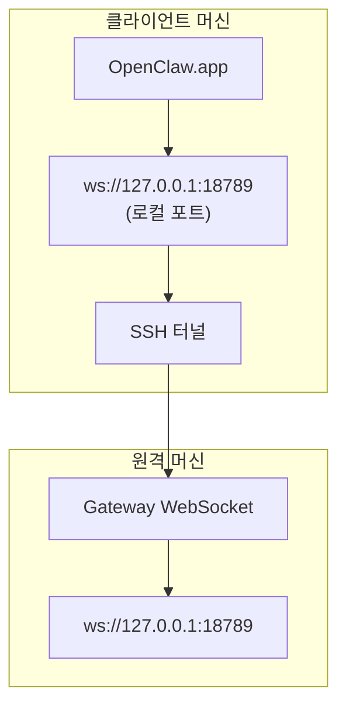

# OpenClaw.app을 원격 Gateway와 함께 실행하기

OpenClaw.app은 SSH 터널링을 사용하여 원격 Gateway에 연결합니다. 이 가이드는 설정 방법을 보여줍니다.

## 개요


```mermaid
flowchart TB
    subgraph Client["클라이언트 머신"]
        direction TB
        A["OpenClaw.app"]
        B["ws://127.0.0.1:18789\n(로컬 포트)"]
        T["SSH 터널"]

        A --> B
        B --> T
    end
    subgraph Remote["원격 머신"]
        direction TB
        C["Gateway WebSocket"]
        D["ws://127.0.0.1:18789"]

        C --> D
    end
    T --> C
```

## 빠른 설정

### 1단계: SSH 설정 추가

`~/.ssh/config`를 편집하고 추가합니다:

```ssh
Host remote-gateway
    HostName <REMOTE_IP>          # 예: 172.27.187.184
    User <REMOTE_USER>            # 예: jefferson
    LocalForward 18789 127.0.0.1:18789
    IdentityFile ~/.ssh/id_rsa
```

`<REMOTE_IP>`와 `<REMOTE_USER>`를 실제 값으로 대체합니다.

### 2단계: SSH 키 복사

공개 키를 원격 머신에 복사합니다 (한 번 비밀번호 입력):

```bash
ssh-copy-id -i ~/.ssh/id_rsa <REMOTE_USER>@<REMOTE_IP>
```

### 3단계: Gateway 토큰 설정

```bash
launchctl setenv OPENCLAW_GATEWAY_TOKEN "<your-token>"
```

### 4단계: SSH 터널 시작

```bash
ssh -N remote-gateway &
```

### 5단계: OpenClaw.app 재시작

```bash
# OpenClaw.app 종료 (Command+Q), 다시 열기:
open /path/to/OpenClaw.app
```

앱이 이제 SSH 터널을 통해 원격 Gateway에 연결됩니다.

---

## 로그인 시 터널 자동 시작

로그인 시 SSH 터널이 자동으로 시작되도록 Launch Agent를 생성합니다.

### PLIST 파일 생성

다음을 `~/Library/LaunchAgents/ai.openclaw.ssh-tunnel.plist`로 저장합니다:

```xml
<?xml version="1.0" encoding="UTF-8"?>
<!DOCTYPE plist PUBLIC "-//Apple//DTD PLIST 1.0//EN" "http://www.apple.com/DTDs/PropertyList-1.0.dtd">
<plist version="1.0">
<dict>
    <key>Label</key>
    <string>ai.openclaw.ssh-tunnel</string>
    <key>ProgramArguments</key>
    <array>
        <string>/usr/bin/ssh</string>
        <string>-N</string>
        <string>remote-gateway</string>
    </array>
    <key>KeepAlive</key>
    <true/>
    <key>RunAtLoad</key>
    <true/>
</dict>
</plist>
```

### Launch Agent 로드

```bash
launchctl bootstrap gui/$UID ~/Library/LaunchAgents/ai.openclaw.ssh-tunnel.plist
```

터널은 이제:

- 로그인 시 자동으로 시작됩니다
- 크래시 시 재시작됩니다
- 백그라운드에서 계속 실행됩니다

레거시 참고: 남아 있는 `com.openclaw.ssh-tunnel` LaunchAgent가 있으면 제거하세요.

---

## 문제 해결

**터널이 실행 중인지 확인:**

```bash
ps aux | grep "ssh -N remote-gateway" | grep -v grep
lsof -i :18789
```

**터널 재시작:**

```bash
launchctl kickstart -k gui/$UID/ai.openclaw.ssh-tunnel
```

**터널 중지:**

```bash
launchctl bootout gui/$UID/ai.openclaw.ssh-tunnel
```

---

## 작동 원리

| 구성요소                             | 역할                                       |
| ------------------------------------ | ------------------------------------------ |
| `LocalForward 18789 127.0.0.1:18789` | 로컬 포트 18789를 원격 포트 18789로 포워딩 |
| `ssh -N`                             | 원격 명령 실행 없이 SSH (포트 포워딩만)    |
| `KeepAlive`                          | 터널이 크래시하면 자동 재시작              |
| `RunAtLoad`                          | 에이전트가 로드될 때 터널 시작             |

OpenClaw.app은 클라이언트 머신의 `ws://127.0.0.1:18789`에 연결합니다. SSH 터널은 해당 연결을 Gateway가 실행 중인 원격 머신의 포트 18789로 포워딩합니다.
