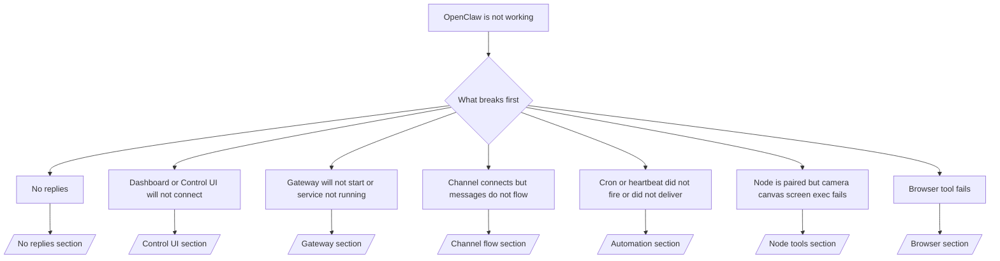

# 문제 해결

단 2분만 있다면, 이 페이지를 초기 진단의 출입구로 사용하세요.

## 처음 60초

다음 절차를 정확하게 순서대로 실행하세요:

```bash
openclaw status
openclaw status --all
openclaw gateway probe
openclaw gateway status
openclaw doctor
openclaw channels status --probe
openclaw logs --follow
```

한 줄로 좋은 출력 결과:

- `openclaw status` → 구성된 채널이 보이고 명확한 인증 오류가 없음.
- `openclaw status --all` → 전체 보고서가 존재하고 공유 가능함.
- `openclaw gateway probe` → 예상한 게이트웨이 대상에 도달 가능.
- `openclaw gateway status` → `Runtime: running` 및 `RPC probe: ok`.
- `openclaw doctor` → 차단되는 설정/서비스 오류 없음.
- `openclaw channels status --probe` → 채널이 `connected` 또는 `ready` 상태 보고.
- `openclaw logs --follow` → 지속적인 활동, 반복되는 치명적 오류 없음.

## 의사 결정 트리



<AccordionGroup>
  <Accordion title="No replies">
    ```bash
    openclaw status
    openclaw gateway status
    openclaw channels status --probe
    openclaw pairing list <channel>
    openclaw logs --follow
    ```

    좋은 출력 결과는 다음과 같습니다:

    - `Runtime: running`
    - `RPC probe: ok`
    - `channels status --probe`에서 채널이 연결/준비 상태로 표시됨
    - 발신자가 승인된 것처럼 보임 (또는 다이렉트 메시지 정책이 오픈/허용 목록)

    일반적인 로그 서명:

    - `drop guild message (mention required` → Discord에서 멘션 게이팅으로 메시지가 차단됨.
    - `pairing request` → 발신자가 승인되지 않았고 다이렉트 메시지 쌍으로 승인 대기 중.
    - `blocked` / `allowlist` in channel logs → 발신자, 방 또는 그룹이 필터링됨.

    심층 페이지:

    - [/gateway/troubleshooting#no-replies](/ko-KR/gateway/troubleshooting#no-replies)
    - [/channels/troubleshooting](/ko-KR/channels/troubleshooting)
    - [/channels/pairing](/ko-KR/channels/pairing)

  </Accordion>

  <Accordion title="Dashboard or Control UI will not connect">
    ```bash
    openclaw status
    openclaw gateway status
    openclaw logs --follow
    openclaw doctor
    openclaw channels status --probe
    ```

    좋은 출력 결과는 다음과 같습니다:

    - `Dashboard: http://...`가 `openclaw gateway status`에 표시됨
    - `RPC probe: ok`
    - 로그에 인증 루프 없음

    일반적인 로그 서명:

    - `device identity required` → HTTPS/비보안 컨텍스트에서 장치 인증 완료 불가.
    - `unauthorized` / reconnect loop → 잘못된 토큰/비밀번호 또는 인증 모드 불일치.
    - `gateway connect failed:` → UI가 잘못된 URL/포트 또는 도달 불가능한 게이트웨이를 대상으로 설정됨.

    심층 페이지:

    - [/gateway/troubleshooting#dashboard-control-ui-connectivity](/ko-KR/gateway/troubleshooting#dashboard-control-ui-connectivity)
    - [/web/control-ui](/ko-KR/web/control-ui)
    - [/gateway/authentication](/ko-KR/gateway/authentication)

  </Accordion>

  <Accordion title="Gateway will not start or service installed but not running">
    ```bash
    openclaw status
    openclaw gateway status
    openclaw logs --follow
    openclaw doctor
    openclaw channels status --probe
    ```

    좋은 출력 결과는 다음과 같습니다:

    - `Service: ... (loaded)`
    - `Runtime: running`
    - `RPC probe: ok`

    일반적인 로그 서명:

    - `Gateway start blocked: set gateway.mode=local` → 게이트웨이 모드가 설정되지 않음/원격.
    - `refusing to bind gateway ... without auth` → 비인증 비밀번호/토큰 없이 비로컬 루프백에 바인드 거부.
    - `another gateway instance is already listening` or `EADDRINUSE` → 포트가 이미 사용 중.

    심층 페이지:

    - [/gateway/troubleshooting#gateway-service-not-running](/ko-KR/gateway/troubleshooting#gateway-service-not-running)
    - [/gateway/background-process](/ko-KR/gateway/background-process)
    - [/gateway/configuration](/ko-KR/gateway/configuration)

  </Accordion>

  <Accordion title="Channel connects but messages do not flow">
    ```bash
    openclaw status
    openclaw gateway status
    openclaw logs --follow
    openclaw doctor
    openclaw channels status --probe
    ```

    좋은 출력 결과는 다음과 같습니다:

    - 채널 전송이 연결됨.
    - 쌍/허용 목록 검사가 통과됨.
    - 필요한 경우 멘션이 감지됨.

    일반적인 로그 서명:

    - `mention required` → 그룹 멘션 게이팅이 처리 차단.
    - `pairing` / `pending` → 다이렉트 메시지 발신자가 아직 승인되지 않음.
    - `not_in_channel`, `missing_scope`, `Forbidden`, `401/403` → 채널 권한 토큰 문제.

    심층 페이지:

    - [/gateway/troubleshooting#channel-connected-messages-not-flowing](/ko-KR/gateway/troubleshooting#channel-connected-messages-not-flowing)
    - [/channels/troubleshooting](/ko-KR/channels/troubleshooting)

  </Accordion>

  <Accordion title="Cron or heartbeat did not fire or did not deliver">
    ```bash
    openclaw status
    openclaw gateway status
    openclaw cron status
    openclaw cron list
    openclaw cron runs --id <jobId> --limit 20
    openclaw logs --follow
    ```

    좋은 출력 결과는 다음과 같습니다:

    - `cron.status`가 다음으로 깨어날 예정으로 활성화된 상태로 표시됨.
    - `cron runs`가 최근 `ok` 항목을 표시함.
    - 하트비트가 활성화되고 활성 시간대 외부가 아님.

    일반적인 로그 서명:

    - `cron: scheduler disabled; jobs will not run automatically` → 크론이 비활성화됨.
    - `heartbeat skipped` with `reason=quiet-hours` → 설정된 활성 시간대 외부.
    - `requests-in-flight` → 주레인 바쁨; 하트비트 깨우기 연기됨.
    - `unknown accountId` → 하트비트 전달 대상 계정이 존재하지 않음.

    심층 페이지:

    - [/gateway/troubleshooting#cron-and-heartbeat-delivery](/ko-KR/gateway/troubleshooting#cron-and-heartbeat-delivery)
    - [/automation/troubleshooting](/ko-KR/automation/troubleshooting)
    - [/gateway/heartbeat](/ko-KR/gateway/heartbeat)

  </Accordion>

  <Accordion title="Node is paired but tool fails camera canvas screen exec">
    ```bash
    openclaw status
    openclaw gateway status
    openclaw nodes status
    openclaw nodes describe --node <idOrNameOrIp>
    openclaw logs --follow
    ```

    좋은 출력 결과는 다음과 같습니다:

    - 노드가 `node` 역할로 연결되고 쌍으로 지정되어 있음.
    - 실행하려는 명령에 대한 기능이 존재함.
    - 도구에 대한 권한 상태가 부여됨.

    일반적인 로그 서명:

    - `NODE_BACKGROUND_UNAVAILABLE` → 노드 앱을 포그라운드로 가져오세요.
    - `*_PERMISSION_REQUIRED` → OS 권한이 거부/누락됨.
    - `SYSTEM_RUN_DENIED: approval required` → 실행 승인이 대기 중.
    - `SYSTEM_RUN_DENIED: allowlist miss` → 명령이 실행 허용 목록에 없음.

    심층 페이지:

    - [/gateway/troubleshooting#node-paired-tool-fails](/ko-KR/gateway/troubleshooting#node-paired-tool-fails)
    - [/nodes/troubleshooting](/ko-KR/nodes/troubleshooting)
    - [/tools/exec-approvals](/ko-KR/tools/exec-approvals)

  </Accordion>

  <Accordion title="Browser tool fails">
    ```bash
    openclaw status
    openclaw gateway status
    openclaw browser status
    openclaw logs --follow
    openclaw doctor
    ```

    좋은 출력 결과는 다음과 같습니다:

    - 브라우저 상태가 `running: true` 및 선택된 브라우저/프로필을 표시함.
    - `openclaw` 프로필 시작 또는 `chrome` 릴레이에 연결된 탭이 있음.

    일반적인 로그 서명:

    - `Failed to start Chrome CDP on port` → 로컬 브라우저 실행 실패.
    - `browser.executablePath not found` → 설정된 이진 경로가 잘못됨.
    - `Chrome extension relay is running, but no tab is connected` → 확장 프로그램이 연결되지 않음.
    - `Browser attachOnly is enabled ... not reachable` → 붙임 전용 프로필에 라이브 CDP 대상이 없음.

    심층 페이지:

    - [/gateway/troubleshooting#browser-tool-fails](/ko-KR/gateway/troubleshooting#browser-tool-fails)
    - [/tools/browser-linux-troubleshooting](/ko-KR/tools/browser-linux-troubleshooting)
    - [/tools/chrome-extension](/ko-KR/tools/chrome-extension)

  </Accordion>
</AccordionGroup>