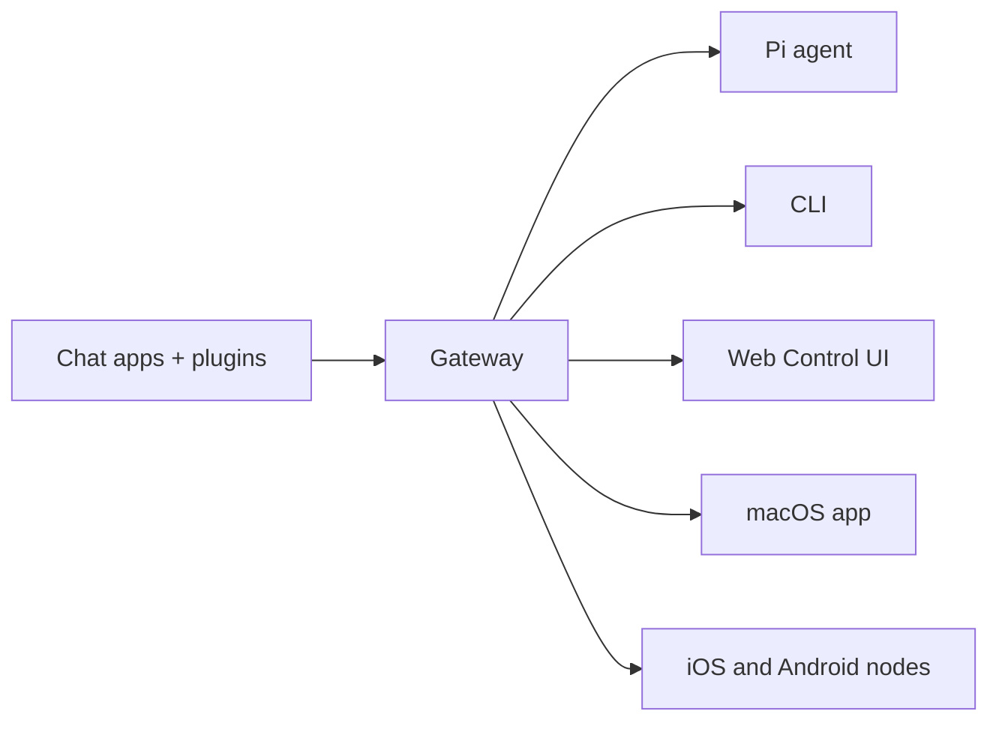

# OpenClaw 🦞

<p align="center">
    
    
</p>

> _"EXFOLIATE! EXFOLIATE!"_ — 아마도 우주 바닷가재가 한 말

<p align="center">
  <strong>WhatsApp, Telegram, Discord, iMessage 등을 지원하는 모든 OS 용 AI 에이전트 게이트웨이.</strong><br />
  메시지를 보내면 주머니 속에서 에이전트 응답을 받을 수 있습니다. 플러그인으로 Mattermost 등을 추가할 수 있습니다.
</p>

<Columns>
  <Card title="시작하기" href="/ko-KR/start/getting-started" icon="rocket">
    OpenClaw 를 설치하고 몇 분 만에 게이트웨이를 실행하세요.
  </Card>
  <Card title="마법사 실행" href="/ko-KR/start/wizard" icon="sparkles">
    `openclaw onboard` 와 페어링 플로우를 통한 안내식 설정.
  </Card>
  <Card title="Control UI 열기" href="/ko-KR/web/control-ui" icon="layout-dashboard">
    채팅, 설정, 세션을 위한 브라우저 대시보드를 실행하세요.
  </Card>
</Columns>

## OpenClaw 란?

OpenClaw 는 여러분이 즐겨 사용하는 채팅 앱 — WhatsApp, Telegram, Discord, iMessage 등 — 을 Pi 와 같은 AI 코딩 에이전트에 연결하는 **셀프 호스팅 게이트웨이**입니다. 자신의 컴퓨터(또는 서버)에서 단일 게이트웨이 프로세스를 실행하면, 메시징 앱과 항상 사용 가능한 AI 어시스턴트 사이의 다리 역할을 합니다.

**누구를 위한 것인가요?** 데이터 통제권을 포기하거나 호스팅 서비스에 의존하지 않으면서, 어디서든 메시지를 보낼 수 있는 개인 AI 어시스턴트를 원하는 개발자와 파워 유저를 위한 것입니다.

**무엇이 다른가요?**

- **셀프 호스팅**: 여러분의 하드웨어에서 실행하며, 여러분의 규칙을 따릅니다
- **멀티 채널**: 하나의 게이트웨이로 WhatsApp, Telegram, Discord 등을 동시에 서비스합니다
- **에이전트 네이티브**: 도구 사용, 세션, 메모리, 멀티 에이전트 라우팅을 갖춘 코딩 에이전트를 위해 설계되었습니다
- **오픈 소스**: MIT 라이선스, 커뮤니티 주도

**무엇이 필요한가요?** Node 22+, API 키(Anthropic 권장), 그리고 5분.

## 작동 방식



게이트웨이는 세션, 라우팅, 채널 연결의 단일 진실 공급원(single source of truth)입니다.

## 주요 기능

<Columns>
  <Card title="멀티 채널 게이트웨이" icon="network">
    하나의 게이트웨이 프로세스로 WhatsApp, Telegram, Discord, iMessage 를 지원합니다.
  </Card>
  <Card title="플러그인 채널" icon="plug">
    확장 패키지로 Mattermost 등을 추가할 수 있습니다.
  </Card>
  <Card title="멀티 에이전트 라우팅" icon="route">
    에이전트, 워크스페이스, 또는 발신자별로 격리된 세션을 제공합니다.
  </Card>
  <Card title="미디어 지원" icon="image">
    이미지, 오디오, 문서를 주고받을 수 있습니다.
  </Card>
  <Card title="Web Control UI" icon="monitor">
    채팅, 설정, 세션, 노드를 위한 브라우저 대시보드입니다.
  </Card>
  <Card title="모바일 노드" icon="smartphone">
    Canvas 지원과 함께 iOS 및 Android 노드를 페어링할 수 있습니다.
  </Card>
</Columns>

## 빠른 시작

<Steps>
  <Step title="OpenClaw 설치">
    ```bash
    npm install -g openclaw@latest
    ```
  </Step>
  <Step title="온보딩 및 서비스 설치">
    ```bash
    openclaw onboard --install-daemon
    ```
  </Step>
  <Step title="WhatsApp 페어링 및 게이트웨이 시작">
    ```bash
    openclaw channels login
    openclaw gateway --port 18789
    ```
  </Step>
</Steps>

전체 설치 및 개발 설정이 필요하신가요? [빠른 시작](/ko-KR/start/quickstart)을 참조하세요.

## 대시보드

게이트웨이가 시작된 후 브라우저 Control UI 를 열 수 있습니다.

- 로컬 기본값: [http://127.0.0.1:18789/](http://127.0.0.1:18789/)
- 원격 접근: [웹 서피스](/ko-KR/web) 및 [Tailscale](/ko-KR/gateway/tailscale)

<p align="center">
  
</p>

## 설정 (선택 사항)

설정 파일은 `~/.openclaw/openclaw.json` 에 위치합니다.

- **아무것도 하지 않으면**, OpenClaw 는 번들된 Pi 바이너리를 RPC 모드로 사용하며 발신자별 세션을 적용합니다.
- 접근을 제한하려면, `channels.whatsapp.allowFrom` 과 (그룹의 경우) 멘션 규칙부터 시작하세요.

예시:

```json5
{
  channels: {
    whatsapp: {
      allowFrom: ["+15555550123"],
      groups: { "*": { requireMention: true } },
    },
  },
  messages: { groupChat: { mentionPatterns: ["@openclaw"] } },
}
```

## 여기서 시작하세요

<Columns>
  <Card title="문서 허브" href="/ko-KR/start/hubs" icon="book-open">
    사용 사례별로 정리된 모든 문서와 가이드.
  </Card>
  <Card title="설정" href="/ko-KR/gateway/configuration" icon="settings">
    핵심 게이트웨이 설정, 토큰, 프로바이더 구성.
  </Card>
  <Card title="원격 접근" href="/ko-KR/gateway/remote" icon="globe">
    SSH 및 tailnet 접근 패턴.
  </Card>
  <Card title="채널" href="/ko-KR/channels/telegram" icon="message-square">
    WhatsApp, Telegram, Discord 등의 채널별 설정.
  </Card>
  <Card title="노드" href="/ko-KR/nodes" icon="smartphone">
    페어링과 Canvas 를 지원하는 iOS 및 Android 노드.
  </Card>
  <Card title="도움말" href="/ko-KR/help" icon="life-buoy">
    일반적인 수정 사항 및 문제 해결 안내.
  </Card>
</Columns>

## 더 알아보기

<Columns>
  <Card title="전체 기능 목록" href="/ko-KR/concepts/features" icon="list">
    채널, 라우팅, 미디어 기능의 전체 목록.
  </Card>
  <Card title="멀티 에이전트 라우팅" href="/ko-KR/concepts/multi-agent" icon="route">
    워크스페이스 격리 및 에이전트별 세션.
  </Card>
  <Card title="보안" href="/ko-KR/gateway/security" icon="shield">
    토큰, 허용 목록, 안전 제어.
  </Card>
  <Card title="문제 해결" href="/ko-KR/gateway/troubleshooting" icon="wrench">
    게이트웨이 진단 및 일반적인 오류.
  </Card>
  <Card title="소개 및 크레딧" href="/ko-KR/reference/credits" icon="info">
    프로젝트 기원, 기여자, 라이선스.
  </Card>
</Columns>
