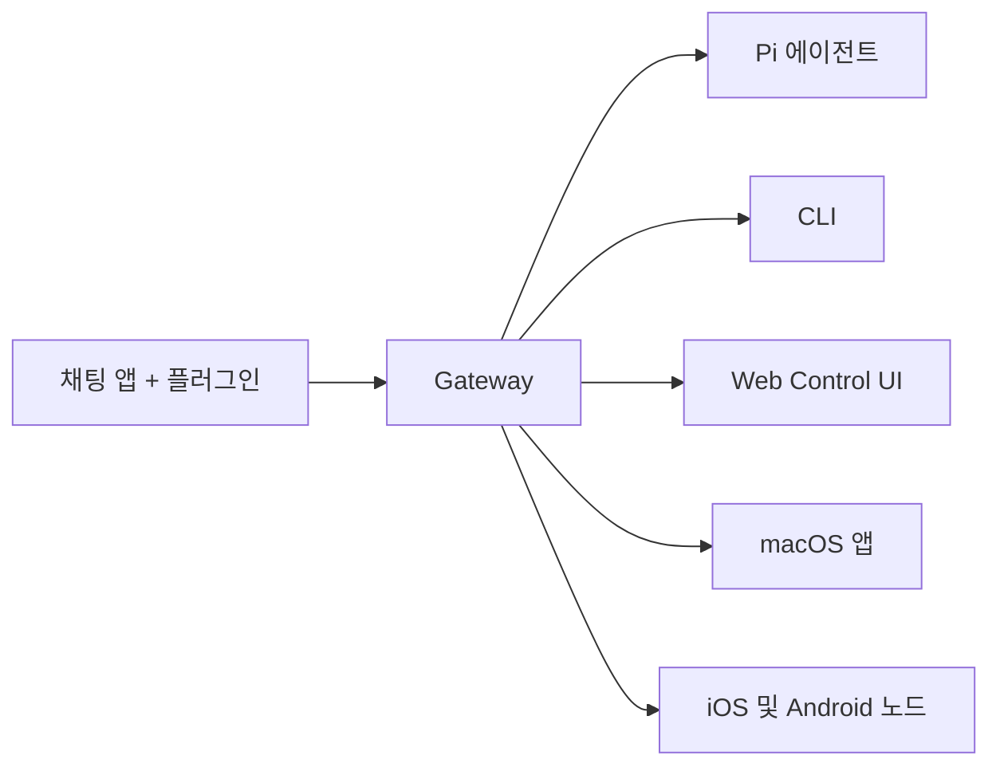

---
read_when:
  - OpenClaw를 처음 소개할 때
summary: OpenClaw는 어떤 OS에서든 실행되는 AI 에이전트용 멀티채널 gateway입니다.
title: OpenClaw
---

# OpenClaw 🦞

<p align="center">
    
    
</p>

> _"EXFOLIATE! EXFOLIATE!"_ - 아마도 우주 바닷가재

<p align="center">
  <strong>WhatsApp, Telegram, Discord, iMessage 등에서 동작하는 AI 에이전트용 범용 OS gateway.</strong><br />
  메시지를 보내면 주머니 속에서 에이전트 응답을 받을 수 있습니다. 플러그인으로 Mattermost 같은 채널도 확장할 수 있습니다.
</p>

<Columns>
  <Card title="시작하기" href="/start/getting-started" icon="rocket">
    OpenClaw를 설치하고 몇 분 안에 Gateway를 실행합니다.
  </Card>
  <Card title="Wizard 실행" href="/start/wizard" icon="sparkles">
    `openclaw onboard`와 페어링 플로우로 안내형 설정을 진행합니다.
  </Card>
  <Card title="Control UI 열기" href="/web/control-ui" icon="layout-dashboard">
    채팅, 설정, 세션을 위한 브라우저 대시보드를 엽니다.
  </Card>
</Columns>

OpenClaw는 단일 Gateway 프로세스를 통해 채팅 앱을 Pi 같은 코딩 에이전트와 연결합니다. 로컬과 원격 환경 모두에서 OpenClaw 어시스턴트를 구동할 수 있습니다.

## 동작 방식



Gateway는 세션, 라우팅, 채널 연결의 단일 소스 오브 트루스입니다.

## 주요 기능

<Columns>
  <Card title="멀티채널 gateway" icon="network">
    단일 Gateway 프로세스로 WhatsApp, Telegram, Discord, iMessage를 동시에 연결합니다.
  </Card>
  <Card title="플러그인 채널" icon="plug">
    확장 패키지로 Mattermost 등 다양한 채널을 추가합니다.
  </Card>
  <Card title="멀티 에이전트 라우팅" icon="route">
    에이전트, 워크스페이스, 발신자별로 세션을 분리합니다.
  </Card>
  <Card title="미디어 지원" icon="image">
    이미지, 오디오, 문서를 송수신합니다.
  </Card>
  <Card title="Web Control UI" icon="monitor">
    채팅, 설정, 세션, 노드를 브라우저에서 관리합니다.
  </Card>
  <Card title="모바일 노드" icon="smartphone">
    Canvas를 지원하는 iOS/Android 노드를 페어링합니다.
  </Card>
</Columns>

## 빠른 시작

<Steps>
  <Step title="OpenClaw 설치">
    ```bash
    npm install -g openclaw@latest
    ```
  </Step>
  <Step title="온보딩 및 서비스 설치">
    ```bash
    openclaw onboard --install-daemon
    ```
  </Step>
  <Step title="WhatsApp 페어링 후 Gateway 실행">
    ```bash
    openclaw channels login
    openclaw gateway --port 18789
    ```
  </Step>
</Steps>

전체 설치와 개발자 설정은 [Quick start](/start/quickstart)를 참고하세요.

## 대시보드

Gateway 실행 후 브라우저에서 Control UI를 엽니다.

- 로컬 기본값: [http://127.0.0.1:18789/](http://127.0.0.1:18789/)
- 원격 접속: [Web surfaces](/web), [Tailscale](/gateway/tailscale)

<p align="center">
  
</p>

## 설정 (선택)

설정 파일 경로: `~/.openclaw/openclaw.json`

- 별도 설정이 없으면 OpenClaw는 번들 Pi 바이너리를 RPC 모드로 사용하고 발신자별 세션을 만듭니다.
- 접근 제어가 필요하면 `channels.whatsapp.allowFrom`과 (그룹의 경우) 멘션 규칙부터 구성하세요.

예시:

```json5
{
  channels: {
    whatsapp: {
      allowFrom: ["+15555550123"],
      groups: { "*": { requireMention: true } },
    },
  },
  messages: { groupChat: { mentionPatterns: ["@openclaw"] } },
}
```

## 여기서 시작하세요

<Columns>
  <Card title="문서 허브" href="/start/hubs" icon="book-open">
    사용 사례별로 정리된 전체 문서와 가이드.
  </Card>
  <Card title="설정" href="/gateway/configuration" icon="settings">
    Gateway 핵심 설정, 토큰, 프로바이더 설정.
  </Card>
  <Card title="원격 접속" href="/gateway/remote" icon="globe">
    SSH 및 tailnet 접속 패턴.
  </Card>
  <Card title="채널" href="/channels/telegram" icon="message-square">
    WhatsApp, Telegram, Discord 등 채널별 설정 가이드.
  </Card>
  <Card title="노드" href="/nodes" icon="smartphone">
    페어링과 Canvas를 지원하는 iOS/Android 노드.
  </Card>
  <Card title="도움말" href="/help" icon="life-buoy">
    일반적인 문제 해결 진입점.
  </Card>
</Columns>
