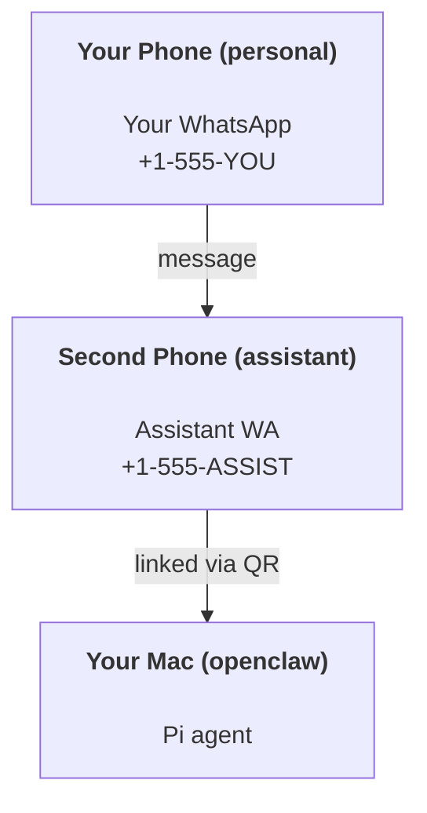

# OpenClaw 로 개인 비서 구축하기

OpenClaw 는 **Pi** 에이전트를 위한 WhatsApp + Telegram + Discord + iMessage 게이트웨이입니다. 플러그인은 Mattermost 를 추가합니다. 이 가이드는 "개인 비서" 설정입니다: 항상 켜져 있는 에이전트처럼 동작하는 전용 WhatsApp 번호 하나.

## ⚠️ 먼저 안전을 고려하세요

에이전트를 위치시키게 됩니다:

- (Pi 도구 설정에 따라) 기기에서 명령어를 실행
- 작업공간에서 파일 읽기/쓰기
- WhatsApp/Telegram/Discord/Mattermost(플러그인)을 통해 메시지 전송

보수적으로 시작하세요:

- 항상 `channels.whatsapp.allowFrom` 을 설정하세요(개인 Mac 을 외부에 열어두지 말 것).
- 비서를 위한 전용 WhatsApp 번호를 사용하세요.
- 하트비트는 이제 기본적으로 30분마다입니다. 설정을 신뢰할 때까지 `agents.defaults.heartbeat.every: "0m"` 으로 비활성화하세요.

## 필요조건

- OpenClaw 설치 및 온보딩 완료 — 아직 하지 않았다면 [시작하기](/ko-KR/start/getting-started)를 참조하세요
- 비서를 위한 두 번째 전화번호(SIM/eSIM/선불)

## 권장되는 두 전화 설정

이것을 원합니다:



개인 WhatsApp 을 OpenClaw 에 연결하면, 당신에게 오는 모든 메시지가 "에이전트 입력"이 됩니다. 이것은 드물게 원하는 것입니다.

## 5분 퀵 스타트

1. WhatsApp 웹 연결(QR 표시; 비서 전화로 스캔):

```bash
openclaw channels login
```

2. 게이트웨이 시작(실행 상태 유지):

```bash
openclaw gateway --port 18789
```

3. 최소한의 설정을 `~/.openclaw/openclaw.json` 에 배치하세요:

```json5
{
  channels: { whatsapp: { allowFrom: ["+15555550123"] } },
}
```

이제 허용 목록에 등록된 전화에서 비서 번호로 메시지를 보내세요.

온보딩이 완료되면, 우리는 대시보드를 자동으로 열고 정리된 링크를 출력합니다(토큰화되지 않음). 인증 요구 시, `gateway.auth.token` 에서 토큰을 제어 UI 설정에 붙여 넣으세요. 나중에 다시 열려면: `openclaw dashboard`.

## 에이전트에게 작업공간 제공하기 (AGENTS)

OpenClaw 는 작업 공간 디렉토리에서 운영 지침과 "메모리"를 읽습니다.

기본적으로 OpenClaw 는 에이전트 작업 공간으로 `~/.openclaw/workspace` 를 사용하며, 설정/첫 에이전트 실행 시 이를 자동으로 생성합니다(시작 `AGENTS.md`, `SOUL.md`, `TOOLS.md`, `IDENTITY.md`, `USER.md`, `HEARTBEAT.md`). `BOOTSTRAP.md` 는 작업 공간이 처음일 때만 생성됩니다(삭제 후 다시 생기지 않음). `MEMORY.md` 는 선택 사항입니다(자동 생성되지 않음); 존재할 경우 일반 세션에 로드됩니다. 서브 에이전트 세션에는 `AGENTS.md` 와 `TOOLS.md` 만 주입됩니다.

팁: 이 폴더를 OpenClaw의 "메모리"로 취급하고, git 저장소(이상적으로는 비공개)로 만들어 `AGENTS.md` + 메모리 파일이 백업되도록 하세요. git이 설치되어 있다면, 새 작업 공간들은 자동 초기화됩니다.

```bash
openclaw setup
```

전체 작업 공간 레이아웃 + 백업 가이드: [에이전트 작업공간](/ko-KR/concepts/agent-workspace)
메모리 워크플로: [메모리](/ko-KR/concepts/memory)

선택 사항: `agents.defaults.workspace` 옵션으로 다른 작업 공간 선택(지원 `~`).

```json5
{
  agent: {
    workspace: "~/.openclaw/workspace",
  },
}
```

이미 작업 공간 파일을 저장소에서 제공하는 경우, 부트스트랩 파일 생성을 완전히 비활성화할 수 있습니다:

```json5
{
  agent: {
    skipBootstrap: true,
  },
}
```

## "비서"로 전환시키는 설정

OpenClaw 는 기본적으로 훌륭한 비서 설정으로 작동하지만, 보통 아래를 조정하고 싶을 것입니다:

- `SOUL.md` 에서 페르소나/지침
- 사고 기본값(원하는 경우)
- 하트비트(신뢰가 쌓일 때까지)

예시:

```json5
{
  logging: { level: "info" },
  agent: {
    model: "anthropic/claude-opus-4-6",
    workspace: "~/.openclaw/workspace",
    thinkingDefault: "high",
    timeoutSeconds: 1800,
    // 0으로 시작; 나중에 활성화.
    heartbeat: { every: "0m" },
  },
  channels: {
    whatsapp: {
      allowFrom: ["+15555550123"],
      groups: {
        "*": { requireMention: true },
      },
    },
  },
  routing: {
    groupChat: {
      mentionPatterns: ["@openclaw", "openclaw"],
    },
  },
  session: {
    scope: "per-sender",
    resetTriggers: ["/new", "/reset"],
    reset: {
      mode: "daily",
      atHour: 4,
      idleMinutes: 10080,
    },
  },
}
```

## 세션과 메모리

- 세션 파일: `~/.openclaw/agents/<agentId>/sessions/{{SessionId}}.jsonl`
- 세션 메타데이터(토큰 사용, 마지막 경로 등): `~/.openclaw/agents/<agentId>/sessions/sessions.json` (이전: `~/.openclaw/sessions/sessions.json`)
- `/new` 또는 `/reset` 은 그 채팅의 새로운 세션을 시작합니다(`resetTriggers`로 구성 가능). 단독으로 전송 시, 에이전트는 리셋 확인을 위한 짧은 인사로 응답합니다.
- `/compact [instructions]` 는 세션 컨텍스트를 압축하고 남은 컨텍스트 예산을 보고합니다.

## 하트비트(적극적 모드)

기본적으로 OpenClaw 는 30분마다 다음 프롬프트로 하트비트를 실행합니다:
`HEARTBEAT.md 가 존재한다면 읽습니다(작업 공간 컨텍스트). 엄격히 따르세요. 이전 채팅의 작업을 추론하거나 반복하지 마세요. 주의할 사항이 없다면 HEARTBEAT_OK 로 응답하세요.`
비활성화하려면 `agents.defaults.heartbeat.every: "0m"` 을 설정하세요.

- `HEARTBEAT.md` 가 존재하지만 내용이 사실상 비어 있다면(`# 헤딩`과 같은 마크다운 헤더와 빈 줄만 존재), OpenClaw 는 하트비트 실행을 건너 API 호출을 절약합니다.
- 파일이 없으면, 하트비트는 여전히 실행되며 모델이 할 일을 결정합니다.
- 에이전트가 `HEARTBEAT_OK` 로 응답하면(옵션으로 짧은 패딩 포함; `agents.defaults.heartbeat.ackMaxChars` 참조), 해당 하트비트에 대해 발신 전달을 억제합니다.
- 하트비트는 전체 에이전트 턴을 실행합니다 — 짧은 간격은 더 많은 토큰을 소모합니다.

```json5
{
  agent: {
    heartbeat: { every: "30m" },
  },
}
```

## 미디어 입출력

들어오는 첨부 파일(이미지/오디오/문서)은 템플릿을 통해 명령어로 표시될 수 있습니다:

- `{{MediaPath}}` (로컬 임시 파일 경로)
- `{{MediaUrl}}` (가상 URL)
- `{{Transcript}}` (오디오 전사가 활성화된 경우)

에이전트에서 나가는 첨부 파일: 단독 줄에 `MEDIA:<path-or-url>` 을 포함시키세요(공백 없음). 예:

```
Here’s the screenshot.
MEDIA:https://example.com/screenshot.png
```

OpenClaw 는 이를 추출해 텍스트와 함께 미디어로 전송합니다.

## 작업 검사 목록

```bash
openclaw status          # 로컬 상태(자격 증명, 세션, 대기열 이벤트)
openclaw status --all    # 전체 진단(읽기 전용, 붙여넣기 가능)
openclaw status --deep   # 게이트웨이 상태 검사 추가(Telegram + Discord)
openclaw health --json   # 게이트웨이 상태 스냅샷(WS)
```

로그는 `/tmp/openclaw/` 에 저장됨(기본: `openclaw-YYYY-MM-DD.log`).

## 다음 단계

- WebChat: [WebChat](/ko-KR/web/webchat)
- 게이트웨이 운영: [게이트웨이 실행서](/ko-KR/gateway)
- Cron + 기상: [Cron 작업](/ko-KR/automation/cron-jobs)
- macOS 메뉴 바 동반 앱: [OpenClaw macOS 앱](/ko-KR/platforms/macos)
- iOS 노드 앱: [iOS 앱](/ko-KR/platforms/ios)
- Android 노드 앱: [Android 앱](/ko-KR/platforms/android)
- Windows 상태: [Windows (WSL2)](/ko-KR/platforms/windows)
- Linux 상태: [Linux 앱](/ko-KR/platforms/linux)
- 보안: [보안](/ko-KR/gateway/security)