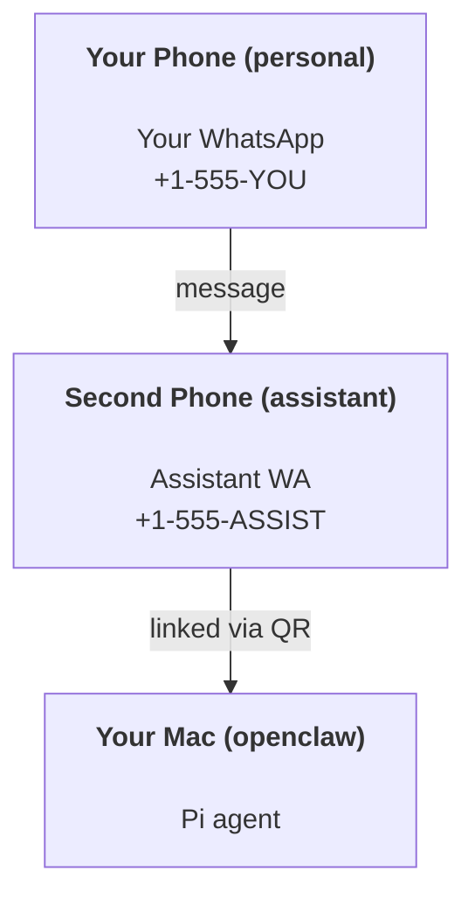

# OpenClaw로 개인 보조원 구축하기

OpenClaw는 WhatsApp + Telegram + Discord + iMessage gateway for **Pi** agents입니다. Plugins이 Mattermost를 추가합니다. 이 가이드는 "개인 보조원" 설정입니다: 항상 켜진 agent처럼 작동하는 전용 WhatsApp 번호.

## ⚠️ 안전이 먼저

agent를 다음을 수행할 수 있는 위치에 놓고 있습니다:

- 머신에서 명령 실행 (Pi tool 설정에 따라)
- 작업 공간의 파일 읽기/쓰기
- WhatsApp/Telegram/Discord/Mattermost (plugin)를 통해 메시지 다시 전송

보수적으로 시작합니다:

- 항상 `channels.whatsapp.allowFrom` 설정 (개인 Mac에서 world-open 실행 금지).
- 보조원에 전용 WhatsApp 번호 사용.
- Heartbeats는 이제 30분마다 기본값입니다. `agents.defaults.heartbeat.every: "0m"`을 설정하여 설정을 신뢰할 때까지 비활성화합니다.

## 전제 조건

- OpenClaw 설치 및 onboarded — [Getting Started](/start/getting-started) 참조
- 보조언 용 두 번째 전화 번호 (SIM/eSIM/prepaid)

## Two-phone 설정 (권장)

이것을 원합니다:


```mermaid
flowchart TB
    A["<b>Your Phone (personal)<br></b><br>Your WhatsApp<br>+1-555-YOU"] -- message --> B["<b>Second Phone (assistant)<br></b><br>Assistant WA<br>+1-555-ASSIST"]
    B -- linked via QR --> C["<b>Your Mac (openclaw)<br></b><br>Pi agent"]
```

개인 WhatsApp을 OpenClaw에 연결하면 모든 메시지가 "agent input"이 됩니다. 그것은 거의 원하는 것이 아닙니다.

## 5분 quick start

1. WhatsApp Web 쌍 (QR 표시; assistant phone으로 스캔):

```bash
openclaw channels login
```

2. Gateway 시작 (실행 유지):

```bash
openclaw gateway --port 18789
```

3. `~/.openclaw/openclaw.json`에 최소 config 배치:

```json5
{
  channels: { whatsapp: { allowFrom: ["+15555550123"] } },
}
```

이제 allowlisted phone에서 assistant 번호로 메시지합니다.

onboarding이 완료되면 dashboard를 자동으로 열고 깨끗한 (non-tokenized) 링크를 인쇄합니다. auth를 요청하면 Control UI settings에서 `gateway.auth.token`의 token을 붙여넣습니다. 나중에 다시 열려면: `openclaw dashboard`.

## Agent에 workspace 지정 (AGENTS)

OpenClaw는 operating instructions 및 "memory"를 workspace directory에서 읽습니다.

기본적으로 OpenClaw는 `~/.openclaw/workspace`를 agent workspace로 사용하며 설정/첫 agent 실행에서 자동으로 생성합니다 (starter `AGENTS.md`, `SOUL.md`, `TOOLS.md`, `IDENTITY.md`, `USER.md`, `HEARTBEAT.md` 포함). `BOOTSTRAP.md`는 workspace이 완전히 새로울 때만 생성됩니다 (삭제 후 다시 돌아오면 안 됨). `MEMORY.md`는 선택 사항 (자동 생성 안 함); 있으면 일반 sessions에 로드됩니다. Subagent sessions은 `AGENTS.md` 및 `TOOLS.md`만 주입합니다.

Tip: 이 폴더를 OpenClaw "memory"로 취급하고 git repo (이상적으로 private)로 만듭니다. 그러면 `AGENTS.md` + memory files이 백업됩니다. Git이 설치되어 있으면 brand-new workspaces이 자동으로 초기화됩니다.

```bash
openclaw setup
```

전체 workspace layout + backup 가이드: [Agent workspace](/concepts/agent-workspace)
Memory workflow: [Memory](/concepts/memory)

선택 사항: `agents.defaults.workspace` (supports `~`)로 다른 workspace 선택.

```json5
{
  agent: {
    workspace: "~/.openclaw/workspace",
  },
}
```

이미 repo에서 자체 workspace files을 배송하는 경우 bootstrap file 생성을 완전히 비활성화할 수 있습니다:

```json5
{
  agent: {
    skipBootstrap: true,
  },
}
```

## "An assistant"로 전환하는 config

OpenClaw는 좋은 assistant 설정으로 기본값이지만 일반적으로 tune을 원합니다:

- persona/instructions in `SOUL.md`
- thinking defaults (원하는 경우)
- heartbeats (신뢰한 후)

예:

```json5
{
  logging: { level: "info" },
  agent: {
    model: "anthropic/claude-opus-4-6",
    workspace: "~/.openclaw/workspace",
    thinkingDefault: "high",
    timeoutSeconds: 1800,
    // 0으로 시작; 나중에 활성화.
    heartbeat: { every: "0m" },
  },
  channels: {
    whatsapp: {
      allowFrom: ["+15555550123"],
      groups: {
        "*": { requireMention: true },
      },
    },
  },
  routing: {
    groupChat: {
      mentionPatterns: ["@openclaw", "openclaw"],
    },
  },
  session: {
    scope: "per-sender",
    resetTriggers: ["/new", "/reset"],
    reset: {
      mode: "daily",
      atHour: 4,
      idleMinutes: 10080,
    },
  },
}
```

## Sessions 및 memory

- Session files: `~/.openclaw/agents/<agentId>/sessions/{{SessionId}}.jsonl`
- Session metadata (token usage, last route, etc): `~/.openclaw/agents/<agentId>/sessions/sessions.json` (legacy: `~/.openclaw/sessions/sessions.json`)
- `/new` 또는 `/reset`은 그 채팅을 위해 fresh session을 시작합니다 (configurable via `resetTriggers`). 단독으로 전송되면 agent가 reset을 확인하는 짧은 hello로 회신합니다.
- `/compact [instructions]`은 session context를 압축하고 남은 context budget을 보고합니다.

## Heartbeats (proactive mode)

기본적으로 OpenClaw는 prompt와 함께 30분마다 heartbeat를 실행합니다:
`Read HEARTBEAT.md if it exists (workspace context). Follow it strictly. Do not infer or repeat old tasks from prior chats. If nothing needs attention, reply HEARTBEAT_OK.`
`agents.defaults.heartbeat.every: "0m"`을 설정하여 비활성화합니다.

- `HEARTBEAT.md`가 있지만 효과적으로 비어 있으면 (blank lines 및 markdown headers만 `# Heading` 같음), OpenClaw는 API 호출을 저장하기 위해 heartbeat 실행을 건너뜁니다.
- 파일이 없으면 heartbeat는 여전히 실행되고 모델이 수행할 작업을 결정합니다.
- Agent가 `HEARTBEAT_OK` (optionally with short padding; `agents.defaults.heartbeat.ackMaxChars` 참조)로 회신하면 OpenClaw는 해당 heartbeat에 대해 아웃바운드 전달을 억제합니다.
- 기본적으로 DM-style `user:<id>` targets에 대한 heartbeat delivery는 allowed입니다. `agents.defaults.heartbeat.directPolicy: "block"`을 설정하여 heartbeat 실행을 활성 상태로 유지하면서 direct-target delivery를 억제합니다.
- Heartbeats는 전체 agent turns를 실행합니다 — shorter intervals은 더 많은 tokens을 태웁니다.

```json5
{
  agent: {
    heartbeat: { every: "30m" },
  },
}
```

## Media in and out

Inbound attachments (images/audio/docs)은 templates을 통해 command에 표시될 수 있습니다:

- `{{MediaPath}}` (local temp file path)
- `{{MediaUrl}}` (pseudo-URL)
- `{{Transcript}}` (audio transcription이 활성화된 경우)

Agent에서 아웃바운드 attachments: 자체 줄에 `MEDIA:<path-or-url>` 포함 (공백 없음). 예:

```
Here's the screenshot.
MEDIA:https://example.com/screenshot.png
```

OpenClaw는 이를 추출하고 텍스트와 함께 media로 전송합니다.

## Operations checklist

```bash
openclaw status          # local status (creds, sessions, queued events)
openclaw status --all    # full diagnosis (read-only, pasteable)
openclaw status --deep   # adds gateway health probes (Telegram + Discord)
openclaw health --json   # gateway health snapshot (WS)
```

Logs는 `/tmp/openclaw/` (default: `openclaw-YYYY-MM-DD.log`)에 있습니다.

## 다음 단계

- WebChat: [WebChat](/web/webchat)
- Gateway ops: [Gateway runbook](/gateway)
- Cron + wakeups: [Cron jobs](/automation/cron-jobs)
- macOS menu bar companion: [OpenClaw macOS app](/platforms/macos)
- iOS node app: [iOS app](/platforms/ios)
- Android node app: [Android app](/platforms/android)
- Windows status: [Windows (WSL2)](/platforms/windows)
- Linux status: [Linux app](/platforms/linux)
- Security: [Security](/gateway/security)
