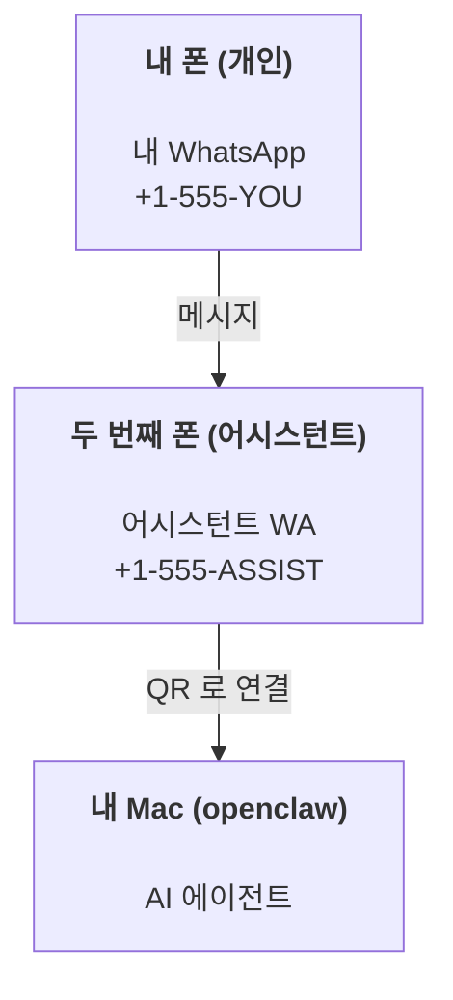

# OpenClaw 로 개인 어시스턴트 만들기

OpenClaw 는 WhatsApp, Telegram, Discord, iMessage 등을 AI 에이전트에 연결하는 셀프 호스팅 게이트웨이입니다. 이 가이드는 "개인 어시스턴트" 설정을 다룹니다: 항상 켜져 있는 AI 어시스턴트처럼 작동하는 전용 WhatsApp 번호입니다.

## ⚠️ 안전 우선

에이전트에게 다음을 할 수 있는 위치를 부여하게 됩니다:

- 머신에서 명령 실행 (도구 정책에 따라)
- 워크스페이스의 파일 읽기/쓰기
- WhatsApp/Telegram/Discord/Mattermost(플러그인)를 통해 메시지 발신

보수적으로 시작하세요:

- 항상 `channels.whatsapp.allowFrom` 을 설정하세요 (개인 Mac 에서 전 세계에 공개로 실행하지 마세요).
- 어시스턴트용 전용 WhatsApp 번호를 사용하세요.
- 하트비트는 이제 기본적으로 30 분마다 실행됩니다. 설정을 신뢰할 때까지 `agents.defaults.heartbeat.every: "0m"` 으로 비활성화하세요.

## 사전 요구 사항

- OpenClaw 설치 및 온보딩 완료 — 아직 하지 않았다면 [시작하기](/start/getting-started)를 참조하세요
- 어시스턴트용 두 번째 전화번호 (SIM/eSIM/선불)

## 2 대 폰 설정 (권장)

이렇게 설정하고 싶을 것입니다:


```mermaid
flowchart TB
    A["<b>내 폰 (개인)<br></b><br>내 WhatsApp<br>+1-555-YOU"] -- 메시지 --> B["<b>두 번째 폰 (어시스턴트)<br></b><br>어시스턴트 WA<br>+1-555-ASSIST"]
    B -- QR 로 연결 --> C["<b>내 Mac (openclaw)<br></b><br>AI 에이전트"]
```

개인 WhatsApp 을 OpenClaw 에 연결하면, 모든 메시지가 "에이전트 입력"이 됩니다. 이는 원하는 바가 아닌 경우가 대부분입니다.

## 5 분 빠른 시작

1. WhatsApp Web 페어링 (QR 표시; 어시스턴트 폰으로 스캔):

```bash
openclaw channels login
```

2. Gateway 시작 (계속 실행 상태 유지):

```bash
openclaw gateway --port 18789
```

3. `~/.openclaw/openclaw.json` 에 최소 설정 넣기:

```json5
{
  channels: { whatsapp: { allowFrom: ["+15555550123"] } },
}
```

이제 허용 목록에 있는 전화기에서 어시스턴트 번호로 메시지를 보내세요.

온보딩이 완료되면 대시보드가 자동으로 열리고 깨끗한(토큰화되지 않은) 링크가 출력됩니다. 인증을 요청하면 `gateway.auth.token` 의 토큰을 Control UI 설정에 붙여넣으세요. 나중에 다시 열려면: `openclaw dashboard`.

## 에이전트에 워크스페이스 제공 (AGENTS)

OpenClaw 는 워크스페이스 디렉터리에서 운영 지침과 "메모리"를 읽습니다.

기본적으로 OpenClaw 는 `~/.openclaw/workspace` 를 에이전트 워크스페이스로 사용하며, 설정/첫 에이전트 실행 시 자동으로 생성합니다(시작 파일 `AGENTS.md`, `SOUL.md`, `TOOLS.md`, `IDENTITY.md`, `USER.md`, `HEARTBEAT.md` 포함). `BOOTSTRAP.md` 는 워크스페이스가 새로 만들어질 때만 생성됩니다(삭제 후 다시 나타나지 않아야 합니다). `MEMORY.md` 는 선택 사항이며(자동 생성되지 않음), 존재하면 일반 세션에 로드됩니다. 서브에이전트 세션은 `AGENTS.md` 와 `TOOLS.md` 만 주입합니다.

팁: 이 폴더를 OpenClaw 의 "메모리"로 취급하고 git 레포(이상적으로는 프라이빗)로 만들어 `AGENTS.md` + 메모리 파일을 백업하세요. git 이 설치되어 있으면 새 워크스페이스는 자동으로 초기화됩니다.

```bash
openclaw setup
```

전체 워크스페이스 레이아웃 + 백업 가이드: [에이전트 워크스페이스](/concepts/agent-workspace)
메모리 워크플로: [메모리](/concepts/memory)

선택 사항: `agents.defaults.workspace` 로 다른 워크스페이스를 선택합니다(`~` 지원).

```json5
{
  agent: {
    workspace: "~/.openclaw/workspace",
  },
}
```

이미 레포에서 자체 워크스페이스 파일을 제공하는 경우, 부트스트랩 파일 생성을 완전히 비활성화할 수 있습니다:

```json5
{
  agent: {
    skipBootstrap: true,
  },
}
```

## "어시스턴트"로 만드는 설정

OpenClaw 는 좋은 어시스턴트 설정을 기본값으로 사용하지만, 일반적으로 다음을 조정하고 싶을 것입니다:

- `SOUL.md` 의 페르소나/지침
- 씽킹 기본값 (원하는 경우)
- 하트비트 (신뢰한 후)

예시:

```json5
{
  logging: { level: "info" },
  agent: {
    model: "anthropic/claude-opus-4-6",
    workspace: "~/.openclaw/workspace",
    thinkingDefault: "high",
    timeoutSeconds: 1800,
    // 0 으로 시작; 나중에 활성화.
    heartbeat: { every: "0m" },
  },
  channels: {
    whatsapp: {
      allowFrom: ["+15555550123"],
      groups: {
        "*": { requireMention: true },
      },
    },
  },
  routing: {
    groupChat: {
      mentionPatterns: ["@openclaw", "openclaw"],
    },
  },
  session: {
    scope: "per-sender",
    resetTriggers: ["/new", "/reset"],
    reset: {
      mode: "daily",
      atHour: 4,
      idleMinutes: 10080,
    },
  },
}
```

## 세션 및 메모리

- 세션 파일: `~/.openclaw/agents/<agentId>/sessions/{{SessionId}}.jsonl`
- 세션 메타데이터 (토큰 사용량, 마지막 라우트 등): `~/.openclaw/agents/<agentId>/sessions/sessions.json` (레거시: `~/.openclaw/sessions/sessions.json`)
- `/new` 또는 `/reset` 은 해당 채팅의 새 세션을 시작합니다(`resetTriggers` 를 통해 구성 가능). 단독으로 전송하면 에이전트가 초기화를 확인하는 짧은 인사로 응답합니다.
- `/compact [instructions]` 는 세션 컨텍스트를 압축하고 남은 컨텍스트 예산을 보고합니다.

## 하트비트 (사전 대응 모드)

기본적으로 OpenClaw 는 30 분마다 다음 프롬프트로 하트비트를 실행합니다:
`Read HEARTBEAT.md if it exists (workspace context). Follow it strictly. Do not infer or repeat old tasks from prior chats. If nothing needs attention, reply HEARTBEAT_OK.`
비활성화하려면 `agents.defaults.heartbeat.every: "0m"` 을 설정하세요.

- `HEARTBEAT.md` 가 존재하지만 사실상 비어 있는 경우(빈 줄과 `# Heading` 같은 마크다운 헤더만), OpenClaw 는 API 호출을 절약하기 위해 하트비트 실행을 건너뜁니다.
- 파일이 없으면 하트비트는 여전히 실행되며 모델이 무엇을 할지 결정합니다.
- 에이전트가 `HEARTBEAT_OK` 로 응답하면(선택적으로 짧은 패딩 포함; `agents.defaults.heartbeat.ackMaxChars` 참조), OpenClaw 는 해당 하트비트의 아웃바운드 전달을 억제합니다.
- 기본적으로 DM 스타일 `user:<id>` 타겟으로의 하트비트 전달이 허용됩니다. `agents.defaults.heartbeat.directPolicy: "block"` 을 설정하면 하트비트 실행은 활성 상태를 유지하면서 직접 타겟 전달을 억제합니다.
- 하트비트는 전체 에이전트 턴을 실행합니다 — 더 짧은 간격은 더 많은 토큰을 소비합니다.

```json5
{
  agent: {
    heartbeat: { every: "30m" },
  },
}
```

## 미디어 입출력

인바운드 첨부 파일(이미지/오디오/문서)은 템플릿을 통해 명령에 표시할 수 있습니다:

- `{{MediaPath}}` (로컬 임시 파일 경로)
- `{{MediaUrl}}` (유사 URL)
- `{{Transcript}}` (오디오 전사가 활성화된 경우)

에이전트의 아웃바운드 첨부 파일: 자체 줄에 `MEDIA:<path-or-url>` 을 포함합니다(공백 없이). 예시:

```
Here's the screenshot.
MEDIA:https://example.com/screenshot.png
```

OpenClaw 는 이를 추출하여 텍스트와 함께 미디어로 전송합니다.

## 운영 체크리스트

```bash
openclaw status          # 로컬 상태 (자격 증명, 세션, 대기 이벤트)
openclaw status --all    # 전체 진단 (읽기 전용, 붙여넣기 가능)
openclaw status --deep   # Gateway 상태 프로브 추가 (Telegram + Discord)
openclaw health --json   # Gateway 상태 스냅샷 (WS)
```

로그는 `/tmp/openclaw/` 에 있습니다 (기본값: `openclaw-YYYY-MM-DD.log`).

## 다음 단계

- WebChat: [WebChat](/web/webchat)
- Gateway 운영: [Gateway 운영 가이드](/gateway)
- Cron + 웨이크업: [Cron 작업](/automation/cron-jobs)
- macOS 메뉴 바 컴패니언: [OpenClaw macOS 앱](/platforms/macos)
- iOS 노드 앱: [iOS 앱](/platforms/ios)
- Android 노드 앱: [Android 앱](/platforms/android)
- Windows 상태: [Windows (WSL2)](/platforms/windows)
- Linux 상태: [Linux 앱](/platforms/linux)
- 보안: [보안](/gateway/security)
