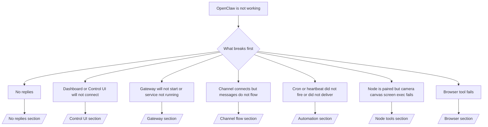

# 문제 해결

시간이 2분밖에 없다면 이 페이지를 트리아지의 첫 관문으로 사용하십시오.

## 처음 60초

다음 사다리를 정확히 순서대로 실행하십시오:

```bash
openclaw status
openclaw status --all
openclaw gateway probe
openclaw gateway status
openclaw doctor
openclaw channels status --probe
openclaw logs --follow
```

한 줄로 좋은 출력의 기준:

- `openclaw status` → 구성된 채널이 표시되고 명백한 인증 오류가 없습니다.
- `openclaw status --all` → 전체 보고서가 존재하며 공유 가능합니다.
- `openclaw gateway probe` → 예상된 Gateway(게이트웨이) 대상에 도달할 수 있습니다.
- `openclaw gateway status` → `Runtime: running` 및 `RPC probe: ok`.
- `openclaw doctor` → 차단하는 구성/서비스 오류가 없습니다.
- `openclaw channels status --probe` → 채널이 `connected` 또는 `ready` 를 보고합니다.
- `openclaw logs --follow` → 안정적인 활동, 반복되는 치명적 오류가 없습니다.

## 결정 트리



<AccordionGroup>
  <Accordion title="No replies">
    ```bash
    openclaw status
    openclaw gateway status
    openclaw channels status --probe
    openclaw pairing list <channel>
    openclaw logs --follow
    ```

    ```
    좋은 출력의 예:
    
    - `Runtime: running`
    - `RPC probe: ok`
    - 채널이 `channels status --probe` 에서 연결됨/준비됨으로 표시됩니다.
    - 발신자가 승인된 것으로 보입니다(또는 다이렉트 메시지 정책이 열려 있음/허용 목록).
    
    일반적인 로그 시그니처:
    
    - `drop guild message (mention required` → Discord 에서 멘션 게이팅이 메시지를 차단했습니다.
    - `pairing request` → 발신자가 승인되지 않아 다이렉트 메시지 페어링 승인을 대기 중입니다.
    - 채널 로그의 `blocked` / `allowlist` → 발신자, 방 또는 그룹이 필터링되었습니다.
    
    심층 페이지:
    
    - [/gateway/troubleshooting#no-replies](/gateway/troubleshooting#no-replies)
    - [/channels/troubleshooting](/channels/troubleshooting)
    - [/channels/pairing](/channels/pairing)
    ```

  </Accordion>

  <Accordion title="Dashboard or Control UI will not connect">
    ```bash
    openclaw status
    openclaw gateway status
    openclaw logs --follow
    openclaw doctor
    openclaw channels status --probe
    ```

    ```
    좋은 출력의 예:
    
    - `Dashboard: http://...` 이(가) `openclaw gateway status` 에 표시됩니다.
    - `RPC probe: ok`
    - 로그에 인증 루프가 없습니다.
    
    일반적인 로그 시그니처:
    
    - `device identity required` → HTTP/비보안 컨텍스트에서는 디바이스 인증을 완료할 수 없습니다.
    - `unauthorized` / 재연결 루프 → 잘못된 토큰/비밀번호 또는 인증 모드 불일치.
    - `gateway connect failed:` → UI 가 잘못된 URL/포트를 대상으로 하거나 접근 불가한 게이트웨이를 가리킵니다.
    
    심층 페이지:
    
    - [/gateway/troubleshooting#dashboard-control-ui-connectivity](/gateway/troubleshooting#dashboard-control-ui-connectivity)
    - [/web/control-ui](/web/control-ui)
    - [/gateway/authentication](/gateway/authentication)
    ```

  </Accordion>

  <Accordion title="Gateway will not start or service installed but not running">
    ```bash
    openclaw status
    openclaw gateway status
    openclaw logs --follow
    openclaw doctor
    openclaw channels status --probe
    ```

    ```
    좋은 출력의 예:
    
    - `Service: ... (loaded)`
    - `Runtime: running`
    - `RPC probe: ok`
    
    일반적인 로그 시그니처:
    
    - `Gateway start blocked: set gateway.mode=local` → 게이트웨이 모드가 설정되지 않았거나 원격입니다.
    - `refusing to bind gateway ... without auth` → 토큰/비밀번호 없이 non-loopback 바인딩.
    - `another gateway instance is already listening` 또는 `EADDRINUSE` → 포트가 이미 사용 중입니다.
    
    심층 페이지:
    
    - [/gateway/troubleshooting#gateway-service-not-running](/gateway/troubleshooting#gateway-service-not-running)
    - [/gateway/background-process](/gateway/background-process)
    - [/gateway/configuration](/gateway/configuration)
    ```

  </Accordion>

  <Accordion title="Channel connects but messages do not flow">
    ```bash
    openclaw status
    openclaw gateway status
    openclaw logs --follow
    openclaw doctor
    openclaw channels status --probe
    ```

    ```
    좋은 출력의 예:
    
    - 채널 전송이 연결되어 있습니다.
    - 페어링/허용 목록 검사가 통과합니다.
    - 필요한 경우 멘션이 감지됩니다.
    
    일반적인 로그 시그니처:
    
    - `mention required` → 그룹 멘션 게이팅이 처리를 차단했습니다.
    - `pairing` / `pending` → 다이렉트 메시지 발신자가 아직 승인되지 않았습니다.
    - `not_in_channel`, `missing_scope`, `Forbidden`, `401/403` → 채널 권한 토큰 문제.
    
    심층 페이지:
    
    - [/gateway/troubleshooting#channel-connected-messages-not-flowing](/gateway/troubleshooting#channel-connected-messages-not-flowing)
    - [/channels/troubleshooting](/channels/troubleshooting)
    ```

  </Accordion>

  <Accordion title="Cron or heartbeat did not fire or did not deliver">
    ```bash
    openclaw status
    openclaw gateway status
    openclaw cron status
    openclaw cron list
    openclaw cron runs --id <jobId> --limit 20
    openclaw logs --follow
    ```

    ```
    좋은 출력의 예:
    
    - `cron.status` 에서 활성화되어 있으며 다음 깨우기가 표시됩니다.
    - `cron runs` 에 최근 `ok` 항목이 표시됩니다.
    - 하트비트가 활성화되어 있으며 활성 시간대를 벗어나지 않습니다.
    
    일반적인 로그 시그니처:
    
    - `cron: scheduler disabled; jobs will not run automatically` → cron 이 비활성화되어 있습니다.
    - `heartbeat skipped` 와 `reason=quiet-hours` → 구성된 활성 시간대 밖입니다.
    - `requests-in-flight` → 메인 레인이 바쁨; 하트비트 깨우기가 지연되었습니다.
    - `unknown accountId` → 하트비트 전달 대상 계정이 존재하지 않습니다.
    
    심층 페이지:
    
    - [/gateway/troubleshooting#cron-and-heartbeat-delivery](/gateway/troubleshooting#cron-and-heartbeat-delivery)
    - [/automation/troubleshooting](/automation/troubleshooting)
    - [/gateway/heartbeat](/gateway/heartbeat)
    ```

  </Accordion>

  <Accordion title="Node is paired but tool fails camera canvas screen exec">
    ```bash
    openclaw status
    openclaw gateway status
    openclaw nodes status
    openclaw nodes describe --node <idOrNameOrIp>
    openclaw logs --follow
    ```

    ```
    좋은 출력의 예:
    
    - 노드가 역할 `node` 로 연결 및 페어링됨으로 표시됩니다.
    - 호출 중인 명령에 대한 기능이 존재합니다.
    - 도구에 대한 권한 상태가 부여되었습니다.
    
    일반적인 로그 시그니처:
    
    - `NODE_BACKGROUND_UNAVAILABLE` → 노드 앱을 전면으로 가져오십시오.
    - `*_PERMISSION_REQUIRED` → OS 권한이 거부되었거나 누락되었습니다.
    - `SYSTEM_RUN_DENIED: approval required` → exec 승인이 대기 중입니다.
    - `SYSTEM_RUN_DENIED: allowlist miss` → 명령이 exec 허용 목록에 없습니다.
    
    심층 페이지:
    
    - [/gateway/troubleshooting#node-paired-tool-fails](/gateway/troubleshooting#node-paired-tool-fails)
    - [/nodes/troubleshooting](/nodes/troubleshooting)
    - [/tools/exec-approvals](/tools/exec-approvals)
    ```

  </Accordion>

  <Accordion title="Browser tool fails">
    ```bash
    openclaw status
    openclaw gateway status
    openclaw browser status
    openclaw logs --follow
    openclaw doctor
    ```

    ```
    좋은 출력의 예:
    
    - 브라우저 상태에 `running: true` 및 선택한 브라우저/프로필이 표시됩니다.
    - `openclaw` 프로필이 시작되거나 `chrome` 릴레이에 탭이 연결되어 있습니다.
    
    일반적인 로그 시그니처:
    
    - `Failed to start Chrome CDP on port` → 로컬 브라우저 실행에 실패했습니다.
    - `browser.executablePath not found` → 구성된 바이너리 경로가 잘못되었습니다.
    - `Chrome extension relay is running, but no tab is connected` → 확장 프로그램이 연결되지 않았습니다.
    - `Browser attachOnly is enabled ... not reachable` → attach-only 프로필에 활성 CDP 대상이 없습니다.
    
    심층 페이지:
    
    - [/gateway/troubleshooting#browser-tool-fails](/gateway/troubleshooting#browser-tool-fails)
    - [/tools/browser-linux-troubleshooting](/tools/browser-linux-troubleshooting)
    - [/tools/chrome-extension](/tools/chrome-extension)
    ```

  </Accordion>
</AccordionGroup>
