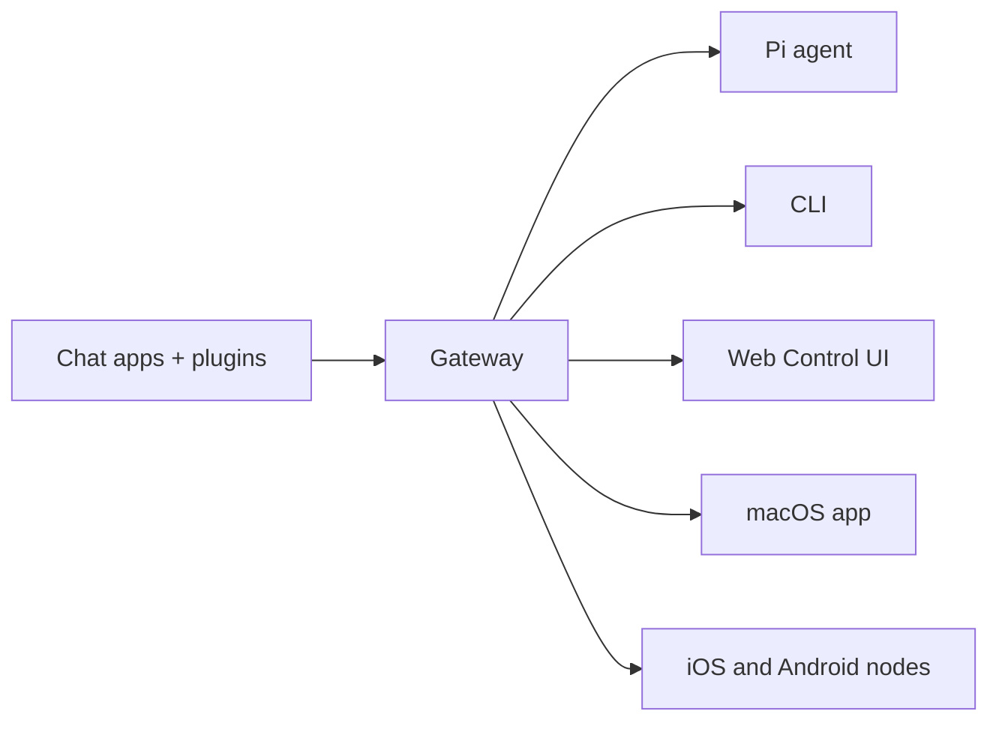

# OpenClaw 🦞

<p align="center">
    
    
</p>

> _"EXFOLIATE! EXFOLIATE!"_ — 아마도 우주 랍스터의 외침

<p align="center"><strong>WhatsApp, Telegram, Discord, iMessage 등에서 AI 에이전트를 연결하는 모든 OS 용 Gateway(게이트웨이).</strong><br />
  메시지를 보내면, 주머니 속에서 바로 에이전트의 응답을 받습니다. 플러그인을 통해 Mattermost 등도 추가할 수 있습니다.
</p>

<Columns>
  <Card title="Get Started" href="/start/getting-started" icon="rocket">
    OpenClaw 를 설치하고 몇 분 안에 Gateway 를 실행합니다.
  </Card>
  <Card title="Run the Wizard" href="/start/wizard" icon="sparkles">
    `openclaw onboard` 및 페어링 흐름을 포함한 가이드형 설정입니다.
  </Card>
  <Card title="Open the Control UI" href="/web/control-ui" icon="layout-dashboard">
    채팅, 설정, 세션을 위한 브라우저 대시보드를 실행합니다.
  </Card>
</Columns>

## OpenClaw 란 무엇인가요?

OpenClaw 는 **셀프 호스팅 Gateway** 로, WhatsApp, Telegram, Discord, iMessage 등 즐겨 사용하는 채팅 앱을 Pi 와 같은 AI 코딩 에이전트에 연결합니다. 사용자의 머신(또는 서버)에서 단일 Gateway 프로세스를 실행하면, 메시징 앱과 항상 사용 가능한 AI 어시스턴트 사이의 다리가 됩니다.

**누구를 위한 것인가요?** 어디서나 메시지로 접근할 수 있는 개인 AI 어시스턴트를 원하면서도, 데이터에 대한 통제권을 유지하고 호스팅 서비스에 의존하지 않으려는 개발자와 파워 유저를 위한 도구입니다.

**무엇이 다른가요?**

- **셀프 호스팅**: 사용자의 하드웨어에서, 사용자의 규칙으로 실행됩니다.
- **멀티 채널**: 하나의 Gateway 가 WhatsApp, Telegram, Discord 등을 동시에 제공합니다.
- **에이전트 네이티브**: 도구 사용, 세션, 메모리, 멀티 에이전트 라우팅을 갖춘 코딩 에이전트를 위해 설계되었습니다.
- **오픈 소스**: MIT 라이선스, 커뮤니티 주도 프로젝트입니다.

**무엇이 필요하나요?** Node 22+, API 키(Anthropic 권장), 그리고 5 분이면 충분합니다.

## 작동 방식



Gateway 는 세션, 라우팅, 채널 연결에 대한 단일 진실 공급원입니다.

## 주요 기능

<Columns>
  <Card title="Multi-channel gateway" icon="network">
    하나의 Gateway 프로세스로 WhatsApp, Telegram, Discord, iMessage 를 지원합니다.
  </Card>
  <Card title="Plugin channels" icon="plug">
    확장 패키지로 Mattermost 등 다양한 채널을 추가할 수 있습니다.
  </Card>
  <Card title="Multi-agent routing" icon="route">
    에이전트, 워크스페이스, 또는 발신자별로 격리된 세션을 제공합니다.
  </Card>
  <Card title="Media support" icon="image">
    이미지, 오디오, 문서를 송수신할 수 있습니다.
  </Card>
  <Card title="Web Control UI" icon="monitor">
    채팅, 설정, 세션, 노드를 위한 브라우저 대시보드입니다.
  </Card>
  <Card title="Mobile nodes" icon="smartphone">
    Canvas 지원과 함께 iOS 및 Android 노드를 페어링합니다.
  </Card>
</Columns>

## 빠른 시작

<Steps>
  <Step title="Install OpenClaw">
    ```bash
    npm install -g openclaw@latest
    ```
  </Step>
  <Step title="Onboard and install the service">
    ```bash
    openclaw onboard --install-daemon
    ```
  </Step>
  <Step title="Pair WhatsApp and start the Gateway">
    ```bash
    openclaw channels login
    openclaw gateway --port 18789
    ```
  </Step>
</Steps>

전체 설치 및 개발 설정이 필요하신가요? [빠른 시작](/start/quickstart)을 참고하십시오.

## 대시보드

Gateway 가 시작된 후 브라우저에서 Control UI 를 엽니다.

- 로컬 기본값: [http://127.0.0.1:18789/](http://127.0.0.1:18789/)
- 원격 액세스: [Web surfaces](/web) 및 [Tailscale](/gateway/tailscale)

<p align="center">
  
</p>

## 구성 (선택 사항)

구성 파일은 `~/.openclaw/openclaw.json` 에 위치합니다.

- **아무것도 하지 않으면**, OpenClaw 는 번들된 Pi 바이너리를 RPC 모드로 사용하며 발신자별 세션을 제공합니다.
- 보안을 강화하려면 `channels.whatsapp.allowFrom` 로 시작하고, (그룹의 경우) 멘션 규칙을 설정하십시오.

예시:

```json5
{
  channels: {
    whatsapp: {
      allowFrom: ["+15555550123"],
      groups: { "*": { requireMention: true } },
    },
  },
  messages: { groupChat: { mentionPatterns: ["@openclaw"] } },
}
```

## 여기서 시작하세요

<Columns>
  <Card title="Docs hubs" href="/start/hubs" icon="book-open">
    사용 사례별로 정리된 모든 문서와 가이드입니다.
  </Card>
  <Card title="Configuration" href="/gateway/configuration" icon="settings">
    핵심 Gateway 설정, 토큰, 프로바이더 구성입니다.
  </Card>
  <Card title="Remote access" href="/gateway/remote" icon="globe">
    SSH 및 tailnet 액세스 패턴입니다.
  </Card>
  <Card title="Channels" href="/channels/telegram" icon="message-square">
    WhatsApp, Telegram, Discord 등 채널별 설정입니다.
  </Card>
  <Card title="Nodes" href="/nodes" icon="smartphone">
    페어링과 Canvas 를 지원하는 iOS 및 Android 노드입니다.
  </Card>
  <Card title="Help" href="/help" icon="life-buoy">
    일반적인 해결 방법과 문제 해결 진입점입니다.
  </Card>
</Columns>

## 더 알아보기

<Columns>
  <Card title="Full feature list" href="/concepts/features" icon="list">
    채널, 라우팅, 미디어 기능의 전체 목록입니다.
  </Card>
  <Card title="Multi-agent routing" href="/concepts/multi-agent" icon="route">
    워크스페이스 격리 및 에이전트별 세션입니다.
  </Card>
  <Card title="Security" href="/gateway/security" icon="shield">
    토큰, 허용 목록, 안전 제어입니다.
  </Card>
  <Card title="Troubleshooting" href="/gateway/troubleshooting" icon="wrench">
    Gateway 진단 및 일반적인 오류입니다.
  </Card>
  <Card title="About and credits" href="/reference/credits" icon="info">
    프로젝트의 기원, 기여자, 라이선스입니다.
  </Card>
</Columns>
