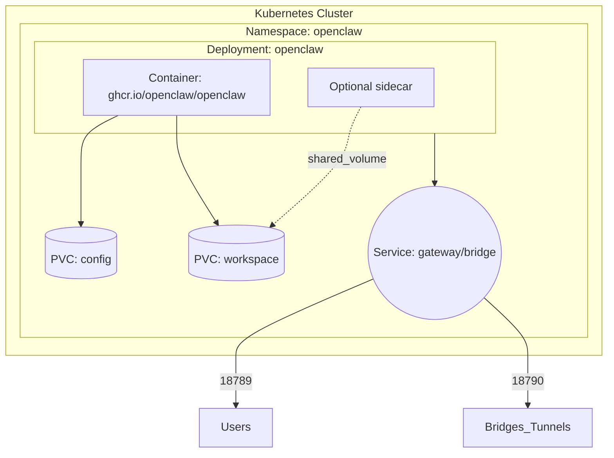
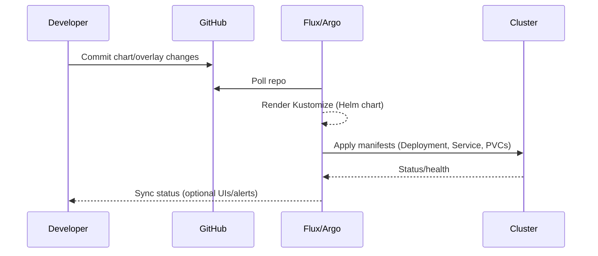

# OpenClaw on Kubernetes

Running OpenClaw inside Kubernetes keeps the upstream code untouched while letting you
compose sidecars, declarative secrets, GitOps pipelines, and HA upgrades. This guide
covers the packaged Helm chart, Kustomize overlays, and GitOps workflows.

## Architecture

Kubernetes hosts the gateway container alongside any helper sidecars (browser, cron,
model runners). Persistent volumes provide `/home/node/.openclaw` state, while services
expose the gateway and bridge ports.



Flux or Argo CD reconcile the chart via Kustomize overlays, keeping the cluster in sync
with git.



## Helm chart (`deploy/kubernetes/charts/openclaw`)

The chart deploys:

- `Deployment` running `ghcr.io/openclaw/openclaw`
- `Service` exposing ports 18789 (gateway) + 18790 (bridge)
- Optional `Ingress`
- PVCs for `/home/node/.openclaw` and `/home/node/.openclaw/workspace`
- Optional Secret (for `OPENCLAW_GATEWAY_TOKEN`, OAuth creds, etc.)
- BusyBox init container to fix permissions on shared volumes

Key values (`values.yaml`):

| Value | Purpose |
|-------|---------|
| `image.repository/tag/pullPolicy` | Pin the OpenClaw container release. |
| `gateway.env/args` | Inject CLI flags or env vars (model keys, bind mode). |
| `secret.create/stringData` | Inline secret creation. Set `secret.create=false` to reference an external secret. |
| `persistence.{config,workspace}` | Size, accessMode, storageClass, or reuse `existingClaim`. |
| `extraContainers/extraVolumes` | Attach GUI browsers, proxies, etc., without modifying upstream images. |
| `ingress.*` | Enable HTTP ingress + TLS. |

Install directly:

```bash
helm upgrade --install openclaw \
  ./deploy/kubernetes/charts/openclaw \
  --namespace openclaw --create-namespace \
  --set image.tag=v2026.2.13 \
  --set secret.create=true \
  --set secret.stringData.OPENCLAW_GATEWAY_TOKEN="REPLACE_ME"
```

## Kustomize overlays (`deploy/kubernetes/kustomize`)

- `base/` – namespace definition (openclaw)
- `overlays/dev` – single replica, smaller PVCs, sample secret
- `overlays/prod` – two replicas, ingress + TLS, references external secret

Render locally:

```bash
kustomize build deploy/kubernetes/kustomize/overlays/dev
```

### Flux example

```yaml
apiVersion: source.toolkit.fluxcd.io/v1
kind: GitRepository
metadata:
  name: openclaw
spec:
  interval: 1m
  url: https://github.com/egkristi/openclaw
  ref:
    branch: feature/k8s
---
apiVersion: kustomize.toolkit.fluxcd.io/v1
kind: Kustomization
metadata:
  name: openclaw
spec:
  interval: 5m
  path: ./deploy/kubernetes/kustomize/overlays/prod
  prune: true
  sourceRef:
    kind: GitRepository
    name: openclaw
```

### Argo CD example

```yaml
apiVersion: argoproj.io/v1alpha1
kind: Application
metadata:
  name: openclaw
spec:
  destination:
    namespace: openclaw
    server: https://kubernetes.default.svc
  project: default
  source:
    repoURL: https://github.com/egkristi/openclaw.git
    targetRevision: feature/k8s
    path: deploy/kubernetes/kustomize/overlays/dev
  syncPolicy:
    automated:
      prune: true
      selfHeal: true
```

## Secrets & security

- **Never commit real tokens.** Use `secret.create=false` and reference a secret from
  External Secrets, SOPS, or your cloud secret manager.
- ServiceAccount is minimal by default. Add Roles/Bindings only if sidecars need API
  access.
- The Deployment runs as UID 1000 (`node`). Adjust `securityContext` if a sidecar needs
  elevated privileges.

## Self-deploy / progressive rollout

Because every manifest lives in git, OpenClaw can "self-deploy" by committing changes
(via its own automation or a human) and letting Flux/Argo reconcile. A safe rollout flow:

1. **Generate a new image/config** – e.g., publish `ghcr.io/egkristi/openclaw:<hash>` or
   tweak Helm values (sidecars, env vars, skills) and push to a feature branch.
2. **Spin up a parallel release** – duplicate the overlay (e.g., `overlays/prod-canary`) or
   use Helm values to set `fullnameOverride: openclaw-canary`. Flux/Argo deploys it next
   to the existing instance, pointing at the same persistent PVCs or at cloned ones.
3. **Health-check + smoke-test** – leverage the `/healthz` probe, run scripted checks, or
   forward traffic gradually (service mesh, Ingress weights, or manual channel tests).
4. **Promote** – once the canary is healthy, update the primary overlay/tag and let the
   controller roll the Deployment. The old ReplicaSet sticks around until the new pods
   are ready, giving you zero-downtime blue/green semantics.
5. **Garbage-collect** – delete the canary overlay/namespace via git once traffic fully
   shifts. Since the desired state is in git, the reconciler removes the extra instance.

This approach lets OpenClaw evolve autonomously: it can author PRs that add containers,
update configs, or sideload helper images, and GitOps ensures changes land only after the
cluster converges. Workspaces, memory, and config remain in git (or in PVC snapshots), so
state survives across rollouts.

## Sidecars & extensions

1. Add a browser/GUI container via `extraContainers`. Mount the same workspace PVC to
   share cookies or session files.
2. Use `extraVolumes` + `extraVolumeMounts` for shared Unix sockets or cache dirs.
3. Wire Prometheus scraping by enabling service annotations (`prometheus.io/*`).
4. Attach NetworkPolicies or ServiceMonitors outside the chart via additional manifests in
   your overlay.

## Upstream compatibility

All Kubernetes assets live under `deploy/kubernetes/*` plus documentation links, so they
can track the official upstream repo without touching core code. Regularly merge upstream
`main` into your branch to stay current; conflicts are unlikely unless upstream eventually
ships their own Kubernetes package (in which case you can upstream these files or adapt).
