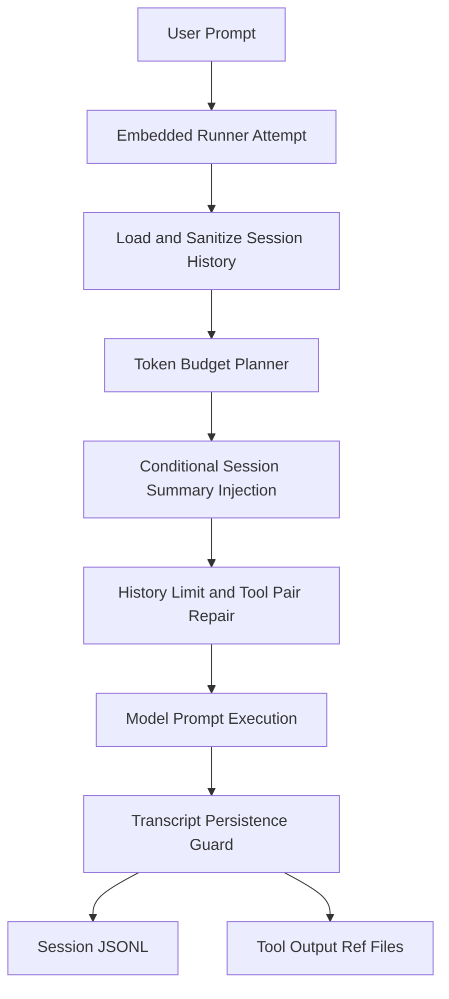
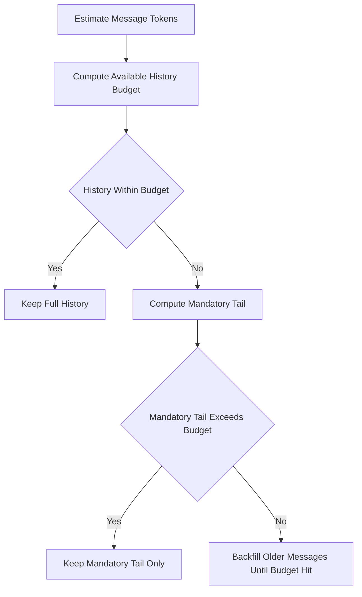
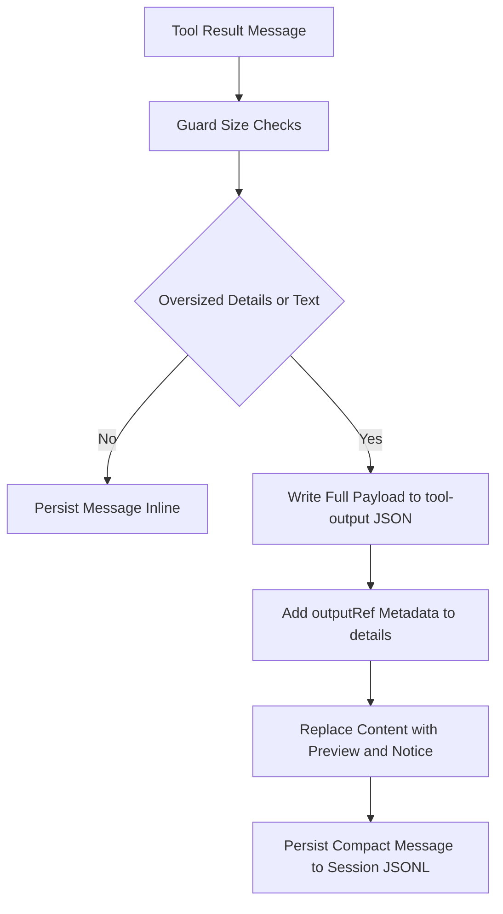

# Memory Kernel Rebuild: Design, Implementation, and Test Results (2026-02-15)

## Scope

This document records the implementation and validation of the memory/context rebuild work delivered in PR `openclaw/openclaw#17345` on branch `codex/memory-token-budget-planner`.

Covered commits:

- `84e694680` Runner: add token-budget context planning
- `520998e5a` Memory: cap injected recall snippets
- `e22c86b41` Runner: persist incremental session summary state
- `9642a3a6a` Runner: prevent session-summary prompt feedback loops
- `b9490e95e` Runner: recover session summary after transcript rewinds
- `827d3e48c` Runner: inject session summary only under context pressure
- `f43c5f41f` Session: persist oversized tool payloads as file refs

## Design Goals

- Replace blunt turn-count trimming with deterministic token budgeting.
- Keep transcript continuity resilient by adding incremental summary state.
- Prevent summary feedback loops in conversation history.
- Keep cache prefix stable when context pressure is low.
- Stop oversized tool outputs from bloating transcript/prompt context by storing references.

## High-Level Architecture

## Implementation Details

### 1) Token-Budget Context Planning

Primary file:

- `src/agents/pi-embedded-runner/context-planner.ts`

Key behavior:

- Computes `historyBudget` from model context window, reserve tokens, static prompt tokens, dynamic reserve, and safety ratio.
- Trims from oldest messages first.
- Preserves mandatory tail from latest user turn onward.
- Handles invalid-budget fallback by preserving at least the last message.

Flow:

### 2) Memory Retrieval Payload Cap

Primary files:

- `src/agents/tools/memory-tool.ts`
- `src/agents/memory-search.ts`
- `src/config/types.tools.ts`
- `src/config/zod-schema.agent-runtime.ts`

Key behavior:

- Introduced injected snippet cap (default `maxInjectedChars=4000`) to bound recall payload size in prompt context.
- Applied consistently across memory search backends.

### 3) Session Summary Sidecar State

Primary files:

- `src/agents/pi-embedded-runner/session-summary.ts`
- `src/agents/pi-embedded-runner/run/attempt.ts`

Key behavior:

- Added sidecar summary state path: `<sessionFile>.summary.json`.
- Tracks `lastProcessedMessageCount`, rolling summary items, and bounded prompt materialization.
- Persists incrementally each run.

### 4) Summary Loop and Rewind Hardening

Primary files:

- `src/agents/pi-embedded-runner/session-summary.ts`
- `src/agents/pi-embedded-runner/run/attempt.ts`

Fixes:

- Ignore synthetic `[SESSION_SUMMARY]` content during summary updates.
- Recover correctly when transcript message count rewinds after repair/compaction.
- Keep summary text in system context path instead of user prompt path.

### 5) Cache-Aware Summary Injection Policy

Primary file:

- `src/agents/pi-embedded-runner/run/attempt.ts`

Key behavior:

- Added `decideSessionSummaryInjection(...)`.
- Inject summary into system prompt only when:
  - history was trimmed, or
  - context pressure ratio crosses threshold (default `0.72`).
- If not under pressure, summary state still persists but cached prefix remains more stable.

### 6) Tool Payload Reference Persistence (P5)

Primary file:

- `src/agents/session-tool-result-guard.ts`

Key behavior:

- On tool-result persistence, if payload is oversized:
  - write full payload to `.../sessions/tool-output/*.json`;
  - keep compact transcript preview and `details.outputRef` metadata in JSONL.
- Preserves essential scalar metadata (`status`, `exitCode`, etc.) in transcript.

Flow:

## Key Files Changed

- `src/agents/pi-embedded-runner/context-planner.ts`
- `src/agents/pi-embedded-runner/context-planner.test.ts`
- `src/agents/tools/memory-tool.ts`
- `src/agents/memory-search.ts`
- `src/config/types.tools.ts`
- `src/config/zod-schema.agent-runtime.ts`
- `src/agents/pi-embedded-runner/session-summary.ts`
- `src/agents/pi-embedded-runner/session-summary.test.ts`
- `src/agents/pi-embedded-runner/run/attempt.ts`
- `src/agents/pi-embedded-runner/run/attempt.e2e.test.ts`
- `src/agents/session-tool-result-guard.ts`
- `src/agents/session-tool-result-guard.e2e.test.ts`

## Automated Test Results

Final verification rerun completed on HEAD `f43c5f41f`:

- `pnpm tsgo`
  - Result: pass
- `pnpm test src/agents/pi-embedded-runner/context-planner.test.ts src/agents/pi-embedded-runner/session-summary.test.ts`
  - Result: `2` files, `11` tests passed
- `pnpm exec vitest run -c vitest.e2e.config.ts src/agents/pi-embedded-runner.limithistoryturns.e2e.test.ts src/agents/pi-embedded-runner/run/attempt.e2e.test.ts src/agents/memory-search.e2e.test.ts src/agents/tools/memory-tool.citations.e2e.test.ts src/agents/session-tool-result-guard.e2e.test.ts src/agents/session-tool-result-guard.tool-result-persist-hook.e2e.test.ts`
  - Result: `6` files, `46` tests passed

Historical targeted runs during implementation also passed for the same suites when executed incrementally.

## UAT Results

### UAT 1: Summary Sidecar and Loop Prevention

Session:

- `agent:main:uat-summary-fix`

Observed:

- Summary sidecar created under `~/.openclaw/agents/main/sessions/*.jsonl.summary.json`.
- No synthetic `[SESSION_SUMMARY]` artifacts re-ingested into summary items.

### UAT 2: Tool Output Reference Persistence

Session:

- `agent:main:uat-p5-tool-output-ref`

Input:

- `python - <<'PY'`
- `print("x"*150000)`
- `PY`

Observed:

- Transcript `toolResult.details.outputRef` created with:
  - `kind: "tool_result_payload"`
  - `path: "tool-output/<timestamp>-exec-...json"`
  - `bytes` and `sha256`
  - `contains: { details: true, text: true }`
- Referenced payload file exists at:
  - `~/.openclaw/agents/main/sessions/tool-output/...json`
- Tool-result text in transcript contains:
  - `[openclaw] Full tool output saved to ...`

## Current Status

Implemented and validated:

- Phase 1: token-budget planning core
- Phase 2: retrieval injection cap
- Phase 3: incremental summary sidecar, loop prevention, rewind recovery
- Phase 4: cache-aware conditional summary injection
- Phase 5: oversized tool payload reference persistence

Remaining follow-ups:

- Read helper path for `outputRef` payloads (on-demand full retrieval).
- Benchmark report for token/cost/latency deltas across long sessions.
