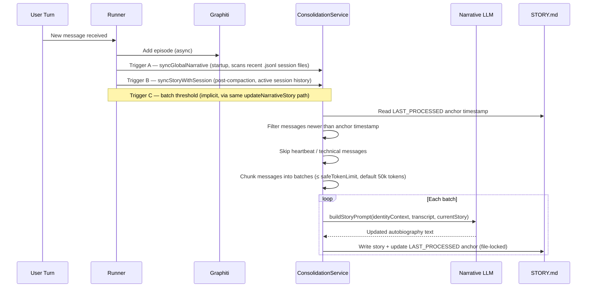
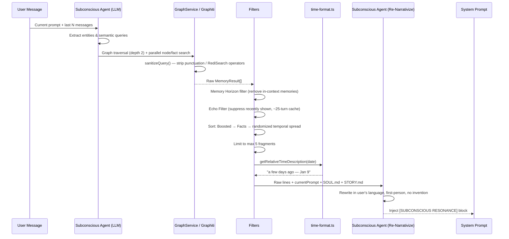

# Mind Memory & Subconscious Architecture

MindBot (OpenClaw fork) implements a **Dual-Process Theory of Mind**, separating immediate conversational logic from long-term narrative identity and semantic resonance.

## 1. Architectural Overview

The memory system is divided into two primary loops:

### A. The Conscious System (Foreground)
*   **Context Window**: Holds the short-term chat history for immediate response generation.
*   **Direct Recall Tools**:
    *   `remember`: Queries the Graphiti knowledge graph for facts and entities.
    *   `journal_memory_search`: Semantically searches Markdown chunks from `MEMORY.md` and `memory/*.md`.
    *   `journal_memory_get`: Reads specific memory file content by path.

**Recall Protocol**:
When the `mind-memory` plugin is active, the system prompt instructs the agent to check *both* memory systems (`remember` for the knowledge graph, `journal_memory_search` for Markdown files) before answering questions about prior work, decisions, or user preferences. When only the base memory plugin is active, the prompt guides `journal_memory_search` / `journal_memory_get` only.

### B. The Subconscious System (Background)
*   **Memory Resonance**: Before every turn, a 6-phase **Subconscious Resonance Pipeline** surfaces relevant past moments as natural-language flashbacks silently injected into the system prompt. See [Section 5](#5-the-subconscious-resonance-pipeline) for full detail.
*   **Narrative Consolidation**: A background process distills raw conversation (batched by token count) into a persistent, first-person autobiography (`STORY.md`).

---

## 2. Memory Components

### Graphiti (Episodic & Semantic)
MindBot uses Graphiti (via MCP server) as its primary long-term repository.
*   **Episodes**: Every turn is stored as a raw chronological event.
*   **Entities (Nodes)**: People, places, concepts extracted from conversations.
*   **Facts (Edges)**: Relationships and facts connecting entities.
*   **Neural Resonance**: Retrieval-Augmented Generation (RAG) using semantic search to find relevant past interactions.
*   **Heartbeat Isolation**: Messages like `HEARTBEAT_OK` are filtered out before reaching the graph to maintain signal quality.
*   **Docker-based**: Runs via Docker Compose with FalkorDB backend at `http://localhost:8001`.

### Mind Memory (`STORY.md`)
The core of MindBot's identity is stored in a local Markdown file.
*   **The Global Story**: A first-person narrative ("I", "My") that evolves with the user.
*   **Global Scope**: All interactions across channels are consolidated into a single identity (`global-user-memory`).
*   **Persistence**: Unlike context-window memory, the story is perpetual and survives session resets.
*   **Injection**: Content is injected into the agent's system prompt every turn, providing historical weight and temporal awareness.

---

## 3. The Consolidation Pipeline

Narrative consolidation runs via `ConsolidationService` in three distinct triggers, all funneling through `updateNarrativeStory` which holds an exclusive file lock on `STORY.md`:



### Consolidation Triggers

| Trigger | When | Method |
|---|---|---|
| **Global Sync** | Agent startup (before first turn) | `syncGlobalNarrative` — scans last 5 `.jsonl` session files, collects messages after anchor |
| **Session Sync** | After context window compaction | `syncStoryWithSession` — processes in-memory message array |
| **Legacy Bootstrap** | First-time setup with pre-existing memory files | `bootstrapFromLegacyMemory` — concatenates all historical `YYYY-MM-DD.md` files into one pass |

### The Anchor Timestamp Mechanism

Every successful write to `STORY.md` embeds an invisible HTML comment:
```html
<!-- LAST_PROCESSED: 2026-01-28T13:45:00.000Z -->
```
On the next consolidation, the service reads this timestamp and **only processes messages newer than it**, preventing any message from being narrativized twice.

### Chunked Processing Strategy

To avoid exceeding the narrative LLM's context window, messages are grouped into token-limited batches:
1. Estimate tokens per message using `estimateTokens()`
2. Accumulate messages until the batch would exceed `safeTokenLimit` (default: 50,000 tokens)
3. Call `updateNarrativeStory` per batch — each call receives the current story and extends it
4. Update the anchor after each successful batch write

### Heartbeat & Probe Filtering

Messages matching heartbeat patterns (e.g. `Read HEARTBEAT.md ... reply HEARTBEAT_OK`) and probe sessions are skipped entirely — they never reach Graphiti or the narrative.

### Safety & Integrity Mechanisms

*   **File Lock** (`withFileLock`): All STORY.md writes acquire an exclusive file lock (`STORY.md.lock`), preventing concurrent corruption across parallel consolidation calls.
*   **Anchor Invariant**: `LAST_PROCESSED` is the only mechanism used to determine what is new. It is written atomically with the story content.
*   **Type Validation**: Response text is validated as `typeof response?.text === "string"` before writing — prevents `[object Object]` corruption.
*   **Graceful Degradation**: Empty or null LLM responses return the current story unchanged.
*   **Heartbeat Protection**: Heartbeat messages never enter the narrative or Graphiti.

---

## 4. The Story Prompt

**File**: `src/services/memory/story-prompt-builder.ts`

`buildStoryPrompt` generates the narrative LLM prompt with two modes:

- **Bootstrap** (`isBootstrap: true`): No existing story — synthesizes first events into an autobiography from scratch.
- **Incremental** (`isBootstrap: false`): Integrates new events into the existing autobiography, avoiding duplication.

The prompt enforces:

| Rule | Description |
|---|---|
| **Voice** | Always first-person (`I`, `Me`, `My`) |
| **Chapter format** | `### [YYYY-MM-DD HH:MM] Short evocative title` |
| **Biographical fidelity** | Preserve concrete facts, people's names, outcomes, milestones |
| **No duplication** | Never repeat events already in the existing story |
| **Length limit** | Auto-summarize older chapters if approaching 10,000 words |
| **No metadata** | Identity/soul file headers are never included in output |

### SubconsciousAgent Factory

**File**: `src/agents/pi-embedded-runner/subconscious-agent.ts`

Factory function that creates a lightweight LLM client for narrative generation:

*   **Streaming**: Uses `streamSimple` from `@mariozechner/pi-ai` for efficient token streaming.
*   **Error Detection**: Detects error events emitted by the stream (not thrown as exceptions).
*   **Automatic Failover**: If primary model fails via Copilot, automatically retries with `gpt-4o`:
    ```typescript
    if (result.streamError && isCopilotProvider && result.text.length === 0) {
      // Failover to gpt-4o
    }
    ```
*   **Audio Format Handling**: Processes mu-law audio chunks (8kHz telephony standard).
*   **Debug Mode**: Comprehensive logging when `debug: true` is passed.

### Model Resolution

**File**: `src/agents/pi-embedded-runner/run.ts`

Narrative model resolution follows this hierarchy:

1. **mindConfig.config.narrative.provider/model**: Primary source for narrative-specific model.
2. **Chat model fallback**: If not configured, uses the main agent's chat model.
3. **Error handling**: If resolution fails, logs warning and falls back gracefully.

```typescript
const narrativeProvider =
  (mindConfig?.config as any)?.narrative?.provider || provider;
const narrativeModel =
  (mindConfig?.config as any)?.narrative?.model || modelId;
```

The SubconsciousAgent is created at two points in the agent lifecycle:

*   **Global narrative sync**: Before agent run starts (batch consolidation of recent sessions).
*   **Post-compaction**: After context window compaction (consolidate compacted messages).

### Integration Points

**Runner Integration** (`src/agents/pi-embedded-runner/run.ts`):

1. **Startup**: Loads STORY.md and injects into system prompt.
2. **Pre-turn**: Queries Graphiti for memory resonance ("Flashbacks").
3. **Post-turn**: Appends episode to Graphiti and pending-episodes.log.
4. **Batch trigger**: When log crosses threshold (~5000 tokens), triggers consolidation.
5. **Post-compaction**: Consolidates compacted messages into story.

**Safety Mechanisms**:
*   **Metadata Anchors**: `<!-- LAST_PROCESSED: [ISO] -->` tracks narrated progress.
*   **Heartbeat Protection**: Consolidation skipped for heartbeat turns.
*   **Audit Log**: `pending-episodes.log` provides reliable, auditable trace.
*   **Type Validation**: Strict type checking prevents object/string confusion.
*   **Graceful Degradation**: Empty responses return current story unchanged.

---

## 5. The Subconscious Resonance Pipeline

**Core file**: `src/services/memory/SubconsciousService.ts`

The pipeline runs before every non-heartbeat agent turn and follows 6 sequential phases:



### Phase 1 — Seed Extraction

`SubconsciousService.generateSeekerQueries()` and `extractEntities()` use the Subconscious Agent (a lightweight LLM) to analyze the current message + recent history and produce:
- **Named entities**: People, places, projects
- **Semantic queries**: 2–3 clean search phrases (Telegram IDs and technical metadata are stripped)

### Phase 2 — Graph Retrieval

`GraphService.searchNodes()` and `searchFacts()` are called in parallel per query. Before any Graphiti call, `sanitizeQuery()` strips characters that break the RediSearch query engine:

```typescript
// Removes punctuation and special chars, keeps Unicode letters, numbers, spaces
private sanitizeQuery(query: string): string {
  return query.replace(/[^\p{L}\p{N}\s\-_]/gu, " ").replace(/\s+/g, " ").trim();
}
```

### Phase 3 — Temporal & Quality Filters

- **Memory Horizon** (`applyMemoryHorizon`): Removes memories that fall within the current conversation's visible window — they're already in context.
- **Echo Filter** (`applyEchoFilter`): A circular buffer of ~25 recently-injected memory IDs prevents repeating the same flashback every turn.
- **Priority sort**: Boosted → Facts first → pseudo-random temporal spread to avoid showing N memories from the same date.
- **Limit**: Maximum 5 fragments per turn (configurable).

### Phase 4 — Temporal Labeling

`getRelativeTimeDescription(date)` in `src/utils/time-format.ts` converts each memory's timestamp into a human-readable sensation:

| Range | Label |
|---|---|
| < 30 min | `a moment ago` |
| 30 min – 2 h | `a little while ago` |
| 2–6 h | `a few hours ago` |
| 6–18 h | `earlier today` |
| 18–30 h | `yesterday` |
| 2–4 days | `a few days ago` |
| 4–10 days | `last week` |
| 10–20 days | `a couple of weeks ago` |
| 20–45 days | `about a month ago` |
| 45–90 days | `a couple of months ago` |
| 3–6 months | `several months ago` |
| 6–11 months | `almost a year ago` |
| ~1 year | `about a year ago` |
| ~1 year+ | `over a year ago` |
| ~N years | `about N years ago`, `over N years ago`, `almost N+1 years ago` |

The relative label is combined with the exact date: `a few days ago — Jan 9`.

### Phase 5 — Re-Narrativization

The raw fragments (which contain technical log language like `"human asks..."`, `"assistant replied..."`) are rewritten by the Subconscious Agent using:

- **Language detection**: Current user message sets the output language
- **SOUL.md**: Loaded from workspace and injected as persona/tone reference
- **STORY.md**: Loaded from workspace and injected as narrative/relationship context
- **Anti-hallucination rules** (enforced in the prompt):
  1. Do not invent facts not explicitly in the raw memory
  2. Do not add sensory details (`"I heard"`, `"I saw"`) unless literally stated in the source
  3. Only rephrase style and point-of-view; keep all facts strictly sourced from raw text
  4. When uncertain, stay closer to the original wording

### Phase 6 — Injection

The rewritten flashbacks are wrapped in a minimal block and injected into the main agent's System Prompt:

```
---
[SUBCONSCIOUS RESONANCE]
- A few days ago — Jan 9, the user mentioned their mother lives in [city].
- Almost a year ago — Mar 14, the user asked whether I was truly conscious.
---
```

The main agent treats these as its own recollections — informing tone and continuity without reciting them verbatim.

---

## 6. Prompt Injection
During every agent turn, the `STORY.md` content is injected into the System Prompt. This provides the agent with:
*   **Historical Weight**: Knowledge of how the relationship has evolved over months.
*   **Temporal Awareness**: Ability to comment on the passage of time.
*   **Consistent Voice**: Self-reinforcement of its own character arc.

---

## 7. Configuration

### Narrative Model Configuration

Configure the narrative model in your mindConfig:

```json5
{
  "mindConfig": {
    "config": {
      "narrative": {
        "provider": "anthropic",           // LLM provider for narrative
        "model": "claude-opus-4-6",        // Model for story generation
        "autoBootstrapHistory": true       // Load historical episodes on startup
      }
    }
  }
}
```

### Graphiti Configuration

```json5
{
  "plugins": {
    "entries": {
      "mind-memory": {
        "enabled": true,
        "config": {
          "graphiti": {
            "baseUrl": "http://localhost:8001",
            "autoStart": true                // Auto-start Docker containers
          }
        }
      }
    }
  }
}
```

### Memory Search Configuration

```json5
{
  "agents": {
    "defaults": {
      "memorySearch": {
        "provider": "openai",               // or "gemini", "local"
        "model": "text-embedding-3-small",
        "query": {
          "hybrid": {
            "enabled": true,                // Vector + BM25 keyword search
            "vectorWeight": 0.7,
            "textWeight": 0.3,
            "mmr": {
              "enabled": true,              // Diversity re-ranking
              "lambda": 0.7
            },
            "temporalDecay": {
              "enabled": true,              // Recency boost
              "halfLifeDays": 30
            }
          }
        }
      }
    }
  }
}
```

### Consolidation Thresholds

Consolidation triggers are configured in the ConsolidationService:

*   **Default token threshold**: ~5000 tokens in pending-episodes.log.
*   **Story length limits**: Configurable max length before compression.
*   **Batch size**: Adjustable based on model context window.

---

## 8. Debugging

### Common Issues

**1. `[object Object]` in STORY.md**
*   **Cause**: LLM returning empty object `{}` instead of string.
*   **Fix**: Strict type checking in ConsolidationService validates `typeof response?.text === "string"`.

**2. Empty LLM responses**
*   **Cause**: Model doesn't exist, deprecated, or prompt too large.
*   **Fix**: Automatic failover to `gpt-4o` via SubconsciousAgent.

**3. `undefined/undefined` model in logs**
*   **Cause**: `provider` and `modelId` not resolved from params correctly.
*   **Check**: Verify local variables from `resolveModel` are used, not `params.provider/model`.

**4. Graphiti connection failure**
*   **Cause**: Docker containers not running or port conflict.
*   **Fix**: Run `docker-compose -f extensions/mind-memory/docker-compose.yml up -d` or check port 8001/6379.

**5. RediSearch Syntax Error in Flashback Retrieval**
*   **Symptom**: `RediSearch: Syntax error at offset N near <number>` in logs during memory resonance.
*   **Cause**: Raw user input (e.g. Telegram message IDs, punctuation operators) passed directly as a Graphiti search query.
*   **Fix**: `GraphService.sanitizeQuery()` strips all non-alphanumeric characters before any `searchNodes` / `searchFacts` call. The `SubconsciousService` routes flashbacks through semantic query generation (via the Subconscious Agent) rather than using the raw user prompt as a search query.

### Logging

Enable debug mode for detailed logging:

```typescript
const subconsciousAgent = createSubconsciousAgent({
  model: narrativeLLM,
  authStorage,
  modelRegistry,
  debug: true,  // Enable comprehensive logging
  autoBootstrapHistory: true
});
```

Debug logs include:
*   Stream open/close events
*   Payload details (model, API, baseUrl)
*   Token counts and elapsed time
*   Error events and failover attempts

---
*Document Version: 2.2.0 - "The Technical Scribe"*
