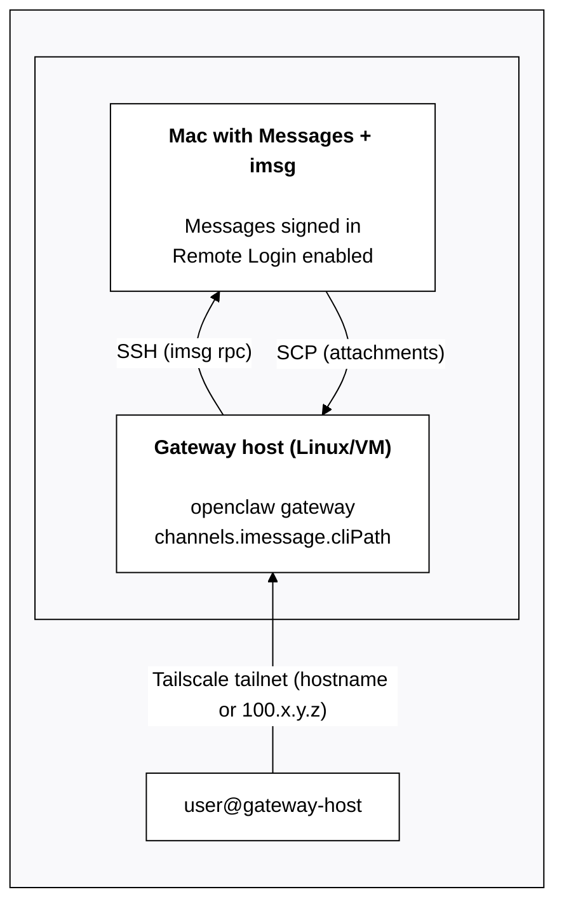

# iMessage (အဟောင်း: imsg)

> **အကြံပြုချက်:** iMessage အသစ်တပ်ဆင်မှုများအတွက် [BlueBubbles](/channels/bluebubbles) ကို အသုံးပြုပါ။
>
> `imsg` ချန်နယ်သည် အဟောင်း external-CLI ပေါင်းစည်းမှု ဖြစ်ပြီး အနာဂတ် release တစ်ခုတွင် ဖယ်ရှားခံရနိုင်သည်။

Status: legacy external CLI integration. Gateway spawns `imsg rpc` (JSON-RPC over stdio).

## Quick setup (beginner)

1. ဤ Mac တွင် Messages ကို sign in လုပ်ထားကြောင်း သေချာပါစေ။
2. `imsg` ကို ထည့်သွင်းပါ:
   - `brew install steipete/tap/imsg`
3. OpenClaw ကို `channels.imessage.cliPath` နှင့် `channels.imessage.dbPath` ဖြင့် ဖွဲ့စည်းပြင်ဆင်ပါ။
4. gateway ကို စတင်ပြီး macOS prompt များ (Automation + Full Disk Access) ကို အတည်ပြုပါ။

အနည်းဆုံး config:

```json5
{
  channels: {
    imessage: {
      enabled: true,
      cliPath: "/usr/local/bin/imsg",
      dbPath: "/Users/<you>/Library/Messages/chat.db",
    },
  },
}
```

## What it is

- macOS ပေါ်ရှိ `imsg` ကို အခြေခံထားသော iMessage ချန်နယ်။
- Deterministic routing: ပြန်လည်ဖြေကြားချက်များသည် အမြဲ iMessage သို့ ပြန်သွားသည်။
- DM မက်ဆေ့ချ်များသည် agent ၏ အဓိက ဆက်ရှင်ကို မျှဝေသုံးစွဲသည်; အုပ်စုများကို သီးခြားထားသည် (`agent:<agentId>:imessage:group:<chat_id>`)။
- `is_group=false` ပါဝင်သော အများပါဝင် thread တစ်ခု ဝင်လာပါက `channels.imessage.groups` ကို အသုံးပြု၍ `chat_id` ဖြင့် သီးခြားထားနိုင်သည် (“Group-ish threads” ကို အောက်တွင် ကြည့်ပါ)။

## Config writes

မူလအားဖြင့် iMessage သည် `/config set|unset` ကြောင့် ဖြစ်ပေါ်လာသော config update များကို ရေးသားခွင့်ပြုထားသည် (`commands.config: true` လိုအပ်သည်)။

ပိတ်ရန်:

```json5
{
  channels: { imessage: { configWrites: false } },
}
```

## Requirements

- Messages ကို sign in လုပ်ထားသော macOS။
- OpenClaw + `imsg` အတွက် Full Disk Access (Messages DB ကို ဝင်ရောက်ရန်)။
- ပို့ရာတွင် Automation ခွင့်ပြုချက်။
- `channels.imessage.cliPath` သည် stdin/stdout ကို proxy လုပ်သော မည်သည့် command မဆို ကိုညွှန်ပြနိုင်သည် (ဥပမာ၊ အခြား Mac သို့ SSH ချိတ်ပြီး `imsg rpc` ကို chạy လုပ်သည့် wrapper script)။

## Troubleshooting macOS Privacy and Security TCC

ပို့ခြင်း/လက်ခံခြင်း မအောင်မြင်ပါက (ဥပမာ `imsg rpc` သည် non-zero ဖြင့် ထွက်ခြင်း၊ timeout ဖြစ်ခြင်း၊ သို့မဟုတ် gateway က ရပ်နေသလို မြင်ရခြင်း) အကြောင်းရင်းအဖြစ် macOS ခွင့်ပြုချက် prompt တစ်ခုကို မအတည်ပြုခဲ့ခြင်း ဖြစ်နိုင်သည်။

macOS grants TCC permissions per app/process context. Approve prompts in the same context that runs `imsg` (for example, Terminal/iTerm, a LaunchAgent session, or an SSH-launched process).

Checklist:

- **Full Disk Access**: allow access for the process running OpenClaw (and any shell/SSH wrapper that executes `imsg`). This is required to read the Messages database (`chat.db`).
- **Automation → Messages**: OpenClaw ကို chạy လုပ်နေသော process (သို့မဟုတ် သင့် terminal) ကို outbound ပို့ခြင်းအတွက် **Messages.app** ကို ထိန်းချုပ်ခွင့် ပေးပါ။
- **`imsg` CLI health**: `imsg` ကို ထည့်သွင်းထားပြီး RPC (`imsg rpc --help`) ကို ပံ့ပိုးကြောင်း စစ်ဆေးပါ။

Tip: If OpenClaw is running headless (LaunchAgent/systemd/SSH) the macOS prompt can be easy to miss. Run a one-time interactive command in a GUI terminal to force the prompt, then retry:

```bash
imsg chats --limit 1
# or
imsg send <handle> "test"
```

ဆက်စပ် macOS ဖိုလ်ဒါ ခွင့်ပြုချက်များ (Desktop/Documents/Downloads): [/platforms/mac/permissions](/platforms/mac/permissions)။

## Setup (fast path)

1. ဤ Mac တွင် Messages ကို sign in လုပ်ထားကြောင်း သေချာပါစေ။
2. iMessage ကို ဖွဲ့စည်းပြင်ဆင်ပြီး gateway ကို စတင်ပါ။

### Dedicated bot macOS user (identity ကို သီးခြားထားရန်)

bot ကို **သီးခြား iMessage identity** ဖြင့် ပို့စေလိုပါက (သင့်ကိုယ်ပိုင် Messages ကို သန့်ရှင်းထားရန်) သီးခြား Apple ID + သီးခြား macOS user ကို အသုံးပြုပါ။

1. သီးခြား Apple ID တစ်ခု ဖန်တီးပါ (ဥပမာ `my-cool-bot@icloud.com`)။
   - Apple သည် စိစစ်မှု / 2FA အတွက် ဖုန်းနံပါတ် လိုအပ်နိုင်သည်။
2. macOS user တစ်ခု ဖန်တီးပါ (ဥပမာ `openclawhome`) နှင့် ထို user ဖြင့် sign in လုပ်ပါ။
3. ထို macOS user တွင် Messages ကို ဖွင့်ပြီး bot Apple ID ဖြင့် iMessage ကို sign in လုပ်ပါ။
4. Remote Login ကို ဖွင့်ပါ (System Settings → General → Sharing → Remote Login)။
5. `imsg` ကို ထည့်သွင်းပါ:
   - `brew install steipete/tap/imsg`
6. `ssh <bot-macos-user>@localhost true` ကို password မလိုဘဲ အလုပ်လုပ်စေရန် SSH ကို သတ်မှတ်ပါ။
7. `channels.imessage.accounts.bot.cliPath` ကို bot user အဖြစ် `imsg` ကို chạy လုပ်သော SSH wrapper သို့ ညွှန်ပြပါ။

First-run note: sending/receiving may require GUI approvals (Automation + Full Disk Access) in the _bot macOS user_. If `imsg rpc` looks stuck or exits, log into that user (Screen Sharing helps), run a one-time `imsg chats --limit 1` / `imsg send ...`, approve prompts, then retry. See [Troubleshooting macOS Privacy and Security TCC](#troubleshooting-macos-privacy-and-security-tcc).

Example wrapper (`chmod +x`). Replace `<bot-macos-user>` with your actual macOS username:

```bash
#!/usr/bin/env bash
set -euo pipefail

# Run an interactive SSH once first to accept host keys:
#   ssh <bot-macos-user>@localhost true
exec /usr/bin/ssh -o BatchMode=yes -o ConnectTimeout=5 -T <bot-macos-user>@localhost \
  "/usr/local/bin/imsg" "$@"
```

Config ဥပမာ:

```json5
{
  channels: {
    imessage: {
      enabled: true,
      accounts: {
        bot: {
          name: "Bot",
          enabled: true,
          cliPath: "/path/to/imsg-bot",
          dbPath: "/Users/<bot-macos-user>/Library/Messages/chat.db",
        },
      },
    },
  },
}
```

single-account setup များအတွက် `accounts` map အစား flat options (`channels.imessage.cliPath`, `channels.imessage.dbPath`) ကို အသုံးပြုပါ။

### Remote/SSH variant (optional)

If you want iMessage on another Mac, set `channels.imessage.cliPath` to a wrapper that runs `imsg` on the remote macOS host over SSH. OpenClaw only needs stdio.

Wrapper ဥပမာ:

```bash
#!/usr/bin/env bash
exec ssh -T gateway-host imsg "$@"
```

**Remote attachments:** When `cliPath` points to a remote host via SSH, attachment paths in the Messages database reference files on the remote machine. OpenClaw can automatically fetch these over SCP by setting `channels.imessage.remoteHost`:

```json5
{
  channels: {
    imessage: {
      cliPath: "~/imsg-ssh", // SSH wrapper to remote Mac
      remoteHost: "user@gateway-host", // for SCP file transfer
      includeAttachments: true,
    },
  },
}
```

If `remoteHost` is not set, OpenClaw attempts to auto-detect it by parsing the SSH command in your wrapper script. Explicit configuration is recommended for reliability.

#### Remote Mac via Tailscale (example)

If the Gateway runs on a Linux host/VM but iMessage must run on a Mac, Tailscale is the simplest bridge: the Gateway talks to the Mac over the tailnet, runs `imsg` via SSH, and SCPs attachments back.

Architecture:



Concrete config example (Tailscale hostname):

```json5
{
  channels: {
    imessage: {
      enabled: true,
      cliPath: "~/.openclaw/scripts/imsg-ssh",
      remoteHost: "bot@mac-mini.tailnet-1234.ts.net",
      includeAttachments: true,
      dbPath: "/Users/bot/Library/Messages/chat.db",
    },
  },
}
```

Example wrapper (`~/.openclaw/scripts/imsg-ssh`):

```bash
#!/usr/bin/env bash
exec ssh -T bot@mac-mini.tailnet-1234.ts.net imsg "$@"
```

မှတ်ချက်များ —

- Ensure the Mac is signed in to Messages, and Remote Login is enabled.
- Use SSH keys so `ssh bot@mac-mini.tailnet-1234.ts.net` works without prompts.
- `remoteHost` should match the SSH target so SCP can fetch attachments.

Multi-account support: use `channels.imessage.accounts` with per-account config and optional `name`. See [`gateway/configuration`](/gateway/configuration#telegramaccounts--discordaccounts--slackaccounts--signalaccounts--imessageaccounts) for the shared pattern. Don't commit `~/.openclaw/openclaw.json` (it often contains tokens).

## Access control (DMs + groups)

DM များ:

- မူလ: `channels.imessage.dmPolicy = "pairing"`။
- မသိသော ပို့သူများသည် pairing code ကို လက်ခံရရှိပြီး အတည်ပြုမပြုလုပ်မချင်း မက်ဆေ့ချ်များကို လျစ်လျူရှုမည် (code များသည် ၁ နာရီအတွင်း သက်တမ်းကုန်ဆုံးသည်)။
- အတည်ပြုရန်-
  - `openclaw pairing list imessage`
  - `openclaw pairing approve imessage <CODE>`
- Pairing is the default token exchange for iMessage DMs. Details: [Pairing](/channels/pairing)

အုပ်စုများ:

- `channels.imessage.groupPolicy = open | allowlist | disabled`။
- `allowlist` ကို သတ်မှတ်ထားသည့်အခါ အုပ်စုတွင် မည်သူက trigger လုပ်နိုင်သည်ကို `channels.imessage.groupAllowFrom` က ထိန်းချုပ်သည်။
- Mention gating uses `agents.list[].groupChat.mentionPatterns` (or `messages.groupChat.mentionPatterns`) because iMessage has no native mention metadata.
- Multi-agent override: per-agent patterns ကို `agents.list[].groupChat.mentionPatterns` တွင် သတ်မှတ်ပါ။

## How it works (behavior)

- `imsg` streams message events; the gateway normalizes them into the shared channel envelope.
- Replies always route back to the same chat id or handle.

## Group-ish threads (`is_group=false`)

`channels.imessage.groups` အောက်တွင် `chat_id` ကို ထင်ရှားစွာ သတ်မှတ်ပါက OpenClaw သည် ထို thread ကို အောက်ပါအတွက် “group” အဖြစ် သဘောထားမည်-

If you explicitly configure a `chat_id` under `channels.imessage.groups`, OpenClaw treats that thread as a “group” for:

- session isolation (separate `agent:<agentId>:imessage:group:<chat_id>` session key)
- group allowlisting / mention gating behavior

ဥပမာ:

```json5
{
  channels: {
    imessage: {
      groupPolicy: "allowlist",
      groupAllowFrom: ["+15555550123"],
      groups: {
        "42": { requireMention: false },
      },
    },
  },
}
```

This is useful when you want an isolated personality/model for a specific thread (see [Multi-agent routing](/concepts/multi-agent)). For filesystem isolation, see [Sandboxing](/gateway/sandboxing).

## Media + limits

- Optional attachment ingestion via `channels.imessage.includeAttachments`.
- Media cap via `channels.imessage.mediaMaxMb`.

## Limits

- Outbound text ကို `channels.imessage.textChunkLimit` အထိ ခွဲခြားပို့သည် (ပုံမှန် 4000)။
- Optional newline chunking: `channels.imessage.chunkMode="newline"` ကို သတ်မှတ်ပါက အရှည်အလိုက် ခွဲခြားမီ blank lines (paragraph boundaries) အလိုက် ခွဲမည်။
- Media upload များကို `channels.imessage.mediaMaxMb` ဖြင့် ကန့်သတ်ထားပါသည် (ပုံမှန် 16)။

## Addressing / delivery targets

Prefer `chat_id` for stable routing:

- `chat_id:123` (preferred)
- `chat_guid:...`
- `chat_identifier:...`
- direct handles: `imessage:+1555` / `sms:+1555` / `user@example.com`

List chats:

```
imsg chats --limit 20
```

## Configuration reference (iMessage)

ဖွဲ့စည်းပြင်ဆင်မှု အပြည့်အစုံ: [Configuration](/gateway/configuration)

Provider options:

- `channels.imessage.enabled`: channel startup ကို ဖွင့်/ပိတ်။
- `channels.imessage.cliPath`: path to `imsg`.
- `channels.imessage.dbPath`: Messages DB path.
- `channels.imessage.remoteHost`: SSH host for SCP attachment transfer when `cliPath` points to a remote Mac (e.g., `user@gateway-host`). Auto-detected from SSH wrapper if not set.
- `channels.imessage.service`: `imessage | sms | auto`.
- `channels.imessage.region`: SMS region.
- `channels.imessage.dmPolicy`: `pairing | allowlist | open | disabled` (မူလ: pairing).
- `channels.imessage.allowFrom`: DM allowlist (handles, emails, E.164 numbers, or `chat_id:*`). `open` requires `"*"`. iMessage has no usernames; use handles or chat targets.
- `channels.imessage.groupPolicy`: `open | allowlist | disabled` (default: allowlist)။
- `channels.imessage.groupAllowFrom`: အုပ်စု ပို့သူ allowlist။
- `channels.imessage.historyLimit` / `channels.imessage.accounts.*.historyLimit`: max group messages to include as context (0 disables).
- `channels.imessage.dmHistoryLimit`: DM history limit in user turns. Per-user overrides: `channels.imessage.dms["<handle>"].historyLimit`.
- `channels.imessage.groups`: per-group defaults + allowlist (global defaults အတွက် `"*"` ကို အသုံးပြုပါ)။
- `channels.imessage.includeAttachments`: ingest attachments into context.
- `channels.imessage.mediaMaxMb`: inbound/outbound media cap (MB)။
- `channels.imessage.textChunkLimit`: outbound chunk size (chars)။
- `channels.imessage.chunkMode`: `length` (မူလ) သို့မဟုတ် `newline` ကို အသုံးပြု၍ အလျားအလိုက် ခွဲမပြုမီ blank line များဖြင့် ခွဲပါ။

ဆက်စပ်သော အထွေထွေ ရွေးချယ်စရာများ:

- `agents.list[].groupChat.mentionPatterns` (သို့မဟုတ် `messages.groupChat.mentionPatterns`)။
- `messages.responsePrefix`။
