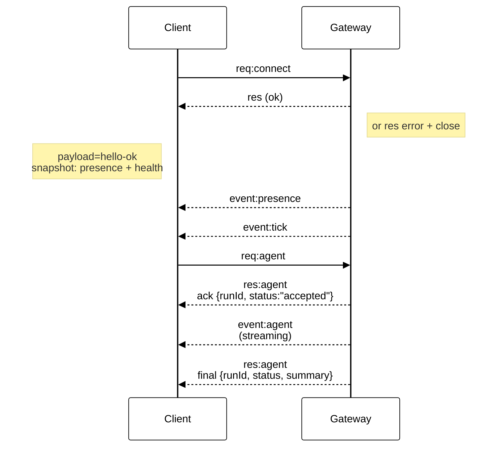

# Gateway အခြေခံဖွဲ့စည်းပုံ

နောက်ဆုံး အပ်ဒိတ်လုပ်ထားသည့်ရက်စွဲ: 2026-01-22

## အကျဉ်းချုပ်

- တစ်ခုတည်းသော အချိန်ကြာရှည် အသုံးပြုနေသော **Gateway** တစ်ခုသည် messaging surface အားလုံးကို ပိုင်ဆိုင်ထားသည် (WhatsApp ကို Baileys ဖြင့်၊ Telegram ကို grammY ဖြင့်၊ Slack၊ Discord၊ Signal၊ iMessage၊ WebChat)။
- Control-plane client များ (macOS app၊ CLI၊ web UI၊ automations) သည် သတ်မှတ်ထားသော bind host (default `127.0.0.1:18789`) တွင် **WebSocket** မှတစ်ဆင့် Gateway နှင့် ချိတ်ဆက်သည်။
- **Nodes** (macOS/iOS/Android/headless) များလည်း **WebSocket** မှတစ်ဆင့် ချိတ်ဆက်သော်လည်း `role: node` ကို အတိအကျ caps/commands ဖြင့် ကြေညာရသည်။
- host တစ်ခုလျှင် Gateway တစ်ခုသာရှိပြီး WhatsApp session ကို ဖွင့်ထားသည့် တစ်ခုတည်းသောနေရာဖြစ်သည်။
- **canvas host** (default `18793`) သည် agent က ပြင်ဆင်နိုင်သော HTML နှင့် A2UI ကို ဝန်ဆောင်မှုပေးသည်။

## အစိတ်အပိုင်းများနှင့် flow များ

### Gateway (daemon)

- provider ချိတ်ဆက်မှုများကို ထိန်းသိမ်းထားသည်။
- typed WS API (request များ၊ response များ၊ server‑push event များ) ကို ဖော်ထုတ်ပေးသည်။
- ဝင်လာသော frame များကို JSON Schema ဖြင့် စစ်ဆေးအတည်ပြုသည်။
- `agent`၊ `chat`၊ `presence`၊ `health`၊ `heartbeat`၊ `cron` ကဲ့သို့သော event များကို ထုတ်လွှင့်ပေးသည်။

### Clients (mac app / CLI / web admin)

- client တစ်ခုလျှင် WS connection တစ်ခု။
- request များ (`health`၊ `status`၊ `send`၊ `agent`၊ `system-presence`) ကို ပို့သည်။
- event များ (`tick`၊ `agent`၊ `presence`၊ `shutdown`) ကို subscribe လုပ်သည်။

### Nodes (macOS / iOS / Android / headless)

- **WS server တစ်ခုတည်း** သို့ `role: node` ဖြင့် ချိတ်ဆက်သည်။
- `connect` တွင် device identity ကို ပေးပို့ရပြီး pairing သည် **device‑based** ဖြစ်သည် (role `node`)၊
  approval သည် device pairing store တွင် သိမ်းဆည်းထားသည်။
- `canvas.*`၊ `camera.*`၊ `screen.record`၊ `location.get` ကဲ့သို့သော command များကို ဖော်ထုတ်ပေးသည်။

Protocol အသေးစိတ်များ:

- [Gateway protocol](/gateway/protocol)

### WebChat

- chat history နှင့် send များအတွက် Gateway WS API ကို အသုံးပြုသည့် static UI ဖြစ်သည်။
- remote setup များတွင် အခြား client များကဲ့သို့ SSH/Tailscale တန်နယ်တစ်ခုတည်းမှတစ်ဆင့် ချိတ်ဆက်သည်။

## Connection lifecycle (client တစ်ခုတည်း)



## Wire protocol (အကျဉ်းချုပ်)

- Transport: WebSocket၊ JSON payload ပါသော text frame များ။
- ပထမ frame သည် **မဖြစ်မနေ** `connect` ဖြစ်ရမည်။
- handshake ပြီးနောက်:
  - Requests: `{type:"req", id, method, params}` → `{type:"res", id, ok, payload|error}`
  - Events: `{type:"event", event, payload, seq?, stateVersion?}`
- `OPENCLAW_GATEWAY_TOKEN` (သို့မဟုတ် `--token`) ကို သတ်မှတ်ထားပါက `connect.params.auth.token` သည် ကိုက်ညီရမည်၊ မဟုတ်ပါက socket ကို ပိတ်မည်။
- side‑effect ဖြစ်စေသော method များ (`send`၊ `agent`) အတွက် idempotency key များကို မဖြစ်မနေ အသုံးပြုရပြီး
  ပြန်လည်ကြိုးစားနိုင်ရန် server သည် အချိန်တိုသာ အသက်ရှင်သော dedupe cache ကို ထိန်းသိမ်းထားသည်။
- Nodes များသည် `role: "node"` နှင့်အတူ caps/commands/permissions များကို `connect` တွင် ထည့်သွင်းရမည်။

## Pairing + local trust

- WS client အားလုံး (operator များ + node များ) သည် `connect` တွင် **device identity** ကို ထည့်သွင်းရသည်။
- device ID အသစ်များသည် pairing approval လိုအပ်ပြီး Gateway သည် နောက်တစ်ကြိမ် ချိတ်ဆက်ရန် **device token** ကို ထုတ်ပေးသည်။
- **Local** ချိတ်ဆက်မှုများ (loopback သို့မဟုတ် gateway host ၏ ကိုယ်ပိုင် tailnet address) ကို
  host တူ UX ကို ချောမွေ့စေရန် auto‑approve လုပ်နိုင်သည်။
- **Non‑local** ချိတ်ဆက်မှုများသည် `connect.challenge` nonce ကို sign လုပ်ရပြီး
  အတိအကျ approval လိုအပ်သည်။
- Gateway auth (`gateway.auth.*`) သည် local ဖြစ်စေ remote ဖြစ်စေ **ချိတ်ဆက်မှုအားလုံး** တွင် အသုံးဝင်နေဆဲဖြစ်သည်။

အသေးစိတ်များ: [Gateway protocol](/gateway/protocol), [Pairing](/channels/pairing),
[Security](/gateway/security).

## Protocol typing နှင့် codegen

- TypeBox schema များဖြင့် protocol ကို သတ်မှတ်ထားသည်။
- JSON Schema ကို အဆိုပါ schema များမှ generate လုပ်သည်။
- Swift model များကို JSON Schema မှ generate လုပ်သည်။

## Remote access

- ဦးစားပေး: Tailscale သို့မဟုတ် VPN။

- အခြားရွေးချယ်မှု: SSH tunnel

  ```bash
  ssh -N -L 18789:127.0.0.1:18789 user@host
  ```

- တန်နယ်မှတစ်ဆင့် ချိတ်ဆက်ရာတွင် handshake နှင့် auth token တူညီစွာ အသုံးပြုသည်။

- remote setup များတွင် WS အတွက် TLS နှင့် optional pinning ကို ဖွင့်နိုင်သည်။

## Operations snapshot

- Start: `openclaw gateway` (foreground၊ log များကို stdout သို့ ထုတ်သည်)။
- Health: WS မှတစ်ဆင့် `health` ( `hello-ok` တွင်လည်း ပါဝင်သည်)။
- Supervision: auto‑restart အတွက် launchd/systemd။

## Invariants

- host တစ်ခုလျှင် Baileys session တစ်ခုကို Gateway တစ်ခုတည်းသာ ထိန်းချုပ်သည်။
- Handshake သည် မဖြစ်မနေလိုအပ်ပြီး JSON မဟုတ်သော သို့မဟုတ် connect မဟုတ်သော ပထမ frame ကို ပို့ပါက ချက်ချင်း ပိတ်မည်။
- Event များကို ပြန်လည်ပို့မည်မဟုတ်သဖြင့် client များသည် gap ရှိပါက refresh လုပ်ရမည်။
