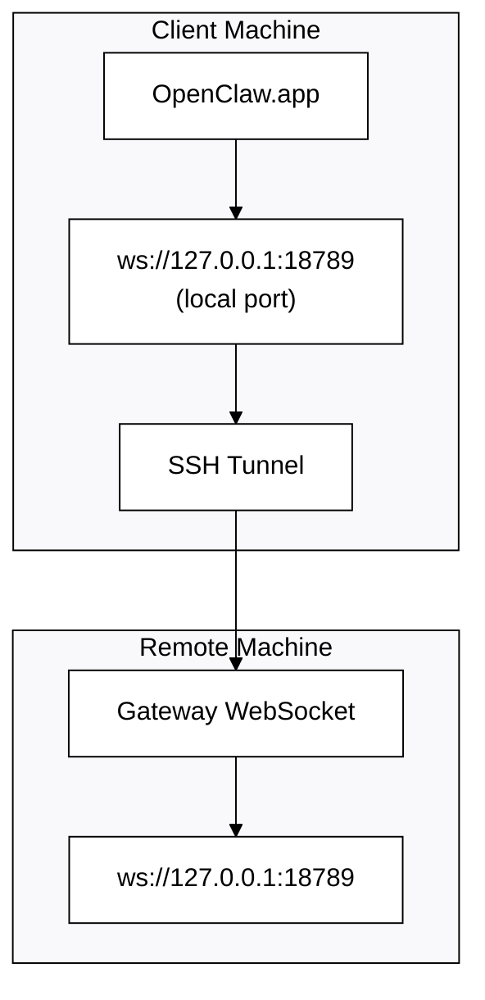

# အဝေးမှ Gateway ဖြင့် OpenClaw.app ကို လည်ပတ်စေခြင်း

တိတိကျကျ surface ကို `src/gateway/protocol/schema.ts` ထဲက TypeBox schemas တွေက သတ်မှတ်ထားပါတယ်။ OpenClaw.app က remote gateway ကို ချိတ်ဆက်ဖို့ SSH tunneling ကို အသုံးပြုပါတယ်။

## အနှစ်ချုပ်



## အမြန်တပ်ဆင်ခြင်း

### အဆင့် ၁: SSH Config ထည့်သွင်းခြင်း

`~/.ssh/config` ကို ပြင်ဆင်ပြီး အောက်ပါအတိုင်း ထည့်ပါ—

```ssh
Host remote-gateway
    HostName <REMOTE_IP>          # e.g., 172.27.187.184
    User <REMOTE_USER>            # e.g., jefferson
    LocalForward 18789 127.0.0.1:18789
    IdentityFile ~/.ssh/id_rsa
```

`<REMOTE_IP>` နှင့် `<REMOTE_USER>` ကို သင့်တန်ဖိုးများဖြင့် အစားထိုးပါ။

### အဆင့် ၂: SSH ကီးကို ကူးယူခြင်း

သင့် public key ကို အဝေးမှ စက်သို့ ကူးယူပါ (စကားဝှက်ကို တစ်ကြိမ်သာ ထည့်ရန်လိုသည်)—

```bash
ssh-copy-id -i ~/.ssh/id_rsa <REMOTE_USER>@<REMOTE_IP>
```

### အဆင့် ၃: Gateway တိုကင် သတ်မှတ်ခြင်း

```bash
launchctl setenv OPENCLAW_GATEWAY_TOKEN "<your-token>"
```

### အဆင့် ၄: SSH တန်နယ် စတင်ခြင်း

```bash
ssh -N remote-gateway &
```

### အဆင့် ၅: OpenClaw.app ကို ပြန်လည်စတင်ခြင်း

```bash
# Quit OpenClaw.app (⌘Q), then reopen:
open /path/to/OpenClaw.app
```

အက်ပ်သည် ယခု SSH တန်နယ်မှတဆင့် အဝေးမှ Gateway သို့ ချိတ်ဆက်သွားမည်ဖြစ်သည်။

---

## လော့ဂ်အင်ဝင်ချိန်တွင် တန်နယ်ကို အလိုအလျောက် စတင်စေခြင်း

သင် လော့ဂ်အင်ဝင်ချိန်တိုင်း SSH တန်နယ်ကို အလိုအလျောက် စတင်စေလိုပါက Launch Agent တစ်ခု ဖန်တီးပါ။

### PLIST ဖိုင်ကို ဖန်တီးခြင်း

ဤဖိုင်ကို `~/Library/LaunchAgents/bot.molt.ssh-tunnel.plist` အဖြစ် သိမ်းဆည်းပါ—

```xml
<?xml version="1.0" encoding="UTF-8"?>
<!DOCTYPE plist PUBLIC "-//Apple//DTD PLIST 1.0//EN" "http://www.apple.com/DTDs/PropertyList-1.0.dtd">
<plist version="1.0">
<dict>
    <key>Label</key>
    <string>bot.molt.ssh-tunnel</string>
    <key>ProgramArguments</key>
    <array>
        <string>/usr/bin/ssh</string>
        <string>-N</string>
        <string>remote-gateway</string>
    </array>
    <key>KeepAlive</key>
    <true/>
    <key>RunAtLoad</key>
    <true/>
</dict>
</plist>
```

### Launch Agent ကို တင်သွင်းခြင်း

```bash
launchctl bootstrap gui/$UID ~/Library/LaunchAgents/bot.molt.ssh-tunnel.plist
```

ယခု တန်နယ်သည်—

- သင် လော့ဂ်အင်ဝင်ချိန်တွင် အလိုအလျောက် စတင်မည်
- ပျက်ကျသွားပါက အလိုအလျောက် ပြန်စတင်မည်
- နောက်ခံတွင် ဆက်လက် လည်ပတ်နေမည်

အဟောင်းမှတ်ချက်: ရှိနေပါက `com.openclaw.ssh-tunnel` LaunchAgent အကျန်များကို ဖယ်ရှားပါ။

---

## ပြဿနာဖြေရှင်းခြင်း

**တန်နယ် လည်ပတ်နေကြောင်း စစ်ဆေးခြင်း:**

```bash
ps aux | grep "ssh -N remote-gateway" | grep -v grep
lsof -i :18789
```

**တန်နယ်ကို ပြန်စတင်ခြင်း:**

```bash
launchctl kickstart -k gui/$UID/bot.molt.ssh-tunnel
```

**တန်နယ်ကို ရပ်တန့်ခြင်း:**

```bash
launchctl bootout gui/$UID/bot.molt.ssh-tunnel
```

---

## အလုပ်လုပ်ပုံ

| အစိတ်အပိုင်း                         | လုပ်ဆောင်ချက်                                                          |
| ------------------------------------ | ---------------------------------------------------------------------- |
| `LocalForward 18789 127.0.0.1:18789` | local port 18789 ကို အဝေးမှ port 18789 သို့ လမ်းကြောင်းပို့ဆောင်ပေးသည် |
| `ssh -N`                             | အဝေးမှ အမိန့်များ မလုပ်ဆောင်ဘဲ SSH အသုံးပြုခြင်း (port forwarding သာ)  |
| `KeepAlive`                          | ပျက်ကျသွားပါက တန်နယ်ကို အလိုအလျောက် ပြန်စတင်ပေးသည်                     |
| `RunAtLoad`                          | Agent တင်သွင်းချိန်တွင် တန်နယ်ကို စတင်ပေးသည်                           |

ဒီ guide က ဘယ်လို setup လုပ်ရမလဲဆိုတာကို ပြသပေးပါတယ်။ OpenClaw.app က သင့် client machine ပေါ်မှာ `ws://127.0.0.1:18789` ကို ချိတ်ဆက်ပါတယ်။
