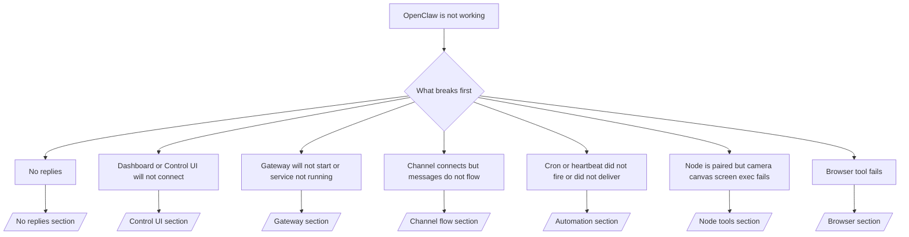

# Troubleshooting

အချိန် ၂ မိနစ်သာရှိပါက ဤစာမျက်နှာကို အခြေအနေခွဲခြမ်းစစ်ဆေးရန် အဝင်ပေါက်အဖြစ် အသုံးပြုပါ။

## ပထမ ၆၀ စက္ကန့်

အောက်ပါ အဆင့်လိုက် လမ်းကြောင်းကို အစဉ်လိုက် တိတိကျကျ လုပ်ဆောင်ပါ —

```bash
openclaw status
openclaw status --all
openclaw gateway probe
openclaw gateway status
openclaw doctor
openclaw channels status --probe
openclaw logs --follow
```

တစ်ကြောင်းတည်းဖြင့် ကောင်းမွန်သော အထွက်အပေါ်လက္ခဏာများ —

- `openclaw status` → ဖွဲ့စည်းပြင်ဆင်ထားသော ချန်နယ်များကို ပြသပြီး auth ဆိုင်ရာ အမှားများ မမြင်ရပါ။
- `openclaw status --all` → အစီရင်ခံစာ အပြည့်အစုံ ရှိပြီး မျှဝေနိုင်ပါသည်။
- `openclaw gateway probe` → မျှော်မှန်းထားသော gateway target ကို ချိတ်ဆက်နိုင်ပါသည်။
- `openclaw gateway status` → `Runtime: running` နှင့် `RPC probe: ok` ဖြစ်ပါသည်။
- `openclaw doctor` → ပိတ်ဆို့နေသော ဖွဲ့စည်းပြင်ဆင်မှု/ဝန်ဆောင်မှု အမှားများ မရှိပါ။
- `openclaw channels status --probe` → ချန်နယ်များက `connected` သို့မဟုတ် `ready` ဟု တင်ပြပါသည်။
- `openclaw logs --follow` → လှုပ်ရှားမှု တည်ငြိမ်ပြီး ထပ်ခါတလဲလဲ ဖြစ်နေသော ပြင်းထန်အမှားများ မရှိပါ။

## ဆုံးဖြတ်ချက် သစ်ပင်



<AccordionGroup>
  <Accordion title="No replies">
    ```bash
    openclaw status
    openclaw gateway status
    openclaw channels status --probe
    openclaw pairing list <channel>
    openclaw logs --follow
    ```

    ```
    ကောင်းမွန်သော အထွက်အပေါ်လက္ခဏာများ —
    
    - `Runtime: running`
    - `RPC probe: ok`
    - သင့်ချန်နယ်သည် `channels status --probe` တွင် connected/ready ဟု ပြသနေပါသည်။
    - ပို့သူသည် ခွင့်ပြုထားပြီးသား ဖြစ်နေသည် (သို့) DM မူဝါဒသည် open/allowlist ဖြစ်နေသည်။
    
    လေ့လာတွေ့ရသော log လက္ခဏာများ —
    
    - `drop guild message (mention required` → Discord တွင် mention gating ကြောင့် မက်ဆေ့ချ်ကို ပိတ်ဆို့ထားသည်။
    - `pairing request` → ပို့သူကို ခွင့်မပြုရသေးဘဲ DM pairing အတည်ပြုချက်ကို စောင့်ဆိုင်းနေသည်။
    - ချန်နယ် log များတွင် `blocked` / `allowlist` → ပို့သူ၊ အခန်း သို့မဟုတ် အုပ်စုကို စစ်ထုတ်ထားသည်။
    
    အသေးစိတ် စာမျက်နှာများ —
    
    - [/gateway/troubleshooting#no-replies](/gateway/troubleshooting#no-replies)
    - [/channels/troubleshooting](/channels/troubleshooting)
    - [/channels/pairing](/channels/pairing)
    ```

  </Accordion>

  <Accordion title="Dashboard or Control UI will not connect">
    ```bash
    openclaw status
    openclaw gateway status
    openclaw logs --follow
    openclaw doctor
    openclaw channels status --probe
    ```

    ```
    ကောင်းမွန်သော အထွက်အပေါ်လက္ခဏာများ —
    
    - `Dashboard: http://...` ကို `openclaw gateway status` တွင် ပြသနေသည်။
    - `RPC probe: ok`
    - log များတွင် auth loop မရှိပါ။
    
    လေ့လာတွေ့ရသော log လက္ခဏာများ —
    
    - `device identity required` → HTTP/မလုံခြုံသော context ကြောင့် device auth ကို မပြီးစီးနိုင်ပါ။
    - `unauthorized` / reconnect loop → token/password မှားယွင်းခြင်း သို့မဟုတ် auth mode မကိုက်ညီခြင်း။
    - `gateway connect failed:` → UI သည် URL/port မှားယွင်းနေခြင်း သို့မဟုတ် gateway ကို မရောက်ရှိနိုင်ခြင်း။
    
    အသေးစိတ် စာမျက်နှာများ —
    
    - [/gateway/troubleshooting#dashboard-control-ui-connectivity](/gateway/troubleshooting#dashboard-control-ui-connectivity)
    - [/web/control-ui](/web/control-ui)
    - [/gateway/authentication](/gateway/authentication)
    ```

  </Accordion>

  <Accordion title="Gateway will not start or service installed but not running">
    ```bash
    openclaw status
    openclaw gateway status
    openclaw logs --follow
    openclaw doctor
    openclaw channels status --probe
    ```

    ```
    ကောင်းမွန်သော အထွက်အပေါ်လက္ခဏာများ —
    
    - `Service: ... (loaded)`
    - `Runtime: running`
    - `RPC probe: ok`
    
    လေ့လာတွေ့ရသော log လက္ခဏာများ —
    
    - `Gateway start blocked: set gateway.mode=local` → gateway mode ကို မသတ်မှတ်ထားပါ/remote ဖြစ်နေသည်။
    - `refusing to bind gateway ... without auth` → non-loopback bind ကို token/password မပါဘဲ ပြုလုပ်ထားသည်။
    - `another gateway instance is already listening` သို့မဟုတ် `EADDRINUSE` → port ကို အခြားအရာက အသုံးပြုပြီးသား ဖြစ်နေသည်။
    
    အသေးစိတ် စာမျက်နှာများ —
    
    - [/gateway/troubleshooting#gateway-service-not-running](/gateway/troubleshooting#gateway-service-not-running)
    - [/gateway/background-process](/gateway/background-process)
    - [/gateway/configuration](/gateway/configuration)
    ```

  </Accordion>

  <Accordion title="Channel connects but messages do not flow">
    ```bash
    openclaw status
    openclaw gateway status
    openclaw logs --follow
    openclaw doctor
    openclaw channels status --probe
    ```

    ```
    ကောင်းမွန်သော အထွက်အပေါ်လက္ခဏာများ —
    
    - ချန်နယ် Transport သည် ချိတ်ဆက်ပြီး ဖြစ်သည်။
    - Pairing/allowlist စစ်ဆေးမှုများ အောင်မြင်သည်။
    - လိုအပ်သည့်နေရာတွင် mentions များကို သိရှိနိုင်သည်။
    
    လေ့လာတွေ့ရသော log လက္ခဏာများ —
    
    - `mention required` → group mention gating ကြောင့် လုပ်ဆောင်မှုကို ပိတ်ဆို့ထားသည်။
    - `pairing` / `pending` → DM ပို့သူကို မခွင့်ပြုရသေးပါ။
    - `not_in_channel`, `missing_scope`, `Forbidden`, `401/403` → ချန်နယ် permission token ဆိုင်ရာ ပြဿနာ။
    
    အသေးစိတ် စာမျက်နှာများ —
    
    - [/gateway/troubleshooting#channel-connected-messages-not-flowing](/gateway/troubleshooting#channel-connected-messages-not-flowing)
    - [/channels/troubleshooting](/channels/troubleshooting)
    ```

  </Accordion>

  <Accordion title="Cron or heartbeat did not fire or did not deliver">
    ```bash
    openclaw status
    openclaw gateway status
    openclaw cron status
    openclaw cron list
    openclaw cron runs --id <jobId> --limit 20
    openclaw logs --follow
    ```

    ```
    ကောင်းမွန်သော အထွက်အပေါ်လက္ခဏာများ —
    
    - `cron.status` တွင် enabled ဖြစ်ပြီး နောက်တစ်ကြိမ် wake အချိန်ကို ပြသထားသည်။
    - `cron runs` တွင် မကြာသေးမီက `ok` မှတ်တမ်းများကို ပြသထားသည်။
    - Heartbeat ကို enabled ပြုလုပ်ထားပြီး active hours အပြင်ဘက် မဖြစ်ပါ။
    
    လေ့လာတွေ့ရသော log လက္ခဏာများ —
    
    - `cron: scheduler disabled; jobs will not run automatically` → cron ကို ပိတ်ထားသည်။
    - `heartbeat skipped` နှင့် `reason=quiet-hours` → ဖွဲ့စည်းပြင်ဆင်ထားသော active hours အပြင်ဘက် ဖြစ်နေသည်။
    - `requests-in-flight` → အဓိက lane အလုပ်များနေသဖြင့် heartbeat wake ကို နောက်ရွှေ့ထားသည်။
    - `unknown accountId` → heartbeat ပို့ဆောင်ရမည့် target account မရှိပါ။
    
    အသေးစိတ် စာမျက်နှာများ —
    
    - [/gateway/troubleshooting#cron-and-heartbeat-delivery](/gateway/troubleshooting#cron-and-heartbeat-delivery)
    - [/automation/troubleshooting](/automation/troubleshooting)
    - [/gateway/heartbeat](/gateway/heartbeat)
    ```

  </Accordion>

  <Accordion title="Node is paired but tool fails camera canvas screen exec">
    ```bash
    openclaw status
    openclaw gateway status
    openclaw nodes status
    openclaw nodes describe --node <idOrNameOrIp>
    openclaw logs --follow
    ```

    ```
    ကောင်းမွန်သော အထွက်အပေါ်လက္ခဏာများ —
    
    - Node ကို `node` အခန်းကဏ္ဍအတွက် connected နှင့် paired အဖြစ် စာရင်းသွင်းထားသည်။
    - သင်ခေါ်ယူနေသော command အတွက် capability ရှိသည်။
    - ကိရိယာအတွက် permission အခြေအနေကို ခွင့်ပြုပြီး ဖြစ်သည်။
    
    လေ့လာတွေ့ရသော log လက္ခဏာများ —
    
    - `NODE_BACKGROUND_UNAVAILABLE` → node app ကို foreground သို့ ယူလာပါ။
    - `*_PERMISSION_REQUIRED` → OS permission ကို ပယ်ချထားသည်/မရှိပါ။
    - `SYSTEM_RUN_DENIED: approval required` → exec approval ကို စောင့်ဆိုင်းနေသည်။
    - `SYSTEM_RUN_DENIED: allowlist miss` → command သည် exec allowlist တွင် မပါဝင်ပါ။
    
    အသေးစိတ် စာမျက်နှာများ —
    
    - [/gateway/troubleshooting#node-paired-tool-fails](/gateway/troubleshooting#node-paired-tool-fails)
    - [/nodes/troubleshooting](/nodes/troubleshooting)
    - [/tools/exec-approvals](/tools/exec-approvals)
    ```

  </Accordion>

  <Accordion title="Browser tool fails">
    ```bash
    openclaw status
    openclaw gateway status
    openclaw browser status
    openclaw logs --follow
    openclaw doctor
    ```

    ```
    ကောင်းမွန်သော အထွက်အပေါ်လက္ခဏာများ —
    
    - Browser status တွင် `running: true` နှင့် ရွေးချယ်ထားသော browser/profile ကို ပြသထားသည်။
    - `openclaw` profile စတင်နိုင်သည် သို့မဟုတ် `chrome` relay တွင် tab တစ်ခု ချိတ်ဆက်ထားသည်။
    
    လေ့လာတွေ့ရသော log လက္ခဏာများ —
    
    - `Failed to start Chrome CDP on port` → local browser ကို စတင်ဖွင့်မရပါ။
    - `browser.executablePath not found` → ဖွဲ့စည်းပြင်ဆင်ထားသော binary path မှားယွင်းနေသည်။
    - `Chrome extension relay is running, but no tab is connected` → extension ကို မချိတ်ဆက်ထားပါ။
    - `Browser attachOnly is enabled ... not reachable` → attach-only profile တွင် live CDP target မရှိပါ။
    
    အသေးစိတ် စာမျက်နှာများ —
    
    - [/gateway/troubleshooting#browser-tool-fails](/gateway/troubleshooting#browser-tool-fails)
    - [/tools/browser-linux-troubleshooting](/tools/browser-linux-troubleshooting)
    - [/tools/chrome-extension](/tools/chrome-extension)
    ```

  </Accordion>
</AccordionGroup>
