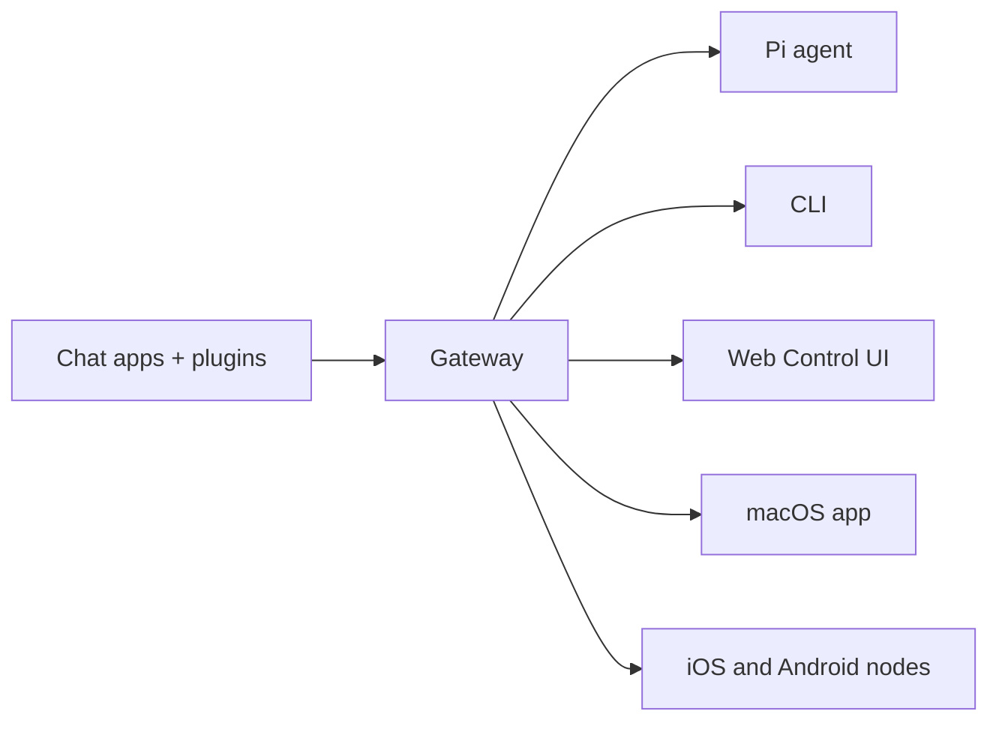

# OpenClaw 🦞

<p align="center">
    
    
</p>

> _"EXFOLIATE! EXFOLIATE!"_ — အာကာသ လော့ဘ်စတာ တစ်ကောင် ဖြစ်နိုင်ပါတယ်

<p align="center"><strong>WhatsApp, Telegram, Discord, iMessage နှင့် အခြားများအတွက် AI agents များကို ချိတ်ဆက်ပေးသော Any OS gateway.</strong><br />
  စာတိုတစ်စောင် ပို့လိုက်ပါ၊ သင့်အိတ်ထဲမှ agent တုံ့ပြန်ချက်ကို ရယူပါ။ Plugins များသည် Mattermost နှင့် အခြားများကို ထပ်မံထည့်သွင်းပေးပါသည်။
</p>

<Columns>
  <Card title="Get Started" href="/start/getting-started" icon="rocket">
    OpenClaw ကို ထည့်သွင်းပြီး မိနစ်အနည်းငယ်အတွင်း Gateway ကို စတင်လည်ပတ်နိုင်ပါသည်။
  </Card>
  <Card title="Run the Wizard" href="/start/wizard" icon="sparkles">
    `openclaw onboard` နှင့် pairing flow များဖြင့် လမ်းညွှန်ထားသော setup ပြုလုပ်နိုင်ပါသည်။
  </Card>
  <Card title="Open the Control UI" href="/web/control-ui" icon="layout-dashboard">
    ချတ်၊ config နှင့် ဆက်ရှင်များအတွက် ဘရောက်ဇာ dashboard ကို ဖွင့်ပါ။
  </Card>
</Columns>

## OpenClaw ဆိုတာဘာလဲ?

OpenClaw သည် **self-hosted gateway** တစ်ခုဖြစ်ပြီး သင်ကြိုက်နှစ်သက်သော chat app များ — WhatsApp, Telegram, Discord, iMessage နှင့် အခြားများ — ကို Pi ကဲ့သို့သော AI coding agents များနှင့် ချိတ်ဆက်ပေးပါသည်။ သင်၏ ကိုယ်ပိုင်စက် (သို့မဟုတ် server) ပေါ်တွင် Gateway process တစ်ခုတည်းကို chạy လုပ်ရုံဖြင့်၊ သင့် messaging apps များနှင့် အမြဲအသင့်ရှိသော AI assistant အကြား တံတားအဖြစ် လုပ်ဆောင်ပေးပါသည်။

**ဘယ်သူတွေအတွက်လဲ?** မည်သည့်နေရာမှမဆို မက်ဆေ့ချ်ပို့၍ အသုံးပြုနိုင်သော ကိုယ်ပိုင် AI အကူအညီပေးသူကို လိုလားပြီး၊ ကိုယ်ပိုင်ဒေတာကို ထိန်းချုပ်ထားလိုသူများ၊ hosted service များကို မမှီခိုလိုသူများဖြစ်သော developer များနှင့် power user များအတွက် ဖြစ်ပါသည်။

**ဘာတွေက ကွာခြားစေသလဲ?**

- **Self-hosted**: သင့် hardware ပေါ်တွင်၊ သင့်စည်းမျဉ်းများအတိုင်း လည်ပတ်ပါသည်
- **Multi-channel**: Gateway တစ်ခုတည်းဖြင့် WhatsApp၊ Telegram၊ Discord စသည်တို့ကို တပြိုင်နက်တည်း ဝန်ဆောင်မှုပေးနိုင်ပါသည်
- **Agent-native**: coding agents များအတွက် tool အသုံးပြုမှု၊ ဆက်ရှင်များ၊ မှတ်ဉာဏ်နှင့် multi-agent routing တို့ကို အထောက်အပံ့ပေးရန် တည်ဆောက်ထားပါသည်
- **Open source**: MIT လိုင်စင်ဖြင့် အသိုင်းအဝိုင်းအခြေပြု ဖွံ့ဖြိုးထားပါသည်

**ဘာတွေလိုအပ်လဲ?** Node 22+၊ API key တစ်ခု (Anthropic ကို အကြံပြုပါသည်) နှင့် မိနစ် ၅ ခန့်သာ လိုအပ်ပါသည်။

## အလုပ်လုပ်ပုံ



Gateway သည် ဆက်ရှင်များ၊ routing နှင့် ချန်နယ်ချိတ်ဆက်မှုများအတွက် အချက်အလက်အမှန်တရား၏ အဓိကအရင်းအမြစ်တစ်ခုဖြစ်ပါသည်။

## အဓိက စွမ်းရည်များ

<Columns>
  <Card title="Multi-channel gateway" icon="network">
    Gateway process တစ်ခုတည်းဖြင့် WhatsApp၊ Telegram၊ Discord နှင့် iMessage ကို အသုံးပြုနိုင်ပါသည်။
  </Card>
  <Card title="Plugin channels" icon="plug">
    extension packages များဖြင့် Mattermost နှင့် အခြားချန်နယ်များကို ထပ်မံထည့်သွင်းနိုင်ပါသည်။
  </Card>
  <Card title="Multi-agent routing" icon="route">
    အေးဂျင့်၊ workspace သို့မဟုတ် ပို့သူအလိုက် သီးခြား ဆက်ရှင်များ။
  </Card>
  <Card title="Media support" icon="image">
    ပုံရိပ်များ၊ အသံဖိုင်များနှင့် စာရွက်စာတမ်းများကို ပို့ခြင်းနှင့် လက်ခံခြင်း ပြုလုပ်နိုင်ပါသည်။
  </Card>
  <Card title="Web Control UI" icon="monitor">
    ချတ်၊ config၊ ဆက်ရှင်များနှင့် နိုဒ်များအတွက် ဘရောက်ဇာ dashboard။
  </Card>
  <Card title="Mobile nodes" icon="smartphone">
    Canvas အထောက်အပံ့ပါရှိသော iOS နှင့် Android နိုဒ်များကို pairing ပြုလုပ်နိုင်ပါသည်။
  </Card>
</Columns>

## အမြန်စတင်ရန်

<Steps>
  <Step title="Install OpenClaw">
    ```bash
    npm install -g openclaw@latest
    ```
  </Step>
  <Step title="Onboard and install the service">
    ```bash
    openclaw onboard --install-daemon
    ```
  </Step>
  <Step title="Pair WhatsApp and start the Gateway">
    ```bash
    openclaw channels login
    openclaw gateway --port 18789
    ```
  </Step>
</Steps>

အပြည့်အစုံ install နှင့် dev setup လိုအပ်ပါသလား? [Quick start](/start/quickstart) ကို ကြည့်ပါ။

## Dashboard

Gateway စတင်လည်ပတ်ပြီးနောက် ဘရောက်ဇာ Control UI ကို ဖွင့်ပါ။

- Local default: [http://127.0.0.1:18789/](http://127.0.0.1:18789/)
- Remote access: [Web surfaces](/web) နှင့် [Tailscale](/gateway/tailscale)

<p align="center">
  
</p>

## Configuration (ရွေးချယ်နိုင်သည်)

Config ကို `~/.openclaw/openclaw.json` တွင် သိမ်းဆည်းထားပါသည်။

- **ဘာမှမလုပ်ဘူးဆိုရင်** OpenClaw သည် bundled Pi binary ကို RPC mode ဖြင့် per-sender ဆက်ရှင်များနှင့် အသုံးပြုပါသည်။
- ပိုမို ကန့်သတ်ချင်ပါက `channels.whatsapp.allowFrom` မှ စတင်ပြီး (အုပ်စုများအတွက်) mention စည်းမျဉ်းများကို သတ်မှတ်ပါ။

ဥပမာ-

```json5
{
  channels: {
    whatsapp: {
      allowFrom: ["+15555550123"],
      groups: { "*": { requireMention: true } },
    },
  },
  messages: { groupChat: { mentionPatterns: ["@openclaw"] } },
}
```

## ဒီနေရာက စတင်ပါ

<Columns>
  <Card title="Docs hubs" href="/start/hubs" icon="book-open">
    အသုံးပြုမှုအမျိုးအစားအလိုက် စုစည်းထားသော docs နှင့် လမ်းညွှန်များအားလုံး။
  </Card>
  <Card title="Configuration" href="/gateway/configuration" icon="settings">
    အဓိက Gateway ဆက်တင်များ၊ token များနှင့် provider config။
  </Card>
  <Card title="Remote access" href="/gateway/remote" icon="globe">
    SSH နှင့် tailnet ဝင်ရောက်အသုံးပြုမှုပုံစံများ။
  </Card>
  <Card title="Channels" href="/channels/telegram" icon="message-square">
    WhatsApp၊ Telegram၊ Discord စသည်တို့အတွက် ချန်နယ်အလိုက် setup ပြုလုပ်နည်း။
  </Card>
  <Card title="Nodes" href="/nodes" icon="smartphone">
    pairing နှင့် Canvas ပါရှိသော iOS နှင့် Android နိုဒ်များ။
  </Card>
  <Card title="Help" href="/help" icon="life-buoy">
    အဖြစ်များသော ပြဿနာများနှင့် troubleshooting အတွက် ဝင်ပေါက်။
  </Card>
</Columns>

## ပိုမိုလေ့လာရန်

<Columns>
  <Card title="Full feature list" href="/concepts/features" icon="list">
    ချန်နယ်၊ routing နှင့် media စွမ်းရည်များအားလုံး။
  </Card>
  <Card title="Multi-agent routing" href="/concepts/multi-agent" icon="route">
    Workspace သီးခြားခွဲခြားမှုနှင့် per-agent ဆက်ရှင်များ။
  </Card>
  <Card title="Security" href="/gateway/security" icon="shield">
    Token များ၊ allowlist များနှင့် လုံခြုံရေးထိန်းချုပ်မှုများ။
  </Card>
  <Card title="Troubleshooting" href="/gateway/troubleshooting" icon="wrench">
    Gateway diagnostic နှင့် အဖြစ်များသော အမှားများ။
  </Card>
  <Card title="About and credits" href="/reference/credits" icon="info">
    ပရောဂျက်၏ အစပြုမှု၊ ပါဝင်ကူညီသူများနှင့် လိုင်စင်။
  </Card>
</Columns>
