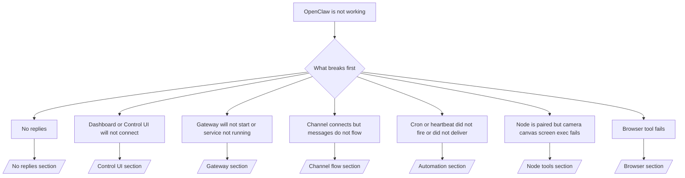

# Problemen oplossen

Als je maar 2 minuten hebt, gebruik deze pagina als triage-ingang.

## Eerste 60 seconden

Doorloop deze exacte ladder in volgorde:

```bash
openclaw status
openclaw status --all
openclaw gateway probe
openclaw gateway status
openclaw doctor
openclaw channels status --probe
openclaw logs --follow
```

Goede uitvoer in één regel:

- `openclaw status` → toont geconfigureerde kanalen en geen duidelijke authenticatiefouten.
- `openclaw status --all` → volledig rapport is aanwezig en deelbaar.
- `openclaw gateway probe` → verwacht Gateway-doel is bereikbaar.
- `openclaw gateway status` → `Runtime: running` en `RPC probe: ok`.
- `openclaw doctor` → geen blokkerende config-/servicefouten.
- `openclaw channels status --probe` → kanalen rapporteren `connected` of `ready`.
- `openclaw logs --follow` → stabiele activiteit, geen herhalende fatale fouten.

## Besluit boom



<AccordionGroup>
  <Accordion title="No replies">
    ```bash
    openclaw status
    openclaw gateway status
    openclaw channels status --probe
    openclaw pairing list <channel>
    openclaw logs --follow
    ```

    ```
    Goede uitvoer ziet er zo uit:
    
    - `Runtime: running`
    - `RPC probe: ok`
    - Je kanaal toont verbonden/klaar in `channels status --probe`
    - Afzender lijkt goedgekeurd (of DM-beleid is open/toegestane lijst)
    
    Veelvoorkomende logsignaturen:
    
    - `drop guild message (mention required` → mention-gating blokkeerde het bericht in Discord.
    - `pairing request` → afzender is niet goedgekeurd en wacht op DM-koppelingsgoedkeuring.
    - `blocked` / `allowlist` in kanaallogs → afzender, ruimte of groep wordt gefilterd.
    
    Verdiepende pagina’s:
    
    - [/gateway/troubleshooting#no-replies](/gateway/troubleshooting#no-replies)
    - [/channels/troubleshooting](/channels/troubleshooting)
    - [/channels/pairing](/channels/pairing)
    ```

  </Accordion>

  <Accordion title="Dashboard or Control UI will not connect">
    ```bash
    openclaw status
    openclaw gateway status
    openclaw logs --follow
    openclaw doctor
    openclaw channels status --probe
    ```

    ```
    Goede uitvoer ziet er zo uit:
    
    - `Dashboard: http://...` wordt getoond in `openclaw gateway status`
    - `RPC probe: ok`
    - Geen auth-loop in logs
    
    Veelvoorkomende logsignaturen:
    
    - `device identity required` → HTTP/niet-beveiligde context kan apparaatauthenticatie niet voltooien.
    - `unauthorized` / reconnect-loop → verkeerde token/wachtwoord of mismatch in auth-modus.
    - `gateway connect failed:` → UI richt zich op de verkeerde URL/poort of onbereikbare Gateway.
    
    Verdiepende pagina’s:
    
    - [/gateway/troubleshooting#dashboard-control-ui-connectivity](/gateway/troubleshooting#dashboard-control-ui-connectivity)
    - [/web/control-ui](/web/control-ui)
    - [/gateway/authentication](/gateway/authentication)
    ```

  </Accordion>

  <Accordion title="Gateway will not start or service installed but not running">
    ```bash
    openclaw status
    openclaw gateway status
    openclaw logs --follow
    openclaw doctor
    openclaw channels status --probe
    ```

    ```
    Goede uitvoer ziet er zo uit:
    
    - `Service: ... (loaded)`
    - `Runtime: running`
    - `RPC probe: ok`
    
    Veelvoorkomende logsignaturen:
    
    - `Gateway start blocked: set gateway.mode=local` → gateway-modus is niet ingesteld/op afstand.
    - `refusing to bind gateway ... without auth` → niet-loopback binding zonder token/wachtwoord.
    - `another gateway instance is already listening` of `EADDRINUSE` → poort is al in gebruik.
    
    Verdiepende pagina’s:
    
    - [/gateway/troubleshooting#gateway-service-not-running](/gateway/troubleshooting#gateway-service-not-running)
    - [/gateway/background-process](/gateway/background-process)
    - [/gateway/configuration](/gateway/configuration)
    ```

  </Accordion>

  <Accordion title="Channel connects but messages do not flow">
    ```bash
    openclaw status
    openclaw gateway status
    openclaw logs --follow
    openclaw doctor
    openclaw channels status --probe
    ```

    ```
    Goede uitvoer ziet er zo uit:
    
    - Kanaaltransport is verbonden.
    - Koppeling/toegestane-lijst-controles slagen.
    - Mentions worden gedetecteerd waar vereist.
    
    Veelvoorkomende logsignaturen:
    
    - `mention required` → groeps-mention-gating blokkeerde verwerking.
    - `pairing` / `pending` → DM-afzender is nog niet goedgekeurd.
    - `not_in_channel`, `missing_scope`, `Forbidden`, `401/403` → probleem met kanaalrechten-token.
    
    Verdiepende pagina’s:
    
    - [/gateway/troubleshooting#channel-connected-messages-not-flowing](/gateway/troubleshooting#channel-connected-messages-not-flowing)
    - [/channels/troubleshooting](/channels/troubleshooting)
    ```

  </Accordion>

  <Accordion title="Cron or heartbeat did not fire or did not deliver">
    ```bash
    openclaw status
    openclaw gateway status
    openclaw cron status
    openclaw cron list
    openclaw cron runs --id <jobId> --limit 20
    openclaw logs --follow
    ```

    ```
    Goede uitvoer ziet er zo uit:
    
    - `cron.status` toont ingeschakeld met een volgende wake.
    - `cron runs` toont recente `ok`-items.
    - Heartbeat is ingeschakeld en niet buiten actieve uren.
    
    Veelvoorkomende logsignaturen:
    
    - `cron: scheduler disabled; jobs will not run automatically` → cron is uitgeschakeld.
    - `heartbeat skipped` met `reason=quiet-hours` → buiten geconfigureerde actieve uren.
    - `requests-in-flight` → hoofdbaan bezet; heartbeat-wake is uitgesteld.
    - `unknown accountId` → doelaccount voor heartbeat-aflevering bestaat niet.
    
    Verdiepende pagina’s:
    
    - [/gateway/troubleshooting#cron-and-heartbeat-delivery](/gateway/troubleshooting#cron-and-heartbeat-delivery)
    - [/automation/troubleshooting](/automation/troubleshooting)
    - [/gateway/heartbeat](/gateway/heartbeat)
    ```

  </Accordion>

  <Accordion title="Node is paired but tool fails camera canvas screen exec">
    ```bash
    openclaw status
    openclaw gateway status
    openclaw nodes status
    openclaw nodes describe --node <idOrNameOrIp>
    openclaw logs --follow
    ```

    ```
    Goede uitvoer ziet er zo uit:
    
    - Node staat vermeld als verbonden en gekoppeld voor rol `node`.
    - Capaciteit bestaat voor de opdracht die je uitvoert.
    - Rechtenstatus is verleend voor de tool.
    
    Veelvoorkomende logsignaturen:
    
    - `NODE_BACKGROUND_UNAVAILABLE` → breng de node-app naar de voorgrond.
    - `*_PERMISSION_REQUIRED` → OS-recht is geweigerd/ontbreekt.
    - `SYSTEM_RUN_DENIED: approval required` → uitvoeringsgoedkeuring is in behandeling.
    - `SYSTEM_RUN_DENIED: allowlist miss` → opdracht staat niet op de exec-toegestane lijst.
    
    Verdiepende pagina’s:
    
    - [/gateway/troubleshooting#node-paired-tool-fails](/gateway/troubleshooting#node-paired-tool-fails)
    - [/nodes/troubleshooting](/nodes/troubleshooting)
    - [/tools/exec-approvals](/tools/exec-approvals)
    ```

  </Accordion>

  <Accordion title="Browser tool fails">
    ```bash
    openclaw status
    openclaw gateway status
    openclaw browser status
    openclaw logs --follow
    openclaw doctor
    ```

    ```
    Goede uitvoer ziet er zo uit:
    
    - Browserstatus toont `running: true` en een gekozen browser/profiel.
    - `openclaw`-profiel start of `chrome`-relay heeft een gekoppeld tabblad.
    
    Veelvoorkomende logsignaturen:
    
    - `Failed to start Chrome CDP on port` → lokaal starten van browser mislukt.
    - `browser.executablePath not found` → geconfigureerd binair pad is onjuist.
    - `Chrome extension relay is running, but no tab is connected` → extensie niet gekoppeld.
    - `Browser attachOnly is enabled ... not reachable` → profiel met alleen koppelen heeft geen live CDP-doel.
    
    Verdiepende pagina’s:
    
    - [/gateway/troubleshooting#browser-tool-fails](/gateway/troubleshooting#browser-tool-fails)
    - [/tools/browser-linux-troubleshooting](/tools/browser-linux-troubleshooting)
    - [/tools/chrome-extension](/tools/chrome-extension)
    ```

  </Accordion>
</AccordionGroup>
