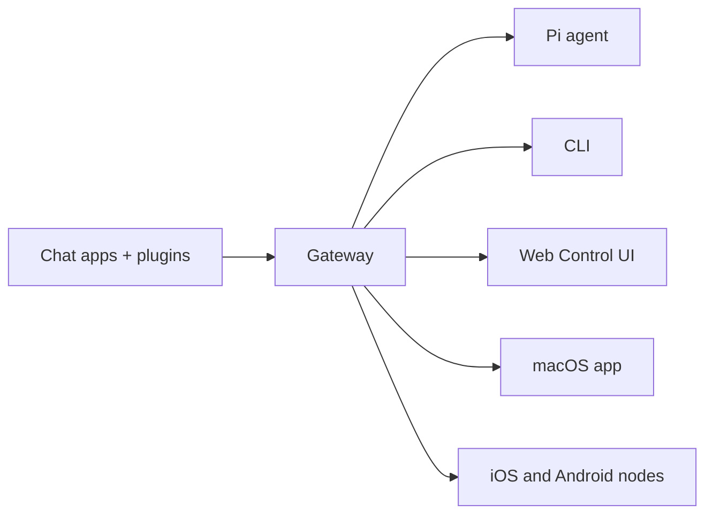

# OpenClaw 🦞

<p align="center">
    
    
</p>

> _"EXFOLIATE! EXFOLIATE!"_ — Een ruimtekreeft, waarschijnlijk

<p align="center"><strong>Gateway voor AI‑agents op elk besturingssysteem, voor WhatsApp, Telegram, Discord, iMessage en meer.</strong><br />
  Stuur een bericht en ontvang een agent‑antwoord vanuit je broekzak. Plugins voegen Mattermost en meer toe.
</p>

<Columns>
  <Card title="Get Started" href="/start/getting-started" icon="rocket">
    Installeer OpenClaw en start de Gateway binnen enkele minuten.
  </Card>
  <Card title="Run the Wizard" href="/start/wizard" icon="sparkles">
    Begeleide installatie met `openclaw onboard` en koppelingsflows.
  </Card>
  <Card title="Open the Control UI" href="/web/control-ui" icon="layout-dashboard">
    Start het browserdashboard voor chat, config en sessies.
  </Card>
</Columns>

## Wat is OpenClaw?

OpenClaw is een **self-hosted Gateway** die je favoriete chatapps — WhatsApp, Telegram, Discord, iMessage en meer — verbindt met AI‑codingagents zoals Pi. Je draait één enkel Gateway‑proces op je eigen machine (of een server), en dat wordt de brug tussen je messagingapps en een altijd beschikbare AI‑assistent.

**Voor wie is het?** Ontwikkelaars en power users die een persoonlijke AI‑assistent willen die ze overal kunnen berichten — zonder de controle over hun data op te geven of afhankelijk te zijn van een gehoste dienst.

**Wat maakt het anders?**

- **Self-hosted**: draait op jouw hardware, volgens jouw regels
- **Multi-channel**: één Gateway bedient WhatsApp, Telegram, Discord en meer tegelijk
- **Agent-native**: gebouwd voor coding agents met toolgebruik, sessies, geheugen en multi‑agent routing
- **Open source**: MIT‑licentie, community‑gedreven

**Wat heb je nodig?** Node 22+, een API‑sleutel (Anthropic aanbevolen) en 5 minuten.

## Hoe het werkt



De Gateway is de enige bron van waarheid voor sessies, routing en kanaalverbindingen.

## Belangrijkste mogelijkheden

<Columns>
  <Card title="Multi-channel gateway" icon="network">
    WhatsApp, Telegram, Discord en iMessage met één enkel Gateway‑proces.
  </Card>
  <Card title="Plugin channels" icon="plug">
    Voeg Mattermost en meer toe met extensiepakketten.
  </Card>
  <Card title="Multi-agent routing" icon="route">
    Geïsoleerde sessies per agent, werkruimte of afzender.
  </Card>
  <Card title="Media support" icon="image">
    Afbeeldingen, audio en documenten verzenden en ontvangen.
  </Card>
  <Card title="Web Control UI" icon="monitor">
    Browserdashboard voor chat, config, sessies en nodes.
  </Card>
  <Card title="Mobile nodes" icon="smartphone">
    iOS‑ en Android‑nodes koppelen met Canvas‑ondersteuning.
  </Card>
</Columns>

## Snelle start

<Steps>
  <Step title="Install OpenClaw">
    ```bash
    npm install -g openclaw@latest
    ```
  </Step>
  <Step title="Onboard and install the service">
    ```bash
    openclaw onboard --install-daemon
    ```
  </Step>
  <Step title="Pair WhatsApp and start the Gateway">
    ```bash
    openclaw channels login
    openclaw gateway --port 18789
    ```
  </Step>
</Steps>

Heb je de volledige installatie- en ontwikkelsetup nodig? Zie [Snelle start](/start/quickstart).

## Dashboard

Open de browser‑Control UI nadat de Gateway is gestart.

- Lokale standaard: [http://127.0.0.1:18789/](http://127.0.0.1:18789/)
- Externe toegang: [Web surfaces](/web) en [Tailscale](/gateway/tailscale)

<p align="center">
  
</p>

## Configuratie (optioneel)

De config bevindt zich op `~/.openclaw/openclaw.json`.

- Als je **niets doet**, gebruikt OpenClaw de meegeleverde Pi‑binary in RPC‑modus met per‑afzender sessies.
- Als je het wilt vergrendelen, begin dan met `channels.whatsapp.allowFrom` en (voor groepen) mention‑regels.

Voorbeeld:

```json5
{
  channels: {
    whatsapp: {
      allowFrom: ["+15555550123"],
      groups: { "*": { requireMention: true } },
    },
  },
  messages: { groupChat: { mentionPatterns: ["@openclaw"] } },
}
```

## Begin hier

<Columns>
  <Card title="Docs hubs" href="/start/hubs" icon="book-open">
    Alle documentatie en handleidingen, geordend per use‑case.
  </Card>
  <Card title="Configuration" href="/gateway/configuration" icon="settings">
    Kern‑Gateway‑instellingen, tokens en providerconfig.
  </Card>
  <Card title="Remote access" href="/gateway/remote" icon="globe">
    SSH‑ en tailnet‑toegangspatronen.
  </Card>
  <Card title="Channels" href="/channels/telegram" icon="message-square">
    Kanaalspecifieke installatie voor WhatsApp, Telegram, Discord en meer.
  </Card>
  <Card title="Nodes" href="/nodes" icon="smartphone">
    iOS‑ en Android‑nodes met koppeling en Canvas.
  </Card>
  <Card title="Help" href="/help" icon="life-buoy">
    veelvoorkomende oplossingen en het oplossen van problemen invoerpunt.
  </Card>
</Columns>

## Meer leren

<Columns>
  <Card title="Full feature list" href="/concepts/features" icon="list">
    Complete kanaal-, routing‑ en mediacapaciteiten.
  </Card>
  <Card title="Multi-agent routing" href="/concepts/multi-agent" icon="route">
    Isolatie van werkruimtes en per‑agent sessies.
  </Card>
  <Card title="Security" href="/gateway/security" icon="shield">
    Tokens, toegestane lijsten en veiligheidscontroles.
  </Card>
  <Card title="Troubleshooting" href="/gateway/troubleshooting" icon="wrench">
    Gateway‑diagnostiek en veelvoorkomende fouten.
  </Card>
  <Card title="About and credits" href="/reference/credits" icon="info">
    Oorsprong van het project, bijdragers en licentie.
  </Card>
</Columns>
