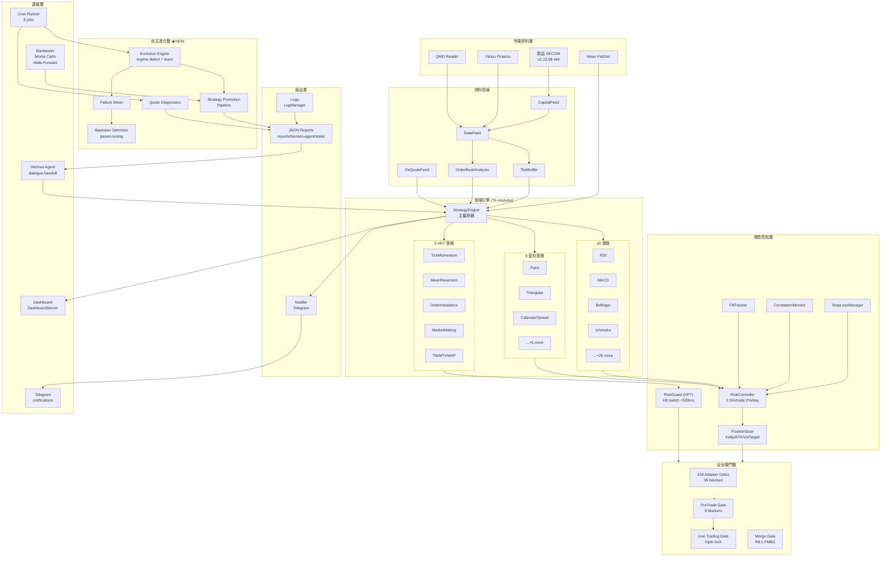
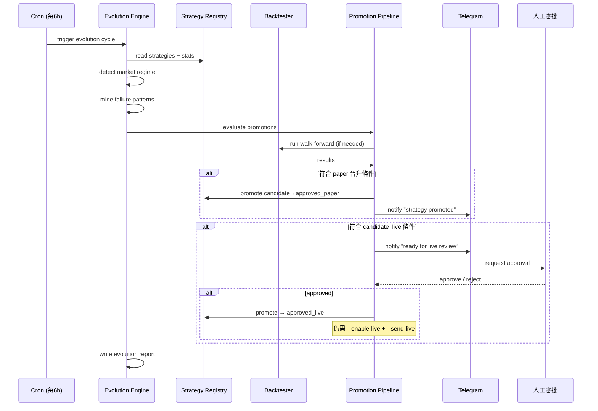
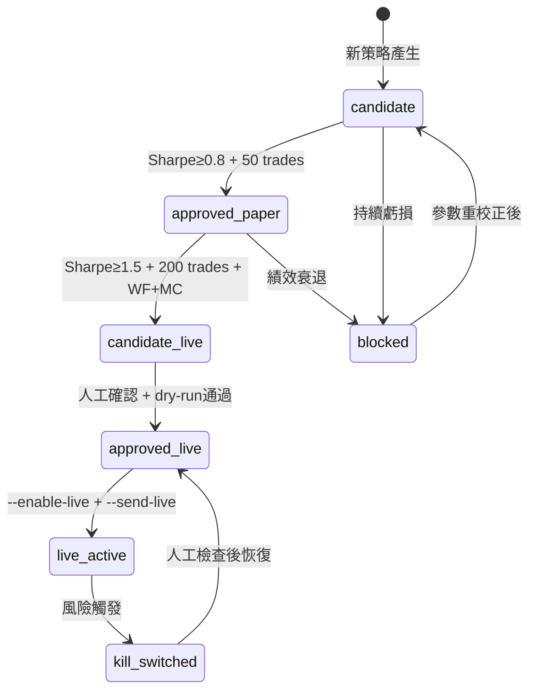

# OpenClaw 全方面進化架構

## 系統架構圖



## 進化引擎運作流程



## 策略晉升狀態機



## Codex Automations

### Auto 1: 進化循環 (每 6 小時)

```
觸發: cron 每 6 小時
任務: node scripts/openclaw-evolution-engine.mjs --cycle --write-state
驗證: reports/hermes-agent/state/evolution-cycle-latest.json 存在且 < 10min old
```

### Auto 2: 報價診斷 (每 30 分鐘)

```
觸發: cron 每 30 分鐘
任務: node scripts/openclaw-quote-diagnostics.mjs --write-state
驗證: reports/hermes-agent/state/quote-diagnostics-latest.json status != "blocked"
失敗: 發送 Telegram 通知
```

### Auto 3: 策略晉升 (每日 03:00)

```
觸發: cron 每日 03:00
任務: node scripts/openclaw-strategy-promotion-pipeline.mjs --execute --json
驗證: reports/hermes-agent/state/strategy-promotion-latest.json 存在
條件: 有晉升時發送 Telegram 通知
```

### Auto 4: Adapter Gate 全檢 (每週日 04:00)

```
觸發: cron 每週日 04:00
任務: node scripts/generate-all-adapter-gates.mjs --write-state
驗證: reports/hermes-agent/state/adapter-gates-generation-summary.json
```

## 驗證指令

```bash
# 進化引擎
node scripts/openclaw-evolution-engine.mjs --cycle --json

# 報價診斷
node scripts/openclaw-quote-diagnostics.mjs --json

# 策略晉升 (dry-run)
node scripts/openclaw-strategy-promotion-pipeline.mjs --json

# 全部 gate 狀態
node -e "import fs from 'fs';const d=JSON.parse(fs.readFileSync('reports/hermes-agent/state/adapter-gates-generation-summary.json'));console.log(d.generated+' gates, '+d.skipped+' skipped')"
```

## 假設

1. 群益 SKCOM 服務可在 Windows 本機正常啟動
2. Telegram bot token 已設定在安全環境變數
3. nuwa.db evolution-state 可持續累積學習
4. 策略 stats 由 backtester 定期更新至 registry

## 需人工確認

- candidate_live → approved_live 晉升
- allow_live=true 設定
- --enable-live + --send-live flags 啟用
- 首日交易限制解除
- 任何涉及真實資金的操作
