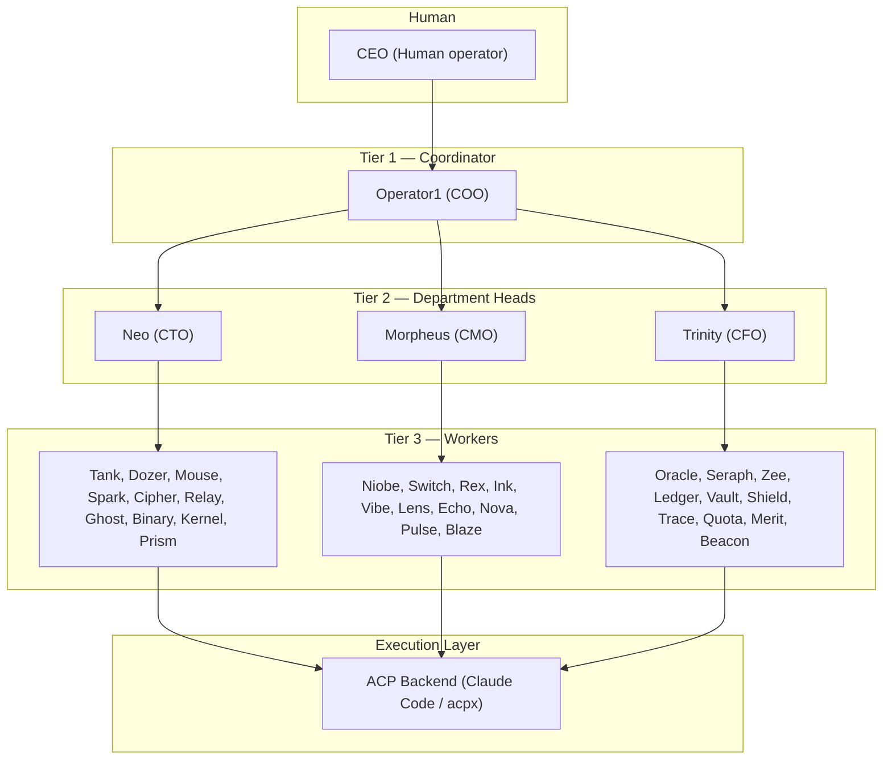
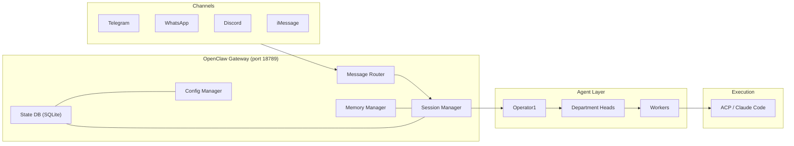

# Architecture

Operator1 is a multi-agent orchestration layer built on top of the OpenClaw gateway. It organizes AI agents into a corporate hierarchy that mirrors a real company structure, enabling autonomous task delegation, execution, and reporting.

## System overview



## Core components

### Gateway

The OpenClaw gateway is the runtime that hosts all agents. It provides:

- **WebSocket JSON-RPC server** for config, sessions, memory, and health operations
- **Channel plugins** (Telegram, WhatsApp, Discord, iMessage) for message ingress/egress
- **ACP backend** for spawning Claude Code sessions
- **Session management** with per-agent isolation
- **MCP integration** for connecting external tool servers
- **Memory operations** via QMD semantic search

All agents share a single gateway process in the current collocated deployment model. See [Gateway Patterns](/operator1/gateway-patterns) for alternatives.

### Agent runtime

Each agent runs as an isolated session within the gateway:

| Component       | Scope               | Purpose                                                |
| --------------- | ------------------- | ------------------------------------------------------ |
| Workspace       | Per-agent directory | SOUL.md, AGENTS.md, MEMORY.md, and other persona files |
| Agent directory | Per-agent           | Session logs, state, and runtime data                  |
| Auth profile    | Per-agent           | API keys and provider credentials                      |
| Memory          | Per-workspace       | QMD index, daily notes, long-term memory               |
| Tools           | Per-agent           | Allowed/denied tool lists, sandbox config              |

### Config system

Configuration is split across two files joined by `$include`:

```
~/.openclaw/openclaw.json          # Core gateway config (channels, models, auth, etc.)
    └── $include: ["./matrix-agents.json"]
              └── matrix-agents.json   # Agent hierarchy definitions
```

See [Configuration](/operator1/configuration) for the full reference.

### State database

All runtime state is persisted in a single SQLite database at `~/.openclaw/operator1.db`:

```
~/.openclaw/operator1.db           # Unified state (WAL mode, schema v10, 38 tables)
    ├── op1_config                 # Key-value config overrides
    ├── op1_projects               # Project definitions
    ├── agent_scopes               # Marketplace agent scopes
    ├── session_entries            # Session metadata + project binding
    ├── core_settings              # Scoped settings
    └── audit_log                  # Security audit trail
```

The database auto-creates on first gateway startup and self-migrates to the latest schema version. Run `openclaw doctor` to verify DB health.

## Three-tier model

The hierarchy enforces structured delegation with clear boundaries:

| Tier       | Role               | Agents                         | Model                   | Delegation                     |
| ---------- | ------------------ | ------------------------------ | ----------------------- | ------------------------------ |
| **Tier 1** | Coordinator        | Operator1                      | Strongest available     | Delegates to Tier 2 only       |
| **Tier 2** | Department heads   | Neo, Morpheus, Trinity         | Strong (e.g., glm-5)    | Delegates to any Tier 3 worker |
| **Tier 3** | Specialist workers | 30 agents across 3 departments | Capable (e.g., glm-4.7) | Spawns Claude Code via ACP     |

### Spawn depth

The system enforces `maxSpawnDepth: 4` to prevent runaway delegation chains:

```
Human → Operator1 → Neo → Tank → Claude Code (ACP)
  0         1         2      3         4
```

### Shared talent pool

Tier 3 workers are available to **all** department heads, not just their home department. Neo can spawn Oracle (finance) for data analysis, and Trinity can spawn Tank (engineering) for automation tasks. Cross-department spawning is configured via the `subagents` field on each Tier 2 agent.

## Integration stack



## Key design principles

**Session isolation** — Each agent runs in its own session with a dedicated workspace. Agents cannot read each other's memory or state directly; communication happens through delegation (spawning) with explicit context passing.

**Structured delegation** — Tasks flow top-down through the hierarchy. Cross-department requests always route through Operator1 to maintain coordination. See [Delegation](/operator1/delegation).

**Workspace-scoped memory** — Each agent has its own memory files and QMD index. Daily notes capture raw session data, MEMORY.md holds curated long-term knowledge, and QMD provides semantic search. See [Memory System](/operator1/memory-system).

**Config-driven hierarchy** — The entire agent tree is defined in JSON configuration, making it easy to add, remove, or reconfigure agents without code changes. See [Configuration](/operator1/configuration).

**Unified SQLite state** — All runtime state lives in a single `operator1.db` database using WAL mode for safe concurrent access. This replaces the previous pattern of scattered JSON/YAML state files. Schema migrations run automatically at gateway startup, and `openclaw doctor` validates database health. See [Configuration](/operator1/configuration#state-database-operator1db).

**Project-scoped memory** — Projects bind sessions to codebases or workstreams, with isolated memory at `~/.openclaw/workspace/projects/{id}/memory/`. Subagent sessions automatically inherit their parent's project binding. See [Memory System](/operator1/memory-system).
