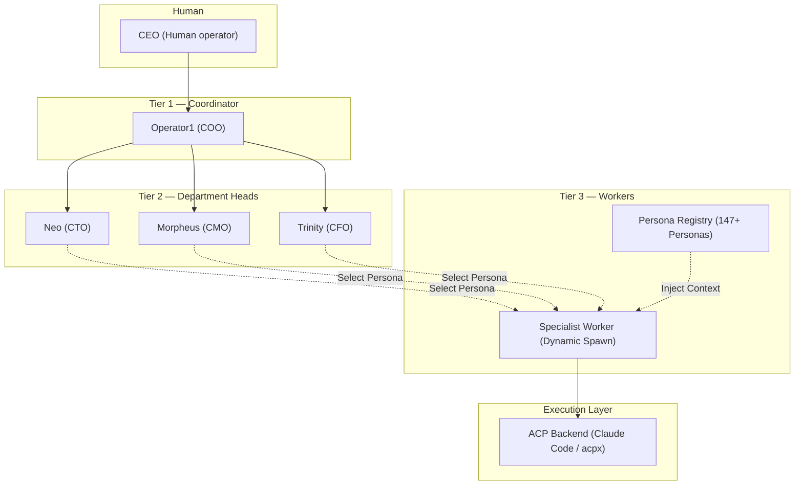
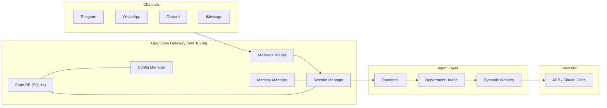

# Architecture

Operator1 is a multi-agent system built on OpenClaw. It organizes AI agents into a corporate hierarchy (similar to how a real company is structured) so they can automatically delegate tasks, execute work, and report results.

## System overview



## Core components

### Gateway

The OpenClaw gateway is the runtime that runs all agents. It handles:

- Config management and agent sessions
- Messaging (Telegram, WhatsApp, Discord, iMessage)
- Spawning Claude Code when needed
- Connecting external tools
- Memory and semantic search

All agents run in a single gateway process. See [Gateway Patterns](/operator1/gateway-patterns) for other deployment options.

### Agent runtime

Each agent runs in an isolated session. Key components:

| Component    | What it stores                                          |
| ------------ | ------------------------------------------------------- |
| Workspace    | SOUL.md, AGENTS.md, MEMORY.md (agent personality files) |
| Session logs | Events and output from each run                         |
| Credentials  | API keys and provider access tokens                     |
| Memory       | Knowledge and previous notes (searchable)               |
| Tools        | Which capabilities the agent can use                    |

### Config system

Two config files work together:

```
~/.openclaw/openclaw.json    # Gateway settings (channels, models, auth)
    ├── Includes: matrix-agents.json
matrix-agents.json           # Agent definitions (hierarchy, roles, models)
```

See [Configuration](/operator1/configuration) for details.

### State database

All data is stored in `~/.openclaw/operator1.db` (SQLite):

```
operator1.db
├── op1_config      # Config overrides
├── op1_projects    # Project definitions
├── session_entries # Session data
├── core_settings   # Scoped settings
└── audit_log       # Security events
```

The database is created automatically and updates to the latest version on startup. Run `openclaw doctor` to check database health.

## Three-tier model

The hierarchy enforces structured delegation with clear boundaries:

| Tier       | Role               | Agents                 | Model                | Delegation                    |
| ---------- | ------------------ | ---------------------- | -------------------- | ----------------------------- |
| **Tier 1** | Coordinator        | Operator1              | Strongest available  | Delegates to Tier 2 only      |
| **Tier 2** | Department heads   | Neo, Morpheus, Trinity | Strong (e.g., glm-5) | Spawns persona-based workers  |
| **Tier 3** | Specialist workers | Dynamic Persona Spawns | Capable              | Executes task via Claude Code |

### Spawn depth

The system enforces `maxSpawnDepth: 4` to prevent runaway delegation chains:

```
Human → Operator1 → Neo → backend-architect → Claude Code (ACP)
  0         1         2          3               4
```

### Shared talent pool

Tier 3 workers are available to **all** department heads, not just their home department. Neo can spawn a `data-analyst` (finance) for data analysis, and Trinity can spawn a `backend-architect` (engineering) for automation tasks. Cross-department spawning is enabled by selecting personas from the Registry.

## Integration stack



## Key design principles

**Isolation** — Each agent has its own workspace and memory. Agents don't share state directly; they communicate by spawning each other with explicit context.

**Structured flow** — Tasks move down the hierarchy. Cross-department work routes through Operator1 for coordination.

**Workspace memory** — Each agent stores its own notes, knowledge files, and searchable memory index.

**Config-driven** — The entire hierarchy is defined in JSON, so you can add or remove agents without code changes.

**Single database** — All state lives in `operator1.db` (SQLite) for reliable concurrent access and automatic schema updates.

**Project memory** — Projects isolate memory for different codebases. Sub-agents inherit their parent's project context automatically.
