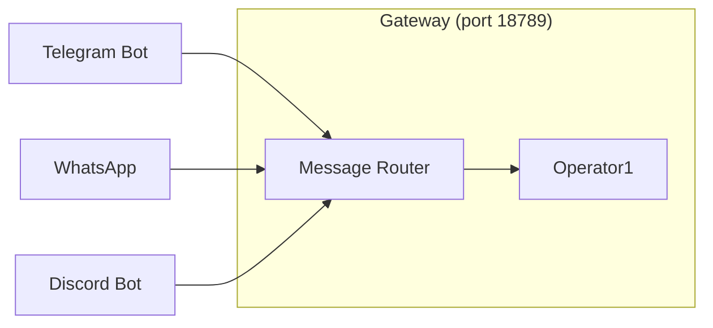

# Channels

Operator1 receives tasks and sends responses through messaging channels connected to the OpenClaw gateway. Multiple agents can share channels or have dedicated channel accounts.

## Supported channels

| Channel                | Status               | Primary Use               |
| ---------------------- | -------------------- | ------------------------- |
| Telegram               | Active               | Primary command interface |
| WhatsApp               | Supported            | Mobile messaging          |
| Discord                | Supported            | Community and team chat   |
| iMessage (BlueBubbles) | Available (disabled) | Apple ecosystem           |
| Signal                 | Supported            | Secure messaging          |
| Matrix (extension)     | Available            | Self-hosted chat          |
| MS Teams (extension)   | Available            | Enterprise                |

## Channel architecture



All incoming messages route through the gateway's message router, which determines the target agent based on channel bindings, peer mappings, and routing rules.

## Telegram (primary)

Telegram is the primary interface for interacting with Operator1.

### Configuration

```json
{
  "channels": {
    "telegram": {
      "enabled": true,
      "dmPolicy": "pairing",
      "botToken": "your-bot-token",
      "groupPolicy": "allowlist",
      "streaming": "partial",
      "groups": {
        "-1003506452238": {
          "enabled": true,
          "groupPolicy": "open",
          "requireMention": false
        }
      }
    }
  }
}
```

### Key settings

| Setting          | Values                                     | Description                              |
| ---------------- | ------------------------------------------ | ---------------------------------------- |
| `dmPolicy`       | `pairing`, `allowlist`, `open`, `disabled` | Who can DM the bot                       |
| `groupPolicy`    | `allowlist`, `open`, `disabled`            | Which groups the bot responds in         |
| `streaming`      | `partial`, `full`, `off`                   | Message streaming mode                   |
| `requireMention` | `true`/`false`                             | Whether bot must be @mentioned in groups |

### Topic-to-project auto-binding

Telegram groups with topics enabled support automatic project binding. When a message arrives in a topic, the gateway matches the topic name to a project in `op1_projects` and automatically binds the session to that project. This means:

- Messages in a topic named "subzero" auto-bind to the project with slug `subzero`
- The agent receives project context (soul, tools, memory path) in its system prompt
- Subagent sessions spawned from that session inherit the project binding

### Group configuration

Groups are configured by their Telegram group ID. Each group can override the global policy:

```json
{
  "groups": {
    "-1003506452238": {
      "enabled": true,
      "groupPolicy": "open",
      "requireMention": false
    }
  }
}
```

## iMessage (BlueBubbles)

iMessage integration via BlueBubbles server. Currently disabled in the default setup.

### Configuration

```json
{
  "channels": {
    "bluebubbles": {
      "enabled": false,
      "serverUrl": "http://192.168.1.19:1234",
      "password": "your-password",
      "webhookPath": "/bluebubbles-webhook"
    }
  }
}
```

### Requirements

- BlueBubbles server running on a Mac
- Server URL accessible from the gateway
- Webhook path configured for message delivery

## Multi-agent routing

When multiple agents are configured, the gateway routes messages based on bindings:

### Routing resolution order

1. **Peer binding** — specific sender → specific agent
2. **Parent peer** — sender's parent account → agent
3. **Guild + roles** — group/server + role → agent
4. **Channel-wide** — channel default → agent
5. **Fallback** — default agent (Operator1)

### Per-agent channel accounts

Each agent can have its own channel account (e.g., separate Telegram bots):

```json
{
  "agents": {
    "list": [
      {
        "id": "main",
        "channels": {
          "telegram": { "botToken": "operator1-bot-token" }
        }
      },
      {
        "id": "neo",
        "channels": {
          "telegram": { "botToken": "neo-bot-token" }
        }
      }
    ]
  }
}
```

### Shared channel with mention routing

Alternatively, all agents share one channel account, and routing is based on @mentions:

```json
{
  "messages": {
    "groupChat": {
      "mentionPatterns": ["@operator1", "@neo", "@morpheus"]
    }
  }
}
```

## Channel setup checklist

1. Choose a channel (Telegram recommended for getting started)
2. Create a bot/account for the channel
3. Add credentials to `openclaw.json`
4. Configure DM and group policies
5. Set up routing bindings if using multiple agents
6. Test with `pnpm openclaw channels status --probe`
7. Send a test message

## Related

- [Architecture](/operator1/architecture) — how channels fit in the system
- [Configuration](/operator1/configuration) — full config reference
- [Deployment](/operator1/deployment) — setup guide
- [Multi-agent routing](/concepts/multi-agent) — detailed routing docs
