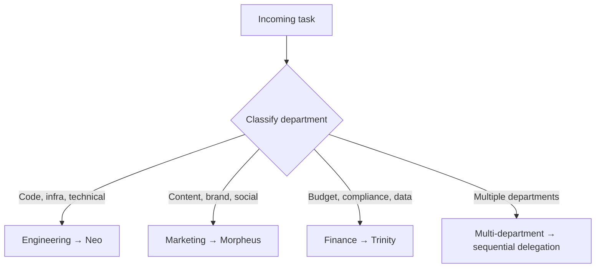
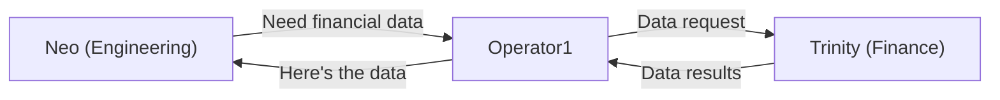

# Delegation

Tasks flow top-down through the agent hierarchy. Each level adds detail, refines the work, and delegates to the next person down the chain.

## Delegation rules

| Rule             | Flow                              | Description                                                          |
| ---------------- | --------------------------------- | -------------------------------------------------------------------- |
| Tier 1 to Tier 2 | Operator1 → Neo/Morpheus/Trinity  | Operator1 classifies by department and delegates to the C-suite head |
| Tier 2 to Tier 3 | Neo → Tank, Morpheus → Ink, etc.  | Department heads assign specific workers                             |
| Tier 3 to ACP    | Tank → Claude Code                | Workers spawn Claude Code sessions for code-level execution          |
| Cross-department | Engineering → Operator1 → Finance | Always routes back through Operator1                                 |

## Task classification flow

When Operator1 receives a task from the human CEO:



For multi-department tasks, Operator1 breaks the work into department-scoped subtasks and delegates each one separately, tracking progress across all.

## Spawning via sessions_spawn

Delegation happens through the `sessions.spawn` RPC call. Each spawn creates an isolated agent session with explicit context.

### Spawn parameters

```json
{
  "agentId": "neo",
  "task": "[Project: subzero | Path: ~/dev/subzero-app]\n[Task]: Add rate limiting to the API endpoints",
  "label": "neo-subzero-ratelimit-1709712060000",
  "runTimeoutSeconds": 1800
}
```

| Field               | Description                                                                            |
| ------------------- | -------------------------------------------------------------------------------------- |
| `agentId`           | The agent to spawn (must be in the spawner's `subagents` list)                         |
| `task`              | The task description with project context                                              |
| `label`             | Human-readable label for tracking (convention: `{agent}-{project}-{task}-{timestamp}`) |
| `runTimeoutSeconds` | Maximum session duration (default: 1800 = 30 minutes)                                  |

### Label conventions

Labels follow the pattern: `{agentId}-{project}-{taskSlug}-{timestamp}`

Examples:

- `neo-subzero-ratelimit-1709712060000`
- `morpheus-website-blogpost-1709712060000`
- `trinity-q1-budget-review-1709712060000`

## Context passing

Every delegated task includes structured context so the receiving agent knows what project they're working on and where to find resources.

### Context template

```
[Project: {project-id} | Path: {project-path}]
[Tagged for this session]
[Task]: {actual task description}

Read the project's .openclaw/AGENTS.md for conventions before starting.
When you spawn sub-agents, pass the project info forward.
For ACP sessions, use cwd: {project-path}.
```

### Flow example

```
1. Human: "Add rate limiting to SubZero"

2. Operator1 classifies → Engineering → spawns Neo:
   task: "[Project: subzero | Path: ~/dev/subzero-app]
          [Task]: Add rate limiting to the API endpoints"

3. Neo receives, reads SOUL.md + AGENTS.md, classifies as Medium task:
   - Creates requirements brief
   - Selects Tank (Backend Engineer)
   - Spawns Tank with refined context:
     task: "[Project: subzero | Path: ~/dev/subzero-app]
            [Requirements]: Add express-rate-limit middleware to all API routes.
            Rate: 100 requests/15min per IP. Return 429 with retry-after header.
            [Task]: Implement rate limiting per the requirements above."

4. Tank receives, spawns Claude Code via ACP:
   - cwd: ~/dev/subzero-app
   - Implements the actual code changes
   - Reports results back to Neo

5. Neo reviews, reports to Operator1

6. Operator1 reports to Human
```

## Spawn depth limits

The system enforces `maxSpawnDepth` to prevent runaway delegation chains:

```
Level 0: Human (CEO)
Level 1: Operator1 (COO)
Level 2: Neo/Morpheus/Trinity (Department Heads)
Level 3: Tank/Ink/Oracle (Workers)
Level 4: Claude Code (ACP)
```

With `maxSpawnDepth: 4`, the chain terminates at ACP. Workers cannot spawn other workers — they can only spawn Claude Code sessions.

## Cross-department protocol

When an agent needs work from another department:

1. **Do not** delegate directly across departments
2. Report the need back to the delegating agent
3. The request escalates back to Operator1
4. Operator1 delegates to the appropriate department head
5. Results flow back through Operator1



This ensures Operator1 maintains visibility into all cross-department work.

## Session isolation

Each spawned session is fully isolated:

- **Workspace**: Reads from the spawned agent's workspace directory
- **Memory**: Accesses only the spawned agent's memory files and QMD index
- **Auth**: Uses the spawned agent's auth profile (or falls back to defaults)
- **Tools**: Respects the spawned agent's tool allow/deny lists
- **State**: No shared mutable state between sessions

Agents communicate only through the delegation chain — task input flows down, results flow up.

## Related

- [Architecture](/operator1/architecture) — system design overview
- [Agent Hierarchy](/operator1/agent-hierarchy) — who delegates to whom
- [Sub-Agent Spawning](/operator1/spawning) — detailed spawning mechanics
- [Configuration](/operator1/configuration) — subagents and timeout config
