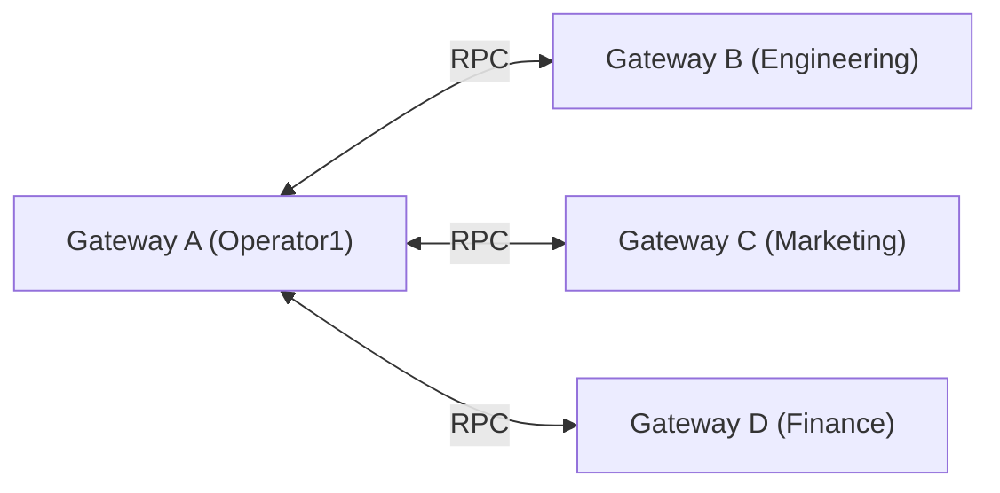

# Gateway Patterns

Operator1 can run in different deployment styles depending on your needs for scale, isolation, and resource use.

## Pattern 1: Collocated (current production)

All agents share a single gateway process on one port.

```
Single Gateway (port 18789)
   +-- Operator1 (main)
   +-- Neo (CTO)
   +-- Morpheus (CMO)
   +-- Trinity (CFO)
   +-- [Specialist Workers] (Dynamic from Registry)
```

### Configuration

Single `openclaw.json` with `$include` for agent definitions:

```json
{
  "$include": ["./matrix-agents.json"],
  "gateway": {
    "port": 18789,
    "mode": "local",
    "bind": "loopback"
  }
}
```

### Advantages

- Simple to set up and manage
- Single process to monitor and restart
- Shared channel connections (one Telegram bot, one WhatsApp session)
- Lower resource footprint
- No cross-gateway communication needed

### Limitations

- All agents compete for the same compute resources
- A crash affects all agents
- Cannot scale departments independently
- Single point of failure

### When to use

- Development and testing
- Single-operator setups
- Resource-constrained environments
- When simplicity is more important than isolation

## Pattern 2: Independent gateways (future)

Each department runs its own gateway process on a dedicated port.

```
Gateway A (port 18789) — Operator1 + shared services
Gateway B (port 19789) — Neo + Engineering personas
Gateway C (port 20789) — Morpheus + Marketing personas
Gateway D (port 21789) — Trinity + Finance personas
```

### Configuration

Separate config files per gateway:

```
~/.openclaw/
   +-- openclaw.json              # Gateway A: Operator1 + routing
   +-- openclaw-engineering.json  # Gateway B: Neo + workers
   +-- openclaw-marketing.json    # Gateway C: Morpheus + workers
   +-- openclaw-finance.json      # Gateway D: Trinity + workers
```

Each config defines only its agents and port:

```json
{
  "gateway": {
    "port": 19789,
    "mode": "local",
    "bind": "loopback"
  },
  "agents": {
    "list": [{ "id": "neo", "role": "CTO", "...": "..." }]
  }
}
```

### Advantages

- Department-level isolation (a crash in engineering doesn't affect finance)
- Independent scaling per department
- Better resource allocation
- Can run on different machines

### Limitations

- More complex to set up and manage
- Cross-gateway communication not yet implemented
- Multiple processes to monitor
- Channel connections need routing decisions
- Higher resource footprint

### When to use

- Production deployments at scale
- When department isolation is critical
- Multi-machine setups
- When departments have very different resource needs

## Decision matrix

| Factor                 | Collocated           | Independent               |
| ---------------------- | -------------------- | ------------------------- |
| Setup complexity       | Low                  | High                      |
| Resource usage         | Lower                | Higher                    |
| Fault isolation        | None                 | Per-department            |
| Scaling                | Vertical only        | Horizontal per department |
| Cross-department comms | In-process           | RPC (future)              |
| Monitoring             | Single process       | Multiple processes        |
| Recommended for        | Dev, single operator | Production at scale       |

## Cross-gateway communication (future)

When running independent gateways, departments will communicate via inter-gateway RPC:



Operator1's gateway acts as the coordination hub, routing cross-department requests to the appropriate department gateway.

This feature is not yet implemented. Current production uses the collocated pattern.

## Related

- [Architecture](/operator1/architecture) — system design overview
- [Configuration](/operator1/configuration) — config file structure
- [Deployment](/operator1/deployment) — setup guides for both patterns
