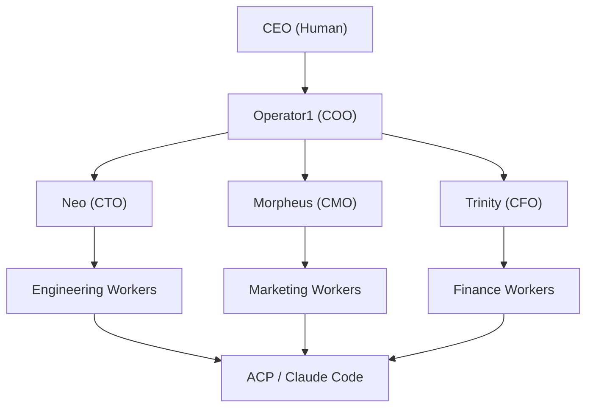

# Operator1

Operator1 is a **multi-agent orchestration system** built on top of OpenClaw. It organizes 34 AI agents into a 3-tier corporate hierarchy — from a COO-level coordinator down to specialized department workers — enabling autonomous delegation, execution, and reporting across engineering, marketing, and finance workstreams.

## How it works

**Tier 1** — Operator1 receives tasks from the human CEO, classifies them by department, and delegates to the appropriate C-suite head.

**Tier 2** — Department heads (Neo, Morpheus, Trinity) break down tasks, create requirements briefs, and assign work to specialized workers.

**Tier 3** — Workers execute tasks directly, spawning Claude Code sessions via ACP when code-level work is needed.

## Documentation

<Columns>
  <Card title="Architecture" href="/operator1/architecture" icon="layers">
    System design, components, and how the pieces fit together.
  </Card>
  <Card title="Agent Hierarchy" href="/operator1/agent-hierarchy" icon="network">
    All 34 agents, their roles, departments, and workspace structure.
  </Card>
  <Card title="Delegation" href="/operator1/delegation" icon="arrow-right-left">
    How tasks flow through the hierarchy with context passing.
  </Card>
  <Card title="Gateway Patterns" href="/operator1/gateway-patterns" icon="server">
    Collocated vs independent gateway deployment models.
  </Card>
</Columns>

<Columns>
  <Card title="Configuration" href="/operator1/configuration" icon="settings">
    openclaw.json structure and Matrix agent config reference.
  </Card>
  <Card title="Agent Configs" href="/operator1/agent-configs" icon="file-text">
    Workspace files: SOUL.md, AGENTS.md, IDENTITY.md, and more.
  </Card>
  <Card title="Memory System" href="/operator1/memory-system" icon="brain">
    Three-layer memory: daily notes, long-term, and semantic search.
  </Card>
  <Card title="RPC Reference" href="/operator1/rpc" icon="terminal">
    Gateway RPC methods for agent management and operations.
  </Card>
</Columns>

<Columns>
  <Card title="Deployment" href="/operator1/deployment" icon="rocket">
    New machine setup, prerequisites, and deployment modes.
  </Card>
  <Card title="Channels" href="/operator1/channels" icon="message-square">
    Channel integrations and multi-agent routing.
  </Card>
  <Card title="Sub-Agent Spawning" href="/operator1/spawning" icon="git-branch">
    sessions_spawn flow, context passing, and ACP integration.
  </Card>
</Columns>

## Quick reference

| Aspect          | Details                                                        |
| --------------- | -------------------------------------------------------------- |
| Total agents    | 34 (1 Tier 1 + 3 Tier 2 + 30 Tier 3)                           |
| Departments     | Engineering, Marketing, Finance                                |
| Max spawn depth | 4 levels                                                       |
| Gateway pattern | Collocated (single process, port 18789)                        |
| Memory backend  | QMD (semantic) + daily notes + MEMORY.md                       |
| ACP backend     | Claude Code via acpx                                           |
| Config          | `~/.openclaw/openclaw.json` + `$include` for agent definitions |
