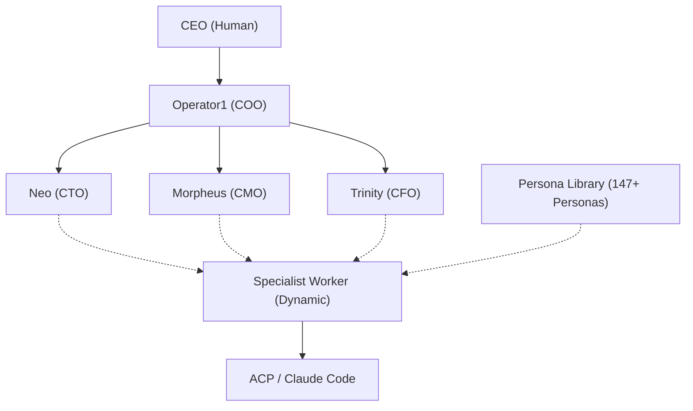
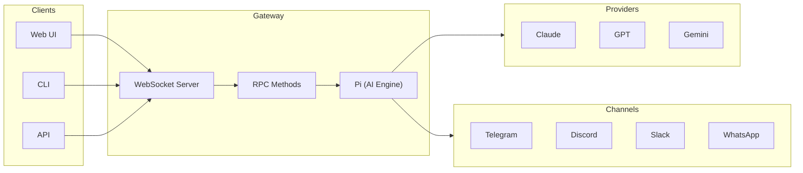

# Operator1

Operator1 is a **multi-agent system** that organizes 4 core AI agents (Operator1, Neo, Morpheus, Trinity) into a corporate hierarchy. It leverages a **Persona Library of 147+ agents** to dynamically spawn specialist workers for autonomous delegation, task execution, and reporting.

## How it works

**Tier 1** — Operator1 receives tasks from you, classifies them by department, and delegates to the right department head.

**Tier 2** — Department heads (Neo, Morpheus, Trinity) break down tasks and spawn specialized workers on-demand from the Persona Library.

**Tier 3** — Workers execute tasks, spawning Claude Code sessions when needed.

### Visual Overview

_The 4-agent core hierarchy supported by a 147+ persona library_

### Gateway Architecture

_Gateway architecture: WebSocket API, channels, nodes, and AI providers_

_Gateway system architecture: WebSocket API, channels, nodes, and AI providers_

## Documentation

**1. Core Architecture**
| Topic | Purpose |
| :--- | :--- |
| **[Architecture](/operator1/architecture)** | System design and components |
| **[Agent Hierarchy](/operator1/agent-hierarchy)** | The 4-core agents and persona registry |
| **[Delegation](/operator1/delegation)** | How tasks flow through the system |
| **[Gateway Patterns](/operator1/gateway-patterns)** | Deployment options |

**2. Control Panel**
| Topic | Purpose |
| :--- | :--- |
| **[Configuration](/operator1/configuration)** | SQL-first settings and SQLite schema |
| **[Channels](/operator1/channels)** | Connect Telegram, Discord, or Slack |
| **[Heartbeat](/operator1/heartbeat)** | System health and audit logs |
| **[Deployment](/operator1/deployment)** | GUI setup and onboarding wizard |

**3. Agent Management**
| Topic | Purpose |
| :--- | :--- |
| **[Agent Hub](/operator1/hub)** | Browse the 147+ Persona Registry |
| **[Agent Configs](/operator1/agent-configs)** | SOUL.md, AGENTS.md, and workspace files |
| **[Spawning](/operator1/spawning)** | How managers spawn specialist workers |

**4. Tools & Interface**
| Topic | Purpose |
| :--- | :--- |
| **[Skills](/operator1/skills)** | Manage agent capabilities and native tools |
| **[Slash Commands](/operator1/slash-commands)** | Unified `/` user actions |
| **[MCP Integration](/operator1/mcp)** | Connect external Model Context servers |
| **[Visualize](/operator1/visualize)** | Real-time pixel art Matrix canvas |
| **[Memory System](/operator1/memory-system)** | QMD and project-scoped knowledge |

## Operator1 Features

Operator1 introduces these core features beyond OpenClaw:

### Agent Marketplace

Discover, install, and customize agents from a centralized registry. Start with a minimal setup and add department heads and specialists as needed. Tier enforcement ensures valid hierarchies — you can't install specialists without their department head. Agents can be installed at user or project scope.

**Key capabilities:**

- Browse marketplace with search and filtering
- Install/uninstall agents with one click
- Pin versions with `agents-lock.yaml`
- Multi-scope installation (user, project, local)
- Tier validation and dependency checking

### Operator1Hub

A built-in, curated registry of skills, agent personas, and commands. No setup needed — Hub ships with operator1 and works on first launch. Content is version-controlled on GitHub and delivered via static manifest. Independent from ClawHub.

**What's included:**

- Ready-to-use agent personas for specialized roles
- Pre-built skills for common tasks
- Commands for quick automation
- Collections (bundled sets of items for team setups)

### SQLite State Consolidation

Operator1 has migrated to a **SQL-first state model**, replacing scattered JSON files with a unified SQLite database (`operator1.db`). All runtime state — sessions, projects, settings, audit logs — lives in one place. Schema auto-migrates on startup.

**What's in the database:**

- Config overrides (`op1_config`)
- Project definitions (`op1_projects`)
- Session metadata with project bindings
- Settings (global, agent, project scopes)
- Audit trail of security-sensitive operations

### Enhanced Memory System

Four-layer architecture: daily notes (raw session capture), long-term memory (curated knowledge), project-scoped memory (isolated per codebase), and semantic search index. Each agent automatically builds knowledge from past work.

**Benefits:**

- Agents don't forget previous decisions
- Project memory isolates contexts
- QMD semantic search finds relevant knowledge fast
- Automatic indexing with no manual curation needed

### Project-Scoped Context

Bind sessions to projects. Sub-agents automatically inherit parent project context, keeping work organized and focused. Project memory stores isolated knowledge per codebase.

**Use case:**
Work on multiple repos without confusion. Each project has its own memory and session history.

### MCP Client Integration

Connect external tool servers via Model Context Protocol. Tools from any MCP-compatible server are automatically discovered and available to all agents. Configure once, use everywhere.

### Agent Personas Registry

147+ reusable agent personas ship locally. Create specialized agents for any role (security engineer, sre, architect, etc.). Personas define personality, values, and decision frameworks.

### Onboarding GUI

Interactive setup wizard guides first-time users through configuration. Changes made via the GUI are persisted directly to the **SQLite state database**, ensuring they take precedence over static JSON files.

## Quick reference

| Aspect          | Details                                                        |
| --------------- | -------------------------------------------------------------- |
| Total agents    | 4 core + 147+ personas (Persona Registry)                      |
| Departments     | Engineering, Marketing, Finance                                |
| Max spawn depth | 4 levels                                                       |
| Gateway pattern | Collocated (single process, port 18789)                        |
| State backend   | `~/.openclaw/operator1.db` (SQLite, WAL mode, schema v10)      |
| Memory backend  | QMD (semantic) + daily notes + MEMORY.md + project memory      |
| ACP backend     | Claude Code via acpx                                           |
| Config          | `~/.openclaw/openclaw.json` + `$include` for agent definitions |
