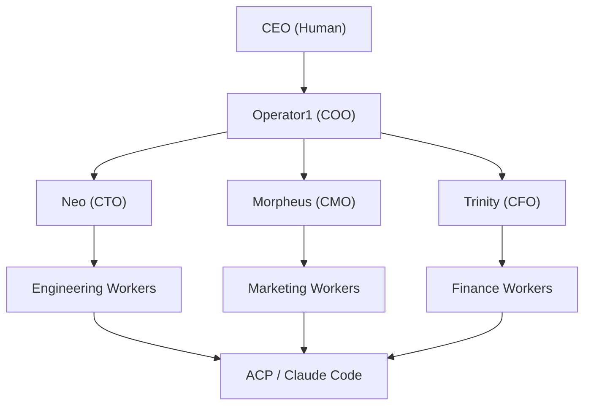
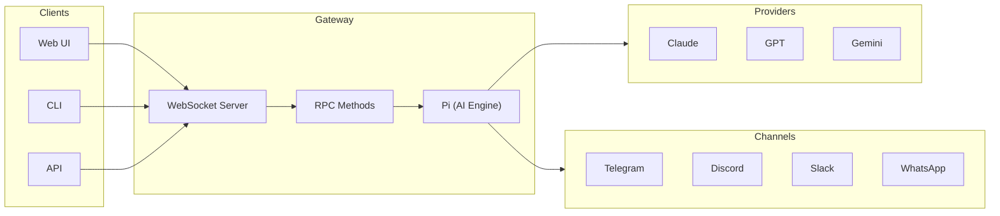

# Operator1

Operator1 is a **multi-agent orchestration system** built on top of OpenClaw. It organizes 34 AI agents into a 3-tier corporate hierarchy — from a COO-level coordinator down to specialized department workers — enabling autonomous delegation, execution, and reporting across engineering, marketing, and finance workstreams.

## How it works

**Tier 1** — Operator1 receives tasks from the human CEO, classifies them by department, and delegates to the appropriate C-suite head.

**Tier 2** — Department heads (Neo, Morpheus, Trinity) break down tasks, create requirements briefs, and assign work to specialized workers.

**Tier 3** — Workers execute tasks directly, spawning Claude Code sessions via ACP when code-level work is needed.

### Visual Overview

_The 34-agent Matrix hierarchy: CEO → COO → Department Heads → Workers_

### Gateway Architecture

_Gateway architecture: WebSocket API, channels, nodes, and AI providers_

_Gateway system architecture: WebSocket API, channels, nodes, and AI providers_

## Documentation

### Architecture

|                                                             |                                                                   |
| ----------------------------------------------------------- | ----------------------------------------------------------------- |
| **[Architecture](/docs/architecture/overview)**             | System design, components, and how the pieces fit together.       |
| **[Agent Hierarchy](/docs/architecture/agent-hierarchy)**   | All 34 agents, their roles, departments, and workspace structure. |
| **[Delegation](/docs/architecture/delegation)**             | How tasks flow through the hierarchy with context passing.        |
| **[Gateway Patterns](/docs/architecture/gateway-patterns)** | Collocated vs independent gateway deployment models.              |

### Configuration

|                                                        |                                                                                 |
| ------------------------------------------------------ | ------------------------------------------------------------------------------- |
| **[Configuration](/docs/configuration/overview)**      | openclaw.json structure and Matrix agent config reference.                      |
| **[Agent Configs](/docs/configuration/agent-configs)** | Workspace files: SOUL.md, AGENTS.md, IDENTITY.md, and more.                     |
| **[Memory System](/docs/configuration/memory-system)** | Four-layer memory: daily notes, long-term, project-scoped, and semantic search. |

### Operations

|                                                     |                                                            |
| --------------------------------------------------- | ---------------------------------------------------------- |
| **[RPC Reference](/docs/operations/rpc)**           | Gateway RPC methods for agent management and operations.   |
| **[Deployment](/docs/operations/deployment)**       | New machine setup, prerequisites, and deployment modes.    |
| **[Channels](/docs/operations/channels)**           | Channel integrations and multi-agent routing.              |
| **[MCP Integration](/docs/operations/mcp)**         | Connect external tool servers via Model Context Protocol.  |
| **[Sub-Agent Spawning](/docs/operations/spawning)** | sessions_spawn flow, context passing, and ACP integration. |

## Quick reference

| Aspect          | Details                                                        |
| --------------- | -------------------------------------------------------------- |
| Total agents    | 34 (1 Tier 1 + 3 Tier 2 + 30 Tier 3)                           |
| Departments     | Engineering, Marketing, Finance                                |
| Max spawn depth | 4 levels                                                       |
| Gateway pattern | Collocated (single process, port 18789)                        |
| State backend   | `~/.openclaw/operator1.db` (SQLite, WAL mode, schema v10)      |
| Memory backend  | QMD (semantic) + daily notes + MEMORY.md + project memory      |
| ACP backend     | Claude Code via acpx                                           |
| Config          | `~/.openclaw/openclaw.json` + `$include` for agent definitions |
