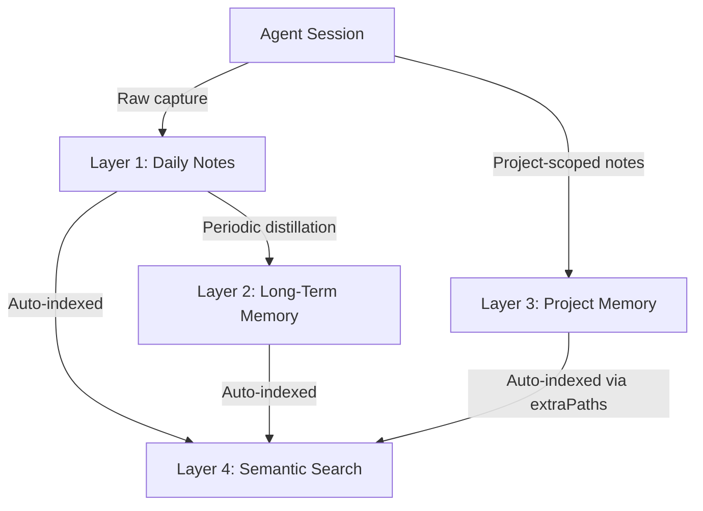

# Memory System

Each agent stores knowledge in four layers: daily notes, long-term memory, project memory, and searchable index. This keeps information organized and easy to find.

## Four-layer model



| Layer              | Files                                 | Purpose                                | Update Frequency        |
| ------------------ | ------------------------------------- | -------------------------------------- | ----------------------- |
| **Daily Notes**    | `memory/YYYY-MM-DD.md`                | Raw session logs and observations      | Every session           |
| **Long-Term**      | `MEMORY.md`                           | Curated wisdom and key decisions       | Periodic distillation   |
| **Project Memory** | `workspace/projects/{id}/memory/*.md` | Project-specific context and decisions | When working on project |
| **Semantic**       | QMD index                             | Vector-searchable knowledge base       | Auto-updated on changes |

## Layer 1: Daily notes

Daily notes capture raw session data — what the agent did, what it learned, and what decisions were made.

**Location:** `{workspace}/memory/YYYY-MM-DD.md`

**Format:**

```markdown
# 2026-03-06

## Sessions

- Reviewed SubZero rate limiting PR — approved with minor changes
- Delegated database migration to Tank — completed in 25 min

## Decisions

- Chose express-rate-limit over custom middleware (simpler, well-maintained)
- Set rate limit at 100 req/15min per IP (standard for internal APIs)

## Notes

- SubZero API has 12 endpoints, all now rate-limited
- Tank works efficiently on middleware tasks — good fit for similar work
```

**Rules:**

- One file per day, created at first session
- Append-only during the day
- Never delete daily notes (they feed into consolidation)

## Layer 2: Long-term memory (MEMORY.md)

MEMORY.md holds curated, distilled knowledge that should persist across sessions indefinitely.

**Location:** `{workspace}/MEMORY.md`

**Contents:**

- Key architectural decisions and rationale
- Project-specific knowledge
- Learned patterns (which workers are good at what)
- Human preferences
- Important context from past sessions

**Distillation process:**

1. Review recent daily notes (last 7-14 days)
2. Extract durable knowledge (decisions, patterns, preferences)
3. Update MEMORY.md with new entries
4. Remove outdated or superseded entries
5. Keep the file concise — aim for high signal-to-noise

**Example:**

```markdown
# Long-Term Memory

## Architecture Decisions

- SubZero uses express-rate-limit at 100 req/15min/IP (2026-03-06)
- All APIs use JWT auth with 24h expiry (2026-02-15)

## Worker Fit

- Tank: excellent for middleware, API routes, database migrations
- Mouse: strong at research tasks, good at finding edge cases
- Spark: fast with React components, prefers Tailwind

## Human Preferences

- Prefers concise status updates, not verbose reports
- Wants security issues escalated immediately
- Reviews PRs in the morning (PST)
```

## Layer 3: Semantic search (QMD)

QMD provides vector-based semantic search across all memory files, enabling agents to find relevant context by meaning rather than keyword matching.

### Configuration

```json
{
  "memory": {
    "backend": "qmd",
    "citations": "on",
    "qmd": {
      "command": "/path/to/bun/bin/qmd",
      "searchMode": "query",
      "update": {
        "commandTimeoutMs": 60000
      },
      "limits": {
        "timeoutMs": 30000
      }
    }
  }
}
```

| Field                         | Description                                            |
| ----------------------------- | ------------------------------------------------------ |
| `backend`                     | Memory backend type (`qmd` for semantic search)        |
| `citations`                   | Enable source citations in search results (`on`/`off`) |
| `qmd.command`                 | Path to the QMD binary                                 |
| `qmd.searchMode`              | Search mode (`query` for natural language)             |
| `qmd.update.commandTimeoutMs` | Timeout for index update operations                    |
| `qmd.limits.timeoutMs`        | Timeout for search queries                             |

### QMD setup

1. Install QMD:

   ```bash
   bun add -g qmd
   ```

2. Models are downloaded automatically on first use (~2.2 GB for the full embedding model set). They are cached at `~/.cache/qmd/models/`.

3. QMD indexes all Markdown files in the agent's workspace, including daily notes and MEMORY.md.

### Critical: PATH configuration

The gateway process does not inherit shell profile settings (`~/.zshrc`, `~/.bashrc`). The QMD binary must be reachable via the gateway's PATH.

Add to `~/.openclaw/.env`:

```
PATH=/path/to/bun/bin:${PATH}
```

Without this, the gateway cannot find the `qmd` binary and memory search will fail silently.

### Memory RPCs

| Method           | Description                                                                        |
| ---------------- | ---------------------------------------------------------------------------------- |
| `memory.status`  | Check memory provider health and index stats                                       |
| `memory.search`  | Search agent memory (includes project memory dirs via `extraPaths` auto-discovery) |
| `memory.reindex` | Trigger a full reindex of the agent's memory (includes project memory)             |

## Layer 3: Project memory

Project memory provides isolated, project-scoped storage for decisions, context, and notes related to a specific project or workstream.

**Location:** `~/.openclaw/workspace/projects/{projectId}/memory/`

Project memory is always centralized under the Operator1 workspace — it never creates files inside external repositories. This keeps project repos clean while still providing persistent project context.

### How it works

1. When a session is bound to a project (via auto-bind or RPC), the agent receives the project's memory path
2. The agent can read/write Markdown files in that directory
3. QMD auto-discovers project memory directories via `extraPaths` and indexes them alongside workspace memory
4. `memory.search` queries return results from both workspace and project memory

### Project memory vs workspace memory

| Aspect                    | Workspace memory              | Project memory                    |
| ------------------------- | ----------------------------- | --------------------------------- |
| Scope                     | Agent-wide knowledge          | Project-specific context          |
| Location                  | `workspace-{agentId}/memory/` | `workspace/projects/{id}/memory/` |
| Survives project archival | Yes                           | Archived with project             |
| Indexed by                | Agent's QMD index             | All agents via `extraPaths`       |
| Written by                | The owning agent              | Any agent bound to the project    |

## Per-agent isolation

Memory is fully workspace-scoped:

- Each agent has its own `memory/` directory for daily notes
- Each agent has its own `MEMORY.md`
- Each agent has its own QMD index
- Agents cannot read each other's memory directly
- Cross-agent knowledge transfer happens only through delegation context

## Consolidation workflow

Memory consolidation distills daily notes into long-term memory:


**Triggers:**

- Manual: agent runs consolidation during heartbeat
- Planned: `consolidate-memory.ts` script (see scripting implementation guide)
- RPC: `memory.sync` (planned)

**Guidelines:**

- Consolidate at least weekly
- Keep MEMORY.md under 200 lines for fast context loading
- Prefer specific facts over vague observations
- Include dates for time-sensitive information
- Remove entries that are no longer relevant

## Related

- [Agent Configs](/operator1/agent-configs) — workspace file reference
- [Configuration](/operator1/configuration) — memory config in openclaw.json
- [RPC Reference](/operator1/rpc) — memory RPC methods
