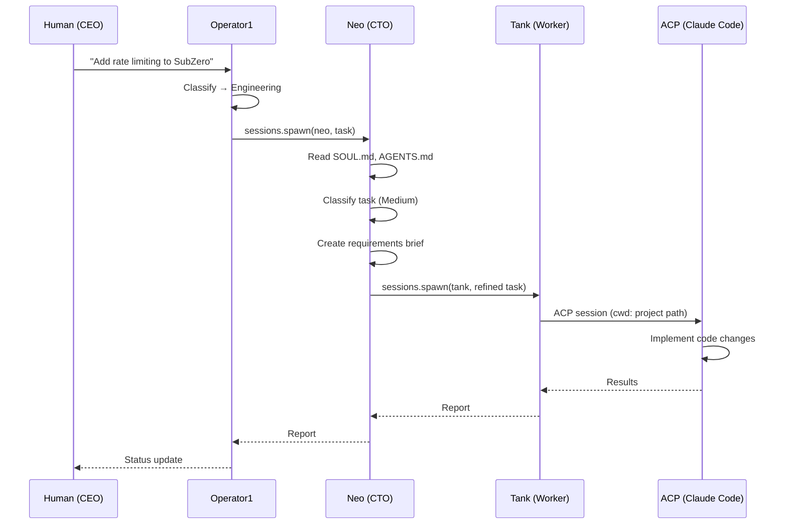
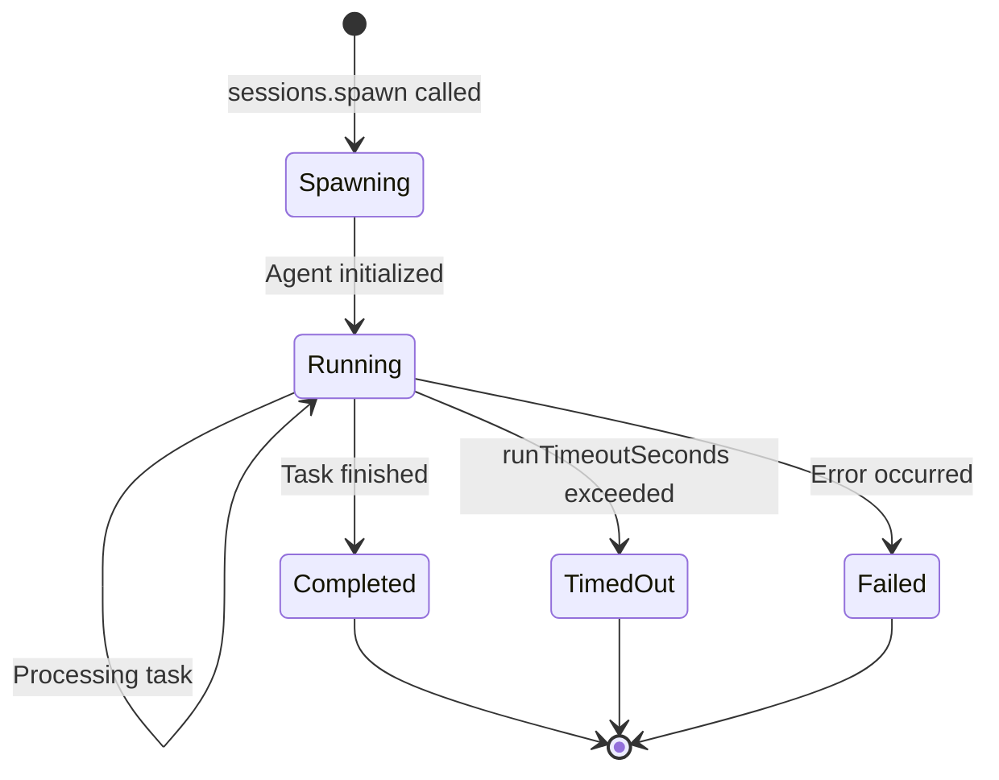

# Sub-Agent Spawning

Spawning is how agents delegate tasks to other agents or Claude Code. Each spawn creates an isolated session with a clear task and time limit.

## Spawning flow



## sessions.spawn

The `sessions.spawn` RPC creates a new agent session with explicit task context.

### Parameters

```json
{
  "agentId": "neo",
  "task": "[Project: subzero | Path: ~/dev/subzero-app]\n[Task]: Add rate limiting to the API endpoints",
  "label": "neo-subzero-ratelimit-1709712060000",
  "runTimeoutSeconds": 1800
}
```

| Parameter           | Type   | Required | Description                                             |
| ------------------- | ------ | -------- | ------------------------------------------------------- |
| `agentId`           | string | Yes      | Target agent ID (must be in spawner's `subagents` list) |
| `task`              | string | Yes      | Task description with structured context                |
| `label`             | string | No       | Human-readable session label for tracking               |
| `runTimeoutSeconds` | number | No       | Max session duration (default: 1800 = 30 min)           |

### Subagent validation

The gateway validates that:

1. The `agentId` exists in the agent list
2. The `agentId` is in the spawning agent's `subagents` array
3. The spawn would not exceed `maxSpawnDepth`
4. The agent's `maxConcurrent` session limit is not reached

If validation fails, the spawn is rejected with an error.

## Context passing

Every spawned task includes structured context so the receiving agent knows what to work on and where.

### Standard context template

```
[Project: {project-id} | Path: {project-path}]
[Tagged for this session]
[Task]: {actual task description}

Read the project's .openclaw/AGENTS.md for conventions before starting.
When you spawn sub-agents, pass the project info forward.
For ACP sessions, use cwd: {project-path}.
```

### Context fields

| Field          | Description                      | Example                                    |
| -------------- | -------------------------------- | ------------------------------------------ |
| `Project`      | Project identifier               | `subzero`                                  |
| `Path`         | Filesystem path to project root  | `~/dev/subzero-app`                        |
| `Task`         | What needs to be done            | `Add rate limiting to API endpoints`       |
| `Requirements` | Detailed specs (added by Tier 2) | `Use express-rate-limit, 100 req/15min/IP` |

### Context enrichment by tier

Each tier adds detail as the task flows down:

**Tier 1 (Operator1)** adds:

- Project identification
- Project path
- High-level task description

**Tier 2 (Department head)** adds:

- Requirements brief
- Technical constraints
- Acceptance criteria
- Worker selection rationale

**Tier 3 (Worker)** passes to ACP:

- Working directory (`cwd`)
- Specific implementation instructions
- File targets if known

## Label conventions

Session labels follow: `{agentId}-{project}-{taskSlug}-{timestamp}`

| Component   | Format                 | Example         |
| ----------- | ---------------------- | --------------- |
| `agentId`   | Agent ID               | `neo`           |
| `project`   | Project slug           | `subzero`       |
| `taskSlug`  | Short task description | `ratelimit`     |
| `timestamp` | Unix timestamp (ms)    | `1709712060000` |

Full example: `neo-subzero-ratelimit-1709712060000`

## ACP integration

Tier 3 workers spawn Claude Code sessions via the ACP (Agent Communication Protocol) backend.

### ACP configuration

```json
{
  "acp": {
    "enabled": true,
    "dispatch": "round-robin",
    "backend": "acpx",
    "defaultAgent": "main",
    "maxConcurrentSessions": 4,
    "stream": true,
    "runtime": "claude-code"
  }
}
```

### ACP session flow

1. Worker decides code-level work is needed
2. Worker spawns an ACP session with `cwd` set to the project path
3. Claude Code executes in the project directory
4. Results (code changes, test output) flow back to the worker
5. Worker validates results and reports to department head

### Key ACP settings

| Setting                 | Description                                  |
| ----------------------- | -------------------------------------------- |
| `dispatch`              | How sessions are distributed (`round-robin`) |
| `backend`               | ACP backend type (`acpx` for Claude Code)    |
| `maxConcurrentSessions` | Max parallel Claude Code sessions            |
| `stream`                | Whether to stream tool events                |
| `runtime`               | Which coding agent to use                    |

## Project binding

Sessions can be bound to a project, which provides project-specific context and memory to the agent.

### Auto-binding

Sessions are automatically bound to a project in these cases:

- **Telegram topics** — messages in a Telegram topic are auto-bound to the matching project based on topic name
- **Subagent inheritance** — when a parent session spawns a child, the child automatically inherits the parent's `project_id`

### Manual binding

Use the `projects.bindSession` RPC to manually associate a session with a project:

```json
{
  "method": "projects.bindSession",
  "params": { "id": "project-uuid", "sessionKey": "session-key" }
}
```

### What binding provides

When a session is bound to a project, the agent's system prompt is injected with:

- Project soul/persona context (if defined)
- Project-specific AGENTS.md rules
- Project tool configurations
- Project memory path (`~/.openclaw/workspace/projects/{id}/memory/`)

### Storage

Project binding is stored as a dedicated `project_id` column on the `session_entries` table in `operator1.db`. This allows efficient queries for all sessions associated with a project.

## Session lifecycle



### States

| State         | Description                                            |
| ------------- | ------------------------------------------------------ |
| **Spawning**  | Session is being created, workspace and context loaded |
| **Running**   | Agent is actively working on the task                  |
| **Completed** | Task finished successfully, results available          |
| **Timed out** | Session exceeded `runTimeoutSeconds`                   |
| **Failed**    | Error during execution                                 |

### Timeout handling

- Default timeout: 1800 seconds (30 minutes)
- Configurable per spawn via `runTimeoutSeconds`
- Configurable per agent via `agents.defaults.timeoutSeconds`
- When a session times out, partial results may be available
- The spawning agent receives a timeout notification

## Session isolation

Each spawned session is fully isolated:

| Aspect      | Scope                                         |
| ----------- | --------------------------------------------- |
| Workspace   | Agent's own workspace directory               |
| Memory      | Agent's own QMD index and daily notes         |
| Project     | Inherited `project_id` from parent (if bound) |
| Auth        | Agent's own auth profile (or defaults)        |
| Tools       | Agent's own allow/deny lists                  |
| File system | ACP sessions scoped to project `cwd`          |
| State       | No shared mutable state between sessions      |

## Related

- [Delegation](/operator1/delegation) — delegation rules and cross-department protocol
- [Architecture](/operator1/architecture) — system design overview
- [RPC Reference](/operator1/rpc) — sessions.spawn and other RPCs
- [Configuration](/operator1/configuration) — ACP and agent config
