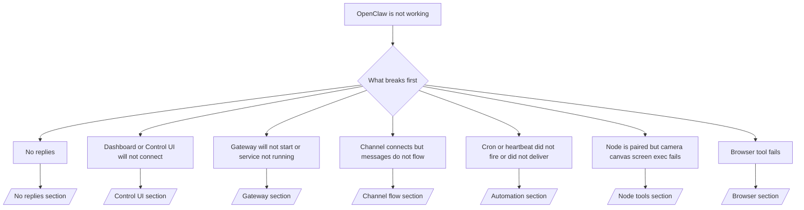

# Rozwiązywanie problemów

Jeśli masz tylko 2 minuty, użyj tej strony jako wejścia do wstępnej triage.

## Pierwsze 60 sekund

Uruchom dokładnie tę drabinę, w podanej kolejności:

```bash
openclaw status
openclaw status --all
openclaw gateway probe
openclaw gateway status
openclaw doctor
openclaw channels status --probe
openclaw logs --follow
```

Prawidłowe wyjście w jednym wierszu:

- `openclaw status` → pokazuje skonfigurowane kanały i brak oczywistych błędów uwierzytelniania.
- `openclaw status --all` → pełny raport jest obecny i możliwy do udostępnienia.
- `openclaw gateway probe` → oczekiwany cel gateway jest osiągalny.
- `openclaw gateway status` → `Runtime: running` oraz `RPC probe: ok`.
- `openclaw doctor` → brak blokujących błędów konfiguracji/usługi.
- `openclaw channels status --probe` → kanały zgłaszają `connected` lub `ready`.
- `openclaw logs --follow` → stabilna aktywność, brak powtarzających się błędów krytycznych.

## Drzewo decyzyjne



<AccordionGroup>
  <Accordion title="No replies">
    ```bash
    openclaw status
    openclaw gateway status
    openclaw channels status --probe
    openclaw pairing list <channel>
    openclaw logs --follow
    ```

    ```
    Prawidłowe wyjście wygląda tak:
    
    - `Runtime: running`
    - `RPC probe: ok`
    - Twój kanał pokazuje stan połączony/gotowy w `channels status --probe`
    - Nadawca wygląda na zatwierdzonego (lub polityka DM jest otwarta/lista dozwolonych)
    
    Typowe sygnatury logów:
    
    - `drop guild message (mention required` → bramkowanie wzmianek zablokowało wiadomość w Discordzie.
    - `pairing request` → nadawca jest niezatwierdzony i czeka na zatwierdzenie parowania DM.
    - `blocked` / `allowlist` w logach kanału → nadawca, pokój lub grupa jest filtrowana.
    
    Strony szczegółowe:
    
    - [/gateway/troubleshooting#no-replies](/gateway/troubleshooting#no-replies)
    - [/channels/troubleshooting](/channels/troubleshooting)
    - [/channels/pairing](/channels/pairing)
    ```

  </Accordion>

  <Accordion title="Dashboard or Control UI will not connect">
    ```bash
    openclaw status
    openclaw gateway status
    openclaw logs --follow
    openclaw doctor
    openclaw channels status --probe
    ```

    ```
    Prawidłowe wyjście wygląda tak:
    
    - `Dashboard: http://...` jest widoczny w `openclaw gateway status`
    - `RPC probe: ok`
    - Brak pętli uwierzytelniania w logach
    
    Typowe sygnatury logów:
    
    - `device identity required` → kontekst HTTP/niezabezpieczony nie może ukończyć uwierzytelniania urządzenia.
    - `unauthorized` / pętla ponownych połączeń → błędny token/hasło lub niezgodność trybu uwierzytelniania.
    - `gateway connect failed:` → UI celuje w niewłaściwy URL/port lub gateway jest nieosiągalny.
    
    Strony szczegółowe:
    
    - [/gateway/troubleshooting#dashboard-control-ui-connectivity](/gateway/troubleshooting#dashboard-control-ui-connectivity)
    - [/web/control-ui](/web/control-ui)
    - [/gateway/authentication](/gateway/authentication)
    ```

  </Accordion>

  <Accordion title="Gateway will not start or service installed but not running">
    ```bash
    openclaw status
    openclaw gateway status
    openclaw logs --follow
    openclaw doctor
    openclaw channels status --probe
    ```

    ```
    Prawidłowe wyjście wygląda tak:
    
    - `Service: ... (loaded)`
    - `Runtime: running`
    - `RPC probe: ok`
    
    Typowe sygnatury logów:
    
    - `Gateway start blocked: set gateway.mode=local` → tryb gateway jest nieustawiony/zdalny.
    - `refusing to bind gateway ... without auth` → powiązanie poza local loopback bez tokenu/hasła.
    - `another gateway instance is already listening` lub `EADDRINUSE` → port jest już zajęty.
    
    Strony szczegółowe:
    
    - [/gateway/troubleshooting#gateway-service-not-running](/gateway/troubleshooting#gateway-service-not-running)
    - [/gateway/background-process](/gateway/background-process)
    - [/gateway/configuration](/gateway/configuration)
    ```

  </Accordion>

  <Accordion title="Channel connects but messages do not flow">
    ```bash
    openclaw status
    openclaw gateway status
    openclaw logs --follow
    openclaw doctor
    openclaw channels status --probe
    ```

    ```
    Prawidłowe wyjście wygląda tak:
    
    - Transport kanału jest połączony.
    - Kontrole parowania/listy dozwolonych przechodzą.
    - Wymagane wzmianki są wykrywane.
    
    Typowe sygnatury logów:
    
    - `mention required` → bramkowanie wzmianek grupowych zablokowało przetwarzanie.
    - `pairing` / `pending` → nadawca DM nie jest jeszcze zatwierdzony.
    - `not_in_channel`, `missing_scope`, `Forbidden`, `401/403` → problem z tokenem uprawnień kanału.
    
    Strony szczegółowe:
    
    - [/gateway/troubleshooting#channel-connected-messages-not-flowing](/gateway/troubleshooting#channel-connected-messages-not-flowing)
    - [/channels/troubleshooting](/channels/troubleshooting)
    ```

  </Accordion>

  <Accordion title="Cron or heartbeat did not fire or did not deliver">
    ```bash
    openclaw status
    openclaw gateway status
    openclaw cron status
    openclaw cron list
    openclaw cron runs --id <jobId> --limit 20
    openclaw logs --follow
    ```

    ```
    Prawidłowe wyjście wygląda tak:
    
    - `cron.status` pokazuje włączone z następnym wybudzeniem.
    - `cron runs` pokazuje ostatnie wpisy `ok`.
    - Heartbeat jest włączony i mieści się w aktywnych godzinach.
    
    Typowe sygnatury logów:
    
    - `cron: scheduler disabled; jobs will not run automatically` → cron jest wyłączony.
    - `heartbeat skipped` z `reason=quiet-hours` → poza skonfigurowanymi aktywnymi godzinami.
    - `requests-in-flight` → główna ścieżka zajęta; wybudzenie heartbeat zostało odroczone.
    - `unknown accountId` → konto docelowe dostarczania heartbeat nie istnieje.
    
    Strony szczegółowe:
    
    - [/gateway/troubleshooting#cron-and-heartbeat-delivery](/gateway/troubleshooting#cron-and-heartbeat-delivery)
    - [/automation/troubleshooting](/automation/troubleshooting)
    - [/gateway/heartbeat](/gateway/heartbeat)
    ```

  </Accordion>

  <Accordion title="Node is paired but tool fails camera canvas screen exec">
    ```bash
    openclaw status
    openclaw gateway status
    openclaw nodes status
    openclaw nodes describe --node <idOrNameOrIp>
    openclaw logs --follow
    ```

    ```
    Prawidłowe wyjście wygląda tak:
    
    - Węzeł jest wymieniony jako połączony i sparowany dla roli `node`.
    - Istnieje zdolność dla wywoływanego polecenia.
    - Stan uprawnień jest przyznany dla narzędzia.
    
    Typowe sygnatury logów:
    
    - `NODE_BACKGROUND_UNAVAILABLE` → przenieś aplikację węzła na pierwszy plan.
    - `*_PERMISSION_REQUIRED` → uprawnienie systemu operacyjnego zostało odrzucone/brakuje go.
    - `SYSTEM_RUN_DENIED: approval required` → zatwierdzenie exec jest w toku.
    - `SYSTEM_RUN_DENIED: allowlist miss` → polecenie nie znajduje się na liście dozwolonych exec.
    
    Strony szczegółowe:
    
    - [/gateway/troubleshooting#node-paired-tool-fails](/gateway/troubleshooting#node-paired-tool-fails)
    - [/nodes/troubleshooting](/nodes/troubleshooting)
    - [/tools/exec-approvals](/tools/exec-approvals)
    ```

  </Accordion>

  <Accordion title="Browser tool fails">
    ```bash
    openclaw status
    openclaw gateway status
    openclaw browser status
    openclaw logs --follow
    openclaw doctor
    ```

    ```
    Prawidłowe wyjście wygląda tak:
    
    - Stan przeglądarki pokazuje `running: true` oraz wybraną przeglądarkę/profil.
    - Profil `openclaw` uruchamia się lub przekaźnik `chrome` ma dołączoną kartę.
    
    Typowe sygnatury logów:
    
    - `Failed to start Chrome CDP on port` → nie powiodło się lokalne uruchomienie przeglądarki.
    - `browser.executablePath not found` → skonfigurowana ścieżka do binarki jest błędna.
    - `Chrome extension relay is running, but no tab is connected` → rozszerzenie nie jest dołączone.
    - `Browser attachOnly is enabled ... not reachable` → profil tylko-do-dołączania nie ma aktywnego celu CDP.
    
    Strony szczegółowe:
    
    - [/gateway/troubleshooting#browser-tool-fails](/gateway/troubleshooting#browser-tool-fails)
    - [/tools/browser-linux-troubleshooting](/tools/browser-linux-troubleshooting)
    - [/tools/chrome-extension](/tools/chrome-extension)
    ```

  </Accordion>
</AccordionGroup>
