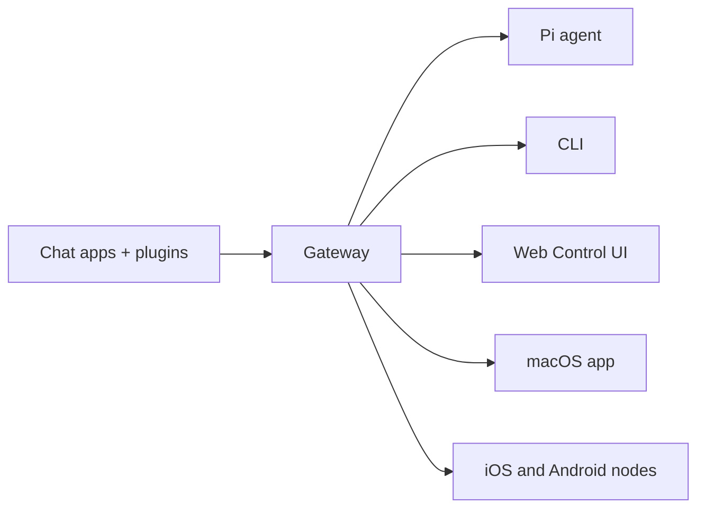

# OpenClaw 🦞

<p align="center">
    
    
</p>

> _„EXFOLIATE! EXFOLIATE!”_ — kosmiczny homar, prawdopodobnie

<p align="center">
  <strong>Gateway dla agentów AI na dowolnym systemie operacyjnym, obejmujący WhatsApp, Telegram, Discord, iMessage i inne.</strong><br />
  Wyślij wiadomość i otrzymaj odpowiedź agenta prosto z kieszeni. Wtyczki dodają Mattermost i kolejne kanały.
</p>

<Columns>
  <Card title="Pierwsze kroki" href="/start/getting-started" icon="rocket">
    Zainstaluj OpenClaw i uruchom Gateway w kilka minut.
  </Card>
  <Card title="Uruchom kreatora" href="/start/wizard" icon="sparkles">
    Konfiguracja z przewodnikiem z `openclaw onboard` i procesami parowania.
  </Card>
  <Card title="Otwórz interfejs sterowania" href="/web/control-ui" icon="layout-dashboard">
    Uruchom panel przeglądarkowy do czatu, konfiguracji i sesji.
  </Card>
</Columns>

## Czym jest OpenClaw?

OpenClaw to **samodzielnie hostowany gateway**, który łączy Twoje ulubione aplikacje czatowe — WhatsApp, Telegram, Discord, iMessage i inne — z agentami AI do programowania, takimi jak Pi. Uruchamiasz pojedynczy proces Gateway na własnej maszynie (lub serwerze), który staje się mostem między aplikacjami komunikacyjnymi a zawsze dostępnym asystentem AI.

**Dla kogo?** Dla programistów i zaawansowanych użytkowników, którzy chcą osobistego asystenta AI dostępnego z dowolnego miejsca — bez oddawania kontroli nad danymi ani polegania na usłudze hostowanej.

**Co go wyróżnia?**

- **Samodzielne hostowanie**: działa na Twoim sprzęcie, na Twoich zasadach
- **Wielokanałowość**: jeden Gateway obsługuje jednocześnie WhatsApp, Telegram, Discord i inne
- **Natywność agentowa**: zaprojektowany dla agentów programistycznych z użyciem narzędzi, sesjami, pamięcią i routowaniem wieloagentowym
- **Open source**: licencja MIT, rozwijany przez społeczność

**Czego potrzebujesz?** Node 22+, klucz API (zalecany Anthropic) i 5 minut.

## Jak to działa



Gateway jest pojedynczym źródłem prawdy dla sesji, routowania i połączeń kanałów.

## Kluczowe możliwości

<Columns>
  <Card title="Wielokanałowy gateway" icon="network">
    WhatsApp, Telegram, Discord i iMessage w jednym procesie Gateway.
  </Card>
  <Card title="Kanały wtyczek" icon="plug">
    Dodaj Mattermost i inne dzięki pakietom rozszerzeń.
  </Card>
  <Card title="Routowanie wieloagentowe" icon="route">
    Izolowane sesje na agenta, obszar roboczy lub nadawcę.
  </Card>
  <Card title="Obsługa multimediów" icon="image">
    Wysyłaj i odbieraj obrazy, dźwięk i dokumenty.
  </Card>
  <Card title="Webowy interfejs sterowania" icon="monitor">
    Panel przeglądarkowy do czatu, konfiguracji, sesji i węzłów.
  </Card>
  <Card title="Węzły mobilne" icon="smartphone">
    Parowanie węzłów iOS i Android z obsługą Canvas.
  </Card>
</Columns>

## Szybki start

<Steps>
  <Step title="Zainstaluj OpenClaw">
    ```bash
    npm install -g openclaw@latest
    ```
  </Step>
  <Step title="Wdróż i zainstaluj usługę">
    ```bash
    openclaw onboard --install-daemon
    ```
  </Step>
  <Step title="Sparuj WhatsApp i uruchom Gateway">
    ```bash
    openclaw channels login
    openclaw gateway --port 18789
    ```
  </Step>
</Steps>

Potrzebujesz pełnej instalacji i konfiguracji deweloperskiej? Zobacz [Szybki start](/start/quickstart).

## Panel

Otwórz webowy interfejs sterowania po uruchomieniu Gateway.

- Lokalnie (domyślnie): [http://127.0.0.1:18789/](http://127.0.0.1:18789/)
- Dostęp zdalny: [Powierzchnie webowe](/web) i [Tailscale](/gateway/tailscale)

<p align="center">
  
</p>

## Konfiguracja (opcjonalna)

Konfiguracja znajduje się w `~/.openclaw/openclaw.json`.

- Jeśli **nic nie zrobisz**, OpenClaw użyje dołączonego binarnego Pi w trybie RPC z sesjami per nadawca.
- Jeśli chcesz to zablokować, zacznij od `channels.whatsapp.allowFrom` oraz (dla grup) reguł wzmianek.

Przykład:

```json5
{
  channels: {
    whatsapp: {
      allowFrom: ["+15555550123"],
      groups: { "*": { requireMention: true } },
    },
  },
  messages: { groupChat: { mentionPatterns: ["@openclaw"] } },
}
```

## Zacznij tutaj

<Columns>
  <Card title="Centra dokumentacji" href="/start/hubs" icon="book-open">
    Cała dokumentacja i przewodniki, uporządkowane według przypadków użycia.
  </Card>
  <Card title="Konfiguracja" href="/gateway/configuration" icon="settings">
    Podstawowe ustawienia Gateway, tokeny i konfiguracja dostawców.
  </Card>
  <Card title="Dostęp zdalny" href="/gateway/remote" icon="globe">
    Wzorce dostępu przez SSH i tailnet.
  </Card>
  <Card title="Kanały" href="/channels/telegram" icon="message-square">
    Konfiguracja specyficzna dla kanałów: WhatsApp, Telegram, Discord i inne.
  </Card>
  <Card title="Węzły" href="/nodes" icon="smartphone">
    Węzły iOS i Android z parowaniem i Canvas.
  </Card>
  <Card title="Pomoc" href="/help" icon="life-buoy">
    Typowe poprawki i punkt wejścia do rozwiązywania problemów.
  </Card>
</Columns>

## Dowiedz się więcej

<Columns>
  <Card title="Pełna lista funkcji" href="/concepts/features" icon="list">
    Kompletne możliwości kanałów, routowania i multimediów.
  </Card>
  <Card title="Routowanie wieloagentowe" href="/concepts/multi-agent" icon="route">
    Izolacja obszarów roboczych i sesje per agent.
  </Card>
  <Card title="Bezpieczeństwo" href="/gateway/security" icon="shield">
    Tokeny, listy dozwolonych i mechanizmy bezpieczeństwa.
  </Card>
  <Card title="Rozwiązywanie problemów" href="/gateway/troubleshooting" icon="wrench">
    Diagnostyka Gateway i typowe błędy.
  </Card>
  <Card title="O projekcie i podziękowania" href="/reference/credits" icon="info">
    Geneza projektu, współtwórcy i licencja.
  </Card>
</Columns>
