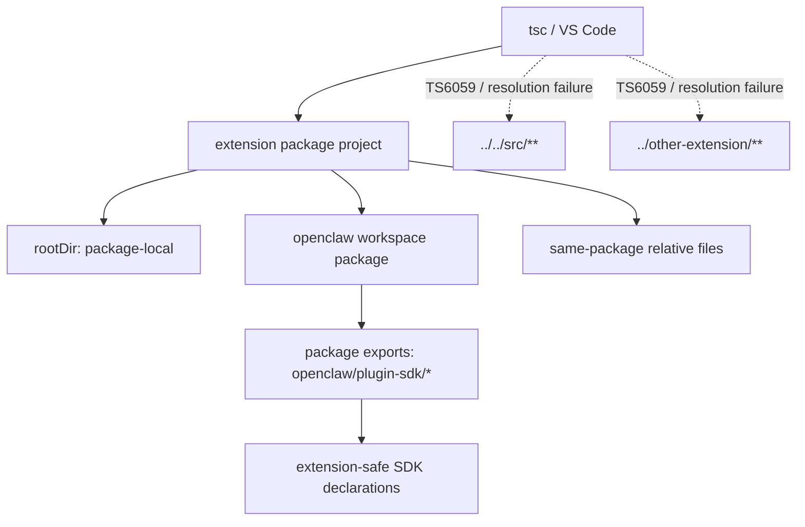
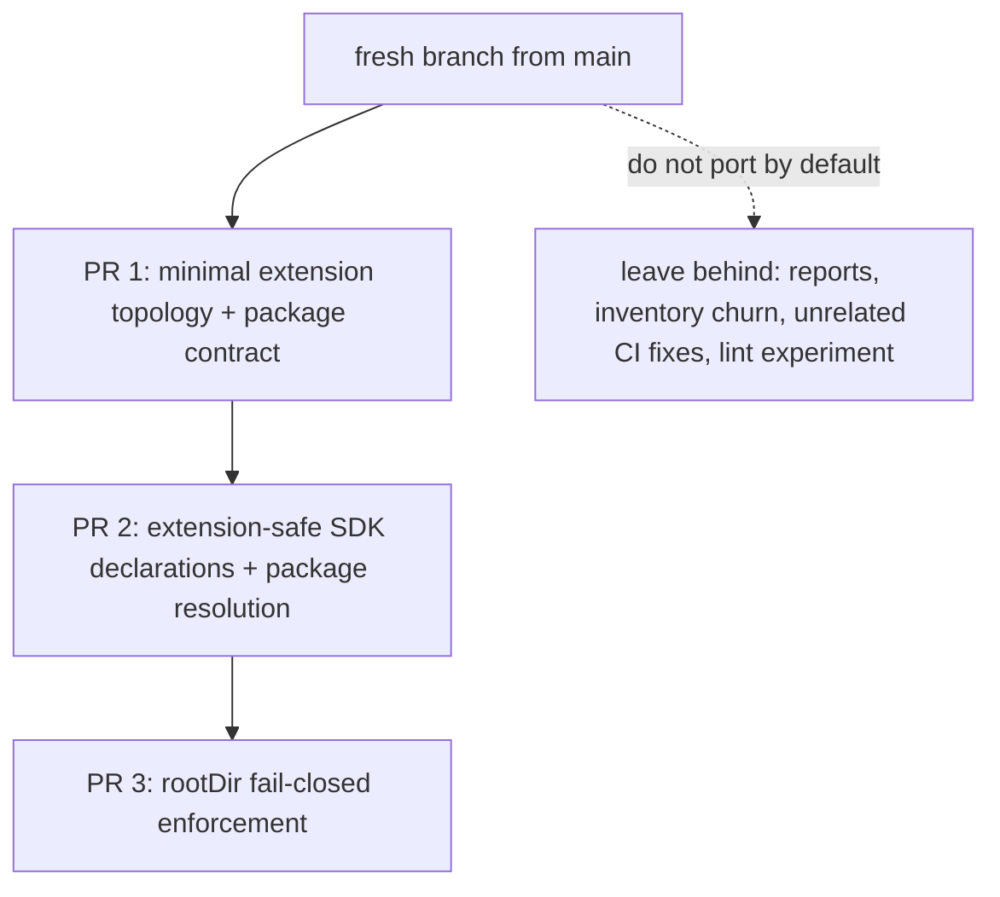

# refactor: Enforce extension package resolution boundaries

## Overview

This plan narrows the next boundary-enforcement slice to one mergeable goal:
make bundled plugin TypeScript projects fail closed through normal package
resolution and `rootDir` enforcement, without dragging the whole repo through a
simultaneous package split or reusing a branch that already accumulated too much
unrelated scaffolding.

The current branch proved two important things:

- package-local `tsconfig.json` files alone do not stop illegal relative imports
- a naive `rootDir` rollout breaks allowed SDK imports, because extension
  projects still resolve `openclaw/plugin-sdk/*` to raw repo source and the
  generated SDK declaration surface still leaks bundled plugin source paths

This follow-up plan is therefore intentionally smaller than the broader
2026-04-04 boundary plan. It aims to produce a fresh-branch implementation path
that carries forward only the subset of current-branch work that is truly on the
critical path:

- extension-local TypeScript projects
- extension package references to the `openclaw` workspace package
- extension-safe SDK declaration/package resolution
- `rootDir`-backed compiler failures for illegal imports

Everything else should be treated as optional, follow-up, or dropped unless it
is proven necessary by the narrower implementation.

## Problem Frame

The repo already has the policy you want:

- bundled plugins may import only `openclaw/plugin-sdk/*` plus same-package
  relative files
- imports of `src/**`, `src/plugin-sdk-internal/**`, and sibling extensions
  should break

But the current TypeScript setup still teaches the opposite lesson.

Today:

- `extensions/tsconfig.base.json` maps `openclaw/plugin-sdk/*` directly to
  `src/plugin-sdk/*.ts`
- extension projects do not set `rootDir`
- generated SDK declarations still include extension-owned source references,
  especially through the facade type map and browser/runtime surfaces

That means:

- illegal relative imports like `../../src/cli/acp-cli.ts` do not fail in
  VS Code or `tsc -p extensions/<id>/tsconfig.json`
- adding `rootDir` immediately produces a flood of false positives, because
  allowed SDK imports still resolve outside the extension package

By contrast, the comparison repo `microapps-core` works because each package is
compiled with a real per-package `rootDir`, so TypeScript emits `TS6059` when an
import escapes the package source tree.

The next useful slice is therefore not "add more scripts" and not "land the
whole current branch." It is:

1. make extension-allowed imports resolve through a real package contract
2. clean the extension-visible SDK declaration surface so it does not leak
   sibling extension or raw repo source paths
3. then add `rootDir` to extension projects and let TypeScript break illegal
   relative imports directly

The current branch provides good discovery data, but it is not the right patch
stack to land as-is. The plan below explicitly classifies which current-branch
changes are reusable seeds for a fresh branch and which should be left behind.

## Requirements Trace

- R1-R4. Bundled plugin production code under `extensions/*` may import only
  `openclaw/plugin-sdk/*` and same-package relative paths, and illegal imports
  should intentionally break.
- R5-R8. `openclaw/plugin-sdk/*` remains the canonical cross-package contract,
  but plugin-specific and extension-owned leakage must not remain implicit.
- R9-R12. Enforcement must move closer to compiler/editor behavior, with minimal
  file movement in phase 1.
- R13-R15. The next slice should be small enough for a focused PR and should
  classify or remove the remaining leaks that block compiler-first enforcement.

## Scope Boundaries

- No full-repo package split for `src/cli`, gateway internals, or channel
  internals in this PR.
- No large runtime behavior changes for providers, channels, or gateway flows.
- No attempt to solve the entire plugin-specific SDK surface reduction in the
  same PR.
- No broad root-lint cleanup for the `extensions/` tree.
- No changes to extension production behavior beyond import resolution and type
  boundary enforcement.
- No requirement to preserve or land every preparatory change from the current
  `codex/plan-plugin-boundaries-followup` branch.
- No assumption that `packages/*` or `ui/` need local TypeScript projects in the
  same PR unless extension fail-closed enforcement proves they are required.

## Context & Research

### Relevant Code and Patterns

- `extensions/tsconfig.base.json`
  currently sets `baseUrl: ".."` and maps:
  - `openclaw/plugin-sdk` -> `src/plugin-sdk/index.ts`
  - `openclaw/plugin-sdk/*` -> `src/plugin-sdk/*.ts`
  - `@openclaw/*` -> `extensions/*`
- `extensions/*/tsconfig.json` files currently define local `include` /
  `exclude`, but they do not define `rootDir`, so TypeScript allows imports to
  escape the package tree.
- `tsconfig.plugin-sdk.dts.json` already emits declarations into
  `dist/plugin-sdk`, but the emitted declaration tree still contains source-like
  references that reach into bundled plugin code.
- `dist/plugin-sdk/src/generated/plugin-sdk-facade-type-map.generated.d.ts`
  currently references bundled plugin modules such as:
  - `../../../extensions/browser/runtime-api.js`
  - `../../../extensions/anthropic-vertex/api.js`
- `dist/plugin-sdk/browser-runtime.d.ts`,
  `dist/plugin-sdk/extensions/browser/runtime-api.d.ts`, and related files show
  that some "public SDK" types are still effectively coupled to extension-owned
  source shape.
- `src/plugins/contracts/extension-package-project-boundaries.test.ts`
  already locks the extension TS topology, but it currently enshrines the raw
  source alias behavior we now know is the blocker.
- Existing backstop guards remain valuable:
  - `scripts/check-extension-plugin-sdk-boundary.mjs`
  - `scripts/check-plugin-extension-import-boundary.mjs`
  - `scripts/report-extension-boundary-breakage.mjs`

### Key Findings from Implementation Discovery

- `pnpm exec tsc -p extensions/xai/tsconfig.json --noEmit` currently accepts an
  illegal import from `../../src/cli/acp-cli.ts`, so package-local `tsconfig`
  files alone are insufficient.
- Forcing `rootDir: "."` on `extensions/xai` immediately produces `TS6059`, but
  not just for illegal imports. It also breaks allowed `openclaw/plugin-sdk/*`
  imports because they still resolve to `src/plugin-sdk/*.ts`.
- Even after hypothetically removing the direct `src/plugin-sdk` alias, the
  emitted SDK type surface still drags sibling extension files into the program
  through generated facade declarations and extension-owned runtime APIs.

### Current-Branch Change Classification

The current branch (`codex/plan-plugin-boundaries-followup`) is useful as a
source of proven experiments, but it is too broad to land or to use as the
direct basis for a focused PR. Its changes fall into three buckets:

| Bucket                                          | Carry forward to fresh branch? | Current examples                                                                                                                                                                                                          |
| ----------------------------------------------- | ------------------------------ | ------------------------------------------------------------------------------------------------------------------------------------------------------------------------------------------------------------------------- |
| Critical path                                   | Yes                            | `extensions/*/tsconfig.json`, `extensions/tsconfig.base.json`, extension `package.json` `devDependencies.openclaw`, representative contract tests, type-stub/facade resolution fixes that keep package-local `tsc` viable |
| Potentially useful but only if proven necessary | Maybe                          | `tsconfig.base.json`, `tsconfig.workspace.json`, narrowed root `tsconfig.json`, `packages/*/tsconfig.json`, `ui/tsconfig.json`                                                                                            |
| Not needed for the fresh fail-closed PR         | No                             | boundary breakage report script, stale inventory refresh, broad docs churn, unrelated CI/mock fixes, lockfile churn unrelated to the fresh branch, the extension-lint experiment                                          |

The critical-path commits from the current branch are:

- `de8a4e9044` `build: add package-local tsconfig projects`
  - but only the extension-local TS project pieces are clearly on the critical
    path; the `packages/*`, `ui`, and broad root topology parts should be
    re-evaluated fresh
- `b57fd9665a` `build: require openclaw dev contract for bundled plugins`
- `34b92fe5be` `build: resolve @openclaw facades in extension tsconfigs`
- `b3b1b0507c` `build: wire extension type stubs into local tsconfigs`

These provide the seed set for the fresh branch. Most later commits are either
instrumentation, CI fallout cleanup, or experiments that should not be assumed
necessary for the focused implementation.

### Fresh-Branch Cherry-Pick Map

Use the prototype branch as a source of _content_, not as a branch to continue
stacking on. The fresh branch should start from `main` and re-apply only the
following buckets.

#### Carry Forward Directly

**Source commit:** `de8a4e9044` `build: add package-local tsconfig projects`

Carry forward:

- `extensions/tsconfig.base.json`
- `extensions/*/tsconfig.json`
  - specifically the extension package roots present on 2026-04-05:
    - `extensions/acpx/tsconfig.json`
    - `extensions/amazon-bedrock/tsconfig.json`
    - `extensions/anthropic/tsconfig.json`
    - `extensions/anthropic-vertex/tsconfig.json`
    - `extensions/bluebubbles/tsconfig.json`
    - `extensions/brave/tsconfig.json`
    - `extensions/browser/tsconfig.json`
    - `extensions/byteplus/tsconfig.json`
    - `extensions/chutes/tsconfig.json`
    - `extensions/cloudflare-ai-gateway/tsconfig.json`
    - `extensions/copilot-proxy/tsconfig.json`
    - `extensions/deepgram/tsconfig.json`
    - `extensions/deepseek/tsconfig.json`
    - `extensions/diagnostics-otel/tsconfig.json`
    - `extensions/diffs/tsconfig.json`
    - `extensions/discord/tsconfig.json`
    - `extensions/duckduckgo/tsconfig.json`
    - `extensions/elevenlabs/tsconfig.json`
    - `extensions/exa/tsconfig.json`
    - `extensions/fal/tsconfig.json`
    - `extensions/feishu/tsconfig.json`
    - `extensions/firecrawl/tsconfig.json`
    - `extensions/github-copilot/tsconfig.json`
    - `extensions/google/tsconfig.json`
    - `extensions/googlechat/tsconfig.json`
    - `extensions/groq/tsconfig.json`
    - `extensions/huggingface/tsconfig.json`
    - `extensions/image-generation-core/tsconfig.json`
    - `extensions/imessage/tsconfig.json`
    - `extensions/irc/tsconfig.json`
    - `extensions/kilocode/tsconfig.json`
    - `extensions/kimi-coding/tsconfig.json`
    - `extensions/line/tsconfig.json`
    - `extensions/litellm/tsconfig.json`
    - `extensions/llm-task/tsconfig.json`
    - `extensions/lobster/tsconfig.json`
    - `extensions/matrix/tsconfig.json`
    - `extensions/mattermost/tsconfig.json`
    - `extensions/media-understanding-core/tsconfig.json`
    - `extensions/memory-core/tsconfig.json`
    - `extensions/memory-lancedb/tsconfig.json`
    - `extensions/microsoft/tsconfig.json`
    - `extensions/microsoft-foundry/tsconfig.json`
    - `extensions/minimax/tsconfig.json`
    - `extensions/mistral/tsconfig.json`
    - `extensions/moonshot/tsconfig.json`
    - `extensions/msteams/tsconfig.json`
    - `extensions/nextcloud-talk/tsconfig.json`
    - `extensions/nostr/tsconfig.json`
    - `extensions/nvidia/tsconfig.json`
    - `extensions/ollama/tsconfig.json`
    - `extensions/open-prose/tsconfig.json`
    - `extensions/openai/tsconfig.json`
    - `extensions/opencode/tsconfig.json`
    - `extensions/opencode-go/tsconfig.json`
    - `extensions/openrouter/tsconfig.json`
    - `extensions/openshell/tsconfig.json`
    - `extensions/perplexity/tsconfig.json`
    - `extensions/qianfan/tsconfig.json`
    - `extensions/qqbot/tsconfig.json`
    - `extensions/qwen/tsconfig.json`
    - `extensions/searxng/tsconfig.json`
    - `extensions/sglang/tsconfig.json`
    - `extensions/signal/tsconfig.json`
    - `extensions/slack/tsconfig.json`
    - `extensions/speech-core/tsconfig.json`
    - `extensions/stepfun/tsconfig.json`
    - `extensions/synology-chat/tsconfig.json`
    - `extensions/synthetic/tsconfig.json`
    - `extensions/tavily/tsconfig.json`
    - `extensions/telegram/tsconfig.json`
    - `extensions/tlon/tsconfig.json`
    - `extensions/together/tsconfig.json`
    - `extensions/twitch/tsconfig.json`
    - `extensions/venice/tsconfig.json`
    - `extensions/vercel-ai-gateway/tsconfig.json`
    - `extensions/video-generation-core/tsconfig.json`
    - `extensions/vllm/tsconfig.json`
    - `extensions/voice-call/tsconfig.json`
    - `extensions/volcengine/tsconfig.json`
    - `extensions/whatsapp/tsconfig.json`
    - `extensions/xai/tsconfig.json`
    - `extensions/xiaomi/tsconfig.json`
    - `extensions/zai/tsconfig.json`
    - `extensions/zalo/tsconfig.json`
    - `extensions/zalouser/tsconfig.json`
- `src/plugins/contracts/extension-package-project-boundaries.test.ts`

Carry forward only if the fresh branch proves they are required:

- `tsconfig.base.json`
- `tsconfig.json`
- `tsconfig.workspace.json`
- `packages/tsconfig.base.json`
- `packages/clawdbot/tsconfig.json`
- `packages/memory-host-sdk/tsconfig.json`
- `packages/moltbot/tsconfig.json`
- `packages/plugin-package-contract/tsconfig.json`
- `ui/tsconfig.json`

**Source commit:** `b57fd9665a` `build: require openclaw dev contract for bundled plugins`

Carry forward:

- `extensions/*/package.json`
  - specifically the bundled plugin package roots present on 2026-04-05:
    - `extensions/acpx/package.json`
    - `extensions/amazon-bedrock/package.json`
    - `extensions/anthropic/package.json`
    - `extensions/anthropic-vertex/package.json`
    - `extensions/bluebubbles/package.json`
    - `extensions/brave/package.json`
    - `extensions/browser/package.json`
    - `extensions/byteplus/package.json`
    - `extensions/chutes/package.json`
    - `extensions/cloudflare-ai-gateway/package.json`
    - `extensions/copilot-proxy/package.json`
    - `extensions/deepgram/package.json`
    - `extensions/deepseek/package.json`
    - `extensions/diagnostics-otel/package.json`
    - `extensions/diffs/package.json`
    - `extensions/discord/package.json`
    - `extensions/duckduckgo/package.json`
    - `extensions/elevenlabs/package.json`
    - `extensions/exa/package.json`
    - `extensions/fal/package.json`
    - `extensions/feishu/package.json`
    - `extensions/firecrawl/package.json`
    - `extensions/github-copilot/package.json`
    - `extensions/google/package.json`
    - `extensions/googlechat/package.json`
    - `extensions/groq/package.json`
    - `extensions/huggingface/package.json`
    - `extensions/image-generation-core/package.json`
    - `extensions/imessage/package.json`
    - `extensions/irc/package.json`
    - `extensions/kilocode/package.json`
    - `extensions/kimi-coding/package.json`
    - `extensions/line/package.json`
    - `extensions/litellm/package.json`
    - `extensions/llm-task/package.json`
    - `extensions/lobster/package.json`
    - `extensions/matrix/package.json`
    - `extensions/mattermost/package.json`
    - `extensions/media-understanding-core/package.json`
    - `extensions/memory-core/package.json`
    - `extensions/memory-lancedb/package.json`
    - `extensions/microsoft/package.json`
    - `extensions/microsoft-foundry/package.json`
    - `extensions/minimax/package.json`
    - `extensions/mistral/package.json`
    - `extensions/moonshot/package.json`
    - `extensions/msteams/package.json`
    - `extensions/nextcloud-talk/package.json`
    - `extensions/nostr/package.json`
    - `extensions/nvidia/package.json`
    - `extensions/ollama/package.json`
    - `extensions/open-prose/package.json`
    - `extensions/openai/package.json`
    - `extensions/opencode/package.json`
    - `extensions/opencode-go/package.json`
    - `extensions/openrouter/package.json`
    - `extensions/openshell/package.json`
    - `extensions/perplexity/package.json`
    - `extensions/qianfan/package.json`
    - `extensions/qqbot/package.json`
    - `extensions/qwen/package.json`
    - `extensions/searxng/package.json`
    - `extensions/sglang/package.json`
    - `extensions/signal/package.json`
    - `extensions/slack/package.json`
    - `extensions/speech-core/package.json`
    - `extensions/stepfun/package.json`
    - `extensions/synology-chat/package.json`
    - `extensions/synthetic/package.json`
    - `extensions/tavily/package.json`
    - `extensions/telegram/package.json`
    - `extensions/tlon/package.json`
    - `extensions/together/package.json`
    - `extensions/twitch/package.json`
    - `extensions/venice/package.json`
    - `extensions/vercel-ai-gateway/package.json`
    - `extensions/video-generation-core/package.json`
    - `extensions/vllm/package.json`
    - `extensions/voice-call/package.json`
    - `extensions/volcengine/package.json`
    - `extensions/whatsapp/package.json`
    - `extensions/xai/package.json`
    - `extensions/xiaomi/package.json`
    - `extensions/zai/package.json`
    - `extensions/zalo/package.json`
    - `extensions/zalouser/package.json`
- `src/plugins/contracts/plugin-sdk-package-contract-guardrails.test.ts`
- `pnpm-lock.yaml`

**Source commits:** `34b92fe5be` and `b3b1b0507c`

Carry forward:

- `extensions/tsconfig.base.json`
- `src/plugins/contracts/extension-package-project-boundaries.test.ts`

These commits are conceptually one bucket in the fresh branch:

- keep the extension-local type stub mappings that are genuinely required for
  package-local `tsc`
- keep any `@openclaw/*` facade resolution only if the narrowed extension plan
  still depends on those facades after Unit 2

#### Do Not Carry Forward By Default

Leave these prototype-branch changes behind unless the fresh implementation
proves they are required:

- `681d4a0a1d` `build: add extension boundary breakage report`
  - `scripts/report-extension-boundary-breakage.mjs`
  - `test/extension-boundary-breakage-report.test.ts`
  - `vitest.unit-paths.mjs`
- `d7edc1102c` `test: refresh extension relative-boundary inventory`
  - `test/fixtures/extension-relative-outside-package-inventory.json`
- `e69dd1015c`, `5827070b0a`, `70e90ecdc8`
  - prototype-branch CI/mock fallout repairs
- `7d243e34bc`
  - broad extension-lint experiment:
    - `extensions/.oxlintrc.import-boundaries.json`
    - `scripts/run-extension-import-lint.mjs`
    - related `package.json` lint wiring
- pure docs churn from the prototype branch that does not directly explain the
  fresh, narrower PR

#### Fresh-Branch Success Condition

The fresh branch is succeeding if it can answer "yes" to all of these without
bringing over the prototype collateral:

- Does each bundled plugin have a local TS project and an `openclaw`
  workspace-package development dependency?
- Do allowed `openclaw/plugin-sdk/*` imports resolve without pulling sibling
  extension or raw repo source into the extension program?
- Does `rootDir` make illegal `../../src/**` or sibling-extension imports fail
  in `tsc -p extensions/<id>` and VS Code?
- Is every remaining touched file obviously in service of that goal?

### External References

- TypeScript guidance against using `paths` to point monorepo packages at
  sibling source:
  `https://www.typescriptlang.org/docs/handbook/modules/reference.html`
- TypeScript project references:
  `https://www.typescriptlang.org/docs/handbook/project-references.html`
- Node package self-reference and `exports`:
  `https://nodejs.org/api/packages.html#self-referencing-a-package-using-its-name`

## Key Technical Decisions

- **Keep `openclaw/plugin-sdk/*` as the import shape.**
  The import spelling is not the problem. The problem is resolving that package
  name to raw repo source through `paths`.

- **Stop extension projects from resolving SDK imports through `src/plugin-sdk/*`.**
  Extension TS projects should use normal workspace package resolution against
  the `openclaw` package, not path aliases to sibling source.

- **Add `rootDir` only after the SDK contract is actually package-safe.**
  `rootDir` is the mechanism that produces the desired `TS6059` editor/compiler
  error, but it cannot land until allowed SDK imports no longer point outside
  the package.

- **Treat extension-owned references in emitted SDK declarations as boundary bugs.**
  If the generated declaration surface for `openclaw/plugin-sdk/*` pulls in
  `extensions/**`, then the SDK is not truly a package boundary yet.

- **Prefer a narrow PR that changes only extension/plugin boundary infrastructure.**
  This slice should focus on:
  - extension `tsconfig` resolution
  - extension package `openclaw` workspace references
  - plugin SDK emitted type surfaces
  - boundary tests and canaries
  - lightweight docs/AGENTS alignment if needed

- **Do not use broad `extensions/` lint cleanup as the primary delivery vehicle.**
  Lint can help later, but the key objective here is compiler/editor enforcement
  through package resolution and `rootDir`.

- **Treat the current branch as a prototype, not the delivery branch.**
  The fresh branch should start from `main` and selectively re-apply only the
  changes that directly advance extension fail-closed enforcement.

- **Default to the smallest topology change that gives VS Code the right project.**
  Start with extension-local TS projects and extension package dependency
  changes. Reintroduce broader root/workspace TS topology changes only if the
  focused implementation proves they are required for correct editor attachment
  or build behavior.

## Open Questions

### Resolved During Planning

- **Why did `microapps-core` succeed where this repo did not?**
  Because its packages use real `rootDir`-based project boundaries. This repo
  does not yet, and its allowed SDK imports still resolve outside package roots.

- **Is `openclaw/plugin-sdk/*` itself the wrong import style?**
  No. The import style is correct. The current alias-based resolution strategy is
  the problem.

- **Can a focused PR provide real improvement without solving the whole repo?**
  Yes. A PR that makes extension projects resolve SDK imports as a real package
  and then enables `rootDir` for extensions would materially improve the
  contributor and editor experience even before the broader architecture plan is
  complete.

- **Can we restart from a fresh branch instead of stacking on the current one?**
  Yes. That is the preferred execution model for this plan.

### Deferred to Implementation

- **Exact shape of the extension-safe SDK declaration surface.**
  Implementation needs to decide whether that is best achieved by:
  - adjusting the existing declaration emit
  - generating a dedicated extension-facing declaration tree
  - or splitting the facade type map and similar plugin-specific declarations
    out of the extension-consumed surface

- **Which plugin-specific SDK subpaths can remain in the first narrow PR.**
  The narrow PR should only preserve the subpaths needed to keep extension type
  checking honest; further reduction remains separate work.

- **Whether a narrowed root `tsconfig.json` plus `tsconfig.workspace.json` is
  actually required for the fresh branch.**
  The current branch introduced those files, but the fresh branch should include
  them only if extension-local TS projects are not sufficient to drive VS Code
  and `tsc` onto the correct configured project.

## High-Level Technical Design

> _This illustrates the intended approach and is directional guidance for
> review, not implementation specification. The implementing agent should treat
> it as context, not code to reproduce._

| Concern                                   | Current model                                                         | Narrow follow-up target                                                                |
| ----------------------------------------- | --------------------------------------------------------------------- | -------------------------------------------------------------------------------------- |
| Allowed SDK import resolution             | `paths` from `extensions/tsconfig.base.json` to `src/plugin-sdk/*.ts` | normal workspace/package resolution through `openclaw` package `exports`               |
| Extension project source boundary         | local `include` / `exclude` only                                      | package-local `rootDir` so relative escapes trigger `TS6059`                           |
| Emitted SDK declaration boundary          | `dist/plugin-sdk` still references `extensions/**` in some surfaces   | extension-consumable SDK declarations avoid sibling extension source references        |
| Failure mode for illegal relative imports | custom script only                                                    | editor and `tsc -p extensions/<id>` failure                                            |
| Delivery strategy                         | broad branch with many collateral changes                             | fresh branch that cherry-picks only critical-path topology and package-resolution work |

## Implementation Units

- [ ] **Unit 1: Reconstruct the minimum extension-local topology on a fresh branch**

**Goal:** Rebuild only the smallest subset of current-branch changes needed to
give each bundled plugin its own TypeScript project and a real dependency on the
`openclaw` workspace package.

**Requirements:** R1-R4, R9-R12, R13-R15

**Dependencies:** None

**Files:**

- Modify: `extensions/tsconfig.base.json`
- Create: `extensions/*/tsconfig.json`
- Modify: `extensions/*/package.json`
- Modify: `src/plugins/contracts/extension-package-project-boundaries.test.ts`
- Modify: `src/plugins/contracts/plugin-sdk-package-contract-guardrails.test.ts`
- Modify: `pnpm-lock.yaml`
- Test: `src/plugins/contracts/extension-package-project-boundaries.test.ts`
- Test: `src/plugins/contracts/plugin-sdk-package-contract-guardrails.test.ts`

**Approach:**

- Reapply the useful part of `de8a4e9044` and `b57fd9665a` on a fresh branch,
  but do not automatically carry over:
  - `packages/*/tsconfig.json`
  - `packages/tsconfig.base.json`
  - `ui/tsconfig.json`
  - `tsconfig.workspace.json`
  - narrowed root `tsconfig.json`
- Keep the branch focused on extension-owned topology and package manifests
  first.
- Make the tests describe this narrower invariant explicitly so future work does
  not re-broaden the scope accidentally.

**Execution note:** Start with the smallest cherry-pickable subset from the
prototype branch, then trim rather than expanding immediately into the broader
topology split.

**Patterns to follow:**

- `de8a4e9044` as the source for extension-local `tsconfig.json` file shape
- `b57fd9665a` as the source for the `openclaw` workspace dev dependency

**Test scenarios:**

- Happy path: every bundled plugin package under `extensions/*` has a local
  `tsconfig.json` that is package-local in `include` and `exclude`.
- Happy path: every bundled plugin package that needs the SDK declares
  `devDependencies.openclaw = "workspace:*"`.
- Edge case: the topology test fails if future edits reintroduce package files
  outside the deliberately chosen fresh-branch scope.
- Integration: a representative extension file opens under its package-local TS
  project in editor tooling rather than relying only on root inferred behavior.

**Verification:**

- The fresh branch contains only extension-local topology and package-contract
  prep, not the broader scaffolding from the prototype branch.

- [ ] **Unit 2: Define an extension-safe SDK type surface**

**Goal:** Make `openclaw/plugin-sdk/*` resolvable for extension projects without
dragging raw repo source or sibling extension modules into the TypeScript
program.

**Requirements:** R1-R4, R5-R8, R9-R11

**Dependencies:** Unit 1

**Files:**

- Modify: `tsconfig.plugin-sdk.dts.json`
- Modify: `package.json`
- Modify: `scripts/lib/plugin-sdk-entrypoints.json`
- Modify: `src/plugins/contracts/plugin-sdk-package-contract-guardrails.test.ts`
- Modify: `src/plugins/contracts/extension-package-project-boundaries.test.ts`
- Test: `src/plugins/contracts/plugin-sdk-package-contract-guardrails.test.ts`
- Test: `src/plugins/contracts/extension-package-project-boundaries.test.ts`

**Approach:**

- Audit the declarations that an extension TypeScript project sees when it
  imports `openclaw/plugin-sdk/*`.
- Remove or isolate declaration surfaces that reference `extensions/**` or
  other repo-internal source paths.
- Treat the generated facade type map and extension-owned runtime API surfaces
  as first-class declaration-boundary problems, not incidental build artifacts.
- Keep the allowed extension-facing SDK contract package-shaped, even if some
  broader root-package declarations still exist for internal use.

**Patterns to follow:**

- `package.json` `exports` for published SDK subpaths
- `tsconfig.plugin-sdk.dts.json` as the existing declaration-emission seam

**Test scenarios:**

- Happy path: importing `openclaw/plugin-sdk/provider-model-shared` from an
  extension resolves without pulling `src/plugin-sdk/*.ts` into the extension
  program.
- Happy path: importing `openclaw/plugin-sdk/config-runtime` from an extension
  resolves without pulling `extensions/**` declarations into the extension
  program.
- Edge case: plugin-specific or facade-generated declarations that previously
  referenced `extensions/browser/runtime-api.js` or similar are either removed
  from the extension-visible surface or redirected to package-safe declarations.
- Integration: the emitted SDK declaration tree used by extension projects can
  be consumed by `tsc -p extensions/xai/tsconfig.json` without `TS6059`
  failures caused by allowed SDK imports.

**Verification:**

- Extension projects can typecheck against `openclaw/plugin-sdk/*` without
  compiling raw `src/plugin-sdk/*.ts` or sibling extension source files.

- [ ] **Unit 3: Switch extension projects to real package resolution**

**Goal:** Stop extension TS projects from using path aliases that bypass package
`exports`.

**Requirements:** R1-R4, R9-R12

**Dependencies:** Unit 2

**Files:**

- Modify: `extensions/tsconfig.base.json`
- Modify: `src/plugins/contracts/extension-package-project-boundaries.test.ts`
- Test: `src/plugins/contracts/extension-package-project-boundaries.test.ts`

**Approach:**

- Remove the extension-specific `paths` entries that map
  `openclaw/plugin-sdk/*` to `src/plugin-sdk/*.ts`.
- Preserve only the minimum type stub mappings that are genuinely about missing
  declarations, not monorepo package resolution.
- Make the contract test assert the new resolution posture rather than the old
  alias behavior.

**Patterns to follow:**

- Existing workspace dependency contract from
  `src/plugins/contracts/plugin-sdk-package-contract-guardrails.test.ts`
- Node/package `exports` behavior already declared in `package.json`

**Test scenarios:**

- Happy path: `extensions/xai` continues to typecheck its allowed
  `openclaw/plugin-sdk/*` imports using package resolution.
- Error path: if `extensions/tsconfig.base.json` reintroduces a direct
  `src/plugin-sdk/*.ts` alias, the contract test fails.
- Integration: representative extension projects such as `extensions/xai`,
  `extensions/slack`, and `extensions/googlechat` resolve SDK imports through
  the package boundary rather than raw source aliases.

**Verification:**

- Extension TS configs no longer teach TypeScript that `src/plugin-sdk/*.ts`
  is the legal source for `openclaw/plugin-sdk/*` imports.

- [ ] **Unit 4: Enable `rootDir`-backed extension boundary failures**

**Goal:** Make illegal relative imports from extension production code fail as
normal TypeScript/editor errors.

**Requirements:** R1-R4, R9-R11

**Dependencies:** Unit 3

**Files:**

- Modify: `extensions/*/tsconfig.json`
- Modify: `src/plugins/contracts/extension-package-project-boundaries.test.ts`
- Modify: `scripts/check-extension-plugin-sdk-boundary.mjs`
- Test: `src/plugins/contracts/extension-package-project-boundaries.test.ts`
- Test: `test/extension-boundary-breakage-report.test.ts`

**Approach:**

- Add a package-local `rootDir` to bundled plugin TypeScript projects.
- Keep root-level extension barrels such as `api.ts`, `runtime-api.ts`, and
  `index.ts` within the allowed source root.
- If extension-local TS projects still attach incorrectly in VS Code after this
  change, evaluate reintroducing only the minimum additional root/workspace
  config needed to make the editor choose the correct configured project.
- Use representative canary scenarios to prove:
  - legal `openclaw/plugin-sdk/*` imports still work
  - illegal `../../src/**` and sibling-extension relative imports now fail

**Patterns to follow:**

- The `microapps-core` package pattern of `rootDir: "src"` as the comparison
  model, adapted here to package-root `rootDir: "."` because OpenClaw extensions
  have package-root barrels

**Test scenarios:**

- Happy path: `extensions/xai/api.ts` can import
  `openclaw/plugin-sdk/provider-model-shared` and same-package local files
  without `TS6059`.
- Error path: `extensions/xai/api.ts` importing `../../src/cli/acp-cli.ts`
  fails with a rootDir/package-boundary TypeScript error.
- Error path: an extension file importing `../other-extension/...` fails with a
  rootDir/package-boundary TypeScript error.
- Integration: representative `tsc -p extensions/<id>/tsconfig.json` runs serve
  as the primary enforcement signal, while the backstop boundary script still
  reports zero allowed-surface regressions.

**Verification:**

- Illegal relative escapes from extension production files fail in TypeScript
  and VS Code instead of only in the custom boundary script.

- [ ] **Unit 5: Document the fresh-branch cut line and landing strategy**

**Goal:** Make the focused PR understandable and keep future work from
reintroducing the same leak or re-inflating the diff with branch-prototype
collateral.

**Requirements:** R9-R15

**Dependencies:** Units 1-4

**Files:**

- Modify: `docs/plugins/architecture.md`
- Modify: `docs/plugins/sdk-overview.md`
- Modify: `docs/plans/2026-04-04-001-refactor-plugin-boundary-enforcement-plan.md`
- Modify: `docs/plans/2026-04-05-001-refactor-extension-package-resolution-boundary-plan.md`
- Modify: `src/plugins/contracts/extension-package-project-boundaries.test.ts`
- Test: `src/plugins/contracts/extension-package-project-boundaries.test.ts`

**Approach:**

- Record that the narrow PR intentionally solves extension compiler/package
  resolution first and intentionally omits prototype-branch collateral such as:
  - boundary-report script additions
  - stale inventory refreshes
  - unrelated CI/mock repairs
  - broad extension-lint wiring
- Update the broader plan to reference this narrower slice as a prerequisite or
  extracted phase when helpful.
- Ensure the contract tests describe the new fail-closed rule in terms of
  package resolution and `rootDir`, not just local config presence.

**Patterns to follow:**

- Existing docs/plan cross-linking style from the current brainstorm and plan

**Test scenarios:**

- Test expectation: none -- documentation and contract-test wiring only.

**Verification:**

- Reviewers can understand why this narrower PR exists, what it improves, and
  how it composes with the broader plugin-boundary work.

## System-Wide Impact

- **Interaction graph:** This work touches the contract between extension
  projects, the root `openclaw` package, emitted plugin SDK declarations, and
  editor/compiler behavior.
- **Error propagation:** The desired change is to move failure earlier, from
  late script/CI-only detection to immediate TypeScript/editor failure for
  illegal extension imports.
- **State lifecycle risks:** The main risk is declaration-surface churn that
  accidentally breaks allowed imports or published type contracts.
- **API surface parity:** The extension-visible SDK type surface and runtime
  package `exports` must remain aligned. A mismatch would create confusing
  "type-only works" or "runtime-only works" behavior.
- **Integration coverage:** Representative extension `tsc -p` canaries are
  required; unit tests alone will not prove editor/compiler boundary behavior.
- **Unchanged invariants:** This plan does not change the user-facing runtime
  behavior of providers or channels. It changes how extension code is allowed to
  typecheck and resolve imports.

## Risks & Dependencies

| Risk                                                                                                                                         | Mitigation                                                                                                                                         |
| -------------------------------------------------------------------------------------------------------------------------------------------- | -------------------------------------------------------------------------------------------------------------------------------------------------- |
| The SDK declaration surface still leaks extension-owned modules after the first pass                                                         | Add targeted declaration-surface tests and inspect emitted `.d.ts` outputs as part of the unit verification                                        |
| `rootDir` rollout breaks allowed SDK imports and creates noisy false positives                                                               | Land `rootDir` only after package resolution and declaration cleanup are in place                                                                  |
| Narrow PR accidentally grows into a whole-repo package-split effort                                                                          | Keep file scope limited to `extensions/*`, plugin SDK type/declaration surfaces, contract tests, and docs                                          |
| VS Code behavior still differs from CLI `tsc` behavior                                                                                       | Use representative package-local `tsc -p extensions/<id>` checks plus manual editor validation before claiming success                             |
| The fresh branch still requires more files than reviewers expect because every extension needs a local TS project or package manifest update | Make that cost explicit in the PR description and keep all non-essential collateral out so the remaining breadth is clearly in service of the goal |
| Some prototype-branch "prep" changes turn out to be unnecessary when rebuilt fresh                                                           | Reapply prototype commits selectively and validate each bucket before carrying it forward                                                          |

## Documentation / Operational Notes

- This PR should be described as "extension package resolution hardening" rather
  than "full plugin boundary enforcement."
- The broader boundary project should remain open, but this narrower slice can
  be landed independently if it provides:
  - real TypeScript/package-boundary failures for illegal extension imports
  - no regressions for allowed `openclaw/plugin-sdk/*` imports
- Reviewers should expect the fresh branch to touch many extension directories,
  but only for a narrow, uniform reason: package-local TS config and package
  contract setup. Any change outside that pattern needs explicit justification.

## Alternative Approaches Considered

- **Land the current prototype branch and iterate from there**
  - Rejected because the branch already includes instrumentation, CI fallout
    cleanup, docs churn, and a lint experiment that do not belong in the
    minimal delivery slice.

- **Flip `rootDir` immediately and let the breakage tell us what to fix**
  - Rejected because the current SDK resolution model produces large false
    positives for allowed imports, so the signal is too noisy to guide clean
    implementation.

- **Rely on custom boundary scripts and lint only**
  - Rejected because the goal is editor/compiler fail-closed behavior, not just
    later CI rejection.

## Phased Delivery

### Phase 1: Fresh-branch topology rebuild

- Reapply only the extension-local topology and `openclaw` workspace dependency
  contract from the prototype branch.
- Keep the diff scoped to uniform, obviously-related extension package changes.

### Phase 2: SDK declaration and package-resolution cleanup

- Remove the `src/plugin-sdk/*.ts` alias escape hatch.
- Clean the extension-visible declaration surface until allowed SDK imports no
  longer drag sibling source into the program.

### Phase 3: Compiler-first boundary enforcement

- Add `rootDir` to extension projects.
- Prove illegal relative imports fail in `tsc` and VS Code.
- Keep the backstop boundary scripts, but demote them to validation rather than
  primary enforcement.

## Sources & References

- **Origin document:** `docs/brainstorms/2026-04-04-plugin-boundary-enforcement-requirements.md`
- Related plan: `docs/plans/2026-04-04-001-refactor-plugin-boundary-enforcement-plan.md`
- Prototype branch context:
  - `de8a4e9044` `build: add package-local tsconfig projects`
  - `b57fd9665a` `build: require openclaw dev contract for bundled plugins`
  - `34b92fe5be` `build: resolve @openclaw facades in extension tsconfigs`
  - `b3b1b0507c` `build: wire extension type stubs into local tsconfigs`
- Related code:
  - `extensions/tsconfig.base.json`
  - `extensions/xai/tsconfig.json`
  - `tsconfig.plugin-sdk.dts.json`
  - `dist/plugin-sdk/src/generated/plugin-sdk-facade-type-map.generated.d.ts`
  - `src/plugins/contracts/extension-package-project-boundaries.test.ts`
- External docs:
  - `https://www.typescriptlang.org/docs/handbook/modules/reference.html`
  - `https://www.typescriptlang.org/docs/handbook/project-references.html`
  - `https://nodejs.org/api/packages.html#self-referencing-a-package-using-its-name`
