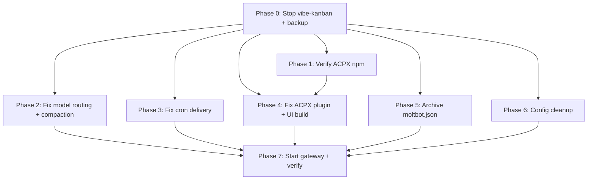

# OpenClaw Health Audit Remediation

## Enhancement Summary

**Deepened on:** 2026-04-08
**Research agents used:** Deployment Verification, Security Sentinel, Architecture Strategist, Adversarial Reviewer, Best Practices Researcher, Coherence Reviewer

### Critical Corrections from Deepening

1. **Model ID prefix RESOLVED**: Live error logs prove bare `minimax/minimax-m2.7` fails with `model_not_found`. All OpenRouter-routed models MUST use the `openrouter/` prefix: `openrouter/minimax/minimax-m2.7`, `openrouter/qwen/qwen3.6-plus`. (Deployment Verification)
2. **JSON paths were WRONG**: Cron job models live at `payload.model` and `payload.fallbacks`, not top-level fields. Fixed throughout. (Adversarial Review)
3. **Phase reordering**: All config edits now happen while gateway is stopped (Phases 0→2→3→4→5→6→7-start). Single gateway start at the end. Eliminates restart accumulation and cron-fires-with-broken-config risk. (Architecture + Adversarial)
4. **Orphan MCP processes**: vibe-kanban has a separate MCP process tree (PIDs 2156698+) not managed by systemd. Must be killed explicitly. (Deployment Verification)
5. **`Rappel virement EJM Ava` has `deleteAfterRun: true`**: Fires 2026-04-09T07:00Z — unrecoverable if missed. Hard deadline. (Deployment Verification + Adversarial)
6. **`softThresholdTokens: 4000` is a confirmed typo**: Fix to `80000` promoted from Phase 6 to Phase 2. (Architecture + Adversarial)
7. **Backup files persist secrets**: Pre-remediation backups contain API keys. Added chmod 600 + post-verification cleanup. (Security Sentinel)
8. **JSON validation after every edit**: Added `python3 -m json.tool` step after each config change. (Adversarial)
9. **`state.consecutiveErrors` must be zeroed**: Exact JSON path identified. (Adversarial + Deployment)
10. **Dependency graph corrected**: P4 (ACPX) and P6 (config cleanup) depend on P1, not P2. (Coherence)

### New Considerations Discovered

- **Swap fully exhausted** (1.0Gi/1.0Gi) — vibe-kanban uses ~400MB. Must verify swap recovery before `pnpm install`. (Deployment)
- **`StartLimitBurst=5`** on the gateway — multiple restarts risk hitting the limit. Added `reset-failed` to rollback. (Adversarial + Best Practices)
- **Root cause attribution is circumstantial** — 63-second gap between context overflow and SIGTERM. May be OOM, not just vibe-kanban. Add diagnostic check. (Adversarial)
- **Systemd hardening recommended**: `WatchdogSec=60`, `StartLimitIntervalSec=300` in `[Unit]`, `RefuseManualStop=yes`. (Best Practices)
- **`gpt` alias may route through OpenRouter** (wrong provider) — explains the 404. Needs investigation. (Architecture)

---

## Summary

The OpenClaw Telegram bot ("Clawd") has been down since 2026-04-07T23:59:50 UTC (~10h+ downtime). Root cause: the decommissioned `vibe-kanban` service issued a `systemctl --user stop` on the gateway without a subsequent restart (attribution is circumstantial — context overflow 63s prior may have contributed via memory pressure). Compounding issues: decommissioned model (`qwen/qwen3.6-plus:free`) in primary config and 4 cron jobs, broken delivery targets, failed plugin loading, and config drift.

This plan remediates all 16 issues identified in the health audit. **Revised execution strategy**: all config edits happen while the gateway is stopped, with a single start at the end. This eliminates the risk of cron jobs firing with broken config between phases.

**Key decisions carried forward from brainstorm:**
- Three-tier model routing: `openai-codex/gpt-5.4` → `openrouter/minimax/minimax-m2.7` → `openrouter/qwen/qwen3.6-plus` (see brainstorm: Phase 2)
- OpenRouter allowlist: only `minimax/minimax-m2.7` and `qwen/qwen3.6-plus` (see brainstorm: Model Routing Rules)
- Telegram delivery: user's direct chat ID `183115134` (see brainstorm: Key Decisions)
- ACPX plugin: must be rebuilt, not removed (see brainstorm: Resolved Questions #2)
- Canonical name: "openclaw" (see brainstorm: Resolved Questions #3)
- Model aliases: only `gpt`, `minimax`, `qwen` — decommission `opus` and `sonnet` (see brainstorm: Resolved Questions #4)

**Hard deadline:** `Rappel virement EJM Ava` fires 2026-04-09T07:00Z with `deleteAfterRun: true`. Gateway must be running with correct delivery config before then, or the 720 EUR transfer reminder is lost.

## Issue Registry

| # | Priority | Issue | Phase |
|---|----------|-------|-------|
| 1 | P0 | Gateway is dead (inactive since Apr 7 23:59:50 UTC) | 7 |
| 2 | P1 | `qwen/qwen3.6-plus:free` decommissioned — primary model in config | 2 |
| 3 | P1 | `minimax/minimax-m2.7` "Unknown model" in some fallback chains | 2 |
| 4 | P1 | `openai-codex/gpt-5.4` rate-limited, fallback chain broken | 2 |
| 5 | P1 | `gpt` alias gets "404 No endpoints" via OpenRouter | 2 |
| 6 | P1 | Daily Second-Brain Routine — 5 consecutive errors | 2 |
| 7 | P1 | ByteRover Knowledge Miner — `@heartbeat` delivery unresolvable | 3 |
| 8 | P1 | Readwise Vault Ingest — missing delivery chatId | 3 |
| 9 | P1 | `acpx` plugin fails to load, retries ~10x per startup | 4 |
| 10 | P2 | Control UI build fails (Node v18 vs v22 mismatch) | 6 |
| 11 | P2 | Daily Knowledge Compile — edit operation failed | 6 |
| 12 | P2 | Dual config files with version skew | 5 |
| 13 | P2 | Systemd ExecStart points to legacy `moltbot` path | 5 |
| 14 | P2 | Context overflow — sessions grow unbounded | 2 |
| 15 | P3 | `plugins.allow` empty — auto-load without allowlist | 6 |
| 16 | P3 | Browser CDP URL hardcoded to MacBook | 6 |

## Phased Remediation Plan

> **Revised execution order**: All config/build work happens while gateway is stopped. Single gateway start at Phase 7. This prevents cron jobs from firing with broken configs between phases.

### Phase 0: Stop Root Cause — Prune vibe-kanban

> **Why reordered from brainstorm Phase 7 → Phase 0:** SpecFlow analysis identified that vibe-kanban is STILL `active running` and enabled in `default.target.wants`. Restarting the gateway without stopping vibe-kanban risks the same failure mode recurring.

**Pre-flight: Diagnostic check (root cause verification)**

```bash
# Check for OOM kills around the time of the gateway stop
journalctl -k --since "2026-04-07 23:55" --until "2026-04-08 00:05" --no-pager | grep -i "oom\|killed\|memory"

# Check if gateway has MemoryMax set
systemctl --user show openclaw-gateway.service -p MemoryMax

# Check current swap state
free -h | grep Swap
```

> Document findings — this helps determine if vibe-kanban was the sole cause or if memory pressure contributed.

**Pre-flight: Backup all configs**

```bash
cp ~/.openclaw/openclaw.json ~/.openclaw/openclaw.json.bak.pre-remediation
cp ~/.openclaw/moltbot.json ~/.openclaw/moltbot.json.bak.pre-remediation
cp ~/.openclaw/cron/jobs.json ~/.openclaw/cron/jobs.json.bak.pre-remediation

# Restrict backup permissions (contain API keys)
chmod 600 ~/.openclaw/*.bak.pre-remediation
chmod 600 ~/.openclaw/cron/*.bak.pre-remediation
```

**Stop and disable vibe-kanban:**

```bash
# Stop the systemd-managed service
systemctl --user stop vibe-kanban.service
systemctl --user disable vibe-kanban.service

# Kill orphan MCP processes (not managed by systemd)
pkill -f 'vibe-kanban' || true
sleep 2
pkill -9 -f 'vibe-kanban' || true

# Remove unit file and backups
rm -f ~/.config/systemd/user/vibe-kanban.service
rm -f ~/.config/systemd/user/vibe-kanban.service.bak.*

# Remove binary and backup
rm -f ~/.local/bin/vibe-kanban-run
rm -f ~/.local/bin/vibe-kanban-run.bak.*

# Scan vibe-kanban npx cache for secrets before cleanup
grep -rn "sk-\|bot[0-9]\|apiKey\|api_key\|secret" ~/.npm/_npx/90c63a2a31a194e7/ 2>/dev/null | head -5
grep -rn "sk-\|bot[0-9]\|apiKey\|api_key\|secret" ~/.npm/_npx/40e7b452a840e14d/ 2>/dev/null | head -5

# Reload systemd to forget the unit
systemctl --user daemon-reload
```

**Full artifact inventory to prune:**

| Artifact | Path | Status |
|----------|------|--------|
| Systemd unit | `~/.config/systemd/user/vibe-kanban.service` | Active, enabled |
| Wants symlink | `~/.config/systemd/user/default.target.wants/vibe-kanban.service` | Auto-removed by disable |
| Unit backups (3) | `~/.config/systemd/user/vibe-kanban.service.bak.*` | On disk |
| Binary | `~/.local/bin/vibe-kanban-run` | On disk |
| Binary backup | `~/.local/bin/vibe-kanban-run.bak.*` | On disk |
| npx cache | `~/.npm/_npx/90c63a2a31a194e7/` (v0.0.148) | On disk |
| npx cache (MCP) | `~/.npm/_npx/40e7b452a840e14d/` (v0.0.155) | On disk |
| Data directory | `~/.vibe-kanban/` | Does NOT exist (verified) |

**Verification:**

```bash
systemctl --user status vibe-kanban.service 2>&1 | grep -q "not-found\|could not be found" && echo "PASS: unit gone" || echo "FAIL"
pgrep -f vibe-kanban && echo "FAIL: processes still running" || echo "PASS: no processes"
ss -ltnp | grep 3333 && echo "WARN: port 3333 still bound" || echo "PASS: port freed"
free -h | grep Swap  # Expect ~400MB freed
```

**Files to edit:** None (all shell commands)

---

### Phase 1: Verify ACPX npm package availability (pre-check for Phase 4)

```bash
# Verify acpx@0.5.1 is published before committing to the install path
npm view acpx versions --json 2>/dev/null | grep -q "0.5.1" && echo "PASS: 0.5.1 available" || echo "FAIL: need GitHub pin fallback"
```

> If `0.5.1` is not available, prepare the GitHub commit pin flow from `extensions/acpx/AGENTS.md` before continuing.

**Files to edit:** None

---

### Phase 2: Fix Model Routing + Compaction (Issues #2, #3, #4, #5, #6, #14 — P1)

> Gateway is still stopped. All edits are cold config changes.

#### 2a. Fix primary config (`~/.openclaw/openclaw.json`)

| Config path | Current value | New value |
|-------------|--------------|-----------|
| `agents.defaults.model.primary` | `qwen/qwen3.6-plus:free` | `openai-codex/gpt-5.4` |
| `agents.defaults.model.fallbacks` | `["qwen/qwen3.6-plus"]` | `["openrouter/minimax/minimax-m2.7", "openrouter/qwen/qwen3.6-plus"]` |
| `agents.defaults.models.opus` | `anthropic/claude-opus-4-6` | **DELETE** (decommissioned alias) |
| `agents.defaults.models.sonnet` | `anthropic/claude-sonnet-4-6` | **DELETE** (decommissioned alias) |
| `agents.defaults.models.gpt` | `openai-codex/gpt-5.4` | `openai-codex/gpt-5.4` (keep) |
| `agents.defaults.models.minimax` | `openrouter/minimax/minimax-m2.7` | `openrouter/minimax/minimax-m2.7` (keep — already has prefix) |
| `agents.defaults.models.qwen` | *(missing)* | `openrouter/qwen/qwen3.6-plus` **(ADD)** |
| `agents.defaults.heartbeat.model` | `minimax` | `minimax` (keep — resolves via alias) |
| `agents.defaults.subagents.model` | `minimax` | `minimax` (keep — resolves via alias) |
| `agents.list[0].model` (main agent) | `openai-codex/gpt-5.4` | `openai-codex/gpt-5.4` (keep) |

> **Model ID prefix (RESOLVED):** Live error logs from Daily Second-Brain Routine confirm `minimax/minimax-m2.7: Unknown model (model_not_found)`. The `openrouter/` prefix IS required for all models routed through OpenRouter. All fallback chains must use `openrouter/minimax/minimax-m2.7` and `openrouter/qwen/qwen3.6-plus`.

#### 2b. Fix compaction threshold (promoted from Phase 6)

| Config path | Current value | New value |
|-------------|--------------|-----------|
| `compaction.memoryFlush.softThresholdTokens` | `4000` | `80000` |

> Confirmed typo: `moltbot.json` has `80000`, `openclaw.json` has `4000`. The 4000-token threshold causes excessive compaction attempts that likely contributed to the context overflow crash. Fix in the same config edit pass.

#### 2c. Fix cron job models (`~/.openclaw/cron/jobs.json`)

> **CRITICAL PATH NOTE:** Cron job models are at `payload.model` and `payload.fallbacks` — NOT top-level fields.

**Jobs with decommissioned primary model:**

| Job name | Path: `payload.model` | New value | Path: `payload.fallbacks` | New value |
|----------|----------------------|-----------|--------------------------|-----------|
| Daily Second-Brain Routine | `qwen/qwen3.6-plus:free` | `openrouter/minimax/minimax-m2.7` | `["qwen/qwen3.6-plus"]` | `["openrouter/qwen/qwen3.6-plus"]` |
| Weekly Second-Brain Review | `qwen/qwen3.6-plus:free` | `openrouter/minimax/minimax-m2.7` | `["minimax/minimax-m2.7", "qwen/qwen3.6-plus"]` | `["openrouter/qwen/qwen3.6-plus"]` |
| Daily Note Prep | `qwen/qwen3.6-plus:free` | `openrouter/minimax/minimax-m2.7` | `["minimax/minimax-m2.7", "qwen/qwen3.6-plus"]` | `["openrouter/qwen/qwen3.6-plus"]` |
| ByteRover Knowledge Miner | `qwen/qwen3.6-plus:free` | `openrouter/minimax/minimax-m2.7` | `["minimax/minimax-m2.7", "qwen/qwen3.6-plus"]` | `["openrouter/qwen/qwen3.6-plus"]` |

**Jobs using `gpt` alias (need fallbacks added):**

| Job name | `payload.model` | `payload.fallbacks` (add) |
|----------|-----------------|--------------------------|
| Daily Assistant Friction Scan | `gpt` (keep) | `["openrouter/minimax/minimax-m2.7", "openrouter/qwen/qwen3.6-plus"]` |
| Weekly Assistant Kaizen Review | `gpt` (keep) | `["openrouter/minimax/minimax-m2.7", "openrouter/qwen/qwen3.6-plus"]` |
| Monthly Assistant Kaizen Review | `gpt` (keep) | `["openrouter/minimax/minimax-m2.7", "openrouter/qwen/qwen3.6-plus"]` |

> **`gpt` alias investigation needed:** The 404 error ("No endpoints available matching your guardrail restrictions") suggests `openai-codex/gpt-5.4` may be routing through OpenRouter instead of direct OpenAI. Check `auth.profiles` to determine if `gpt` resolves via `openai-codex:default` (correct — direct OAuth) or `openrouter:default` (wrong — OpenRouter blocks it). If the latter, either fix OpenRouter privacy settings at https://openrouter.ai/settings/privacy or switch these jobs to `openrouter/minimax/minimax-m2.7` primary.

#### 2d. Zero consecutive error counters

Reset `state.consecutiveErrors` to `0` for all affected jobs in `jobs.json`:

| Job name | Current `state.consecutiveErrors` | Set to |
|----------|----------------------------------|--------|
| Daily Second-Brain Routine | `5` | `0` |
| ByteRover Knowledge Miner | `2` | `0` |
| Daily Knowledge Compile | `1` | `0` |
| Readwise Vault Auto-Ingest | `1` | `0` |
| Daily Assistant Friction Scan | `1` | `0` |

#### 2e. Validate JSON after edits

```bash
python3 -m json.tool ~/.openclaw/openclaw.json > /dev/null && echo "PASS: valid JSON" || echo "FAIL: syntax error"
python3 -m json.tool ~/.openclaw/cron/jobs.json > /dev/null && echo "PASS: valid JSON" || echo "FAIL: syntax error"
```

**Files to edit:** `~/.openclaw/openclaw.json`, `~/.openclaw/cron/jobs.json`

---

### Phase 3: Fix Cron Delivery Targets (Issues #7, #8 — P1)

> **Expanded scope from SpecFlow + Deployment Verification:** 4 jobs need delivery fixes.

**Pre-check: Validate chat ID is reachable** (before writing it to 4 jobs):

```bash
cd /home/codex/projects/moltbot && node dist/index.js message send --to 183115134 --text "Health audit: delivery target validation"
# If this fails, the chat ID is wrong — do not proceed
```

> Note: This requires the gateway to be running briefly. If it cannot be started yet, defer this check to Phase 7 verification.

All delivery edits are in `~/.openclaw/cron/jobs.json` at each job's `delivery` object:

| Job name | Current delivery | Fix |
|----------|-----------------|-----|
| ByteRover Knowledge Miner | `channel: "last"`, no `to` | Set `channel: "telegram"`, add `to: "183115134"` |
| Readwise Vault Auto-Ingest | `channel: "telegram"`, no `to` | Add `to: "183115134"` |
| Reminder: leave for Dr Garcon | `channel: "telegram"`, no `to` | Add `to: "183115134"` |
| **Rappel virement EJM Ava** | `mode: "announce"`, no `channel`/`to` | Add `channel: "telegram"`, `to: "183115134"` |

> **HARD DEADLINE:** "Rappel virement EJM Ava" fires 2026-04-09T07:00Z with `deleteAfterRun: true`. If not fixed + gateway running before then, the 720 EUR reminder is permanently lost.

**Validate JSON after edits:**

```bash
python3 -m json.tool ~/.openclaw/cron/jobs.json > /dev/null && echo "PASS" || echo "FAIL"
```

### Research Insights: Cron Delivery

**Best practice — eliminate `channel: "last"` as policy:** The `"last"` default is a framework fallback for interactive sessions, never valid for cron jobs. Isolated sessions have no prior channel context, so `"last"` resolves to nothing. Enforce explicit `channel` and `to` on all enabled cron jobs. (Architecture Strategist)

**Best practice — startup validation sweep:** At gateway boot, validate every enabled job's `delivery.to` resolves to a reachable Telegram chat and every `payload.model` exists in the allowlist. This single check would have caught 4 of the 5 current failure modes. (Best Practices Researcher)

**Files to edit:** `~/.openclaw/cron/jobs.json`

---

### Phase 4: Fix ACPX Plugin (Issue #9 — P1)

> Gateway is still stopped. Build work only.

**Root cause:** `extensions/acpx/package.json` requires `acpx@0.5.1` but installed version is `0.3.0`. The `0.3.0` dist structure does not have `runtime.js`.

**Pre-check: Verify swap recovered after Phase 0:**

```bash
free -h | grep Swap
# Swap usage should have dropped ~400MB after killing vibe-kanban
# If still near 100%, the pnpm install/build may OOM — investigate before proceeding
```

**Fix sequence** (per `extensions/acpx/AGENTS.md`):

```bash
cd /home/codex/projects/moltbot

# 1. Install correct acpx version
pnpm install --filter ./extensions/acpx

# 2. Verify correct version installed
grep '"version"' extensions/acpx/node_modules/acpx/package.json
# Should show "0.5.1"

# 3. Verify runtime.js exists
ls extensions/acpx/node_modules/acpx/dist/runtime.js

# 4. Rebuild dist (re-bundles extensions)
pnpm build

# 5. Pre-build Control UI while we're at it (Issue #10, saves a Phase 6 step)
pnpm ui:build
```

> **Fallback if `acpx@0.5.1` is not published on npm:** Follow the GitHub commit pin flow documented in `extensions/acpx/AGENTS.md`. Phase 1 pre-check should have determined this already.

**Files to edit:** None directly (install + build commands). If `acpx@0.5.1` requires a version pin update, edit `extensions/acpx/package.json`.

---

### Phase 5: Naming and Config Canonicalization (Issues #12, #13 — P2)

#### 5a. Reconcile then archive legacy `moltbot.json`

> **Architecture Strategist recommendation:** Do not merely archive — first diff and port any meaningful divergent values to `openclaw.json`. The `softThresholdTokens: 80000` is already fixed in Phase 2. Check for other intentional differences.

```bash
# Diff the two configs to find remaining divergences
diff <(jq --sort-keys . ~/.openclaw/openclaw.json) <(jq --sort-keys . ~/.openclaw/moltbot.json) | head -50
```

After reconciling any remaining values:

```bash
# Archive (do not delete — preserve for reference)
mv ~/.openclaw/moltbot.json ~/.openclaw/moltbot.json.archived-2026-04-08
```

> **Security note:** The archived file contains API keys. After Phase 7 verification passes (48h), either delete it or redact secrets. (Security Sentinel)

#### 5b. Update systemd ExecStart path (low priority)

Current: `ExecStart=...node /home/codex/projects/moltbot/dist/index.js gateway --port 18789`

> **Recommendation: Option A (leave as-is).** The path works. A rename risks breaking other references. Add a comment to the unit file documenting the legacy name. Revisit when the moltbot directory is actually renamed. (Architecture Strategist)

**Files to edit:** `~/.openclaw/moltbot.json` (archive)

---

### Phase 6: Config Cleanup (Issues #10, #11, #15, #16 — P2/P3)

#### 6a. Control UI build (Issue #10)

Already handled in Phase 4 (`pnpm ui:build`). If it fails there, investigate:
- The gateway subprocess finds `/usr/bin/node` (v18) instead of mise-managed Node 22
- The systemd PATH includes the correct node, but child processes may not inherit it

#### 6b. Fix Daily Knowledge Compile (Issue #11)

The target file EXISTS (13587 bytes, last modified Apr 7). The error is a content-matching issue in the edit operation, not a missing file. Lower-priority investigation.

```bash
ls -la ~/second-brain/projects/uplix-automation/onboarding/arnaud-mirocha.md
```

#### 6c. Set `plugins.allow` (Issue #15)

Add `allow` key INSIDE the existing `plugins` object in `~/.openclaw/openclaw.json`:

```json
"allow": ["telegram", "byterover", "byterover-onboarding", "openrouter", "anthropic", "openai", "memory-core", "minimax", "qwen", "acpx"]
```

> **`browser` removed from allowlist** until Issue #16 is resolved (CDP URL points to unreachable MacBook). (Security Sentinel)

> **Architecture note:** For a single-user homelab, the security benefit of `plugins.allow` is minimal. The existing `plugins.entries` with per-plugin `enabled` flags provides adequate control. This is a strictness preference, not a critical fix. (Architecture Strategist)

**Validate JSON after edit:**

```bash
python3 -m json.tool ~/.openclaw/openclaw.json > /dev/null && echo "PASS" || echo "FAIL"
```

#### 6d. Browser CDP URL (Issue #16)

`macbook-pro-de-lonard.taildabf2.ts.net:18791` — only works when Mac is on Tailscale. Browser plugin removed from `plugins.allow` in 6c. Optionally also disable in `plugins.entries.browser.enabled: false`.

**Files to edit:** `~/.openclaw/openclaw.json`

---

### Phase 7: Start Gateway and Verify (Issue #1 — P0)

> All config edits are complete. Single gateway start with all fixes applied.

```bash
# If systemd unit was edited in Phase 5b, reload first:
# systemctl --user daemon-reload

systemctl --user start openclaw-gateway.service
sleep 20
```

**Verification checklist:**

| Check | Command | Expected |
|-------|---------|----------|
| Service active | `systemctl --user is-active openclaw-gateway.service` | `active` |
| Port listening | `ss -ltnp \| grep 18789` | Bound on 127.0.0.1:18789 |
| No crash loop | `systemctl --user show openclaw-gateway.service -p NRestarts` | `NRestarts=0` |
| Telegram round-trip | Send test message to @Clawdbot_LSbot | Response received |
| ACPX loaded | `journalctl --user -u openclaw-gateway.service --since "2 min ago" \| grep -i acpx` | No "Cannot find module" errors |
| No decommissioned models | `grep -r "qwen3.6-plus:free" ~/.openclaw/openclaw.json ~/.openclaw/cron/jobs.json` | No matches |
| No decommissioned aliases | `grep -E '"opus"\|"sonnet"' ~/.openclaw/openclaw.json` | No matches in models section |
| `qwen` alias exists | `grep '"qwen"' ~/.openclaw/openclaw.json` | Present in models |
| plugins.allow set | `python3 -c "import json; d=json.load(open('$HOME/.openclaw/openclaw.json')); print(len(d['plugins']['allow']), 'plugins allowed')"` | 10 plugins |
| vibe-kanban gone | `systemctl --user status vibe-kanban.service 2>&1` | `Unit not found` |
| Control UI built | Check logs for "Control UI build failed" | No error |
| Delivery targets valid | See Python script below | All OK |
| Compaction threshold | `python3 -c "import json; d=json.load(open('$HOME/.openclaw/openclaw.json')); print(d['compaction']['memoryFlush']['softThresholdTokens'])"` | `80000` |

**Delivery target sweep:**

```bash
python3 -c "
import json
with open('$HOME/.openclaw/cron/jobs.json') as f:
    data = json.load(f)
for j in data['jobs']:
    if not j.get('enabled', False): continue
    d = j.get('delivery', {})
    if d.get('mode') == 'announce':
        has_channel = 'channel' in d and d['channel'] != 'last'
        has_to = 'to' in d
        status = 'OK' if (has_channel and has_to) else 'MISSING'
        print(f'{status}: {j[\"name\"]} -> channel={d.get(\"channel\",\"NONE\")} to={d.get(\"to\",\"NONE\")}')
"
```

**Cron delivery test:**

```bash
cd /home/codex/projects/moltbot && node dist/index.js cron trigger --job "db190559-58f6-49c2-9389-ce6b0df91026"
# ByteRover Knowledge Miner — confirm message arrives on Telegram
```

**Ongoing monitoring (next 48h):**

| Window | Check | Method |
|--------|-------|--------|
| +1h | No crash loop | `systemctl --user show openclaw-gateway.service -p NRestarts` |
| +1h | No model errors | `journalctl --user -u openclaw-gateway.service --since "1 hour ago" \| grep -i "model_not_found\|Unknown model"` |
| Apr 9 07:00 UTC | `Rappel virement EJM Ava` delivers | Check Telegram for 720 EUR reminder |
| Apr 8 21:00 CEST | Daily Second-Brain fires | Check Telegram |
| Apr 9 05:00 CEST | Daily Note Prep fires | Check Telegram |
| +24h | All cron jobs green | `grep '"consecutiveErrors"' ~/.openclaw/cron/jobs.json` — all should be 0 |
| +24h | No swap exhaustion | `free -h \| grep Swap` — well under 1.0Gi |
| +48h | Close deployment | All checks green → cleanup below |

**Post-verification cleanup (after 48h stable):**

```bash
# Remove pre-remediation backups (contain API keys)
rm ~/.openclaw/openclaw.json.bak.pre-remediation
rm ~/.openclaw/moltbot.json.bak.pre-remediation
rm ~/.openclaw/cron/jobs.json.bak.pre-remediation

# Delete or redact archived moltbot.json
rm ~/.openclaw/moltbot.json.archived-2026-04-08
```

## Rollback Plan

**Config rollback:**
```bash
# Reset failed state first (StartLimitBurst=5 may be exhausted)
systemctl --user reset-failed openclaw-gateway.service

cp ~/.openclaw/openclaw.json.bak.pre-remediation ~/.openclaw/openclaw.json
cp ~/.openclaw/cron/jobs.json.bak.pre-remediation ~/.openclaw/cron/jobs.json
systemctl --user restart openclaw-gateway.service
```

> Note: Rolling back restores the decommissioned model as primary, so the bot will still fail on model routing. Rollback is for cases where the remediation introduces NEW failures, not for reverting to the pre-audit state.

> **Consider:** After Phase 2 completes successfully, take a second checkpoint backup (`*.bak.post-model-fix`). This provides a safer rollback target that has working model routing.

**vibe-kanban rollback:** Not applicable — vibe-kanban is decommissioned. Do not re-enable.

## Open Questions

1. ~~**Model ID prefix:**~~ **RESOLVED.** Live error logs prove `openrouter/` prefix is required. Use `openrouter/minimax/minimax-m2.7` and `openrouter/qwen/qwen3.6-plus` everywhere.

2. ~~**Compaction threshold:**~~ **RESOLVED.** `softThresholdTokens: 4000` is a confirmed typo. Fix to `80000` in Phase 2.

3. **Context overflow root cause:** Did the context overflow at 23:58:46 contribute to the gateway stop at 23:59:49 via memory pressure? The 63-second gap + full swap (1.0Gi/1.0Gi) is suspicious. Phase 0 diagnostics may clarify. Even if vibe-kanban was the proximate cause, the compaction threshold fix (Phase 2) addresses the contributing factor.

4. **`gpt` alias via OpenRouter:** The "Daily Assistant Friction Scan" 404 error suggests `openai-codex/gpt-5.4` is being routed through OpenRouter's privacy filter. Either adjust OpenRouter privacy at https://openrouter.ai/settings/privacy to allow `openai-codex/gpt-5.4`, or verify that the `gpt` alias resolves via the direct `openai-codex:default` OAuth profile (not through OpenRouter). If it goes through OpenRouter, switch these jobs to `openrouter/minimax/minimax-m2.7` primary.

## Dependencies



> **Note:** Phases 2, 3, 4, 5, 6 can run in any order after Phase 0. All must complete before Phase 7 (single gateway start).

## Future Hardening (post-remediation)

These are not part of the current remediation but were surfaced by the research agents:

### Systemd Service Hardening (Best Practices Researcher)

```ini
[Unit]
StartLimitIntervalSec=300
StartLimitBurst=10
# Current: 5 starts in 10s — too tight for operational restarts

[Service]
WatchdogSec=60
# Requires sd-notify integration in the gateway app
# npm install sd-notify; call notify.ready() after init + notify.watchdog() on interval

RefuseManualStop=yes
# Prevents external processes from issuing systemctl stop (speed bump, not wall)
```

### Cron Job Reliability (Best Practices Researcher)

- **Consecutive error alerting**: Alert to Telegram when `consecutiveErrors > 3`
- **Dead-letter queue**: When all model fallbacks exhaust, write payload to `~/.openclaw/cron/dead-letters/` for manual replay
- **Never use `:free` tier models**: Free tiers get decommissioned without warning

### Config Safety (Adversarial Reviewer + Best Practices)

- **Atomic JSON writes**: Use `write-file-atomic` npm package for config saves
- **Startup validation sweep**: At boot, validate all cron job models and delivery targets against allowlists

## Sources

- **Brainstorm:** `docs/brainstorms/2026-04-08-openclaw-health-audit-brainstorm.md` — all 16 issues, phased remediation plan, key decisions on model routing/naming/aliases
- **Repo research:** Config structure at `~/.openclaw/openclaw.json`, systemd unit, cron jobs store, plugin discovery flow, ACPX extension guide
- **SpecFlow analysis:** Phase reordering (vibe-kanban → Phase 0), expanded delivery scope (4 jobs not 2), ACPX version mismatch root cause
- **Deployment Verification:** Go/No-Go checklist, orphan MCP processes, model prefix resolution, `deleteAfterRun` risk, swap state, exact cron job IDs
- **Security Sentinel:** Backup secret persistence (HIGH), archived config secrets (HIGH), plugins.allow review, credential scanning
- **Architecture Strategist:** Config reconciliation before archive, cron-fires-while-starting risk, `gpt` alias routing investigation, `channel: "last"` policy
- **Adversarial Reviewer:** JSON path corrections (`payload.model`), JSON validation steps, restart consolidation, `StartLimitBurst` risk, `state.consecutiveErrors` zeroing, root cause challenge
- **Best Practices Researcher:** Systemd `WatchdogSec`/`StartLimitIntervalSec` (in `[Unit]`), `sd-notify`, `RefuseManualStop`, atomic JSON writes, cron startup validation
- **Coherence Reviewer:** Dependency graph corrections, `gpt` alias contradiction, `moltbot.json` "files to edit" mischaracterization
- **Auto-memory:** `project_openclaw_model_routing.md`, `project_openclaw_architecture.md`, `project_vibe_kanban_decommissioned.md`
