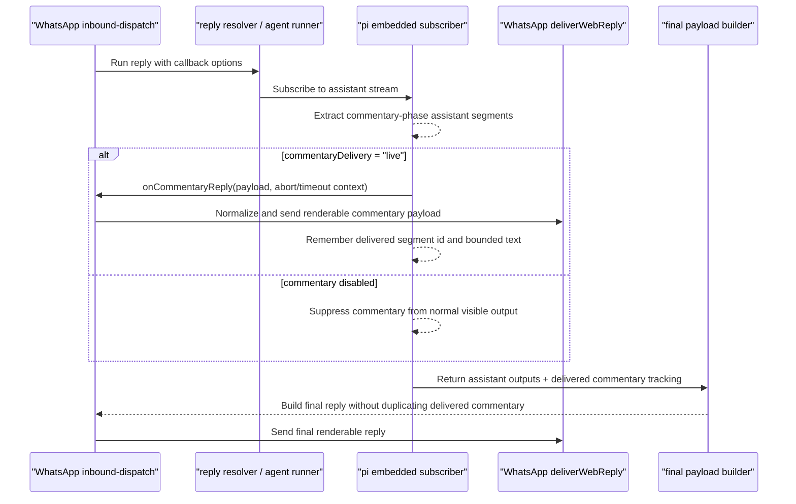

# feat: Rebase WhatsApp live commentary delivery

## Summary

Port the closed WhatsApp live-commentary PR back onto current `main` by using `codex/whatsapp-commentary-main-clean` as the donor branch, adapting the old delivery wiring to the current `extensions/whatsapp/src/auto-reply/monitor/inbound-dispatch.ts` architecture, and preserving the newer final-answer and block-streaming behavior already present on `main`.

---

## Problem Frame

PR #57484 closed before landing, but the underlying behavior gap still exists on current `main`: WhatsApp auto-replies suppress assistant commentary-phase output instead of optionally delivering it live to the user. The old branch cannot be replayed mechanically because `main` has since moved WhatsApp delivery responsibility, generated drift artifacts, and several runner fallback paths.

---

## Assumptions

_This plan was authored without a separate synchronous scope-confirmation step. The items below are planning assumptions to review before implementation proceeds._

- The revived work should use `codex/whatsapp-commentary-main-clean` as the donor branch instead of the single-commit `codex/whatsapp-commentary-pr-reset` branch because it includes the original PR plus later review and safety fixes.
- WhatsApp live commentary should remain opt-in through `channels.whatsapp.commentaryDelivery` / account-level `commentaryDelivery`, with the effective default behaving as `"off"`.
- The implementation should revive the product behavior, not preserve the exact old file-level patch shape. Current `main` architecture wins wherever the branch conflicts.
- The internal review note from `docs/internal/tristanmanchester/2026-03-30-pr-57289-review-followup.md` is not part of the revived user-facing PR unless a maintainer explicitly asks for it.

---

## Requirements

- R1. Users can opt into live WhatsApp delivery of assistant commentary-phase text while an agent is running.
- R2. When opt-in is absent or set to `"off"`, WhatsApp behavior remains unchanged: commentary-phase output is suppressed from outbound WhatsApp messages.
- R3. Live commentary delivery must not leak reasoning, tool updates, compaction notices, or non-renderable payloads.
- R4. Live commentary must not duplicate the final answer. Text already delivered as commentary should be tracked so final payload construction can omit the already-delivered prefix or segment while preserving any undelivered suffix.
- R5. The implementation must preserve current `main` fallback behavior for final assistant text, including `lastAssistant`, media-related fallbacks, and current failure-acknowledgement handling.
- R6. Commentary delivery must be bounded: segment identifiers, retained delivered-segment tracking, callback timeout behavior, and abort cleanup must not grow unbounded or hang the run indefinitely.
- R7. WhatsApp config, schema help, labels, generated config metadata, and validation coverage must remain aligned with the new config field.
- R8. Public Plugin SDK reply-runtime exports must remain consistent with the new callback/context surface and the current tracked API-baseline hash workflow.
- R9. Non-WhatsApp channels must not accidentally receive commentary callbacks or change their current streaming behavior.

---

## Scope Boundaries

- Do not mechanically rebase every file from the old branch; port only the still-relevant behavior onto the current `main` structure.
- Do not resurrect deleted local-only generated artifacts `docs/.generated/plugin-sdk-api-baseline.json` or `docs/.generated/plugin-sdk-api-baseline.jsonl`; current `main` tracks only `docs/.generated/plugin-sdk-api-baseline.sha256`.
- Do not resurrect `extensions/whatsapp/src/auto-reply/monitor/process-message.inbound-context.test.ts`; port useful assertions to the current `inbound-dispatch` test surface.
- Do not enable live commentary by default for existing WhatsApp users.
- Do not expand this work to Telegram, Discord, Slack, iMessage, Signal, web UI, or other channel parity beyond explicit regression coverage that confirms they are unchanged.
- Do not change WhatsApp inbound authorization, group mention gating, ack reactions, last-route behavior, or audio preflight behavior except where necessary to pass the new reply callback through the existing dispatch path.

### Deferred to Follow-Up Work

- User-facing docs for configuring WhatsApp live commentary can be handled in a separate docs PR if maintainers want the feature documented beyond schema help and labels.
- Broader channel parity for live commentary delivery should be planned separately after WhatsApp proves the callback and dedupe model.

---

## Context & Research

### Relevant Code and Patterns

- `codex/whatsapp-commentary-main-clean` contains the best donor history: six commits ending at `4ad996ebb1`, including review hardening for delivered-segment bounds, fallback preservation, and duplicate prevention.
- `extensions/whatsapp/src/auto-reply/monitor/inbound-dispatch.ts` is the current WhatsApp delivery owner on `main`. The old branch primarily wired commentary in `process-message.ts`, which is now the wrong integration point.
- `src/agents/pi-embedded-subscribe.handlers.messages.ts` currently detects `deliveryPhase === "commentary"` and returns early. That is the suppression point the revived feature must split into "suppress from normal visible output" and "optionally deliver through the commentary callback."
- `src/agents/pi-embedded-runner/run/payloads.ts` currently has newer fallback logic than the branch. The plan must fold delivered-commentary filtering into that current logic rather than replacing it with the branch version.
- `src/auto-reply/reply/reply-delivery.ts` currently supports `extractMarkdownImages`; the branch adds directive alias normalization. The final implementation must preserve both behaviors.
- `src/agents/pi-embedded-runner/run/AGENTS.md` says to prefer focused helper tests over full embedded-runner tests for expensive runner behavior. This favors helper-level coverage for payload filtering plus one targeted integration smoke where cross-layer behavior requires it.
- `docs/.generated/README.md` says full Plugin SDK API JSON/JSONL baselines are local-only and gitignored; only the `.sha256` state files are tracked.

### Institutional Learnings

- No relevant `docs/solutions/` entries are present in this checkout.

### External References

- External research is not needed for this plan. The behavior is internal to OpenClaw’s runner, Plugin SDK, config schema, and WhatsApp channel architecture, and the current repo already contains the relevant patterns.

---

## Key Technical Decisions

- Use the donor branch as reference material, not as a replay target: Current `main` has moved key responsibilities, so conflict resolution should favor current architecture and selectively port behavior.
- Wire WhatsApp commentary from `inbound-dispatch.ts`: This keeps final, block, tool, and commentary delivery decisions in the same WhatsApp dispatch layer and avoids duplicating delivery logic back into `process-message.ts`.
- Keep live commentary opt-in: Commentary is a high-noise messaging behavior and can expose intermediate assistant narration; preserving default-off behavior protects existing users.
- Reuse the existing `ReplyPayload` path for commentary: The donor branch already proves commentary can use the same payload/directive/media normalization pipeline, avoiding a separate WhatsApp-only message type.
- Track delivered commentary by bounded segment IDs plus bounded text memory: Segment IDs prevent final-answer duplication, and bounds prevent long-running sessions from growing unbounded state.
- Preserve current final-answer fallback ordering: The branch’s delivered-commentary filtering should become one layer in the existing `main` payload construction, not a replacement for the newer assistant text and media fallback handling.
- Treat Plugin SDK/API drift as intentional only if the public reply-runtime surface changes: If the implementation exports `COMMENTARY_REPLY_TIMEOUT_MS`, `onCommentaryReply`, or callback context types through `src/plugin-sdk/reply-runtime.ts`, update the current `.sha256` baseline workflow rather than restoring old JSON/JSONL artifacts.

---

## Open Questions

### Resolved During Planning

- Which local branch should be rebased? Use `codex/whatsapp-commentary-main-clean`; it contains the original PR plus review follow-up fixes.
- Should implementation target `process-message.ts` or `inbound-dispatch.ts`? Target `inbound-dispatch.ts`; current `main` centralizes buffered WhatsApp reply delivery there.
- Should deleted generated files be restored? No; current tracked Plugin SDK drift artifact is `docs/.generated/plugin-sdk-api-baseline.sha256`.

### Deferred to Implementation

- Exact shape of the smallest `inbound-dispatch` helper extraction: decide while editing, based on whether the existing `deliver` callback can be extended cleanly without making the function too large.
- Whether a dedicated `src/agents/pi-embedded-commentary.test.ts` is worthwhile in addition to subscriber tests: decide after porting the helper, based on how much behavior can be tested without the subscription harness.
- Exact generated artifact set after schema/API changes: regenerate through current repo scripts and commit only tracked files that actually change.

---

## High-Level Technical Design

> _This illustrates the intended approach and is directional guidance for review, not implementation specification. The implementing agent should treat it as context, not code to reproduce._

---

## Implementation Units

- U1. **Establish Commentary Segment Extraction**

**Goal:** Create or port the helper that extracts assistant commentary/final-answer text segments from current assistant messages with stable, bounded segment identifiers.

**Requirements:** R1, R3, R4, R6

**Dependencies:** None

**Files:**

- Create: `src/agents/pi-embedded-commentary.ts`
- Test: `src/agents/pi-embedded-commentary.test.ts`
- Reference: `src/agents/pi-embedded-helpers.ts`
- Reference: `src/agents/pi-embedded-utils.ts`

**Approach:**

- Port the donor helper’s `AssistantOutputEntry` / `AssistantOutputCandidate` concept onto current `main`.
- Preserve the donor branch’s safety improvements: bounded segment ID length, restricted segment ID character set, sanitization through current user-facing text helpers, and grouping of repeated signed text blocks.
- Treat `phase: "commentary"` and `phase: "final_answer"` as the only known assistant message phases for this feature.
- Keep helper behavior independent from WhatsApp so runner/subscriber tests can validate it without a channel harness.

**Execution note:** Implement helper tests before wiring the helper into subscriber state; this keeps failures local and avoids expensive full-runner tests for parser behavior.

**Patterns to follow:**

- `src/agents/pi-embedded-helpers.sanitizeuserfacingtext.test.ts`
- `src/agents/pi-embedded-subscribe.subscribe-embedded-pi-session.suppresses-commentary-phase-output.test.ts`
- Donor implementation in `codex/whatsapp-commentary-main-clean:src/agents/pi-embedded-commentary.ts`

**Test scenarios:**

- Happy path: assistant message with a signed commentary text block extracts one `commentary` segment with the signed ID and sanitized text.
- Happy path: assistant message with unsigned text blocks derives stable fallback segment IDs from the message ID and content ordinal.
- Happy path: repeated signed text blocks with the same ID and phase are grouped into one segment.
- Edge case: invalid, empty, or overlong segment signatures are ignored and fall back to generated segment IDs where possible.
- Edge case: mixed `commentary` and `final_answer` blocks remain separate segments and preserve phase.
- Error path: text containing thinking tags, downgraded tool-call text, or model special tokens is sanitized before becoming a deliverable segment.

**Verification:**

- Commentary extraction is deterministic for the same assistant message.
- Invalid IDs cannot create unbounded or unsafe tracking keys.
- Helper tests prove sanitization without requiring WhatsApp delivery.

---

- U2. **Add Subscriber Commentary Callback and Bounded Delivery Tracking**

**Goal:** Extend embedded session subscription so commentary-phase assistant output can be delivered through an optional callback while still being suppressed from the normal visible assistant stream.

**Requirements:** R1, R2, R3, R4, R6

**Dependencies:** U1, U4

**Files:**

- Modify: `src/agents/pi-embedded-subscribe.ts`
- Modify: `src/agents/pi-embedded-subscribe.types.ts`
- Modify: `src/agents/pi-embedded-subscribe.handlers.types.ts`
- Modify: `src/agents/pi-embedded-subscribe.handlers.messages.ts`
- Test: `src/agents/pi-embedded-subscribe.commentary.test.ts`
- Test: `src/agents/pi-embedded-subscribe.subscribe-embedded-pi-session.suppresses-commentary-phase-output.test.ts`
- Test: `src/agents/pi-embedded-subscribe.subscribe-embedded-pi-session.emits-block-replies-text-end-does-not.test.ts`

**Approach:**

- Add optional `onCommentaryReply` and timeout-related callback context to subscription params without changing behavior when the callback is absent.
- When a commentary-phase text event arrives, keep the existing suppression from normal visible output, but enqueue the segment for optional commentary delivery.
- Serialize commentary deliveries so WhatsApp receives updates in stream order, and ensure callback failures do not corrupt subscriber state or hang terminal lifecycle handling.
- Track delivered segment IDs and bounded delivered text snapshots so final-answer construction can avoid duplicating already-sent commentary.
- Preserve current subscriber state reset behavior from `main`, including replay, compaction, item tracking, deterministic approval, usage, and built-in-tool-name state.
- Abort or drain pending commentary delivery before terminal lifecycle completion so late callback resolution cannot outlive the run in a surprising way.

**Execution note:** Characterize current commentary suppression first, then add callback-specific tests. Keep the existing suppression test green for the no-callback path.

**Patterns to follow:**

- Current phase handling in `src/agents/pi-embedded-subscribe.handlers.messages.ts`
- Current block reply queue/drain behavior in `src/agents/pi-embedded-subscribe.ts`
- Donor commentary queue/tracking behavior in `codex/whatsapp-commentary-main-clean:src/agents/pi-embedded-subscribe.ts`

**Test scenarios:**

- Happy path: with `onCommentaryReply`, a commentary-phase segment is passed to the callback and not emitted as a normal assistant partial.
- Happy path: without `onCommentaryReply`, commentary-phase output remains suppressed exactly as current `main` behaves.
- Happy path: multiple commentary deltas with stable signatures are delivered in order and remembered as one delivered segment when appropriate.
- Edge case: final-answer phase output still flows through the normal block/final reply path and does not use `onCommentaryReply`.
- Edge case: delivered segment tracking is capped; when more than the maximum retained segment count is delivered, the oldest tracking entries are evicted.
- Edge case: stored delivered text is capped but original delivered text length is retained so suffix filtering can still reason about truncation.
- Error path: callback rejection is surfaced through existing logging/error handling but does not duplicate the final answer or prevent run cleanup.
- Error path: aborting a pending commentary callback prevents stale delivery from being marked as delivered.
- Integration: commentary callback delivery plus later final answer produces one commentary outbound payload and one final outbound payload without sending the commentary text twice.

**Verification:**

- Existing no-commentary behavior remains unchanged without the callback.
- Subscriber exposes delivered-commentary tracking to runner result construction.
- Terminal lifecycle still waits for or cancels bounded commentary delivery consistently.

---

- U3. **Preserve Final Payloads After Live Commentary**

**Goal:** Fold delivered-commentary tracking into the current runner result and final payload construction without regressing newer `main` fallback behavior.

**Requirements:** R4, R5, R6

**Dependencies:** U1, U2, U4

**Files:**

- Modify: `src/agents/pi-embedded-runner/run.ts`
- Modify: `src/agents/pi-embedded-runner/run/attempt.ts`
- Modify: `src/agents/pi-embedded-runner/run/params.ts`
- Modify: `src/agents/pi-embedded-runner/run/payloads.ts`
- Modify: `src/agents/pi-embedded-runner/run/types.ts`
- Modify: `src/agents/pi-embedded-runner.e2e.test.ts`
- Test: `src/agents/pi-embedded-runner/run/payloads.test.ts`
- Test: `src/agents/pi-embedded-runner/run/attempt.test.ts`

**Approach:**

- Thread `onCommentaryReply`, commentary timeout, assistant output segments, and delivered-commentary tracking through the current runner attempt types.
- In final payload construction, first respect current `main` final-answer/fallback logic, then filter or trim assistant output segments that have already been delivered as commentary.
- Preserve undelivered suffixes when a segment was partially delivered live.
- Avoid replacing current fallback behavior for media-only results, `lastAssistant`, `assistantTexts`, and user-facing failure acknowledgement.
- Keep full-runner coverage narrow per `src/agents/pi-embedded-runner/run/AGENTS.md`; prefer helper-level payload tests for filtering and a focused integration test only where callback-to-final result plumbing cannot be proven locally.

**Execution note:** Add payload filtering tests around `src/agents/pi-embedded-runner/run/payloads.ts` before modifying full attempt plumbing.

**Patterns to follow:**

- Current fallback chain in `src/agents/pi-embedded-runner/run/payloads.ts`
- Donor tests in `codex/whatsapp-commentary-main-clean:src/agents/pi-embedded-runner/run/payloads.test.ts`
- Runner test performance guidance in `src/agents/pi-embedded-runner/run/AGENTS.md`

**Test scenarios:**

- Happy path: delivered commentary segment is omitted from final text when the final answer repeats exactly the delivered segment.
- Happy path: if only a prefix of a commentary segment was delivered, final payload includes the undelivered suffix.
- Happy path: if no commentary was delivered, final payload remains identical to current `main` behavior.
- Edge case: delivered text snapshot is truncated but recorded original length is longer; final filtering avoids falsely dropping unknown text beyond the retained snapshot.
- Edge case: multiple delivered segment IDs are filtered without reordering remaining final text.
- Error path: failed or aborted commentary delivery is not marked delivered and is not replayed as final-answer text unless a delivered prefix snapshot proves there is an undelivered suffix.
- Integration: runner result exposes delivered-commentary metadata from subscriber state and final payload construction consumes it.

**Verification:**

- Final-answer behavior remains stable for existing non-commentary tests.
- Live commentary does not cause the final WhatsApp reply to repeat already-sent commentary.
- Payload tests cover the dedupe logic without depending on WhatsApp delivery.

---

- U4. **Expose Reply Runtime Callback Context Safely**

**Goal:** Add the reply-runtime types/constants needed for bounded commentary callback delivery while preserving current directive normalization behavior.

**Requirements:** R3, R6, R8

**Dependencies:** None

**Files:**

- Modify: `src/auto-reply/types.ts`
- Modify: `src/plugin-sdk/reply-runtime.ts`
- Modify: `src/auto-reply/reply/agent-runner-execution.ts`
- Modify: `src/auto-reply/reply/reply-delivery.ts`
- Test: `src/auto-reply/reply/agent-runner-execution.test.ts`
- Test: `src/auto-reply/reply/reply-delivery.test.ts`
- Test: `src/plugins/contracts/plugin-sdk-root-alias.test.ts`
- Generated: `docs/.generated/plugin-sdk-api-baseline.sha256`

**Approach:**

- Introduce the callback/context surface needed by the runner and WhatsApp dispatch layer, including timeout/abort context for commentary delivery.
- Export any public pieces through `src/plugin-sdk/reply-runtime.ts` only when they are meant for plugin-facing use.
- Preserve current `normalizeReplyPayloadDirectives` behavior, including `extractMarkdownImages`, while porting the donor branch’s directive alias normalization only where needed.
- Keep timeout constants centralized so WhatsApp delivery, subscriber waiting, and Plugin SDK exports do not drift.
- If the Plugin SDK public surface changes, regenerate the current tracked API baseline hash rather than restoring old local-only baseline JSON/JSONL files.

**Patterns to follow:**

- Existing `ReplyPayload` / `BlockReplyContext` usage in `src/auto-reply/types.ts`
- Current directive parser tests in `src/auto-reply/reply/reply-delivery.test.ts`
- Current Plugin SDK baseline workflow documented in `docs/.generated/README.md`

**Test scenarios:**

- Happy path: directive alias normalization maps supported alias syntax before parsing when explicitly enabled.
- Happy path: existing Markdown image extraction still works when `extractMarkdownImages` is enabled.
- Edge case: alias normalization is not applied when disabled, preserving current callers.
- Error path: aborted callback context is propagated to delivery code as an abort instead of being treated as a normal send failure.
- Integration: exported Plugin SDK reply-runtime surface includes only the intended new callback/timeout pieces and passes API baseline validation.

**Verification:**

- Existing reply directive tests continue to pass.
- Public Plugin SDK drift is intentional and represented by the tracked `.sha256` state file if it changes.
- No old JSON/JSONL generated baseline artifacts are staged.

---

- U5. **Port WhatsApp Config and Delivery Wiring to Current Inbound Dispatch**

**Goal:** Add WhatsApp opt-in config and wire live commentary delivery through the current `inbound-dispatch.ts` buffered reply flow.

**Requirements:** R1, R2, R3, R6, R7

**Dependencies:** U2, U3, U4

**Files:**

- Modify: `extensions/whatsapp/src/accounts.ts`
- Modify: `extensions/whatsapp/src/auto-reply/deliver-reply.ts`
- Modify: `extensions/whatsapp/src/auto-reply/monitor/inbound-dispatch.ts`
- Modify: `src/config/types.whatsapp.ts`
- Modify: `src/config/zod-schema.providers-whatsapp.ts`
- Modify: `src/config/schema.help.ts`
- Modify: `src/config/schema.labels.ts`
- Modify: `src/config/validation.allowed-values.test.ts`
- Generated: `src/config/bundled-channel-config-metadata.generated.ts`
- Generated: `docs/.generated/config-baseline.sha256`
- Test: `extensions/whatsapp/src/auto-reply/deliver-reply.test.ts`
- Test: `extensions/whatsapp/src/auto-reply/monitor/inbound-dispatch.test.ts`
- Reference: `extensions/whatsapp/src/account-types.ts`
- Reference: `extensions/whatsapp/src/account-config.ts`

**Approach:**

- Add `commentaryDelivery?: "off" | "live"` to shared WhatsApp channel/account config and account resolution, preserving account-level override semantics.
- In `dispatchWhatsAppBufferedReply`, resolve effective commentary mode from the current route/account and pass `onCommentaryReply` only when the mode is `"live"`.
- Reuse the existing WhatsApp deliver function for commentary payloads after normalizing directives, filtering silent/non-renderable content, and respecting media/text limits.
- Preserve current delivery filtering: reasoning, compaction notices, non-media tool updates, and non-renderable payloads must not become WhatsApp messages.
- Keep current `disableBlockStreaming` semantics for final replies unless the implementation discovers a direct conflict; if a conflict exists, record the explicit behavior in tests before changing it.
- Add abort signal and timeout support to `deliverWebReply` only as needed for bounded commentary delivery, without changing normal final-reply send behavior.
- Move useful donor tests from the deleted `process-message.inbound-context.test.ts` into current `inbound-dispatch.test.ts`.

**Execution note:** Add `inbound-dispatch` tests for disabled and enabled commentary before wiring the callback into live delivery.

**Patterns to follow:**

- Current `resolveWhatsAppDisableBlockStreaming` and `resolveWhatsAppDeliverablePayload` in `extensions/whatsapp/src/auto-reply/monitor/inbound-dispatch.ts`
- Current account merging in `extensions/whatsapp/src/account-config.ts` and `extensions/whatsapp/src/accounts.ts`
- Donor WhatsApp callback tests in `codex/whatsapp-commentary-main-clean:extensions/whatsapp/src/auto-reply/monitor/process-message.inbound-context.test.ts`

**Test scenarios:**

- Happy path: channel-level `channels.whatsapp.commentaryDelivery = "live"` causes `replyOptions.onCommentaryReply` to be provided.
- Happy path: account-level `commentaryDelivery = "live"` enables commentary for that account even when the channel default is absent.
- Happy path: account-level `commentaryDelivery = "off"` disables commentary for that account when the channel default is `"live"`.
- Happy path: commentary payload with text is normalized, sent through WhatsApp delivery, and remembered for self-echo/final-dedupe handling.
- Happy path: commentary media, audio, and reply-threading directives are stripped or suppressed so live commentary stays text-only.
- Edge case: whitespace-only commentary payload is ignored.
- Edge case: silent commentary payload without media is ignored.
- Edge case: reasoning, compaction, and tool-text payloads remain suppressed from WhatsApp.
- Error path: aborted commentary send does not mark the segment delivered and does not suppress the later final answer.
- Error path: commentary send timeout is logged/handled without preventing final reply delivery.
- Integration: final reply is still sent after one or more commentary messages, and group history cleanup follows the same rules as current `main`.
- Integration: config validation rejects unsupported values such as `"maybe"` for `channels.whatsapp.commentaryDelivery`.

**Verification:**

- WhatsApp opt-in config resolves correctly at both channel and account levels.
- Current `inbound-dispatch` delivery tests still pass for final, block, tool, and silent payload behavior.
- Generated config metadata and config baseline hash match the current schema.

---

- U6. **Guard Non-WhatsApp Behavior and Conflict Cleanup**

**Goal:** Make the rebase safe by keeping unrelated channels and stale branch artifacts out of the final diff.

**Requirements:** R8, R9

**Dependencies:** U1, U2, U3, U4, U5

**Files:**

- Modify: `extensions/telegram/src/bot-message-dispatch.test.ts`
- Verify absent: `docs/.generated/plugin-sdk-api-baseline.json`
- Verify absent: `docs/.generated/plugin-sdk-api-baseline.jsonl`
- Verify absent: `extensions/whatsapp/src/auto-reply/monitor/process-message.inbound-context.test.ts`
- Verify excluded unless explicitly requested: `docs/internal/tristanmanchester/2026-03-30-pr-57289-review-followup.md`

**Approach:**

- Keep Telegram coverage limited to proving it does not pass `onCommentaryReply` through its current dispatch path.
- Review the final file list against the donor diff and the merge-tree conflict list so stale generated files and deleted tests are not accidentally resurrected.
- Treat the old internal review note as donor-branch context only, not part of the revived feature PR.
- Check for unrelated formatting churn after generated-file updates and keep the final diff scoped to commentary/config/API behavior.

**Patterns to follow:**

- Existing Telegram dispatch test style in `extensions/telegram/src/bot-message-dispatch.test.ts`
- Generated artifact rules in `docs/.generated/README.md`

**Test scenarios:**

- Happy path: Telegram reply dispatch leaves `replyOptions.onCommentaryReply` undefined.
- Edge case: generated Plugin SDK local-only JSON/JSONL files may exist locally after regeneration but are not tracked or staged.
- Integration: final changed-file list does not include the deleted WhatsApp inbound-context test or internal review note unless explicitly approved.

**Verification:**

- Non-WhatsApp channel behavior is unchanged by the new callback surface.
- Final diff contains no stale donor artifacts.
- The implementation branch can be reviewed as a focused revival/port of live WhatsApp commentary.

---

## System-Wide Impact

- **Interaction graph:** WhatsApp inbound dispatch calls the reply resolver, which runs the embedded agent runner and subscriber. The subscriber may call back into WhatsApp delivery for commentary before final reply construction returns to the dispatch layer.
- **Error propagation:** Commentary delivery errors should be bounded and logged through existing reply delivery paths. They must not masquerade as successful delivery for dedupe tracking, and they must not block final reply delivery indefinitely.
- **State lifecycle risks:** Delivered-commentary state is per-run subscription state and must reset on subscriber reset. Retained segment IDs/text must be capped to avoid long-session memory growth.
- **API surface parity:** `src/plugin-sdk/reply-runtime.ts` may gain public callback/context exports. Non-WhatsApp channel code should not be forced to adopt the callback unless explicitly opted in later.
- **Integration coverage:** Unit tests must cover helper extraction and payload filtering. `inbound-dispatch` tests must cover the channel-level integration where config, callback, payload normalization, and WhatsApp delivery meet.
- **Unchanged invariants:** Existing WhatsApp authorization, group gating, last-route updates, final reply delivery, block-streaming defaults, and silent-token behavior should remain unchanged except for opt-in commentary delivery.

---

## Risks & Dependencies

| Risk                                                             | Mitigation                                                                                                                    |
| ---------------------------------------------------------------- | ----------------------------------------------------------------------------------------------------------------------------- |
| Mechanical rebase overwrites newer `main` runner fallback logic  | Port behavior in units and compare against current files before accepting donor code                                          |
| Commentary duplicates the final answer                           | Track delivered segment IDs/text and test exact, prefix, partial, and failed-delivery cases                                   |
| Commentary leaks reasoning/tool text                             | Keep `deliveryPhase === "commentary"` distinct from reasoning/tool/block payloads and preserve WhatsApp deliverable filtering |
| Callback delivery hangs the run                                  | Use timeout/abort context and bounded waiting before terminal lifecycle completion                                            |
| Generated artifact churn restores gitignored baseline JSON/JSONL | Follow `docs/.generated/README.md`; commit only tracked `.sha256` artifacts                                                   |
| Public Plugin SDK change is missed                               | Run the current Plugin SDK API baseline workflow if `src/plugin-sdk/reply-runtime.ts` changes                                 |
| Tests become too slow by leaning on full runner harnesses        | Follow `src/agents/pi-embedded-runner/run/AGENTS.md`; cover most behavior with helper and payload tests                       |

---

## Alternative Approaches Considered

- Mechanical `git rebase main` of `codex/whatsapp-commentary-main-clean`: rejected because conflict resolution would happen in stale files and risks overwriting current `main` behavior.
- Use `codex/whatsapp-commentary-pr-reset` as the donor: rejected because it lacks later review hardening for duplicate prevention, fallback restoration, and bounded tracking.
- Reapply the old `process-message.ts` delivery design: rejected because current `main` routes buffered WhatsApp delivery through `inbound-dispatch.ts`.
- Enable commentary for all channels through a generic default callback: rejected for this plan because the user asked about the closed WhatsApp PR and non-WhatsApp parity would materially expand the blast radius.

---

## Phased Delivery

### Phase 1: Runner and Subscriber Core

- Land U1 and U4 first to establish the helper and callback contract, then land U2 and U3 so commentary delivery tracking and final dedupe can be proven without WhatsApp config or delivery complexity.

### Phase 2: Public Runtime and WhatsApp Integration

- Land U4 and U5 once the core runner behavior is stable, then regenerate only the current tracked config/API drift artifacts that change.

### Phase 3: Cleanup and Regression Guarding

- Land U6 last to verify non-WhatsApp behavior and ensure stale donor files are absent from the final diff.

---

## Documentation / Operational Notes

- Schema help and labels should describe `channels.whatsapp.commentaryDelivery` as an opt-in mode with `"off"` and `"live"` values.
- User-facing docs under `docs/` are optional for the first revived PR unless maintainers want configuration docs included with the feature.
- Changelog entry should be considered if the implementation is intended to ship as a user-visible WhatsApp feature.
- Because this touches runner/module boundaries, WhatsApp delivery, config schema, generated metadata, and Plugin SDK exports, the implementation should be validated beyond a narrow unit-test-only loop.

---

## Sources & References

- Related PR: #57484
- Donor branch: `codex/whatsapp-commentary-main-clean`
- Exact closed-PR-style branch: `codex/whatsapp-commentary-pr-reset`
- Current WhatsApp dispatch surface: `extensions/whatsapp/src/auto-reply/monitor/inbound-dispatch.ts`
- Current commentary suppression point: `src/agents/pi-embedded-subscribe.handlers.messages.ts`
- Current final payload builder: `src/agents/pi-embedded-runner/run/payloads.ts`
- Current reply directive normalization: `src/auto-reply/reply/reply-delivery.ts`
- Current WhatsApp config types: `src/config/types.whatsapp.ts`
- Current generated artifact guidance: `docs/.generated/README.md`
- Runner test guidance: `src/agents/pi-embedded-runner/run/AGENTS.md`
