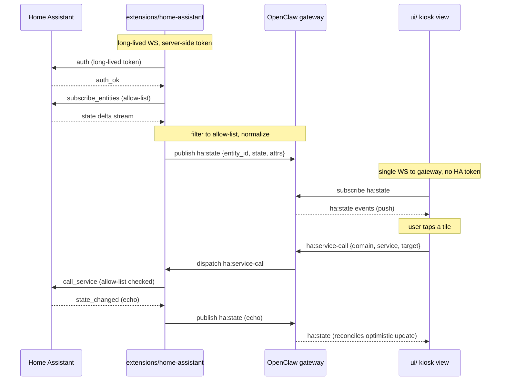

# Home Assistant kiosk dashboard (Wagner Way overview)

## Overview

Build a wall-tablet kiosk dashboard inside OpenClaw that mirrors the existing Home Assistant Lovelace **Wagner Way** overview — family/alarm badges, weather, energy gauges (Battery SOC / Solar / Grid / House), Major Appliances gauges, and the Quick Keys tile grid. v1 scope is the first view only; subsequent views (Calendar, Rooms, Cameras, Climate, Sonos, AppleTV, Plex, People, Solar deep-dive, Eskom, Vacuums, Bourbon & Bubbles) are explicit follow-ups.

The dashboard runs on an always-on wall tablet against the OpenClaw gateway. A new `extensions/home-assistant` plugin owns the long-lived WebSocket connection to Home Assistant, caches entity state, and bridges state changes and service calls through the existing OpenClaw gateway. A new no-chrome kiosk shell view in `ui/` consumes that bridge and renders the Wagner Way layout in Lit.

## Problem Frame

Home Assistant's Lovelace dashboard is the household control surface today (alarms, lights, gates, geyser, pumps, blinds, energy gauges). It runs in a separate browser tab from OpenClaw. The user wants a single wall tablet that lives inside OpenClaw — same control surface, same look-and-feel as the current HA dashboard — so OpenClaw becomes the household control plane and the agent (Jarvis) and the dashboard share one HA integration rather than two.

This plan delivers v1 of that surface: read-and-control of the **Wagner Way overview** view only, on a wall-tablet kiosk, over HA WebSocket, with the same security posture established in the Jarvis Butler plan (dedicated non-admin HA user, services deny-listed at the HA-user layer).

## Requirements Trace

- **R1.** Tablet boots a no-chrome kiosk URL inside OpenClaw and renders the Wagner Way overview view at the same visual fidelity as the existing HA Lovelace view.
- **R2.** Live state for badges, gauges, and tiles updates within ~1s of HA state changes (no polling).
- **R3.** Tapping a tile in the Quick Keys section toggles the underlying entity via HA service call and reconciles the resulting state.
- **R4.** Tapping a forbidden entity is impossible at the UI layer because the HA-user deny-list (locks, alarm-disarm, garage-open) prevents it server-side; the kiosk does not display tiles for deny-listed services.
- **R5.** HA WebSocket disconnects (WiFi flap, HA restart) recover automatically with bounded backoff and a visible "reconnecting" indicator on the tablet — never a blank screen.
- **R6.** HA long-lived token and base URL are stored as plugin credentials (not in source, not in the browser bundle); the browser receives entity state through the gateway WS, never a direct connection to HA.
- **R7.** The kiosk respects the touch-target, brightness, and orientation needs of an always-on wall tablet (≥48px hit areas, dark theme, large numerals, no hover-only affordances).
- **R8.** Plan composes cleanly with the Jarvis Butler agent-tool surface from `docs/plans/2026-05-10-001-feat-jarvis-the-butler-home-migration-plan.md` so the same HA user, deny-list, and integrity check serve both surfaces.

## Scope Boundaries

- v1 renders **only the Wagner Way overview view**. No Calendar, Rooms, Cameras, Alarm panel, Climate, Sonos, AppleTV, Plex, People, Solar, Eskom, Vacuums, or Bourbon & Bubbles views.
- v1 does **not** render camera live views (`camera.*`). The Quick Keys "Front Door Cam" tile becomes a placeholder/disabled in v1; live camera streaming is deferred (see Camera Streaming risk below).
- v1 does **not** integrate with the OpenClaw chat/agent surface — Jarvis already has its own HA tool path via the Butler plan. The kiosk consumes the same plugin, but does not add agent tools.
- v1 does **not** mirror Lovelace HACS custom cards (`modern-circular-gauge`, `bubble-card`, `mushroom-vacuum-card`, `sunsynk-power-flow-card`, `clock-weather-card`, `energy-distribution`, `calendar-card-pro`, `xiaomi-vacuum-map-card`, etc.) — it implements OpenClaw-native Lit equivalents for the gauge, tile, and badge primitives that v1 actually uses.
- v1 does not solve multi-kiosk fan-out, kiosk-to-kiosk handoff, voice control, or notifications-on-tablet.

### Deferred to Separate Tasks

- **Cameras view + camera tiles in Quick Keys** — separate v2 plan; needs RTSP/MJPEG/WebRTC strategy, LAN-only enforcement, and snapshot-link auth (the open Butler-plan unsolved spike).
- **Calendar / Rooms / Climate / Sonos / AppleTV / Plex / People / Solar / Eskom / Vacuums / Bourbon & Bubbles views** — each becomes its own v2+ planning unit once the kiosk shell and HA bridge are stable.
- **Agent tool surface for HA** — owned by `docs/plans/2026-05-10-001-feat-jarvis-the-butler-home-migration-plan.md` Unit 7; this plan does not duplicate it.
- **HA user provisioning / token issuance / weekly deny-list integrity cron** — already covered by the Butler plan; this plan reuses, does not re-spec.

## Context & Research

### Relevant Code and Patterns

- `extensions/anthropic/index.ts`, `extensions/anthropic/register.runtime.ts`, `extensions/anthropic/api.ts`, `extensions/anthropic/openclaw.plugin.json` — canonical extension shape: `definePluginEntry({ id, name, register })`, runtime registration via `register.runtime.ts`, public facade at `api.ts`, manifest at `openclaw.plugin.json`. Mirror this layout for `extensions/home-assistant/`.
- `extensions/anthropic/config-defaults.ts` — config schema + defaults pattern; the HA extension follows the same shape for `homeAssistantUrl`, `tokenRef`, allow-list/deny-list config.
- `src/plugin-sdk/*` — public SDK barrel that extensions consume; HA extension imports from here and `runtime-api.ts`, never reaches into core internals.
- `ui/src/ui/gateway.ts` — `GatewayBrowserClient` WebSocket pattern. Existing in-browser WS to gateway handles reconnect, message dispatch. The kiosk subscribes to a new `ha:state` topic on this same socket.
- `ui/src/ui/navigation.ts` — `TAB_PATHS` hash-route registry. Add a new `kiosk` route, but the kiosk path is **outside** the normal tab nav (no nav chrome) so it is registered as a standalone route, not a tab.
- `ui/src/ui/views/agents-panels-status-files.ts` — `.fullscreen` CSS toggle is the closest existing precedent for a no-chrome surface; use the same pattern (or a tighter `kiosk-mode` body class) for the kiosk shell.
- `ui/src/styles/*.css` — vanilla CSS custom properties (`--bg`, `--accent`, `--shadow-sm`). Kiosk styling extends these rather than introducing Tailwind/shadcn.
- `ui/package.json` — `pnpm dev` (Vite localhost:5173), `pnpm build` (→ `dist/control-ui`), `pnpm test` (vitest).

### Institutional Learnings

From `docs/plans/2026-05-10-001-feat-jarvis-the-butler-home-migration-plan.md`:

- **HA long-lived tokens have no per-entity ACL.** A token inherits the issuing user's permissions wholesale. The kiosk reuses the existing dedicated non-admin `jarvis_butler` HA user (or a sibling `jarvis_kiosk` user — decided in Unit 1) so the agent and the kiosk share an auditable allow-list.
- **High-blast-radius services are deny-listed at the HA user, not in the client.** `lock.unlock`, `alarm_control_panel.alarm_disarm`, garage `cover.open_cover`. The kiosk **must not render tiles** for these; the user-layer deny-list is the safety net, the absent-tile is the primary defense.
- **HA is the umbrella for Apple Home / Ring / Alexa / Sonoff / Sonos / etc.** One token, one URL, one transport. The kiosk follows the same single-proxy posture.
- **Ring re-auths roughly monthly.** The kiosk surfaces this as a "degraded" state in the affected tile (e.g. doorbell battery sensor stale > N hours), not a silent retry.
- **Camera URLs do not leave the LAN in plaintext.** Camera tiles in v2 must be LAN-only or behind the existing ngrok basic-auth + per-user app login posture. Stated here so the v2 split does not lose the constraint.
- **Two-layer public auth posture.** Ngrok basic-auth + app login. The kiosk URL inherits this posture by virtue of living inside OpenClaw's existing UI shell, not as a parallel exposure.
- **Generic entity friendly-names.** No PINs in entity names; no exact addresses. The kiosk renders whatever HA exposes — keep names generic at the HA layer.
- **Failure-mode integrity check exists.** Weekly cron curls `services/lock/unlock` with the dedicated user's token and pages on anything other than permission-denied. The kiosk plan extends this check (same script, same user) — does not invent a parallel one.

### External References

- Home Assistant WebSocket API — `https://developers.home-assistant.io/docs/api/websocket/` (auth handshake, `subscribe_events` with `state_changed`, `subscribe_entities` for delta-only state, ping/pong, command IDs). Read at implementation time per root `AGENTS.md` "Dependency-backed behavior" rule; do not infer from this plan.
- Lovelace dashboard YAML reference — `https://www.home-assistant.io/dashboards/` (semantics of `tile`, `entity`, `picture-entity`, `horizontal-stack`, etc., for fidelity reference when implementing the Lit equivalents).

## Key Technical Decisions

- **Server-relayed HA WebSocket, not browser-direct.** The HA token stays in `extensions/home-assistant`; the browser receives state via the existing gateway WS. **Why:** keeps long-lived tokens server-side, lets multiple kiosks share one HA connection later, fits the existing OpenClaw transport, and lets the same plugin serve both kiosk and agent without duplicating auth.
- **HA bridged via a new `ha:*` topic family on the gateway WS, not new transport.** Add a `ha:state` push topic and a `ha:service-call` request topic to the existing gateway protocol. **Why:** preserves the single-WebSocket-in-browser invariant; reuses the existing reconnect/auth/dispatch pipeline in `ui/src/ui/gateway.ts`.
- **Kiosk is a standalone Lit route at `#/kiosk`, outside `TAB_PATHS`.** Registered in the router but renders no nav chrome, no chat, no agent panels. **Why:** a wall tablet is a distinct surface posture; bolting it into the tabbed control UI as another tab confuses the desktop UX.
- **OpenClaw-native Lit gauge/tile/badge primitives, not HACS card ports.** **Why:** the HACS cards are React/web-component bundles with their own state models; porting them is more work than reimplementing the v1-needed primitives in Lit + vanilla CSS, and produces a smaller, repo-native bundle. The visual fidelity bar is "looks like the Lovelace view" not "is the Lovelace view".
- **Entity allow-list lives in the plugin, not the kiosk view.** The plugin filters HA state to a configured allow-list before bridging; the kiosk receives only what it is allowed to render. **Why:** defense in depth on top of HA-user deny-list, plus a single source of truth for "what the household has decided to put on the kiosk" that v2 views can extend without each touching HA auth.
- **Optimistic tile updates with reconciliation.** Tile tap renders the new state immediately, then waits for the HA `state_changed` event to confirm; on timeout (e.g. 3s) it reverts and surfaces a transient error indicator. **Why:** wall-tablet UX cannot show a 600ms "is it on yet?" pause on every tap; the reconciliation echo from HA is the source of truth.
- **Curated v1 entity list captured in plugin config, not hardcoded in the view.** The view template names slots (e.g. `slot.battery_soc`, `slot.solar_power`, `slot.gate_main`); plugin config maps slots → HA entity IDs. **Why:** household entity IDs change (devices replaced, sensors renamed); the view should not need a code change to track them.
- **Test-first for the HA WS client and state store.** Visual UI is iterated, but the connection lifecycle, auth handshake, reconnect/backoff, and state diff logic are pure-logic units with clear contracts and known failure modes — characterization-first protects them from regression.

## Open Questions

### Resolved During Planning

- **Where does the dashboard live?** New extension `extensions/home-assistant/` for the HA WS client + bridge; new view `ui/src/ui/views/kiosk-*.ts` for the rendered surface.
- **HA transport?** WebSocket from the extension; gateway WS to the browser.
- **v1 scope?** Wagner Way overview only; cameras explicitly deferred.
- **Kiosk shares the Butler plan's HA user?** Yes — same dedicated non-admin user, same deny-list. Unit 1 records whether to issue a sibling token (`jarvis_kiosk`) or reuse `jarvis_butler` based on rotation cadence preference.
- **Custom HACS cards?** Not ported; native Lit equivalents for gauges/tiles/badges only.

### Deferred to Implementation

- **Exact gateway protocol shape for `ha:state` and `ha:service-call`.** Resolved when implementing Unit 4 against the existing `src/gateway/protocol/*` patterns; additive, versioned per root `AGENTS.md` gateway contract rule.
- **Whether to use HA's `subscribe_events` (state_changed) or `subscribe_entities` (compressed deltas).** Decided in Unit 2 after reading current HA WS docs; both work, `subscribe_entities` is more efficient at scale.
- **Tablet sleep / display-on behavior.** Decided in Unit 5 — likely browser-side `wake-lock` API plus tablet OS settings; no OpenClaw kernel involvement expected.
- **Exact Lit gauge math for the 4-segment color bands.** Resolved in Unit 6 against the actual SVG arc rendering; planning specifies _that_ bands exist matching the HACS card thresholds, not the precise math.
- **Brand/colors.** Match the existing OpenClaw control UI dark theme (`--bg`, `--accent`); the Lovelace screenshot's color choices are reference, not contract.

## High-Level Technical Design

> _This illustrates the intended approach and is directional guidance for review, not implementation specification. The implementing agent should treat it as context, not code to reproduce._

### Four-piece data flow



### Wagner Way overview composition

```text
+------------------------------------------------------------+
| Badges row: people · phone batteries · alarms (top sticky) |
+--------------------------+---------------------------------+
| Clock + Weather card     | Energy distribution flow card   |
+----+----+----+----+------+---------------------------------+
| Battery SOC | Solar Power | Grid Power     | House Power   |
+----+----+----+----+------+---------------------------------+
| Major Appliances row: Geyser · Pool · Jacuzzi · Clients · BTC |
+------------------------------------------------------------+
| Quick Keys tile grid (gates, lights, geyser, pumps, blinds) |
+------------------------------------------------------------+
| Vacuums nav · (Front Door Cam: deferred placeholder)        |
+------------------------------------------------------------+
```

### Slot → entity mapping (plugin config, illustrative)

```yaml
# extensions/home-assistant/config (shape, not literal)
allowList:
  - sensor.deye_sunsynk_sol_ark_battery_state_of_charge
  - sensor.deye_sunsynk_sol_ark_pv_power
  - sensor.deye_sunsynk_sol_ark_grid_power
  - sensor.deye_sunsynk_sol_ark_load_power
  - sensor.sonoff_10014e4497_power
  - switch.sonoff_10013c3266
  - cover.aqara_roller_blind_left
  # ...
denyServiceList:
  - lock.unlock
  - alarm_control_panel.alarm_disarm
  - cover.open_cover # garage covers only — see HA-user-side too
slots:
  badge.alarm_wagner: alarm_control_panel.ring_alarm
  gauge.battery_soc: sensor.deye_sunsynk_sol_ark_battery_state_of_charge
  gauge.solar_power: sensor.deye_sunsynk_sol_ark_pv_power
  tile.gate_main: switch.sonoff_10013c3266
  tile.geyser_main: switch.sonoff_10014e4497
  # ... etc
```

## Output Structure

```text
extensions/home-assistant/
  openclaw.plugin.json           # manifest
  package.json
  index.ts                       # definePluginEntry
  register.runtime.ts            # registers HA client + gateway bridge
  api.ts                         # public facade barrel
  config-schema.ts               # url, tokenRef, allowList, denyServiceList, slots
  config-defaults.ts
  ws-client.ts                   # HA WebSocket lifecycle + auth + subscribe
  ws-client.test.ts
  state-store.ts                 # entity state cache + diff
  state-store.test.ts
  allowlist.ts                   # filter + service deny-list
  allowlist.test.ts
  gateway-bridge.ts              # ha:* topic publisher + service-call dispatch
  gateway-bridge.test.ts
  README.md

ui/src/ui/views/
  kiosk-shell.ts                 # no-chrome shell + routing
  kiosk-shell.test.ts
  kiosk-wagner-way.ts            # Wagner Way overview composition
  kiosk-wagner-way.test.ts

ui/src/ui/components/kiosk/
  ha-state-binding.ts            # connects gateway ha:state to Lit reactive store
  ha-state-binding.test.ts
  gauge-circular.ts              # circular gauge primitive
  gauge-circular.test.ts
  tile-toggle.ts                 # tap-to-toggle tile with optimistic update
  tile-toggle.test.ts
  badge-entity.ts                # entity badge primitive
  badge-entity.test.ts
  weather-card.ts                # clock + weather + forecast
  energy-flow-card.ts            # energy distribution diagram

ui/src/styles/
  kiosk.css                      # kiosk-mode body class, large touch targets

src/gateway/protocol/
  ha-events.ts                   # ha:state, ha:service-call schemas (additive)
  ha-events.test.ts
```

## Implementation Units

- [ ] **Unit 1: HA extension scaffold + config schema**

**Goal:** Stand up `extensions/home-assistant/` following the canonical extension pattern, with a config schema for HA URL, credential reference, allow-list, service deny-list, and slot mapping.

**Requirements:** R6, R8

**Dependencies:** None.

**Files:**

- Create: `extensions/home-assistant/openclaw.plugin.json`
- Create: `extensions/home-assistant/package.json`
- Create: `extensions/home-assistant/index.ts`
- Create: `extensions/home-assistant/register.runtime.ts`
- Create: `extensions/home-assistant/api.ts`
- Create: `extensions/home-assistant/config-schema.ts`
- Create: `extensions/home-assistant/config-defaults.ts`
- Create: `extensions/home-assistant/README.md`
- Test: `extensions/home-assistant/config-schema.test.ts`

**Approach:**

- Mirror the `extensions/anthropic/` shape (`definePluginEntry`, `register.runtime.ts`, `api.ts`, `openclaw.plugin.json`).
- Config schema fields: `homeAssistantUrl` (string URL), `tokenRef` (credential reference, not literal), `allowList` (entity-id list), `denyServiceList` (`<domain>.<service>` list), `slots` (slot-name → entity-id map).
- Token storage follows the existing channel/provider credential pattern under `~/.openclaw/credentials/` — never in plugin config files, never in source.
- Document in README that the HA user is the dedicated non-admin user from the Butler plan; do not duplicate the user-provisioning steps here.

**Patterns to follow:**

- `extensions/anthropic/index.ts`, `register.runtime.ts`, `api.ts`, `config-defaults.ts`
- `extensions/anthropic/openclaw.plugin.json`

**Test scenarios:**

- Happy path: schema accepts a valid URL + tokenRef + allow-list + slots and round-trips through `resolvePluginConfigObject`.
- Edge case: missing `tokenRef` rejects with a clear validation error pointing at the credentials path.
- Edge case: `homeAssistantUrl` without `ws://` or `wss://` rejects (the WS client only speaks WS).
- Edge case: a slot pointing at an entity not in `allowList` rejects at config validation, not later at runtime.
- Edge case: a `denyServiceList` entry not formatted as `<domain>.<service>` rejects.

**Verification:**

- `pnpm test extensions/home-assistant` passes the schema tests.
- `pnpm build` resolves the new extension without architecture-rule violations.
- The plugin appears in the manifest registry on startup with `id: home-assistant` and surfaces a config form that asks for URL + credential.

---

- [ ] **Unit 2: HA WebSocket client + state store**

**Goal:** Long-lived WebSocket client to Home Assistant: auth handshake, event subscription, state cache, ping/pong heartbeat, exponential reconnect, structured connection-state for downstream consumers.

**Requirements:** R2, R5, R6

**Dependencies:** Unit 1.

**Files:**

- Create: `extensions/home-assistant/ws-client.ts`
- Create: `extensions/home-assistant/state-store.ts`
- Test: `extensions/home-assistant/ws-client.test.ts`
- Test: `extensions/home-assistant/state-store.test.ts`

**Approach:**

- Read the HA WebSocket API docs at implementation time; do not infer from this plan. Resolve the `subscribe_events` vs `subscribe_entities` choice during Unit 2 and document the chosen call in the file header comment.
- Connection lifecycle states: `idle → connecting → authenticating → subscribed → degraded → disconnected`. Each transition emits an event for the bridge.
- Reconnect: exponential backoff capped at e.g. 30s; reset on successful subscribe.
- Heartbeat: HA WS supports `ping`/`pong` command frames at the protocol level; if the configured interval lapses without a pong, transition to `degraded` and recycle the socket.
- State store is a `Map<entity_id, EntityState>` plus a per-entity subscriber registry; emits a diff (entity, prev, next) on each change.
- Filter at ingestion: states for entities outside `allowList` are dropped before they hit the store.

**Execution note:** Implement test-first. The connection state machine and reconnect/backoff logic regress easily when touched without coverage.

**Patterns to follow:**

- Reuse any long-lived-WS helper if Phase 1 finds one in `src/gateway/` or elsewhere; otherwise this is greenfield.

**Test scenarios:**

- Happy path: connect → auth → subscribe → first `state_changed` event lands in the store and emits a diff.
- Happy path: existing entity state update produces a `(prev, next)` diff with both populated.
- Edge case: auth failure transitions to `degraded` and surfaces an explicit error (not silent reconnect loop).
- Edge case: `ping` timeout recycles the socket and resubscribes on reconnect.
- Edge case: server closes socket → reconnect attempt 1 backs off ~1s, attempt 5 backs off ≤30s.
- Edge case: state for an entity outside `allowList` does not enter the store and does not emit a diff.
- Edge case: malformed/unexpected message payload is logged and ignored, does not crash the client.
- Integration: state store consumer subscribed to entity X receives diff only for X, not for unrelated entity Y.

**Verification:**

- `pnpm test extensions/home-assistant` covers the lifecycle + store tests.
- A live-test smoke (`OPENCLAW_LIVE_TEST=1`) against a real HA instance can connect, authenticate, subscribe, and observe a state change for one allow-listed entity.

---

- [ ] **Unit 3: Allow-list filtering and service deny-list enforcement**

**Goal:** Centralize entity allow-list filtering and service-call deny-list enforcement so both the bridge and any future agent path go through one gate.

**Requirements:** R4, R6

**Dependencies:** Unit 1, Unit 2.

**Files:**

- Create: `extensions/home-assistant/allowlist.ts`
- Test: `extensions/home-assistant/allowlist.test.ts`

**Approach:**

- Pure functions: `isEntityAllowed(entityId, config) → boolean`, `isServiceAllowed(domain, service, config) → boolean`.
- Service-call gate is checked **before** the WS call_service is issued. A blocked call returns a structured error (`{ kind: "service-denied", domain, service }`) that the gateway bridge surfaces back to the kiosk.
- The deny-list is stated as belt-and-braces; the HA-user-side deny-list (Butler plan, weekly cron) is the safety net. Document in code comments that removing this client gate does not lower security — it widens the failure surface from "tile invisible" to "tile visible but rejected".

**Patterns to follow:**

- Existing pure-function gate patterns in `src/plugin-sdk/` (look for similar policy gates).

**Test scenarios:**

- Happy path: allow-listed entity → `isEntityAllowed = true`.
- Happy path: non-deny-listed service → `isServiceAllowed = true`.
- Edge case: service in deny-list → false, with structured error type.
- Edge case: allow-list empty → all entities denied (fail closed).
- Edge case: deny-list empty + allow-list populated → service permission falls back to a documented default (decided in Unit 3: deny by default, allow only services explicitly enumerated in `allowServiceList` once that field is added — record the decision in the test).
- Edge case: case-sensitivity and trailing-whitespace handling for entity IDs and service names.

**Verification:**

- `pnpm test extensions/home-assistant/allowlist.test.ts` passes.
- A targeted test confirms that a `lock.unlock` call against the configured deny-list returns the structured `service-denied` error before the WS call_service is ever issued.

---

- [ ] **Unit 4: Gateway bridge — `ha:state` push + `ha:service-call` request topics**

**Goal:** Bridge HA state and service calls onto the existing OpenClaw gateway WS so the browser sees a single transport.

**Requirements:** R2, R3, R6

**Dependencies:** Unit 2, Unit 3.

**Files:**

- Create: `extensions/home-assistant/gateway-bridge.ts`
- Test: `extensions/home-assistant/gateway-bridge.test.ts`
- Create: `src/gateway/protocol/ha-events.ts`
- Test: `src/gateway/protocol/ha-events.test.ts`
- Modify: `src/gateway/protocol/<barrel>.ts` (add `ha-events` to the protocol exports — exact file resolved at impl time)

**Approach:**

- Define `ha:state` (server → client push) and `ha:service-call` (client → server request) message shapes in `src/gateway/protocol/ha-events.ts` using the existing protocol typing/zod helpers (per `src/gateway/protocol/AGENTS.md` if present).
- Additive change to the gateway protocol per root `AGENTS.md` "additive first" rule; bump the protocol version where convention dictates.
- `gateway-bridge.ts` subscribes to the state-store diff stream, normalizes each diff into a `ha:state` payload (entity_id, state, attrs subset, timestamp), and publishes to the gateway. Does not re-publish unchanged state.
- For `ha:service-call`: validates payload, runs through `allowlist.ts`, dispatches to the WS client's `call_service`. Returns the structured error for denied services; returns ack for accepted calls without waiting for the echo (the echo flows back via the normal state stream).
- Bridge attaches/detaches when the plugin starts/stops; resilient to gateway disconnects.

**Approach diagram (directional):**

```text
state-store diff  →  bridge filter  →  gateway publish ha:state
gateway recv ha:service-call  →  allowlist gate  →  ws-client.call_service
```

**Patterns to follow:**

- Existing channel-event bridges in `src/channels/` (look at how channels publish events to the gateway protocol).
- `src/gateway/protocol/*` typing conventions for additive event types.

**Test scenarios:**

- Happy path: a state-store diff for an allow-listed entity appears as a `ha:state` event on the gateway publish channel within one tick.
- Happy path: a valid `ha:service-call` for an allow-listed `switch.toggle` reaches `ws-client.call_service` with the correct domain/service/target.
- Edge case: `ha:service-call` for a deny-listed service returns the structured `service-denied` error and never calls `ws-client.call_service`.
- Edge case: `ha:service-call` payload missing `domain` or `target` fails validation with a clear error before any allow-list check.
- Edge case: state-store diff for an entity not in `allowList` is dropped at the bridge (defense in depth: the store should not have it, but if config drift means it does, the bridge still refuses to publish it).
- Edge case: gateway disconnect → bridge buffers/drops per documented policy (decide in Unit 4 whether to buffer last-known state for replay or drop and resync on reconnect; default: drop, rely on UI's resync request).
- Integration: full round-trip — UI sends `ha:service-call`, bridge dispatches, mock WS client emits a `state_changed` echo, bridge publishes the resulting `ha:state` event.

**Verification:**

- `pnpm test extensions/home-assistant/gateway-bridge.test.ts` and `pnpm test src/gateway/protocol/ha-events.test.ts` pass.
- `pnpm check:architecture` passes (additive protocol change, no cycle).
- Manual smoke: with the plugin running and a real HA instance, browser devtools shows `ha:state` frames on the gateway WS for at least one allow-listed entity.

---

- [ ] **Unit 5: Kiosk shell view + `#/kiosk` route**

**Goal:** No-chrome Lit shell view that hosts the kiosk dashboard, with body-class kiosk-mode styling, fullscreen toggle, and a visible connection-state indicator.

**Requirements:** R1, R5, R7

**Dependencies:** Unit 4 (so the shell can subscribe to `ha:state`).

**Files:**

- Create: `ui/src/ui/views/kiosk-shell.ts`
- Test: `ui/src/ui/views/kiosk-shell.test.ts`
- Create: `ui/src/ui/components/kiosk/ha-state-binding.ts`
- Test: `ui/src/ui/components/kiosk/ha-state-binding.test.ts`
- Modify: `ui/src/ui/navigation.ts` (register the kiosk route as a standalone route, not a tab)
- Modify: `ui/src/ui/app-routing.ts` or equivalent router (file resolved at impl time) — add `#/kiosk` handling
- Create: `ui/src/styles/kiosk.css`

**Approach:**

- Hash route `#/kiosk` resolves to `kiosk-shell`; not added to `TAB_PATHS`/`TAB_GROUPS` (the shell hides nav and chat).
- Shell sets a `kiosk-mode` body class that disables the tabbed nav and chat panel via CSS; exits kiosk mode when navigating away.
- Subscribes to the gateway's `ha:state` topic on mount; provides a Lit reactive store (`ha-state-binding.ts`) that child components consume.
- Visible connection-state indicator (small corner pill: `live` / `reconnecting` / `degraded`) reflects the gateway-bridge connection and the upstream HA WS state.
- Touch-friendly defaults: `font-size` floor for legibility on a wall tablet, `:hover` styles disabled, `user-select: none`, `touch-action: manipulation` to suppress double-tap zoom.
- Wake-lock: request `navigator.wakeLock` on mount, release on unmount; documented as best-effort and tablet-OS-dependent.

**Patterns to follow:**

- `ui/src/ui/views/agents-panels-status-files.ts` `.fullscreen` toggle for the shell-without-chrome posture.
- `ui/src/ui/gateway.ts` `GatewayBrowserClient` for subscribing to the new topic.
- Vanilla CSS custom properties from `ui/src/styles/*.css` (`--bg`, `--accent`); extend, do not introduce a new framework.

**Test scenarios:**

- Happy path: navigating to `#/kiosk` mounts `kiosk-shell` and applies the `kiosk-mode` body class.
- Happy path: a `ha:state` event from the gateway updates the reactive store; a child component reading entity X re-renders.
- Edge case: gateway WS drops → connection-state indicator shows `reconnecting`; reconnects → returns to `live`.
- Edge case: HA upstream `degraded` (e.g. token expired surfaced via gateway) → indicator shows `degraded`, store retains last-known state.
- Edge case: navigating away from `#/kiosk` removes the body class and unsubscribes the binding (no orphan subscription leak).
- Edge case: wake-lock request rejection (unsupported browser / OS) does not block render.
- Integration: shell + binding wired to a fake gateway client receives a state update and surfaces it through the binding to a test consumer.

**Verification:**

- `pnpm test ui` covers the shell and binding tests.
- `pnpm dev` shows `#/kiosk` rendering an empty kiosk shell with a working connection indicator against a running gateway.

---

- [ ] **Unit 6: Display primitives — gauge, tile, badge, weather card, energy-flow card**

**Goal:** OpenClaw-native Lit components that match the visual fidelity of the Wagner Way Lovelace cards (`modern-circular-gauge`, `tile`, entity badge, `clock-weather-card`, `energy-distribution`) for v1.

**Requirements:** R1, R7

**Dependencies:** Unit 5 (consumes the shared `ha-state-binding`).

**Files:**

- Create: `ui/src/ui/components/kiosk/gauge-circular.ts`
- Test: `ui/src/ui/components/kiosk/gauge-circular.test.ts`
- Create: `ui/src/ui/components/kiosk/tile-toggle.ts`
- Test: `ui/src/ui/components/kiosk/tile-toggle.test.ts`
- Create: `ui/src/ui/components/kiosk/badge-entity.ts`
- Test: `ui/src/ui/components/kiosk/badge-entity.test.ts`
- Create: `ui/src/ui/components/kiosk/weather-card.ts`
- Create: `ui/src/ui/components/kiosk/energy-flow-card.ts`

**Approach:**

- `gauge-circular`: SVG arc, configurable `min`/`max`, 4 segment color bands matching the Lovelace thresholds (e.g. blue → green → orange → red), large center numeral, unit label, optional secondary inner gauge for the Geyser dual-display.
- `tile-toggle`: large rectangular tile with icon + name + state, `tap` event with optimistic state change, "in-flight" visual until reconciliation, error flash on `service-denied`.
- `badge-entity`: small chip showing icon + name + state + last-changed; collapsible to single line when space-constrained.
- `weather-card`: clock + current conditions + 5-row forecast (the same shape as `clock-weather-card`); reads from configured `weather` and outdoor sensors via slots.
- `energy-flow-card`: simple SVG diagram of grid ↔ home ↔ battery ↔ solar with animated dots when power is flowing; v1 is _static-shape_, animation can be a follow-up if it adds noise.
- All primitives bind via slot names, never raw entity IDs in the view layer — slot resolution happens once in the shell.

**Test scenarios:**

- `gauge-circular`: numeric 0/min/max/over-max/under-min render correctly; segment color picks the right band at boundary values; no NaN or `null` state renders a placeholder, not a broken SVG.
- `gauge-circular`: secondary inner gauge renders when configured and is hidden when not.
- `tile-toggle`: tap fires a `service-call` event with the configured domain/service/target; while in-flight the tile shows the in-flight visual; on reconciliation it settles to the new state.
- `tile-toggle`: a `service-denied` reply flashes the error and reverts the tile to the prior state within the timeout.
- `tile-toggle`: rapid double-tap does not emit two service calls (debounced or in-flight-locked — decided in Unit 6).
- `badge-entity`: renders state + relative `last-changed`; entity unavailable (HA reports `unavailable`) renders a distinct neutral style, not "off".
- `weather-card`: renders forecast rows even when sensor for current temp is `unavailable` (graceful partial render).
- `energy-flow-card`: handles negative power values (export) by reversing the visual flow direction.
- Edge case (all): a slot mapped to a non-existent or removed entity ID renders a placeholder + a small "missing" hint, not a crash.

**Verification:**

- `pnpm test ui` covers the primitive component tests.
- `pnpm dev` storybook-style harness page (or a dev-only view at `#/kiosk-dev`) renders each primitive with sample data for visual review.

---

- [ ] **Unit 7: Wagner Way overview composition**

**Goal:** Compose the primitives into the Wagner Way overview view at the visual fidelity of the existing Lovelace screenshot.

**Requirements:** R1, R3, R7

**Dependencies:** Unit 5, Unit 6.

**Files:**

- Create: `ui/src/ui/views/kiosk-wagner-way.ts`
- Test: `ui/src/ui/views/kiosk-wagner-way.test.ts`

**Approach:**

- Layout sections in source order:
  1. **Badges row (sticky top):** people (Audrey, Michelle, Ijeani, Peter), each phone/iPad battery, Wagner alarm, Bourbon alarm.
  2. **House Info row:** clock + weather card (left, ~50%); energy-flow card (right, ~50%).
  3. **Energy gauges row:** Battery SOC, Solar Power.
  4. **Power gauges row:** Grid Power, House Power.
  5. **Major Appliances row:** Geyser (with secondary inner gauge), Pool Pump, Jacuzzi Pump, Total Clients, Bitcoin (BTC).
  6. **Quick Keys tile grid:** Main Gate, Garage Door, Main Entrance Lights, Braai Light, Main Geyser, Geyser Timer, Vintage Lights, Patio Lights, Pool Pump, Jacuzzi Pump, Office Lights, Jacuzzi Down Lights, Wall Lights, Left Blind (cover), Right Blind (cover). **Excludes any entity covered by the deny-list.**
  7. **Footer nav (placeholder):** "Vacuums" and "Front Door Cam" as disabled placeholders pointing at v2.
- Tile order and column hints match the Lovelace `grid_options.columns` values where reasonable, but use a CSS grid that gracefully reflows for the actual tablet aspect ratio.
- All entity references go through the slot map from Unit 1 — no hardcoded entity IDs in this file.
- A configuration check at view mount logs (and visibly indicates) any slot in the v1 manifest that has no allow-list entry; never renders a tile bound to a missing slot.

**Test scenarios:**

- Happy path: rendering with a fully populated slot map produces all 7 sections.
- Happy path: Battery SOC at 95% renders blue; at 50% renders orange; at 10% renders red (via the gauge primitive's segment selection).
- Edge case: a slot mapped to an entity not present in the gateway state store renders a placeholder tile/gauge, not a crash.
- Edge case: tapping the Main Gate tile fires a `ha:service-call` for `switch.toggle` against the configured target.
- Edge case: a deny-listed service (e.g. an attempt to put a `lock.unlock` slot in the manifest) is rejected at config validation and the corresponding tile never renders. (Cross-checked with Unit 1's schema test.)
- Integration: simulated state stream — Battery SOC updates from 95 → 60 → 30 → 5 — the gauge re-renders, color band changes at each threshold, no extra renders for unchanged attributes.

**Verification:**

- `pnpm test ui` covers the composition tests.
- `pnpm dev` against a real HA instance renders the Wagner Way view with live state updates within ~1s of HA changes.
- Side-by-side visual check against the existing Lovelace screenshot confirms section order, gauge thresholds, and tile grid match.

---

- [ ] **Unit 8: Tile-tap → service-call → reconciliation loop**

**Goal:** End-to-end interaction loop: tap a tile, optimistic UI, service call through the bridge, deny-list enforcement, state echo reconciles or reverts.

**Requirements:** R3, R4, R5

**Dependencies:** Unit 7.

**Files:**

- Modify: `ui/src/ui/components/kiosk/tile-toggle.ts` (wire to the gateway client's `ha:service-call` request)
- Modify: `extensions/home-assistant/gateway-bridge.ts` (already partially in Unit 4 — finalize the service-call request handler with reconciliation timeouts)
- Test: `ui/src/ui/components/kiosk/tile-toggle.integration.test.ts`

**Approach:**

- Tile tap → emits `ha:service-call` via gateway client → bridge validates + dispatches → HA emits `state_changed` → bridge republishes as `ha:state` → tile reconciles its optimistic state with the canonical state.
- Reconciliation timeout: configurable per-tile (default 3s). On timeout without an echo, revert the optimistic state and show a transient error indicator. Default-3s is a planning starting point; tune in Unit 8 against real-world observed HA echo latency for switches vs covers.
- Service-denied: short red flash + return to prior state; no console-only error (the kiosk is the only display).
- Cover-position tiles (left/right blinds) are out-of-scope for v1's _position-slider_ interaction — v1 toggle = open/close (`cover.toggle`), no slider. (Position slider can land in v2 once the toggle loop is stable.)

**Test scenarios:**

- Happy path: tap a switch tile → optimistic-on shown → echo lands within 1s → tile shows confirmed-on. Verifies one render for optimistic, one for echo, no extra renders.
- Happy path: tap a cover tile → optimistic state reflects the toggle; echo confirms.
- Edge case: tap a tile, no echo within 3s → tile reverts, error indicator flashes; subsequent taps still work.
- Edge case: tap a tile bound to a deny-listed service (only reachable if config drift occurred) → service-denied returns within one tick, tile reverts immediately, no 3s wait.
- Edge case: rapid taps before echo arrives — bridge serializes; tile shows the latest intended state; reconciles to the final echo.
- Edge case: gateway disconnects mid-call → in-flight tile transitions to "uncertain", no false error; on reconnect the next `ha:state` for that entity reconciles.
- Integration: full happy-path round-trip with a fake HA WS — taps the Main Gate tile, assert WS `call_service` payload, send back a `state_changed` echo, assert tile lands in the confirmed-on state.

**Verification:**

- `pnpm test ui` and `pnpm test extensions/home-assistant` pass.
- Manual smoke: tap each Quick Keys tile on the wall tablet, observe state matches the HA app within 1s for switches, 1–3s for covers.
- `pnpm check:changed` green on the change set.

## System-Wide Impact

- **Interaction graph:** new gateway protocol topics (`ha:state` push, `ha:service-call` request) extend `src/gateway/protocol/*`. Additive only; no existing topics change semantics.
- **Error propagation:** `service-denied` errors travel from `allowlist.ts` → bridge → gateway → tile. Connection-state degradation propagates from HA WS → state-store status flag → bridge → kiosk shell indicator.
- **State lifecycle risks:** state store is in-memory only (no persistence). Stale state across plugin restart is acceptable because subscribe-on-connect refills the store; document this so future caching ideas don't silently change the contract.
- **API surface parity:** the HA plugin exposes the same allow-list/deny-list gate that the Butler-plan agent path will consume when integrated. Both surfaces must go through `allowlist.ts` — make this a code-level invariant via `api.ts` re-exports.
- **Integration coverage:** unit tests alone will not prove tile-tap → HA call_service → echo. The integration test in Unit 8 with a fake HA WS is the proof. A live-test smoke against real HA is the second proof.
- **Unchanged invariants:** existing OpenClaw tabs, chat, and agent panels are unaffected — kiosk mode is additive and routed separately. The Butler plan's HA tool path (REST + Scripts) is unchanged; this plan adds a parallel WebSocket consumer of the same HA user, not a replacement.

## Risks & Dependencies

| Risk                                                                        | Mitigation                                                                                                                                                                                                                                                                                                                                                                 |
| --------------------------------------------------------------------------- | -------------------------------------------------------------------------------------------------------------------------------------------------------------------------------------------------------------------------------------------------------------------------------------------------------------------------------------------------------------------------- |
| HA WS reconnect storms after WiFi flap or HA restart                        | Exponential backoff capped at 30s; bridge does not republish stale state on reconnect — it resyncs from a fresh subscribe. Connection-state pill makes the state visible; no silent failure.                                                                                                                                                                               |
| Token rotation: HA long-lived token revoked or rotated                      | Token is a credential reference, not a literal config value. Rotation is a credentials-store update, no code change. Bridge surfaces auth-failure as `degraded` state, not silent reconnect-loop. Hooks into the Butler plan's existing weekly integrity cron — if the cron starts seeing unexpected responses, the kiosk is also affected and the same alert covers both. |
| Service deny-list drift (a developer edits config to remove a deny entry)   | Two-layer defense: client-side `allowlist.ts` (Unit 3) + HA-user-side deny-list (Butler plan). Removing only one still leaves the other. The weekly integrity cron from the Butler plan catches HA-user-side drift.                                                                                                                                                        |
| Camera URL leakage when v2 lands cameras                                    | Out of scope for v1 by exclusion. Captured under "Deferred to Separate Tasks" so the constraint is preserved when v2 is planned.                                                                                                                                                                                                                                           |
| Kiosk shows stale state if gateway is up but HA is down                     | Connection-state pill shows `degraded`; tiles render last-known state with a subtle "stale" indicator after a configurable threshold (default 60s). Tapping in `degraded` mode shows a transient "HA unavailable" error rather than queuing the call.                                                                                                                      |
| Wall-tablet display sleeps and the wake-lock fails                          | Wake-lock is best-effort. Document that the tablet OS sleep/screensaver settings are part of the deployment; the kiosk shell doesn't fight the OS.                                                                                                                                                                                                                         |
| HACS card visual fidelity gap (e.g. `sunsynk-power-flow-card` is intricate) | v1 ships a simpler `energy-flow-card` that captures the data flow, not the full HACS visual. Solar deep-dive view in v2 can iterate. Document the visual gap in the README so the household isn't surprised.                                                                                                                                                               |
| Gateway protocol additions break existing clients                           | Additive-only per root `AGENTS.md`; new topics don't change existing ones. `pnpm check:architecture` covers cycles; manual review of `src/gateway/protocol/AGENTS.md` if it exists for protocol versioning rules.                                                                                                                                                          |
| `ha:service-call` payload from a malicious or compromised client            | Allow-list and deny-list gates run on the server (extension) side; the browser is treated as untrusted input. Schema validation at the protocol layer rejects malformed calls.                                                                                                                                                                                             |
| Multi-kiosk or multi-tab interactions cause duplicate service calls         | v1 is single-tablet; document that running two kiosks is allowed (state push fans out fine) but rapid taps from two surfaces could double-toggle. Mitigation: rely on HA's idempotency where applicable; revisit if v2 adds multi-kiosk explicitly.                                                                                                                        |

## Documentation / Operational Notes

- Update `extensions/home-assistant/README.md` with: setup (which HA user, where the token comes from, how `homeAssistantUrl` is configured), v1 scope and known gaps, deny-list policy and its relationship to the HA-user-side deny-list, and the cross-link to the Butler plan.
- Note in the README that the kiosk URL is intended for LAN access on the wall tablet; if exposed via ngrok, the existing two-layer auth posture applies.
- No changelog entry until merged; per root `AGENTS.md` use a single-line `### Changes` entry crediting the implementer when the PR lands.
- No new gates or env vars expected; the existing config + credentials lanes cover this.

## Sources & References

- **Origin context:** user request + screenshot of the existing Wagner Way Lovelace dashboard (no formal `docs/brainstorms/*-requirements.md` document — planning bootstrap covered the gap).
- **Cross-plan dependency:** [docs/plans/2026-05-10-001-feat-jarvis-the-butler-home-migration-plan.md](docs/plans/2026-05-10-001-feat-jarvis-the-butler-home-migration-plan.md) — owns HA user provisioning, agent-tool surface, weekly deny-list integrity cron.
- **Extension reference:** `extensions/anthropic/` — canonical extension layout.
- **UI reference:** `ui/src/ui/views/`, `ui/src/ui/gateway.ts`, `ui/src/ui/navigation.ts`.
- **External docs (read at impl time):** Home Assistant WebSocket API — https://developers.home-assistant.io/docs/api/websocket/ ; Lovelace dashboard reference — https://www.home-assistant.io/dashboards/
