This doc is a recipe book. It does not re-document the API surface — that is the
job of [Plugin SDK overview](/plugins/sdk-overview)
and [Plugin hooks](/plugins/hooks). Instead, every section here answers a single
question: _"if I want my plugin to do **X**, which host-hook contracts do I
compose, and what does that look like end-to-end?"_

Examples here are deliberately **non–Plan-Mode**. Plan Mode is one tenant of
the host-hook contract — not a privileged one. Approval flows, workspace
policy gates, background monitors, setup wizards, review assistants, and
release workflows can all be built as plugins through the same seams.

<Note>
  This is a docs-only follow-up. The SDK and Gateway contracts used below land
  in #72287, the workflow seams land in #72383, and the advanced contract
  fixtures land in #72384. The contract tests in
  `src/plugins/contracts/host-hooks.contract.test.ts` and
  `src/plugins/contracts/advanced-workflow-fixtures.contract.test.ts` are the
  executable spec for these recipes.
</Note>

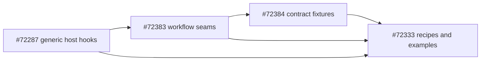

## How to read this doc

Each recipe has the same six parts:

1. **What it does** — the one-line behavior.
2. **Contract** — the actual TypeScript shape from `src/plugins/types.ts` or
   `src/plugins/host-hooks.ts`. No paraphrasing.
3. **Minimal example** — the smallest plugin that exercises the contract.
4. **Diagram** — a sequence or flow diagram of the runtime path.
5. **Real-world example** — a complete plugin entry that's representative of
   how you'd actually ship the contract in production.
6. **Common pitfalls** — the failure modes worth knowing before you ship.

Where two contracts compose naturally (e.g. session extension + command
continuation), the recipe links forward to the full archetype recipe at the
bottom of the doc.

## Quick start

Every plugin entry follows the same shape. The host-hook contracts add
methods to the existing `OpenClawPluginApi` you already get inside `register`:

```typescript
// my-plugin/index.ts
import { definePluginEntry } from "openclaw/plugin-sdk/plugin-entry";

export default definePluginEntry({
  id: "my-plugin",
  name: "My Plugin",
  description: "What it does in one sentence",
  register(api) {
    // Existing surfaces you already know:
    //   api.registerTool(...), api.registerCommand(...), api.on(...)
    //
    // Host-hook surfaces introduced by the host-hook contract PRs:
    //   api.registerSessionExtension(...)
    //   api.enqueueNextTurnInjection(...)
    //   api.registerTrustedToolPolicy(...)        // bundled-only
    //   api.registerToolMetadata(...)
    //   api.registerControlUiDescriptor(...)
    //   api.registerRuntimeLifecycle(...)
    //   api.registerAgentEventSubscription(...)
    //   api.setRunContext(...) / getRunContext(...) / clearRunContext(...)
    //   api.registerSessionSchedulerJob(...)
    //
    // And new typed hook names for api.on(...):
    //   "agent_turn_prepare"
    //   "heartbeat_prompt_contribution"
  },
});
```

If you only need one host-hook surface, you can ignore the others. Composition
is opt-in and lazy — registering nothing in a category means the plugin does
not participate in that category.

---

## Recipe gallery (one section per contract)

### 1. Plugin-owned session state: `api.registerSessionExtension(...)`

**What it does**

Persists small JSON-compatible plugin state alongside the session row, with
optional projection into Gateway clients under `pluginExtensions`. Two plugins
can ship two unrelated extensions and never collide because the namespace and
plugin id key the storage.

**Contract**

```typescript
// from src/plugins/host-hooks.ts
export type PluginSessionExtensionRegistration = {
  namespace: string;
  description: string;
  project?: (ctx: {
    sessionKey: string;
    sessionId?: string;
    state: PluginJsonValue | undefined;
  }) => PluginJsonValue | undefined;
  cleanup?: (ctx: { reason: PluginHostCleanupReason; sessionKey?: string }) => void | Promise<void>;
};

// PluginHostCleanupReason = "disable" | "reset" | "delete" | "restart"
```

`project()` is optional — if you don't pass one, the host returns the raw
stored state under `pluginExtensions[<pluginId>][<namespace>]`. Pass `project()`
when you want to _transform_ what clients see (for example, hide secrets, or
return a different shape than what you persist).

**Minimal example**

```typescript
// my-plugin/index.ts
import { definePluginEntry } from "openclaw/plugin-sdk/plugin-entry";

export default definePluginEntry({
  id: "review-status",
  name: "Review Status",
  description: "Tracks per-session code-review state",
  register(api) {
    api.registerSessionExtension({
      namespace: "review-status",
      description: "Per-session review state: pending | in_review | approved",
      project: ({ state }) => {
        // Show a friendly summary; persist the raw record
        if (!state || typeof state !== "object" || Array.isArray(state)) {
          return undefined;
        }
        return { status: state.status ?? "pending" };
      },
    });
  },
});
```

**Diagram**

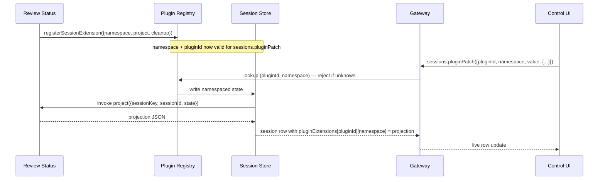

**Real-world example: Review Concierge session state**

A code-review plugin that tracks which files an operator has approved per
session. The persisted state is the full file list; the projection returns
only counts so the row stays small for clients that only need a meter.

```typescript
import { definePluginEntry } from "openclaw/plugin-sdk/plugin-entry";
import type { PluginJsonValue } from "openclaw/plugin-sdk/plugin-entry";

type ReviewStatePersisted = {
  approvedFiles: string[];
  rejectedFiles: string[];
  updatedAt: number;
};

type ReviewStateProjection = {
  approvedCount: number;
  rejectedCount: number;
  totalReviewed: number;
};

function isReviewState(value: PluginJsonValue | undefined): value is ReviewStatePersisted {
  if (!value || typeof value !== "object" || Array.isArray(value)) return false;
  const obj = value as Record<string, PluginJsonValue>;
  return Array.isArray(obj.approvedFiles) && Array.isArray(obj.rejectedFiles);
}

export default definePluginEntry({
  id: "review-concierge",
  name: "Review Concierge",
  description: "Per-session code-review tracking and projection",
  register(api) {
    api.registerSessionExtension({
      namespace: "review-state",
      description: "Files approved or rejected for code review during this session",
      project: ({ state }): ReviewStateProjection | undefined => {
        if (!isReviewState(state)) return undefined;
        return {
          approvedCount: state.approvedFiles.length,
          rejectedCount: state.rejectedFiles.length,
          totalReviewed: state.approvedFiles.length + state.rejectedFiles.length,
        };
      },
      cleanup: async ({ reason, sessionKey }) => {
        api.logger.info(`review-state cleanup reason=${reason} sessionKey=${sessionKey ?? "*"}`);
        // Host already removes the persisted state — this callback is for
        // plugin-owned out-of-band resources (caches, WebSocket handles, etc.)
      },
    });
  },
});
```

**Common pitfalls**

- **Don't put secrets in the projected value.** Anything you return from
  `project()` ends up on session rows that Gateway hands to mobile/desktop
  clients. Persist secrets only if your plugin renders them itself.
- **Validate JSON shape inside `project()`.** The host stores whatever
  `sessions.pluginPatch` writes (it's checked via `isPluginJsonValue`); your
  projection should still defend against shape drift across schema versions.
- **Cleanup is host-driven for the persisted state.** You don't need to clear
  the namespace from `cleanup()`. Use `cleanup()` for _plugin-owned_
  out-of-band resources only (timers, caches, file watchers).

---

### 2. Patching session state from clients: `sessions.pluginPatch`

**What it does**

Lets Control UI / mobile / desktop / internal clients update plugin-owned
session state through the Gateway, with namespace-and-plugin-id validation
at the wire.

**Contract**

```typescript
// Wire-level params for sessions.pluginPatch
type PluginSessionExtensionPatchParams = {
  key: string; // sessionKey
  pluginId: string;
  namespace: string;
  value?: PluginJsonValue;
  unset?: boolean; // pass true to remove the namespace entirely
};
```

**Minimal example**

A Control UI calling `sessions.pluginPatch` to mark a session's approval flow
approved:

```jsonc
// JSON-RPC request from Control UI
{
  "method": "sessions.pluginPatch",
  "params": {
    "key": "agent-default:demo",
    "pluginId": "deploy-approver",
    "namespace": "deploy-approver",
    "value": { "state": "approved", "approvedAt": 1745000000000 },
  },
}
```

**Diagram**

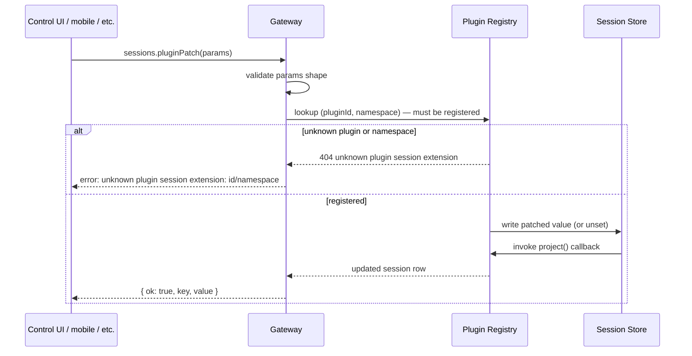

**Real-world example: operator approval card**

The Control UI approval card binds approve/deny buttons to `sessions.pluginPatch`
calls. The plugin doesn't need a custom Gateway method; the patch protocol is
generic.

```typescript
// Control UI side (sketch)
async function approveDeploy(sessionKey: string, version: string) {
  return await gatewayClient.call("sessions.pluginPatch", {
    key: sessionKey,
    pluginId: "deploy-approver",
    namespace: "deploy-approver",
    value: { state: "approved", version, approvedAt: Date.now() },
  });
}

async function denyDeploy(sessionKey: string, reason: string) {
  return await gatewayClient.call("sessions.pluginPatch", {
    key: sessionKey,
    pluginId: "deploy-approver",
    namespace: "deploy-approver",
    value: { state: "denied", reason, deniedAt: Date.now() },
  });
}
```

**Common pitfalls**

- **Patches are atomic per call, not transactional across plugins.** If your
  workflow needs cross-plugin atomicity, model it as a single state machine in
  one plugin's namespace.
- **`unset: true` removes the entire namespace for the session.** Use it for
  reset-style operations; use `value: <new state>` for partial updates.

---

### 3. Durable next-turn context: `api.enqueueNextTurnInjection(...)`

**What it does**

Reaches the next agent turn for a session **exactly once**, with TTL,
idempotency, and chronological cross-plugin drain ordering. The right seam
for "the model should know X on its very next turn, but not as permanent
system prompt text."

**Contract**

```typescript
// from src/plugins/host-hook-turn-types.ts
export type PluginNextTurnInjectionPlacement =
  | "prepend_context"
  | "append_context";

export type PluginNextTurnInjection = {
  sessionKey: string;
  text: string;
  idempotencyKey?: string;
  placement?: PluginNextTurnInjectionPlacement;
  ttlMs?: number;
  metadata?: PluginJsonValue;
};

api.enqueueNextTurnInjection(
  injection: PluginNextTurnInjection,
): Promise<{ enqueued: boolean; id: string; sessionKey: string }>;
```

`enqueued: false` means the call was a duplicate (same `idempotencyKey` for
the same plugin in the same session). The returned `id` is the canonical
record id either way.

**Minimal example**

```typescript
api.registerCommand({
  name: "note-save",
  description: "Save the current model output as a note and inject a summary on the next turn",
  acceptsArgs: false,
  handler: async (ctx) => {
    if (!ctx.sessionKey) {
      return { text: "This command must run inside a bound session." };
    }
    await api.enqueueNextTurnInjection({
      sessionKey: ctx.sessionKey,
      text: `[note saved] previous answer captured at ${new Date().toISOString()}`,
      placement: "prepend_context",
      idempotencyKey: `note-save:${ctx.sessionKey}`,
      ttlMs: 5 * 60_000, // 5 min
    });
    return { text: "Saved.", continueAgent: false };
  },
});
```

**Diagram**

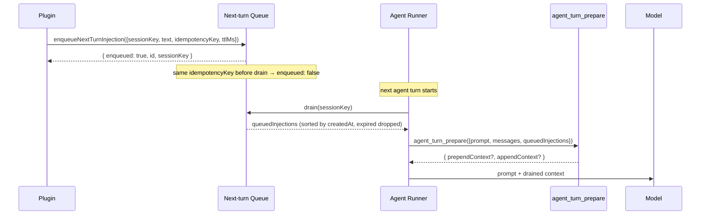

**Real-world example: Code Review Concierge auto-retry**

When a tool call fails, the plugin queues a one-shot diagnosis for the next
turn so the model retries with full context:

```typescript
import { definePluginEntry } from "openclaw/plugin-sdk/plugin-entry";

export default definePluginEntry({
  id: "review-concierge",
  name: "Review Concierge",
  description: "Inject failing-test context on the next turn after a test fails",
  register(api) {
    api.registerAgentEventSubscription({
      id: "review-concierge.tool-fail-watcher",
      streams: ["tool"],
      handle: async (event) => {
        if (event.kind !== "tool_call_failed") return;
        if (event.toolName !== "run_tests") return;
        const sessionKey = event.sessionKey;
        if (!sessionKey) return;

        const summary = formatTestFailure(event); // your own helper
        await api.enqueueNextTurnInjection({
          sessionKey,
          text: `Previous test run failed:\n\n${summary}\n\nThe model should diagnose and propose a focused fix.`,
          placement: "prepend_context",
          idempotencyKey: `tool-fail-${event.runId}-${event.toolCallId}`,
          ttlMs: 10 * 60_000,
          metadata: { source: "review-concierge", kind: "tool-fail-summary" },
        });
      },
    });
  },
});
```

**Common pitfalls**

- **Don't use this for permanent context.** It's exactly-once-per-drain by
  design. Use `before_prompt_build` for context that should appear on every
  turn.
- **`idempotencyKey` is plugin-scoped per session.** If two plugins both
  enqueue with the same key, both fire. The dedup is `(pluginId, sessionKey,
idempotencyKey)`.
- **A drain consumes all of this session's queue, including from
  transiently-inactive plugins.** This is intentional (the drain is the
  consume boundary). If you need to reschedule across registry hot-reload,
  re-enqueue from your reload hook.

---

### 4. Same-turn context from drained injections: `agent_turn_prepare`

**What it does**

Receives the drained next-turn injections and lets you fold them into prompt
context **before** the ordinary `before_prompt_build` hook fires. Use this
when the queued context needs plugin-side shaping before it becomes part of
the prompt. If no plugin handles `agent_turn_prepare`, the host applies the
default fold for queued injections: `prepend_context` items go before the
turn prompt, `append_context` items go after it, and priority decides ordering
within each placement.

**Contract**

```typescript
// from src/plugins/host-hook-turn-types.ts
export type PluginAgentTurnPrepareEvent = {
  prompt: string;
  messages: AgentMessage[] | unknown[];
  queuedInjections: PluginNextTurnInjectionRecord[];
};

export type PluginAgentTurnPrepareResult = {
  prependContext?: string;
  appendContext?: string;
};
```

**Minimal example**

```typescript
api.on("agent_turn_prepare", (event) => {
  const reviewInjections = event.queuedInjections.filter((entry) => entry.pluginId === api.id);
  if (reviewInjections.length === 0) return;

  const summary = reviewInjections.map((entry) => entry.text).join("\n\n");
  return { prependContext: `[review-concierge] notes:\n\n${summary}` };
});
```

**Diagram**

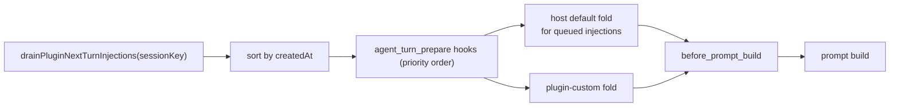

**Real-world example: multi-plugin draft for a meeting summarizer**

```typescript
api.on(
  "agent_turn_prepare",
  (event) => {
    const my = event.queuedInjections.filter((e) => e.pluginId === api.id);
    if (my.length === 0) return;

    // Group by metadata.kind, render with our own headers
    const groups = new Map<string, string[]>();
    for (const entry of my) {
      const kind =
        (entry.metadata && typeof entry.metadata === "object" && !Array.isArray(entry.metadata)
          ? (entry.metadata as { kind?: string }).kind
          : undefined) ?? "note";
      const bucket = groups.get(kind) ?? [];
      bucket.push(entry.text);
      groups.set(kind, bucket);
    }

    const sections: string[] = [];
    for (const [kind, items] of groups.entries()) {
      sections.push(`### ${kind}\n\n${items.map((t) => `- ${t}`).join("\n")}`);
    }
    return { prependContext: `## meeting-summarizer queued\n\n${sections.join("\n\n")}` };
  },
  { priority: 60 },
);
```

**Common pitfalls**

- **Don't drop other plugins' injections.** Filter to your own `pluginId`
  before consuming. The host defaults already handle every plugin's items —
  if you replace the default, do it for _your_ injections only.
- **`agent_turn_prepare` runs only on user-initiated turns.** For
  background-only context use `heartbeat_prompt_contribution` instead.
- **`allowPromptInjection=false` disables this hook per-plugin.** Operators
  can opt out of any prompt-mutating plugin individually.

---

### 5. Heartbeat-only prompt context: `heartbeat_prompt_contribution`

**What it does**

Returns prompt context that fires **only** on heartbeat turns, never on
user-initiated turns. The right seam for SLA timers, long-job progress
deltas, and incident timers — context the model should notice in the
background without polluting interactive prompts.

**Contract**

```typescript
// from src/plugins/host-hook-turn-types.ts
export type PluginHeartbeatPromptContributionEvent = {
  sessionKey?: string;
  agentId?: string;
  heartbeatName?: string;
};

export type PluginHeartbeatPromptContributionResult = {
  prependContext?: string;
  appendContext?: string;
};
```

**Minimal example**

```typescript
api.on("heartbeat_prompt_contribution", (event) => {
  if (!event.sessionKey) return;
  const elapsed = getElapsedMinutes(event.sessionKey); // your own helper
  if (elapsed < 10) return;
  return { appendContext: `⏱ Long-running session: ${elapsed}m elapsed.` };
});
```

**Diagram**

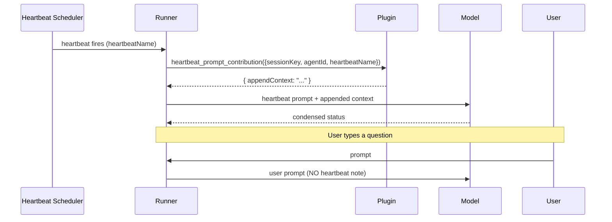

**Real-world example: SLA Watcher**

```typescript
import { definePluginEntry } from "openclaw/plugin-sdk/plugin-entry";

const SLA_BY_AGENT: Record<string, number> = {
  default: 15 * 60_000,
  "release-bot": 30 * 60_000,
};

export default definePluginEntry({
  id: "sla-watcher",
  name: "SLA Watcher",
  description: "Surfaces SLA elapsed/remaining only on heartbeat turns",
  register(api) {
    const startedAt = new Map<string, number>();

    api.registerAgentEventSubscription({
      id: "sla-watcher.run-tracker",
      streams: ["run"],
      handle: (event, ctx) => {
        if (event.kind === "run_started" && event.runId && event.sessionKey) {
          startedAt.set(event.sessionKey, Date.now());
          ctx.setRunContext("sla", { startedAt: Date.now() });
        } else if ((event.kind === "run_ended" || event.kind === "run_error") && event.sessionKey) {
          startedAt.delete(event.sessionKey);
        }
      },
    });

    api.on("heartbeat_prompt_contribution", (event) => {
      if (!event.sessionKey || !event.agentId) return;
      const sla = SLA_BY_AGENT[event.agentId] ?? SLA_BY_AGENT.default;
      const start = startedAt.get(event.sessionKey);
      if (!start) return;
      const elapsed = Date.now() - start;
      const remaining = sla - elapsed;
      if (remaining > 60_000) return; // only nudge inside the last minute
      const human = remaining > 0 ? `${Math.ceil(remaining / 60_000)}m` : "exceeded";
      return {
        appendContext: `⏱ SLA budget: ${human}. Wrap up if possible.`,
      };
    });
  },
});
```

**Common pitfalls**

- **Heartbeat handlers must be cheap.** They run on a timer; an expensive
  handler will slow heartbeat cadence for the whole agent.
- **Empty returns are fine.** If you don't have anything to say this tick,
  return nothing — don't fall through to a generic "no update" string.
- **`allowPromptInjection=false` disables this hook per-plugin** (same as
  `agent_turn_prepare` and `before_prompt_build`).

---

### 6. Bundled-only pre-plugin policy: `api.registerTrustedToolPolicy(...)`

**What it does**

Runs **before** any `before_tool_call` hook. Bundled plugins only. The right
home for compliance, workspace-policy, budget, and other host-trusted gates
that must fire before any third-party plugin can see a tool call.

**Contract**

```typescript
// from src/plugins/host-hooks.ts
export type PluginToolPolicyDecision =
  | PluginHookBeforeToolCallResult
  | { allow?: boolean; reason?: string };

export type PluginTrustedToolPolicyRegistration = {
  id: string;
  description: string;
  evaluate: (
    event: PluginHookBeforeToolCallEvent,
    ctx: PluginHookToolContext,
  ) => PluginToolPolicyDecision | void | Promise<PluginToolPolicyDecision | void>;
};
```

`{ allow: false, reason }` becomes `{ block: true, blockReason }` downstream.
You can also return any `BeforeToolCallResult` directly: `{block, blockReason,
params, requireApproval}`.

**Minimal example**

```typescript
import fs from "node:fs/promises";
import path from "node:path";

api.registerTrustedToolPolicy({
  id: "workspace-policy",
  description: "Block writes outside the configured workspace root",
  evaluate: async (event) => {
    if (event.toolName !== "write_file") return;
    const workspaceRoot = await fs.realpath("/Users/me/work");
    let targetPath: string;
    try {
      targetPath = await fs.realpath(String(event.params?.path ?? ""));
    } catch {
      return { allow: false, reason: "path is not readable" };
    }
    const relative = path.relative(workspaceRoot, targetPath);
    if (relative.startsWith("..") || path.isAbsolute(relative)) {
      return { allow: false, reason: "path outside workspace root" };
    }
    return undefined;
  },
});
```

**Diagram**

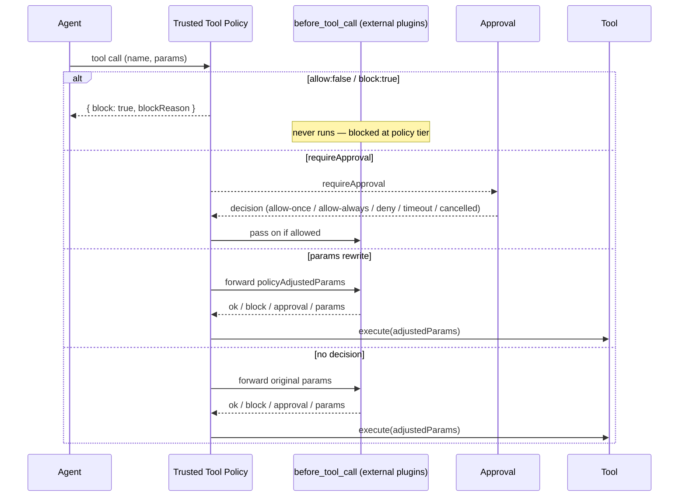

**Real-world example: Budget Guard**

```typescript
import { definePluginEntry } from "openclaw/plugin-sdk/plugin-entry";

const TOOL_COST_USD: Record<string, number> = {
  llm_call: 0.02,
  search: 0.001,
  expensive_analysis: 0.5,
};

export default definePluginEntry({
  id: "budget-guard",
  name: "Budget Guard",
  description: "Blocks tools whose estimated cost would exceed the session budget",
  register(api) {
    api.registerSessionExtension({
      namespace: "budget",
      description: "Budget tracking: spent (USD), capUsd",
    });

    api.registerTrustedToolPolicy({
      id: "budget-guard.cost-cap",
      description: "Require approval when tool cost would exceed session cap",
      evaluate: async (event, ctx) => {
        if (!ctx.sessionKey) return;
        const cost = TOOL_COST_USD[event.toolName] ?? 0;
        if (cost <= 0) return;

        const budget = await getBudgetState(ctx.sessionKey); // your own helper
        const projected = budget.spent + cost;
        if (projected > budget.capUsd) {
          return {
            requireApproval: {
              title: "Budget cap exceeded",
              description: `${event.toolName} (~$${cost.toFixed(2)}) would push session spend to $${projected.toFixed(2)} (cap: $${budget.capUsd.toFixed(2)})`,
              severity: "warning",
              timeoutBehavior: "deny",
              timeoutMs: 60_000,
            },
          };
        }
        return undefined;
      },
    });
  },
});
```

**Common pitfalls**

- **Bundled-only.** External plugins should use `before_tool_call` instead.
  The host enforces this at registration.
- **Trusted policy adjustments propagate as `policyAdjustedParams`.**
  Downstream `before_tool_call` hooks see the adjusted params and can rewrite
  them again. The execution-time params are the final merge.
- **Your `evaluate` runs on every tool call.** Filter by `event.toolName` early
  and return `undefined` fast for tools you don't care about.

---

### 7. Tool catalog and inventory metadata: `api.registerToolMetadata(...)`

**What it does**

Adds display and policy metadata (risk, tags, label) for tools without
forking or wrapping the tool implementation. Projects into the tool catalog
and the effective-inventory view.

**Contract**

```typescript
// from src/plugins/host-hooks.ts
export type PluginToolMetadataRegistration = {
  toolName: string;
  displayName?: string;
  description?: string;
  risk?: "low" | "medium" | "high";
  tags?: string[];
};
```

**Minimal example**

```typescript
api.registerToolMetadata({
  toolName: "s3_export",
  displayName: "Export to S3",
  description: "Writes data to a configured S3 bucket",
  risk: "high",
  tags: ["data-egress", "compliance"],
});
```

**Diagram**

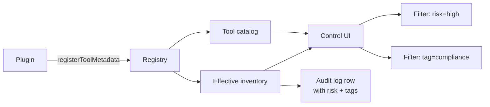

**Real-world example: Compliance Vault**

```typescript
import { definePluginEntry } from "openclaw/plugin-sdk/plugin-entry";

const HIGH_RISK_TOOLS = [
  { name: "s3_export", display: "Export to S3" },
  { name: "db_dump", display: "Database dump" },
  { name: "bigquery_export", display: "Export to BigQuery" },
];

const PII_TOOLS = ["read_user_record", "lookup_email", "read_address_book"];

export default definePluginEntry({
  id: "compliance-vault",
  name: "Compliance Vault",
  description: "Tags export/PII tools for catalog filtering and audit",
  register(api) {
    for (const { name, display } of HIGH_RISK_TOOLS) {
      api.registerToolMetadata({
        toolName: name,
        displayName: display,
        risk: "high",
        tags: ["data-egress", "compliance"],
      });
    }
    for (const name of PII_TOOLS) {
      api.registerToolMetadata({
        toolName: name,
        risk: "medium",
        tags: ["pii", "compliance"],
      });
    }
  },
});
```

**Common pitfalls**

- **Metadata is additive.** You can't override another plugin's metadata.
  The first registration wins, and conflicts are logged. Pick names that
  describe your intent.
- **`risk` is enum.** Only `"low" | "medium" | "high"` are valid. Don't
  pass arbitrary strings.

---

### 8. Scoped commands with continuation: `api.registerCommand(...)`

**What it does**

Adds two new fields to the existing command-registration shape: `requiredScopes`
(Gateway-enforced operator scopes) and `ownership` (bundled-only escape for
reserved names). Plus, command results can carry `continueAgent: true` to wake
the agent immediately after the command's state mutation.

**Contract**

```typescript
// from src/plugins/types.ts
export type PluginCommandResult = ReplyPayload & { continueAgent?: boolean };

export type OpenClawPluginCommandDefinition = {
  name: string;
  description: string;
  acceptsArgs?: boolean;
  requireAuth?: boolean;
  requiredScopes?: OperatorScope[];
  ownership?: "plugin" | "reserved";
  nativeNames?: { default?: string } & Partial<Record<string, string>>;
  nativeProgressMessages?: { default?: string } & Partial<Record<string, string>>;
  handler: PluginCommandHandler;
};
```

The authoritative reserved-command check lives in
`src/plugins/command-registration.ts` inside `validateCommandName`, which
builds its reserved `Set` from names such as `help, commands, status, whoami,
context, btw, stop, restart, reset, new, compact, config, debug, allowlist,
activation, skill, subagents, kill, steer, tell, model, models, queue, send,
bash, exec, think, verbose, reasoning, elevated, usage`. External plugins are
rejected at registration if they try to claim those; only
`ownership: "reserved"` on a bundled plugin can override.

**Minimal example**

```typescript
api.registerCommand({
  name: "release",
  description: "Release management",
  acceptsArgs: true,
  requiredScopes: ["release.admin"],
  handler: async (ctx) => {
    return { text: `release: ${ctx.args ?? "(no args)"}`, continueAgent: false };
  },
});
```

**Diagram**

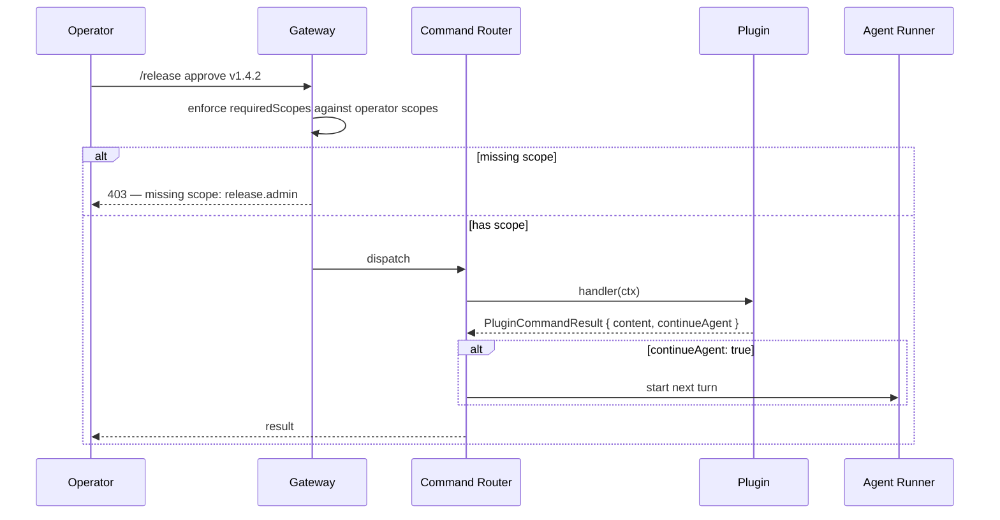

**Real-world example: Release Train Conductor**

```typescript
import { definePluginEntry } from "openclaw/plugin-sdk/plugin-entry";

export default definePluginEntry({
  id: "release-conductor",
  name: "Release Train Conductor",
  description: "/release plan / approve / rollback with operator scopes",
  register(api) {
    api.registerSessionExtension({
      namespace: "release",
      description: "Per-session release state: stage, version, approvedBy",
    });

    api.registerCommand({
      name: "release-plan",
      description: "Print the release plan for a version",
      acceptsArgs: true,
      requiredScopes: ["release.read"],
      handler: async (ctx) => {
        const plan = await loadReleasePlan(ctx.args ?? "");
        return { text: renderPlan(plan), continueAgent: false };
      },
    });

    api.registerCommand({
      name: "release-approve",
      description: "Approve a release for deployment",
      acceptsArgs: true,
      requiredScopes: ["release.admin"],
      handler: async (ctx) => {
        const version = (ctx.args ?? "").trim();
        if (!ctx.sessionKey) {
          return { text: "This command must run inside a bound session.", continueAgent: false };
        }
        if (!version) {
          return { text: "Usage: /release-approve <version>", continueAgent: false };
        }
        await api.enqueueNextTurnInjection({
          sessionKey: ctx.sessionKey,
          text: `Operator approved release of ${version}.`,
          placement: "prepend_context",
          idempotencyKey: `release-approve-${version}`,
        });
        return { text: `Approved ${version}.`, continueAgent: true };
      },
    });

    api.registerCommand({
      name: "release-rollback",
      description: "Roll back the most recent release",
      acceptsArgs: false,
      requiredScopes: ["release.admin"],
      handler: async (ctx) => {
        if (!ctx.sessionKey) {
          return { text: "This command must run inside a bound session.", continueAgent: false };
        }
        await api.enqueueNextTurnInjection({
          sessionKey: ctx.sessionKey,
          text: `Operator initiated release rollback.`,
          placement: "prepend_context",
        });
        return { text: "Rollback queued.", continueAgent: true };
      },
    });
  },
});
```

**Common pitfalls**

- **Don't forget `requiredScopes` for write commands.** The Gateway enforces
  scopes only when you declare them. A command without scopes is callable by
  any authenticated client.
- **`ownership: "reserved"` is bundled-only.** External plugins are rejected
  at registration. If you're a third-party plugin, pick a non-reserved name
  or use `nativeNames` to alias to one of yours.

---

### 9. Command-then-continue: `PluginCommandResult.continueAgent`

**What it does**

Lets a command result wake the agent immediately for one more turn after the
command's state mutation. The classic pattern is: operator clicks Approve,
plugin updates session state and queues a next-turn injection, returns
`continueAgent: true`, agent immediately resumes with the new context.

**Contract**

```typescript
export type PluginCommandResult = ReplyPayload & { continueAgent?: boolean };
```

**Minimal example**

```typescript
api.registerCommand({
  name: "deploy-approve",
  description: "Approve a pending deployment",
  acceptsArgs: false,
  requiredScopes: ["release.admin"],
  handler: async (ctx) => {
    if (!ctx.sessionKey) {
      return { text: "This command must run inside a bound session.", continueAgent: false };
    }
    await applyApprovalState(ctx.sessionKey, "approved"); // your helper
    await api.enqueueNextTurnInjection({
      sessionKey: ctx.sessionKey,
      text: "Deployment approved. Proceed.",
      placement: "prepend_context",
    });
    return { text: "Approved.", continueAgent: true };
  },
});
```

**Diagram**

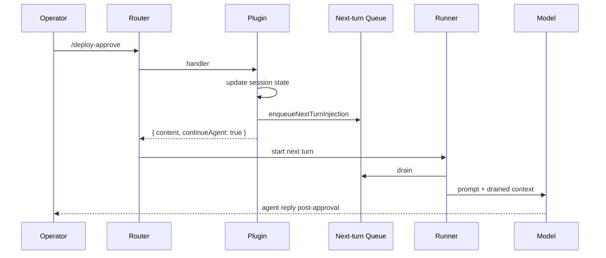

**Common pitfalls**

- **Pair with `enqueueNextTurnInjection` whenever the agent needs to know
  why it was woken.** Without an injection, the agent restarts with no
  visible cause; the model has to infer.
- **Don't use `continueAgent: true` for commands that don't change state.**
  The agent will just spin its wheels.

---

### 10. Data-only Control UI surfaces: `api.registerControlUiDescriptor(...)`

**What it does**

Lets a plugin contribute Control UI surfaces (session, tool, run, settings
panels) by shipping a JSON descriptor. The host renders. **No plugin-shipped
JavaScript reaches client surfaces.**

**Contract**

```typescript
// from src/plugins/host-hooks.ts
export type PluginControlUiDescriptor = {
  id: string;
  surface: "session" | "tool" | "run" | "settings";
  label: string;
  description?: string;
  placement?: string;
  schema?: PluginJsonValue;
  requiredScopes?: OperatorScope[];
};
```

The descriptor is exposed via the new Gateway method `plugins.uiDescriptors`,
which returns each descriptor with `pluginId` and `pluginName` injected by the
host.

**Minimal example**

```typescript
api.registerControlUiDescriptor({
  id: "review-status-panel",
  surface: "session",
  label: "Review Status",
  description: "Shows code-review approval/rejection counts for this session",
  placement: "sidebar",
  schema: {
    kind: "review-counts-card",
    fields: ["approvedCount", "rejectedCount", "totalReviewed"],
  },
});
```

**Diagram**

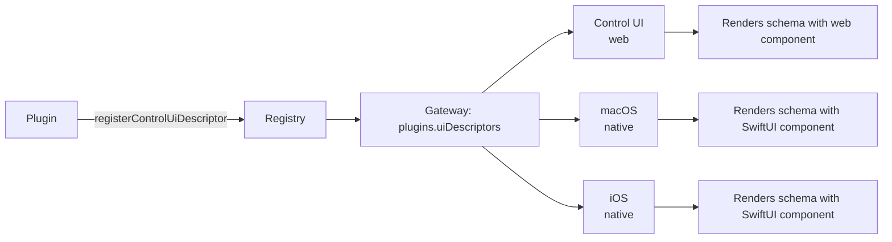

**Real-world example: Budget Meter card**

```typescript
api.registerControlUiDescriptor({
  id: "budget-meter",
  surface: "session",
  label: "Budget",
  description: "Per-session spend tracker",
  placement: "header",
  schema: {
    kind: "meter",
    valuePath: "pluginExtensions.budget-guard.budget.spent",
    capPath: "pluginExtensions.budget-guard.budget.capUsd",
    format: "usd",
    warningRatio: 0.8,
    criticalRatio: 1.0,
  },
});
```

The web Control UI, the macOS app, and the iOS app each ship a `meter`
renderer that knows how to read `valuePath` and `capPath` from the session
row. The plugin only ships data — never UI code.

**Common pitfalls**

- **The `schema` shape is plugin-and-renderer-defined.** Pick a clear
  `kind` field (or any naming convention you like) so renderers can switch.
  The host doesn't validate the shape beyond JSON-compatibility.
- **No XSS surface, but no client-side compute either.** If your plugin
  needs to do anything dynamic in the client (formatting, animations,
  conditional rendering beyond what the schema supports), build a richer
  generic renderer in clients first; don't try to ship JS through `schema`.

---

### 11. Sanitized event subscriptions: `api.registerAgentEventSubscription(...)`

**What it does**

Subscribes to host-owned, sanitized agent events (run lifecycle, tool calls,
turn boundaries) with plugin lifecycle ownership. The subscription is torn
down when the plugin is disabled, restarted, deleted, or reset.

**Contract**

```typescript
// from src/plugins/host-hooks.ts
export type PluginAgentEventSubscriptionRegistration = {
  id: string;
  description?: string;
  streams?: AgentEventStream[];
  handle: (
    event: AgentEventPayload,
    ctx: {
      // run-scoped — runId is implied by the firing event
      getRunContext: <T extends PluginJsonValue = PluginJsonValue>(
        namespace: string,
      ) => T | undefined;
      setRunContext: (namespace: string, value: PluginJsonValue) => void;
      clearRunContext: (namespace?: string) => void;
    },
  ) => void | Promise<void>;
};
```

Inside `handle`, the run-context API is **scoped to the firing event** — you
don't pass `runId` explicitly. Use the top-level `api.setRunContext({runId,
namespace, ...})` if you need to write context outside an event handler.

**Minimal example**

```typescript
api.registerAgentEventSubscription({
  id: "incident-watcher.run-watcher",
  description: "Open an incident timeline on run start",
  streams: ["run"],
  handle: (event, ctx) => {
    if (event.kind === "run_started" && event.runId) {
      ctx.setRunContext("incident", { startedAt: Date.now() });
    }
    if (event.kind === "run_failed" || event.kind === "run_terminal") {
      const incident = ctx.getRunContext<{ startedAt: number }>("incident");
      if (incident) {
        api.logger.info(`incident closed after ${Date.now() - incident.startedAt}ms`);
      }
    }
  },
});
```

**Diagram**

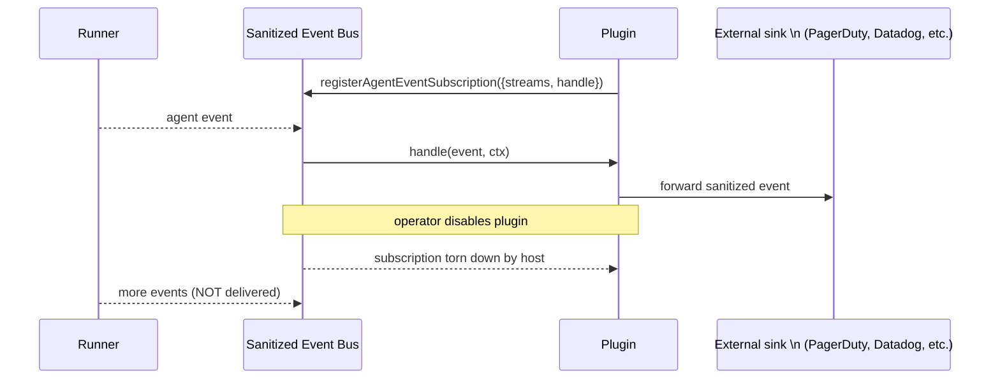

**Real-world example: Pager Bridge**

```typescript
import { definePluginEntry } from "openclaw/plugin-sdk/plugin-entry";

export default definePluginEntry({
  id: "pager-bridge",
  name: "Pager Bridge",
  description: "Forward sanitized run-failure events to PagerDuty",
  register(api) {
    let pagerClient = createPagerClient(api.pluginConfig); // your helper

    api.registerAgentEventSubscription({
      id: "pager-bridge.failures",
      description: "Run lifecycle failures forwarded to PagerDuty",
      streams: ["run", "tool"],
      handle: async (event) => {
        if (event.kind === "run_failed") {
          await pagerClient.trigger({
            severity: "critical",
            summary: `Run ${event.runId} failed: ${event.errorClass ?? "unknown"}`,
          });
          return;
        }
        if (event.kind === "tool_call_failed" && event.severity === "high") {
          await pagerClient.trigger({
            severity: "warning",
            summary: `Tool ${event.toolName} failed`,
          });
        }
      },
    });

    api.registerRuntimeLifecycle({
      id: "pager-bridge.lifecycle",
      cleanup: async ({ reason }) => {
        api.logger.info(`pager-bridge cleanup reason=${reason}`);
        await pagerClient.close();
      },
    });
  },
});
```

**Common pitfalls**

- **Events are sanitized.** You don't see raw prompts, tool params with
  secrets, or provider request bodies. Use this for telemetry and routing,
  not deep introspection.
- **`handle` must be idempotent.** Restart-preserved subscriptions may see
  the same event class on restart depending on stream semantics.
- **Pair every long-lived resource with a `registerRuntimeLifecycle`.**
  Event subscription teardown is automatic; sockets/timers you opened are
  not.

---

### 12. Per-run plugin context: `setRunContext` / `getRunContext` / `clearRunContext`

**What it does**

Stores namespaced JSON-compatible per-run state. Cleared on terminal run
events. Two flavors — top-level on `api`, or run-scoped inside an event
handler.

**Contract**

```typescript
// Top-level on api — needs explicit runId
api.setRunContext(patch: PluginRunContextPatch): boolean;
api.getRunContext<T>(params: PluginRunContextGetParams): T | undefined;
api.clearRunContext(params: { runId: string; namespace?: string }): void;

type PluginRunContextPatch = {
  runId: string;
  namespace: string;
  value?: PluginJsonValue;
  unset?: boolean;
};
type PluginRunContextGetParams = { runId: string; namespace: string };

// Inside an agent-event-subscription handler ctx — runId is implied
ctx.setRunContext(namespace: string, value: PluginJsonValue): void;
ctx.getRunContext<T>(namespace: string): T | undefined;
ctx.clearRunContext(namespace?: string): void;
```

`setRunContext` returns `true` on success; `false` typically means there is
no active run for the supplied `runId` (already terminal, never started, or
garbage-collected).

**Minimal example (in-handler form)**

```typescript
api.registerAgentEventSubscription({
  id: "billing.tagger",
  streams: ["run", "tool"],
  handle: (event, ctx) => {
    if (event.kind === "run_started" && event.runId) {
      const tenantId = inferTenantFromSession(event.sessionKey); // your helper
      ctx.setRunContext("billing", { tenantId });
      return;
    }
    if (event.kind === "tool_call_ended" && event.toolName) {
      const billing = ctx.getRunContext<{ tenantId: string }>("billing");
      if (!billing) return;
      emitBillingRow({ tenantId: billing.tenantId, tool: event.toolName });
    }
  },
});
```

**Minimal example (top-level form)**

```typescript
api.on("agent_end", (event, ctx) => {
  if (!event.runId || !ctx.runId) return;
  const summary = api.getRunContext<{ steps: number }>({
    runId: event.runId,
    namespace: "review",
  });
  api.logger.info(`run ${event.runId} ended, steps=${summary?.steps ?? 0}`);
  api.clearRunContext({ runId: event.runId, namespace: "review" });
});
```

**Diagram**

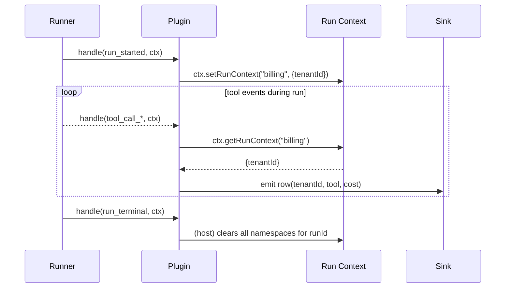

**Common pitfalls**

- **Don't roll your own global maps keyed by `runId`.** That's exactly what
  this contract is for. The host clears it deterministically; your map will
  leak if you forget a cleanup edge case.
- **Don't store cross-run state here.** Use `registerSessionExtension` for
  session-lifetime state.
- **In top-level form, check the `boolean` return.** If `false`, the run
  is gone — your write was a no-op. Common during reload or terminal
  races.

---

### 13. Session scheduler jobs: `api.registerSessionSchedulerJob(...)`

**What it does**

Plugin-owned scheduled work scoped to a session. Cleanup is host-driven on
disable / reset / delete / restart, with restart-preserved jobs skipping
teardown callbacks (so jobs aren't double-run after a host restart).

**Contract**

```typescript
// from src/plugins/host-hooks.ts
export type PluginSessionSchedulerJobRegistration = {
  id: string;
  sessionKey: string;
  kind: string;
  description?: string;
  cleanup?: (ctx: {
    reason: PluginHostCleanupReason;
    sessionKey: string;
    jobId: string;
  }) => void | Promise<void>;
};

export type PluginSessionSchedulerJobHandle = {
  id: string;
  pluginId: string;
  sessionKey: string;
  kind: string;
};

api.registerSessionSchedulerJob(
  job: PluginSessionSchedulerJobRegistration,
): PluginSessionSchedulerJobHandle | undefined;
```

Returns `undefined` if registration fails (for example, duplicate job id for
this plugin/session). The job ownership is `(pluginId, sessionKey, jobId)`.

**Minimal example**

```typescript
const sessionKey = "agent:main:main"; // from the command/event handler context
const handle = api.registerSessionSchedulerJob({
  id: "follow-up-9am",
  sessionKey,
  kind: "follow-up",
  description: "Wake the agent at 9am with a follow-up summary",
  cleanup: async ({ reason, jobId }) => {
    api.logger.info(`scheduler cleanup job=${jobId} reason=${reason}`);
  },
});
```

**Diagram**

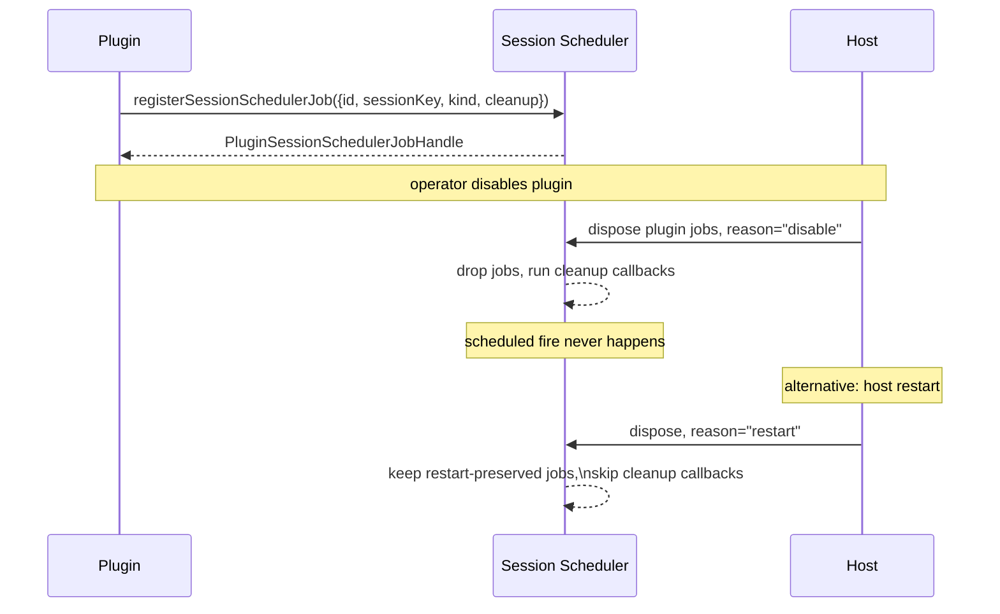

**Real-world example: Quiet Hours**

```typescript
import { definePluginEntry } from "openclaw/plugin-sdk/plugin-entry";

export default definePluginEntry({
  id: "quiet-hours",
  name: "Quiet Hours",
  description: "Suppress heartbeat nudges during configured quiet hours",
  register(api) {
    api.registerAgentEventSubscription({
      id: "quiet-hours.session-watcher",
      streams: ["session"],
      handle: (event) => {
        if (event.kind !== "session_start" || !event.sessionKey) return;

        // Schedule a "resume nudges" job for the next non-quiet hour.
        const resumeAt = computeNextResumeTime(api.pluginConfig.quietWindow);
        api.registerSessionSchedulerJob({
          id: `resume-nudges-${event.sessionKey}`,
          sessionKey: event.sessionKey,
          kind: "resume-nudges",
          description: `Re-enable heartbeat nudges at ${new Date(resumeAt).toISOString()}`,
        });
      },
    });

    api.registerRuntimeLifecycle({
      id: "quiet-hours.lifecycle",
      cleanup: async ({ reason }) => {
        api.logger.info(`quiet-hours runtime cleanup reason=${reason}`);
        // Scheduler jobs are cleaned up by the host already; this is for
        // plugin-owned timers/state if any.
      },
    });
  },
});
```

**Common pitfalls**

- **Pick stable, scoped `id`s.** Job ownership is `(pluginId, jobId)`;
  include the session key in the job id when a plugin needs one scheduled job
  per session. Duplicate job ids for the same plugin are rejected even when
  their payloads target different sessions.
- **Don't assume the cleanup callback fires on restart.**
  Restart-preserved jobs deliberately skip teardown. If you need
  deterministic teardown on restart, use `registerRuntimeLifecycle` with
  `reason === "restart"`.
- **Cleanup is best-effort.** If your callback throws, the host keeps the
  record retryable. Don't rely on cleanup for critical state — write
  through to durable storage from the job firing path itself.

---

### 14. Runtime lifecycle cleanup: `api.registerRuntimeLifecycle(...)`

**What it does**

Lets the plugin clean up out-of-band resources (sockets, polling timers,
file watchers, telemetry buffers) when the plugin is disabled, reset,
deleted, or restarted. The quiet feature that makes every other contract
safe to ship.

**Contract**

```typescript
// from src/plugins/host-hooks.ts
export type PluginRuntimeLifecycleRegistration = {
  id: string;
  description?: string;
  cleanup?: (ctx: {
    reason: PluginHostCleanupReason; // "disable" | "reset" | "delete" | "restart"
    sessionKey?: string;
    runId?: string;
  }) => void | Promise<void>;
};
```

**Minimal example**

```typescript
api.registerRuntimeLifecycle({
  id: "my-plugin.lifecycle",
  description: "Close webhook subscriptions on plugin teardown",
  cleanup: async ({ reason }) => {
    await myWebhookClient.close();
    api.logger.info(`my-plugin lifecycle cleanup reason=${reason}`);
  },
});
```

**Diagram**

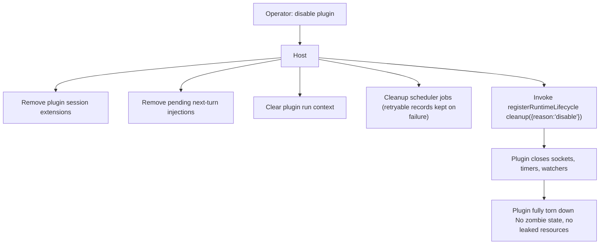

**Common pitfalls**

- **Make `cleanup` idempotent.** It can be called more than once across the
  plugin's lifetime; design it to be a no-op when there's nothing left to
  clean.
- **Don't block on long teardown.** The host awaits your callback but
  long-running cleanup makes operator UX bad. Push slow work to fire-and-
  forget queues if necessary.
- **Restart vs. delete are different reasons.** `restart` preserves the
  plugin's installation; `delete` removes it entirely. Use the `reason`
  field to decide whether to keep on-disk caches or wipe them.

---

### 15. The cleanup matrix at a glance

The four `PluginHostCleanupReason` values fire different combinations of
host-driven cleanup. This table is the contract:

| Reason    | Persistent extensions  | Pending injections | Run context | Scheduler jobs                            | Lifecycle callback             |
| --------- | ---------------------- | ------------------ | ----------- | ----------------------------------------- | ------------------------------ |
| `restart` | preserved              | preserved          | preserved   | preserved (cleanup callbacks **skipped**) | called with `reason:"restart"` |
| `disable` | removed                | removed            | cleared     | removed                                   | called with `reason:"disable"` |
| `reset`   | removed (for session)  | removed (session)  | cleared     | removed (session)                         | called with `reason:"reset"`   |
| `delete`  | removed (all sessions) | removed (all)      | cleared     | removed (all)                             | called with `reason:"delete"`  |

> **Why restart is special.** Restart is the only reason where scheduler
> jobs survive but cleanup callbacks are _skipped_. The reason: cleanup
> callbacks for scheduled jobs typically free resources the job needs to
> fire. If you call them on restart, the surviving job has nothing left to
> do when it fires. So the host preserves both the job and its underlying
> resources, and the cleanup callback runs only when the job actually
> stops being preserved (disable / reset / delete).

---

## Composition recipes

The single-hook recipes above show how each contract behaves alone. Real
plugins compose 2–6 hooks. Here are the canonical archetypes, fully
worked.

### Recipe A: Approval workflow plugin

**Goal.** Operator runs a sensitive command (deploy, release, escalation).
The plugin pauses execution, opens an approval card in Control UI, and
resumes the agent on approve / deny.

**Composes:** session extension + UI descriptor + scoped command +
`continueAgent` + next-turn injection + cleanup.

**Architecture**

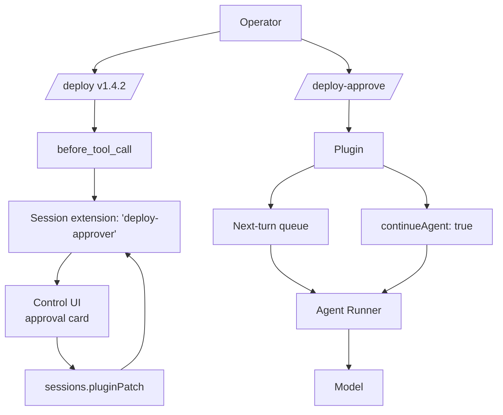

**End-to-end sequence**

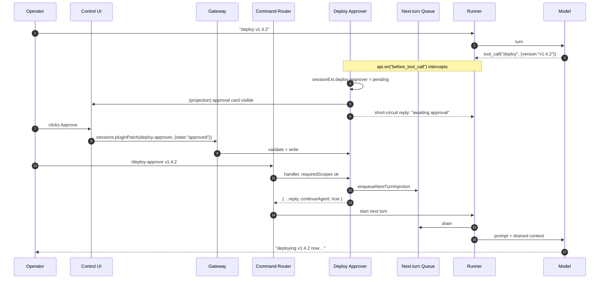

**Code**

```typescript
// deploy-approver/index.ts
import { definePluginEntry } from "openclaw/plugin-sdk/plugin-entry";

type DeployApproverState = {
  state: "pending" | "approved" | "denied";
  version?: string;
  approvedBy?: string;
  reason?: string;
  updatedAt: number;
};

export default definePluginEntry({
  id: "deploy-approver",
  name: "Deploy Approver",
  description: "Pause deploys for human approval; resume agent on decision",
  register(api) {
    api.registerSessionExtension({
      namespace: "deploy-approver",
      description: "Per-session deploy approval state",
    });

    api.registerControlUiDescriptor({
      id: "deploy-approver-card",
      surface: "session",
      label: "Deploy approval",
      placement: "sidebar",
      schema: {
        kind: "approval-card",
        valuePath: "pluginExtensions.deploy-approver.deploy-approver",
        actions: [
          { kind: "approve", label: "Approve", command: "/deploy-approve" },
          { kind: "deny", label: "Deny", command: "/deploy-deny" },
        ],
      },
    });

    api.on("before_tool_call", async (event, ctx) => {
      if (event.toolName !== "deploy") return;
      if (!ctx.sessionKey) return;
      // Mark pending and short-circuit; the operator will run /deploy-approve next.
      await markPending(ctx.sessionKey, String(event.params.version ?? ""));
      return {
        block: true,
        blockReason: "Deploy paused; awaiting operator approval. Use /deploy-approve to continue.",
      };
    });

    api.registerCommand({
      name: "deploy-approve",
      description: "Approve the pending deployment",
      acceptsArgs: true,
      requiredScopes: ["release.admin"],
      handler: async (ctx) => {
        const version = (ctx.args ?? "").trim();
        if (!ctx.sessionKey) {
          return { text: "This command must run inside a bound session.", continueAgent: false };
        }
        await api.enqueueNextTurnInjection({
          sessionKey: ctx.sessionKey,
          text: `Operator approved deployment of ${version || "the pending version"}.`,
          placement: "prepend_context",
          idempotencyKey: `approve-${version || ctx.sessionKey}`,
        });
        return { text: "Approved.", continueAgent: true };
      },
    });

    api.registerCommand({
      name: "deploy-deny",
      description: "Deny the pending deployment",
      acceptsArgs: true,
      requiredScopes: ["release.admin"],
      handler: async (ctx) => {
        if (!ctx.sessionKey) {
          return { text: "This command must run inside a bound session.", continueAgent: false };
        }
        await api.enqueueNextTurnInjection({
          sessionKey: ctx.sessionKey,
          text: `Operator denied deployment. Cancel and explain to user.`,
          placement: "prepend_context",
        });
        return { text: "Denied.", continueAgent: true };
      },
    });

    api.registerRuntimeLifecycle({
      id: "deploy-approver.lifecycle",
      cleanup: async ({ reason }) => {
        api.logger.info(`deploy-approver cleanup reason=${reason}`);
      },
    });
  },
});

async function markPending(_sessionKey: string, _version: string): Promise<void> {
  // Patch in via sessions.pluginPatch from a host RPC, or from a co-registered
  // gateway method. Sketch only; production code lives in your plugin.
}
```

---

### Recipe B: Workspace policy gate

**Goal.** Bundled-only host policy. Block any tool call whose path argument
escapes the configured workspace root, before any third-party plugin can
intervene.

**Composes:** trusted tool policy + tool metadata.

**Architecture**

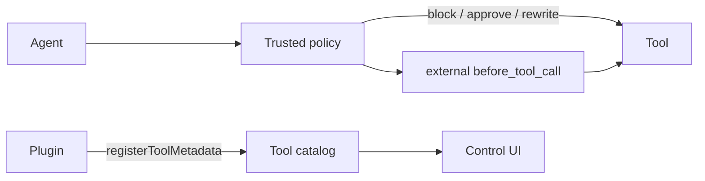

**Code**

```typescript
// workspace-policy/index.ts (BUNDLED-ONLY plugin)
import { definePluginEntry } from "openclaw/plugin-sdk/plugin-entry";

const PATH_TOOL_NAMES = new Set(["write_file", "delete_file", "rename_file", "exec_in_dir"]);

export default definePluginEntry({
  id: "workspace-policy",
  name: "Workspace Policy",
  description: "Block writes outside the configured workspace root",
  register(api) {
    const workspaceRoot = String(api.pluginConfig.root ?? "");

    api.registerTrustedToolPolicy({
      id: "workspace-policy.path-confinement",
      description: "Reject path-bearing tool calls outside workspace root",
      evaluate: (event) => {
        if (!PATH_TOOL_NAMES.has(event.toolName)) return;
        const raw = String(event.params?.path ?? "");
        const normalized = normalize(raw); // your helper
        if (!normalized.startsWith(workspaceRoot + "/")) {
          return {
            allow: false,
            reason: `path "${raw}" is outside workspace root`,
          };
        }
        // Rewrite to canonical form so downstream hooks see consistent params.
        if (normalized !== raw) {
          return { params: { ...event.params, path: normalized } };
        }
        return undefined;
      },
    });

    for (const name of PATH_TOOL_NAMES) {
      api.registerToolMetadata({
        toolName: name,
        risk: "medium",
        tags: ["workspace-confined"],
      });
    }
  },
});

function normalize(p: string): string {
  // Resolve to absolute path, collapse "..", reject symlink escapes, etc.
  return p; // sketch
}
```

---

### Recipe C: Background lifecycle monitor

**Goal.** Watch long-running runs. Open an incident timeline, schedule
periodic ticks, surface elapsed time only on heartbeats, clean up on
disable.

**Composes:** event subscription + run context + scheduler job + heartbeat
contribution + UI descriptor + runtime lifecycle.

**Architecture**

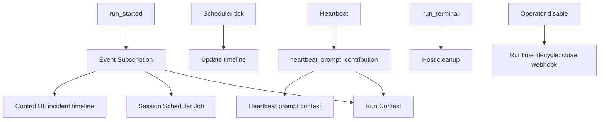

**End-to-end sequence**

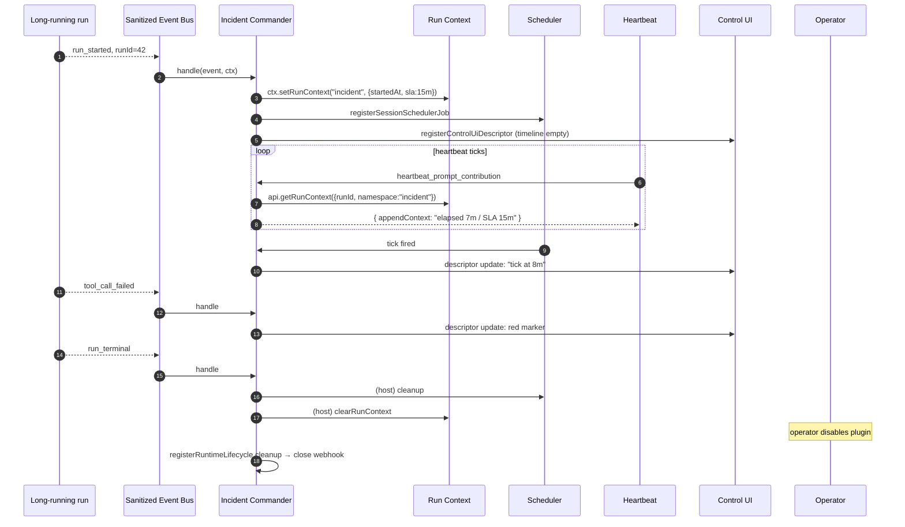

**Code**

```typescript
// incident-commander/index.ts
import { definePluginEntry } from "openclaw/plugin-sdk/plugin-entry";

type IncidentState = { startedAt: number; slaMs: number };

const SLA_BY_AGENT: Record<string, number> = {
  default: 15 * 60_000,
  "release-bot": 30 * 60_000,
};

export default definePluginEntry({
  id: "incident-commander",
  name: "Incident Commander",
  description: "Track long-running runs with timeline + heartbeat-only nudges",
  register(api) {
    api.registerControlUiDescriptor({
      id: "incident-timeline",
      surface: "run",
      label: "Incident timeline",
      placement: "footer",
      schema: { kind: "timeline", source: "incident-commander" },
    });

    api.registerAgentEventSubscription({
      id: "incident-commander.run-watcher",
      streams: ["run", "tool"],
      handle: async (event, ctx) => {
        if (event.kind === "run_started" && event.runId) {
          const sla = SLA_BY_AGENT[event.agentId ?? ""] ?? SLA_BY_AGENT.default;
          ctx.setRunContext("incident", { startedAt: Date.now(), slaMs: sla });
          if (event.sessionKey) {
            api.registerSessionSchedulerJob({
              id: `incident-tick-${event.runId}`,
              sessionKey: event.sessionKey,
              kind: "incident-tick",
            });
          }
        }
        if (event.kind === "tool_call_failed") {
          api.logger.warn(
            `incident-commander tool fail in run=${event.runId} tool=${event.toolName}`,
          );
        }
        if (event.kind === "run_terminal") {
          ctx.clearRunContext("incident");
        }
      },
    });

    api.on("heartbeat_prompt_contribution", (event) => {
      if (!event.sessionKey || !event.agentId) return;
      // Look up the latest run context the heartbeat path knows about.
      // (In production, snapshot the runId in your run-watcher and read from there.)
      return undefined; // sketch — replace with elapsed/remaining computation
    });

    api.registerRuntimeLifecycle({
      id: "incident-commander.lifecycle",
      cleanup: async ({ reason }) => {
        api.logger.info(`incident-commander cleanup reason=${reason}`);
        // Close any external webhooks, flush incident store, etc.
      },
    });
  },
});
```

---

### Recipe D: Setup / onboarding wizard

**Goal.** First-run onboarding flow that walks the operator through provider
auth, workspace selection, and a smoke test. Each step persists progress so
operators can resume across reloads.

**Composes:** session extension + scoped commands + UI descriptor.

**Architecture**

```mermaid
flowchart LR
  Op[Operator] --> Card[UI: setup card]
  Card --> Cmd1[/setup-step provider/]
  Card --> Cmd2[/setup-step workspace/]
  Card --> Cmd3[/setup-step smoke-test/]
  Cmd1 --> SE[Session extension: 'setup']
  Cmd2 --> SE
  Cmd3 --> SE
  SE --> Card
```

**Code**

```typescript
// setup-wizard/index.ts
import { definePluginEntry } from "openclaw/plugin-sdk/plugin-entry";

type SetupStep = "provider" | "workspace" | "smoke-test";
type SetupState = {
  completed: SetupStep[];
  current: SetupStep | "done";
};

export default definePluginEntry({
  id: "setup-wizard",
  name: "Setup Wizard",
  description: "Multi-step first-run onboarding",
  register(api) {
    api.registerSessionExtension({
      namespace: "setup",
      description: "First-run onboarding progress",
    });

    api.registerControlUiDescriptor({
      id: "setup-card",
      surface: "session",
      label: "Setup",
      placement: "header",
      schema: {
        kind: "wizard-card",
        valuePath: "pluginExtensions.setup-wizard.setup",
        steps: [
          { id: "provider", label: "Choose a provider" },
          { id: "workspace", label: "Pick your workspace" },
          { id: "smoke-test", label: "Run a smoke test" },
        ],
      },
    });

    api.registerCommand({
      name: "setup-advance",
      description: "Mark the current onboarding step complete",
      acceptsArgs: true,
      requiredScopes: ["operator.write"],
      handler: async (ctx) => {
        const step = (ctx.args ?? "").trim() as SetupStep;
        if (!step) {
          return { text: "Usage: /setup-advance <provider|workspace|smoke-test>" };
        }
        // In production: read state, append, write back via sessions.pluginPatch
        return { text: `Marked ${step} complete.`, continueAgent: false };
      },
    });
  },
});
```

---

### Recipe E: Review assistant

**Goal.** Watch tool failures, queue diagnostic context for the next turn,
tag review-relevant tools in the catalog, surface session review status.

**Composes:** event subscription + next-turn injection + tool metadata + UI
descriptor.

```typescript
// review-assistant/index.ts
import { definePluginEntry } from "openclaw/plugin-sdk/plugin-entry";

const REVIEW_TOOLS = ["run_tests", "lint", "typecheck", "build"];

export default definePluginEntry({
  id: "review-assistant",
  name: "Review Assistant",
  description: "Auto-diagnose test/build failures and resurface them next turn",
  register(api) {
    api.registerSessionExtension({
      namespace: "review",
      description: "Per-session review summary: lastFailure, lastDiagnosis",
    });

    api.registerControlUiDescriptor({
      id: "review-summary-card",
      surface: "session",
      label: "Review",
      placement: "sidebar",
      schema: {
        kind: "review-summary",
        valuePath: "pluginExtensions.review-assistant.review",
      },
    });

    for (const name of REVIEW_TOOLS) {
      api.registerToolMetadata({
        toolName: name,
        tags: ["review"],
      });
    }

    api.registerAgentEventSubscription({
      id: "review-assistant.failure-watcher",
      streams: ["tool"],
      handle: async (event) => {
        if (event.kind !== "tool_call_failed") return;
        if (!event.sessionKey || !event.toolName) return;
        if (!REVIEW_TOOLS.includes(event.toolName)) return;

        const summary = await summarizeFailure(event); // your helper
        await api.enqueueNextTurnInjection({
          sessionKey: event.sessionKey,
          text: `Review notes for ${event.toolName} failure:\n\n${summary}`,
          placement: "prepend_context",
          idempotencyKey: `review-fail-${event.runId}-${event.toolCallId}`,
          ttlMs: 10 * 60_000,
        });
      },
    });

    api.registerRuntimeLifecycle({
      id: "review-assistant.lifecycle",
      cleanup: async ({ reason }) => {
        api.logger.info(`review-assistant cleanup reason=${reason}`);
      },
    });
  },
});

async function summarizeFailure(_event: unknown): Promise<string> {
  return "(failure summary placeholder)";
}
```

---

## Patterns and pitfalls

## Compose, don't subclass

Each contract is independent. Don't try to wrap `registerSessionExtension`
or `registerCommand` into a higher-level abstraction inside your plugin —
the SDK already provides the right granularity. Two contracts that always
appear together (session extension + UI descriptor) are still better as
two separate registrations than one fused helper.

## Keep handlers cheap

`heartbeat_prompt_contribution`, `agent_turn_prepare`, and event-subscription
`handle` callbacks all run on hot paths. Cache pre-computed values in
your closure or in run/session context; avoid synchronous I/O.

## Prefer projection over duplication

If clients need to read plugin state, use `registerSessionExtension({project})`
rather than copying the same data into a custom Gateway method. Two
plugins reading the same row see the same projection; clients only need to
learn `pluginExtensions[<id>][<namespace>]`.

## Prefer next-turn injection over `before_prompt_build`

For one-shot context (post-approval continuation, post-failure diagnosis,
operator-triggered events), use `enqueueNextTurnInjection`. Reserve
`before_prompt_build` for context that genuinely belongs in **every**
turn (memory adjuncts, capability hints, tool documentation).

## Pair every `register*` that opens a resource with a `registerRuntimeLifecycle`

Event subscriptions, session extensions, and scheduler jobs are torn down by
the host. Sockets, polling timers, file watchers, telemetry buffers, and
external clients **are not**. If you opened it, register a lifecycle
cleanup for it. The host calls cleanup on disable / reset / delete /
restart — write idempotently.

## Test against the contract suite

`src/plugins/contracts/host-hooks.contract.test.ts` is the authoritative
behavior spec. When you add a new plugin that exercises a host-hook surface,
mirror its assertions in your own tests:

- For session extensions: assert that a patch round-trips through
  `sessions.pluginPatch` and your `project()` callback.
- For next-turn injections: assert that two enqueues with the same
  idempotency key produce one delivered injection.
- For trusted tool policy: assert that `allow:false` becomes
  `block: true, blockReason` downstream.
- For commands: assert that `requiredScopes` is enforced for both
  permitted and rejected callers.
- For UI descriptors: assert the `plugins.uiDescriptors` Gateway response
  includes your descriptor with `pluginId` injected.
- For event subscriptions: assert that disable tears the subscription
  down and post-disable events are not delivered.
- For run context: assert that terminal run events clear all
  namespaces.
- For scheduler jobs: assert that each cleanup reason produces the
  documented behavior (especially that `restart` skips teardown
  callbacks).

---

## Cleanup matrix end-to-end

This sequence is the canonical "operator disables a plugin that uses every
host-hook contract":

```mermaid
sequenceDiagram
  autonumber
  participant Op as Operator
  participant Host
  participant Reg as Plugin Registry
  participant Store as Session Store
  participant Q as Next-turn Queue
  participant Ctx as Run Context
  participant Sched as Scheduler
  participant Plug as Plugin

  Op->>Host: disable plugin "incident-commander"
  Host->>Reg: deregister all surfaces
  Host->>Store: remove pluginExtensions[incident-commander][*]
  Host->>Q: drop queued injections for plugin
  Host->>Ctx: clear run-context namespaces for plugin
  Host->>Sched: dispose plugin scheduler jobs (call cleanup callbacks)
  Host->>Plug: registerRuntimeLifecycle.cleanup({reason:"disable"})
  Plug->>Plug: close webhooks, timers, watchers, flush telemetry
  Plug-->>Host: cleanup resolved
  Host-->>Op: plugin disabled — no zombie state, no leaked resources
```

Compare to **restart** (host preserves jobs, skips teardown callbacks, but
still calls runtime lifecycle for resource cleanup):

```mermaid
sequenceDiagram
  autonumber
  participant Op as Operator
  participant Host
  participant Sched as Scheduler
  participant Plug as Plugin

  Op->>Host: restart plugin "incident-commander"
  Host->>Sched: dispose, reason="restart"
  Sched-->>Sched: keep restart-preserved jobs, SKIP cleanup callbacks
  Host->>Plug: registerRuntimeLifecycle.cleanup({reason:"restart"})
  Plug->>Plug: close webhooks, timers (will reopen on re-register)
  Note over Sched: jobs survive — fire normally after restart
```

---

## Testing your plugin against host hooks

The contract test file (`src/plugins/contracts/host-hooks.contract.test.ts`)
is 1,637 lines of executable spec. Every plugin that touches a host-hook
contract should have its own coverage that mirrors the relevant subset.

A reasonable pattern:

```typescript
// my-plugin/host-hooks.test.ts
import { describe, expect, it } from "vitest";
import { createTestPluginRegistry } from "test/helpers/plugins/plugin-api";
import myPlugin from "./index";

describe("my-plugin host hooks", () => {
  it("registers session extension and projects state", async () => {
    const harness = createTestPluginRegistry({ plugins: [myPlugin] });
    await harness.boot();

    const result = await harness.callGatewayMethod("sessions.pluginPatch", {
      key: harness.testSessionKey,
      pluginId: "my-plugin",
      namespace: "my-namespace",
      value: { hello: "world" },
    });

    expect(result.ok).toBe(true);
    const row = await harness.readSessionRow(harness.testSessionKey);
    expect(row.pluginExtensions["my-plugin"]["my-namespace"]).toMatchObject({
      hello: "world",
    });
  });

  it("queues exactly-once injections by idempotency key", async () => {
    const harness = createTestPluginRegistry({ plugins: [myPlugin] });
    await harness.boot();

    const a = await harness.api.enqueueNextTurnInjection({
      sessionKey: harness.testSessionKey,
      text: "hello",
      idempotencyKey: "k1",
    });
    const b = await harness.api.enqueueNextTurnInjection({
      sessionKey: harness.testSessionKey,
      text: "hello again",
      idempotencyKey: "k1",
    });

    expect(a.enqueued).toBe(true);
    expect(b.enqueued).toBe(false);
    expect(b.id).toBe(a.id);
  });

  it("tears down event subscription on disable", async () => {
    const harness = createTestPluginRegistry({ plugins: [myPlugin] });
    await harness.boot();
    const seen: string[] = [];
    harness.api.registerAgentEventSubscription({
      id: "test.recorder",
      streams: ["run"],
      handle: (event) => {
        seen.push(event.kind);
      },
    });

    await harness.emitAgentEvent({ kind: "run_started", runId: "r1" });
    await harness.disablePlugin("my-plugin");
    await harness.emitAgentEvent({ kind: "run_terminal", runId: "r1" });

    expect(seen).toEqual(["run_started"]);
  });
});
```

The test helpers in `test/helpers/plugins/plugin-api.ts` expose enough
host fixtures to exercise every contract above.

---

## Closing

If you've made it this far, you have the full picture: 14 host-hook
contracts, 5 composition recipes, the cleanup matrix, and a testing
pattern. The host-hook contract is small on purpose — every surface here
solves one problem cleanly, composes with the others, and cleans up after
itself.

If you're building a plugin and a contract above doesn't fit your need,
that's worth opening an issue or RFC discussion before working around it.
The right answer is usually a small new contract; the wrong answer is
patching core. Plan Mode is one tenant. Yours can be the next.

## Related

<CardGroup cols={2}>
  <Card title="Plugin SDK overview" icon="book" href="/plugins/sdk-overview">
    Reference for every registration method on `OpenClawPluginApi`.
  </Card>
  <Card title="Plugin hooks" icon="bolt" href="/plugins/hooks">
    The full hook catalog (agent turn, tools, messages, sessions, lifecycle).
  </Card>
  <Card title="Building plugins" icon="cube" href="/plugins/building-plugins">
    Step-by-step guide to scaffolding a new plugin.
  </Card>
  <Card title="Plugin internals" icon="diagram-project" href="/plugins/architecture-internals">
    Deep architecture and capability model.
  </Card>
</CardGroup>
