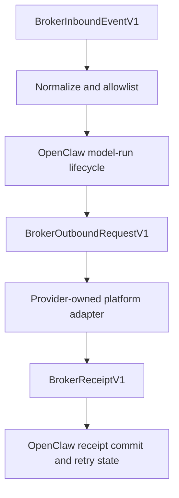

The channel broker SDK lives at `openclaw/plugin-sdk/channel-broker`. It is a
small, versioned protocol surface for providers that want OpenClaw to own common
message semantics while the provider owns platform mechanics.

## Ownership model

This SDK is intentionally a protocol, not another platform-specific channel.
OpenClaw keeps the stable semantics that every channel needs: sessions,
allowlists, routing, streaming policy, `/verbose`, durable final sends,
receipts, retries, and audit fields. Broker providers keep the platform-specific
work: bot/app API calls, bridge daemons, native identifiers, attachment hosting,
device state, and regional or account constraints.



That split is what lets a provider fix one messaging system without forcing
OpenClaw maintainers to rework every native channel plugin that shares the same
streaming, verbose, receipt, or routing behavior.

## V1 types

```typescript
import type {
  BrokerInboundEventV1,
  BrokerOutboundRequestV1,
  BrokerReceiptV1,
  BrokerProviderCapabilities,
  BrokerProviderHealth,
} from "openclaw/plugin-sdk/channel-broker";
```

With the conformance layer installed, V1 uses signed inbound HTTP webhooks and
outbound HTTP calls. WebSocket and provider polling transports are intentionally
deferred so providers can first prove the stable message lifecycle contract.

Inbound webhook providers should send `x-openclaw-broker-provider` with their
configured provider id, `x-openclaw-broker-timestamp`, and
`x-openclaw-broker-signature`. The signature is an HMAC SHA-256 over
`${timestamp}.${rawBody}` using the provider signing secret. OpenClaw uses the
provider header only to select the configured signing secret and body limit
before authentication; the JSON payload `providerId` must still match the
header, and the raw body must verify before the event is accepted. Providers
that include inline `contentBase64` attachments should always send the provider
header so legitimate media payloads use the signed-provider body limit instead
of the smaller anonymous request limit.

## Outbound request

`BrokerOutboundRequestV1` includes:

- `requestId`, `providerId`, `platform`, and optional provider `accountId`.
- `conversation` with id, type, parent id, thread id, and title.
- `mode`, including final sends, preview updates, preview finalization, typing,
  and reactions.
- `payloads` with text, attachments, and provider-owned `channelData`.
- `relation` for reply, silent, and native quote references.
- `preview` on preview finalization requests with the original preview message
  ids and edit/delete tokens.
- `requirements` describing durable delivery features OpenClaw expects.

Providers should return `BrokerReceiptV1` with stable message ids, status,
optional edit/delete tokens, timestamps, and native metadata.

## Target helpers

Use these helpers to normalize provider target ids:

```typescript
import {
  BROKER_KNOWN_PLATFORM_IDS,
  BROKER_PLATFORM_ALIASES,
  buildBrokerConversationTarget,
  createBrokerOutboundRequest,
  createBrokerReceipt,
  normalizeBrokerKnownPlatformId,
  normalizeBrokerPlatformId,
  parseBrokerConversationTarget,
} from "openclaw/plugin-sdk/channel-broker";
```

`buildBrokerConversationTarget({ platform: "Telegram", conversationId:
"chat 123", threadId: "topic/7" })` produces a stable target like
`telegram:chat%20123?threadId=topic%2F7`.

`normalizeBrokerPlatformId(...)` validates and lowercases provider platform
ids. `normalizeBrokerKnownPlatformId(...)` additionally applies OpenClaw's
logical aliases for maintained channels, such as `teams` and `msteams` to
`microsoft-teams`, `googlechat` to `google-chat`, and `qq` to `qqbot`.
`BROKER_KNOWN_PLATFORM_IDS` is a catalog, not a closed enum; broker providers
can still introduce additional platform ids.

## Capabilities

Declare platform capabilities with the same nested shape used by
`BrokerPlatformCapabilities`:

```typescript
const googleChatCapabilities = {
  platform: "google-chat",
  delivery: { text: true, media: true, replyTo: true, thread: true },
  live: { draftPreview: false, previewFinalization: false, progressUpdates: false },
  receive: { webhook: true, ackAfterDurableSend: true },
  native: { appApi: true, workspaceHosted: true },
};
```

Provider-wide `delivery`, `live`, and `receive` defaults merge with
platform-specific entries when OpenClaw evaluates support. Put platform facts
that do not affect the generic broker lifecycle in `native`, for example
`appApi`, `bridgeApi`, `regionalApi`, `workspaceHosted`, `selfHostedOptional`,
`channelOnly`, or `relayBased`.

Use `constraints` and `badges` when a provider is hosted, device-bound,
self-hosted, or bridge-backed:

```typescript
const signalCapabilities = {
  platform: "signal",
  delivery: { text: true },
  receive: { webhook: true, ackAfterDurableSend: true },
  constraints: {
    selfHosted: true,
    deviceBound: true,
    phoneNumberRequired: true,
    signalCli: true,
  },
  badges: ["self-hosted", "device-bound"],
  native: { signalCli: true },
};
```

Modeled constraint keys are intentionally closed so provider metadata does not
drift into arbitrary platform policy. Current keys include `businessApi`,
`cloudApi`, `providerHosted`, `deviceBound`, `linkedDevice`, `qrPairing`,
`sessionFragile`, `selfHosted`, `phoneNumberRequired`, `signalCli`,
`macHostRequired`, `messagesSignedIn`, `privateApiOptional`,
`privateApiRequired`, and `externalBridge`.

## Responsibilities

OpenClaw owns sessions, allowlists, routing, model-run lifecycle, `/verbose`,
streaming policy, durable final sends, receipt commits, retries, and audit
fields. Broker providers own platform APIs, delivery fanout, bridge/device
state, native ids, attachment hosting, and platform-specific metadata.

## Related

- [Channel Broker](/channels/channel-broker)
- [Channel message API](/plugins/sdk-channel-message)
