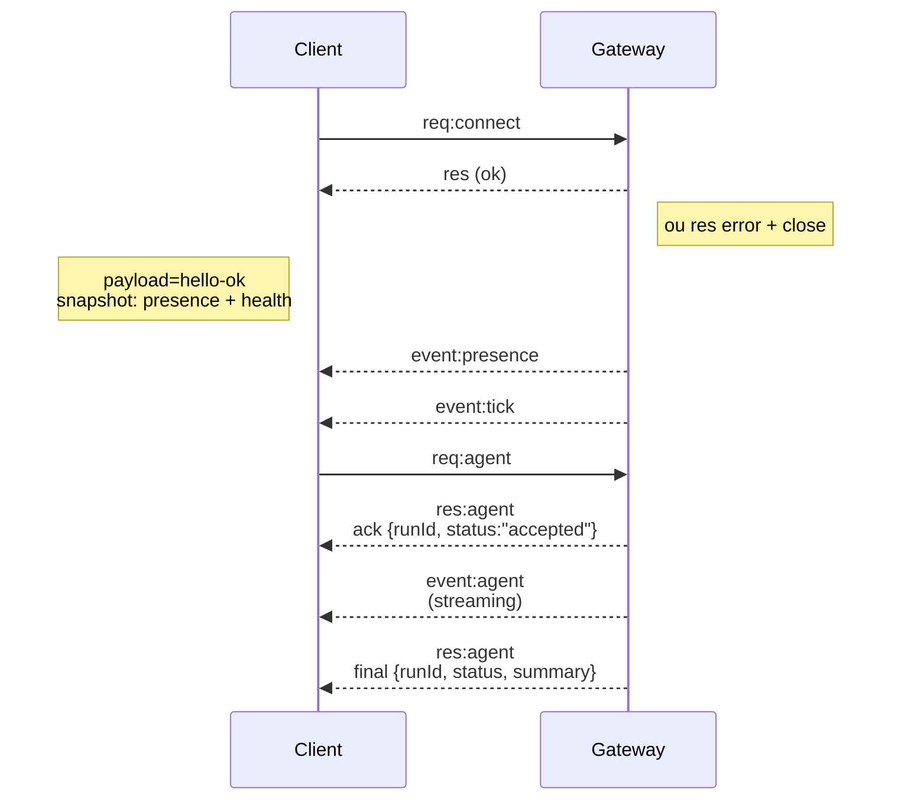

# Arquitetura do Gateway

Última atualização: 2026-01-22

## Visão geral

- Um único **Gateway** de longa duração possui todas as superfícies de mensagem (WhatsApp via Baileys, Telegram via grammY, Slack, Discord, Signal, iMessage, WebChat).
- Clientes de plano de controle (app macOS, CLI, web UI, automações) se conectam ao Gateway sobre **WebSocket** no host de bind configurado (padrão `127.0.0.1:18789`).
- **Nós** (macOS/iOS/Android/headless) também se conectam sobre **WebSocket**, mas declaram `role: node` com caps/commands/permissions explícitos.
- Um Gateway por host; é o único lugar que abre uma sessão WhatsApp.
- O **canvas host** é servido pelo servidor HTTP do Gateway sob:
  - `/__openclaw__/canvas/` (HTML/CSS/JS editável por agente)
  - `/__openclaw__/a2ui/` (host A2UI)
    Usa a mesma porta que o Gateway (padrão `18789`).

## Componentes e fluxos

### Gateway (daemon)

- Mantém conexões de provedor.
- Expõe uma API WS digitada (requisições, respostas, eventos server-push).
- Valida frames de entrada contra JSON Schema.
- Emite eventos como `agent`, `chat`, `presence`, `health`, `heartbeat`, `cron`.

### Clientes (app mac / CLI / web admin)

- Uma conexão WS por cliente.
- Enviam requisições (`health`, `status`, `send`, `agent`, `system-presence`).
- Se inscreem em eventos (`tick`, `agent`, `presence`, `shutdown`).

### Nós (macOS / iOS / Android / headless)

- Se conectam ao **mesmo servidor WS** com `role: node`.
- Fornecem uma identidade de dispositivo em `connect`; emparelhamento é **baseado em dispositivo** (role `node`) e aprovação vive no armazenamento de emparelhamento de dispositivo.
- Expõem comandos como `canvas.*`, `camera.*`, `screen.record`, `location.get`.

Detalhes do protocolo:

- [Protocolo Gateway](/gateway/protocol)

### WebChat

- Interface estática que usa a API WS do Gateway para histórico de chat e envios.
- Em setups remotos, se conecta através do mesmo túnel SSH/Tailscale que outros clientes.

## Ciclo de vida de conexão (cliente único)



## Protocolo de fio (resumo)

- Transporte: WebSocket, frames de texto com payloads JSON.
- Primeiro frame **deve** ser `connect`.
- Após handshake:
  - Requisições: `{type:"req", id, method, params}` → `{type:"res", id, ok, payload|error}`
  - Eventos: `{type:"event", event, payload, seq?, stateVersion?}`
- Se `OPENCLAW_GATEWAY_TOKEN` (ou `--token`) estiver definido, `connect.params.auth.token` deve corresponder ou o socket fecha.
- Chaves de idempotência são necessárias para métodos com efeito colateral (`send`, `agent`) para retry seguro; o servidor mantém um cache de dedupe de vida curta.
- Nós devem incluir `role: "node"` mais caps/commands/permissions em `connect`.

## Emparelhamento + confiança local

- Todos os clientes WS (operadores + nós) incluem uma **identidade de dispositivo** em `connect`.
- IDs de dispositivo novos requerem aprovação de emparelhamento; o Gateway emite um **dispositivo token** para connects subsequentes.
- Connects **locais** (loopback ou endereço tailnet do próprio host do gateway) podem ser auto-aprovadas para manter UX suave no mesmo host.
- Connects **não-locais** devem assinar o nonce `connect.challenge` e requerem aprovação explícita.
- Auth do Gateway (`gateway.auth.*`) ainda se aplica a **todas** as conexões, locais ou remotas.

Detalhes: [Protocolo Gateway](/gateway/protocol), [Emparelhamento](/channels/pairing), [Segurança](/gateway/security).

## Tipagem de protocolo e codegen

- Schemas TypeBox definem o protocolo.
- JSON Schema é gerado desses schemas.
- Modelos Swift são gerados a partir do JSON Schema.

## Acesso remoto

- Preferido: Tailscale ou VPN.
- Alternativa: Túnel SSH

  ```bash
  ssh -N -L 18789:127.0.0.1:18789 user@host
  ```

- O mesmo handshake + token auth se aplicam sobre o túnel.
- TLS + pinning opcional podem ser habilitados para WS em setups remotos.

## Snapshot de operações

- Iniciar: `openclaw gateway` (foreground, logs para stdout).
- Health: `health` sobre WS (também incluído em `hello-ok`).
- Supervisão: launchd/systemd para auto-restart.

## Invariantes

- Exatamente um Gateway controla uma única sessão Baileys por host.
- Handshake é obrigatório; qualquer frame primeiro que não seja JSON ou não-connect é um hard close.
- Eventos não são repetidos; clientes devem atualizar em gaps.
