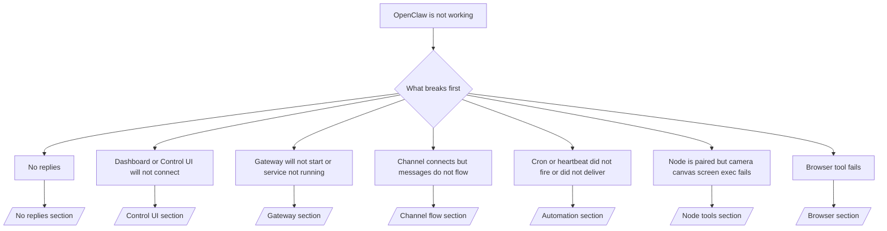

# Solução de problemas

Se voce so tem 2 minutos, use esta pagina como a porta de entrada de triagem.

## Primeiros 60 segundos

Execute exatamente esta sequencia, em ordem:

```bash
openclaw status
openclaw status --all
openclaw gateway probe
openclaw gateway status
openclaw doctor
openclaw channels status --probe
openclaw logs --follow
```

Boa saida em uma linha:

- `openclaw status` → mostra canais configurados e nenhum erro obvio de autenticacao.
- `openclaw status --all` → relatorio completo presente e compartilhavel.
- `openclaw gateway probe` → o alvo esperado do gateway esta acessivel.
- `openclaw gateway status` → `Runtime: running` e `RPC probe: ok`.
- `openclaw doctor` → nenhum erro de configuracao/servico bloqueante.
- `openclaw channels status --probe` → canais reportam `connected` ou `ready`.
- `openclaw logs --follow` → atividade estavel, sem erros fatais repetidos.

## Arvore de decisao



<AccordionGroup>
  <Accordion title="No replies">
    ```bash
    openclaw status
    openclaw gateway status
    openclaw channels status --probe
    openclaw pairing list <channel>
    openclaw logs --follow
    ```

    ```
    Uma boa saida se parece com:
    
    - `Runtime: running`
    - `RPC probe: ok`
    - Seu canal aparece como conectado/pronto em `channels status --probe`
    - O remetente parece aprovado (ou a politica de DM esta aberta/lista de permissoes)
    
    Assinaturas comuns de log:
    
    - `drop guild message (mention required` → o bloqueio por mencao impediu a mensagem no Discord.
    - `pairing request` → o remetente nao esta aprovado e aguarda aprovacao de pareamento de DM.
    - `blocked` / `allowlist` nos logs do canal → remetente, sala ou grupo esta filtrado.
    
    Paginas detalhadas:
    
    - [/gateway/troubleshooting#no-replies](/gateway/troubleshooting#no-replies)
    - [/channels/troubleshooting](/channels/troubleshooting)
    - [/channels/pairing](/channels/pairing)
    ```

  </Accordion>

  <Accordion title="Dashboard or Control UI will not connect">
    ```bash
    openclaw status
    openclaw gateway status
    openclaw logs --follow
    openclaw doctor
    openclaw channels status --probe
    ```

    ```
    Uma boa saida se parece com:
    
    - `Dashboard: http://...` aparece em `openclaw gateway status`
    - `RPC probe: ok`
    - Nenhum loop de autenticacao nos logs
    
    Assinaturas comuns de log:
    
    - `device identity required` → contexto HTTP/nao seguro nao consegue concluir a autenticacao de dispositivo.
    - `unauthorized` / loop de reconexao → token/senha incorretos ou incompatibilidade de modo de autenticacao.
    - `gateway connect failed:` → a UI esta apontando para a URL/porta errada ou o gateway esta inacessivel.
    
    Paginas detalhadas:
    
    - [/gateway/troubleshooting#dashboard-control-ui-connectivity](/gateway/troubleshooting#dashboard-control-ui-connectivity)
    - [/web/control-ui](/web/control-ui)
    - [/gateway/authentication](/gateway/authentication)
    ```

  </Accordion>

  <Accordion title="Gateway will not start or service installed but not running">
    ```bash
    openclaw status
    openclaw gateway status
    openclaw logs --follow
    openclaw doctor
    openclaw channels status --probe
    ```

    ```
    Uma boa saida se parece com:
    
    - `Service: ... (loaded)`
    - `Runtime: running`
    - `RPC probe: ok`
    
    Assinaturas comuns de log:
    
    - `Gateway start blocked: set gateway.mode=local` → o modo do gateway nao esta definido/remoto.
    - `refusing to bind gateway ... without auth` → bind fora de loopback sem token/senha.
    - `another gateway instance is already listening` ou `EADDRINUSE` → porta ja esta em uso.
    
    Paginas detalhadas:
    
    - [/gateway/troubleshooting#gateway-service-not-running](/gateway/troubleshooting#gateway-service-not-running)
    - [/gateway/background-process](/gateway/background-process)
    - [/gateway/configuration](/gateway/configuration)
    ```

  </Accordion>

  <Accordion title="Channel connects but messages do not flow">
    ```bash
    openclaw status
    openclaw gateway status
    openclaw logs --follow
    openclaw doctor
    openclaw channels status --probe
    ```

    ```
    Uma boa saida se parece com:
    
    - O transporte do canal esta conectado.
    - Verificacoes de pareamento/lista de permissoes passam.
    - Mencoes sao detectadas quando necessario.
    
    Assinaturas comuns de log:
    
    - `mention required` → bloqueio por mencao de grupo impediu o processamento.
    - `pairing` / `pending` → remetente de DM ainda nao esta aprovado.
    - `not_in_channel`, `missing_scope`, `Forbidden`, `401/403` → problema de token de permissao do canal.
    
    Paginas detalhadas:
    
    - [/gateway/troubleshooting#channel-connected-messages-not-flowing](/gateway/troubleshooting#channel-connected-messages-not-flowing)
    - [/channels/troubleshooting](/channels/troubleshooting)
    ```

  </Accordion>

  <Accordion title="Cron or heartbeat did not fire or did not deliver">
    ```bash
    openclaw status
    openclaw gateway status
    openclaw cron status
    openclaw cron list
    openclaw cron runs --id <jobId> --limit 20
    openclaw logs --follow
    ```

    ```
    Uma boa saida se parece com:
    
    - `cron.status` mostra habilitado com um proximo despertar.
    - `cron runs` mostra entradas recentes de `ok`.
    - Heartbeat esta habilitado e nao esta fora do horario ativo.
    
    Assinaturas comuns de log:
    
    - `cron: scheduler disabled; jobs will not run automatically` → cron esta desabilitado.
    - `heartbeat skipped` com `reason=quiet-hours` → fora do horario ativo configurado.
    - `requests-in-flight` → trilha principal ocupada; o despertar do heartbeat foi adiado.
    - `unknown accountId` → a conta de destino de entrega do heartbeat nao existe.
    
    Paginas detalhadas:
    
    - [/gateway/troubleshooting#cron-and-heartbeat-delivery](/gateway/troubleshooting#cron-and-heartbeat-delivery)
    - [/automation/troubleshooting](/automation/troubleshooting)
    - [/gateway/heartbeat](/gateway/heartbeat)
    ```

  </Accordion>

  <Accordion title="Node is paired but tool fails camera canvas screen exec">
    ```bash
    openclaw status
    openclaw gateway status
    openclaw nodes status
    openclaw nodes describe --node <idOrNameOrIp>
    openclaw logs --follow
    ```

    ```
    Uma boa saida se parece com:
    
    - Node aparece como conectado e pareado para o papel `node`.
    - Existe capacidade para o comando que voce esta invocando.
    - O estado de permissao esta concedido para a ferramenta.
    
    Assinaturas comuns de log:
    
    - `NODE_BACKGROUND_UNAVAILABLE` → traga o app do node para o primeiro plano.
    - `*_PERMISSION_REQUIRED` → permissao do SO foi negada/ausente.
    - `SYSTEM_RUN_DENIED: approval required` → aprovacao de exec esta pendente.
    - `SYSTEM_RUN_DENIED: allowlist miss` → comando nao esta na lista de permissoes de exec.
    
    Paginas detalhadas:
    
    - [/gateway/troubleshooting#node-paired-tool-fails](/gateway/troubleshooting#node-paired-tool-fails)
    - [/nodes/troubleshooting](/nodes/troubleshooting)
    - [/tools/exec-approvals](/tools/exec-approvals)
    ```

  </Accordion>

  <Accordion title="Browser tool fails">
    ```bash
    openclaw status
    openclaw gateway status
    openclaw browser status
    openclaw logs --follow
    openclaw doctor
    ```

    ```
    Uma boa saida se parece com:
    
    - O status do navegador mostra `running: true` e um navegador/perfil escolhido.
    - O perfil `openclaw` inicia ou o relay `chrome` tem uma aba anexada.
    
    Assinaturas comuns de log:
    
    - `Failed to start Chrome CDP on port` → falha ao iniciar o navegador local.
    - `browser.executablePath not found` → caminho do binario configurado esta errado.
    - `Chrome extension relay is running, but no tab is connected` → extensao nao anexada.
    - `Browser attachOnly is enabled ... not reachable` → perfil somente de anexo nao tem um alvo CDP ativo.
    
    Paginas detalhadas:
    
    - [/gateway/troubleshooting#browser-tool-fails](/gateway/troubleshooting#browser-tool-fails)
    - [/tools/browser-linux-troubleshooting](/tools/browser-linux-troubleshooting)
    - [/tools/chrome-extension](/tools/chrome-extension)
    ```

  </Accordion>
</AccordionGroup>
