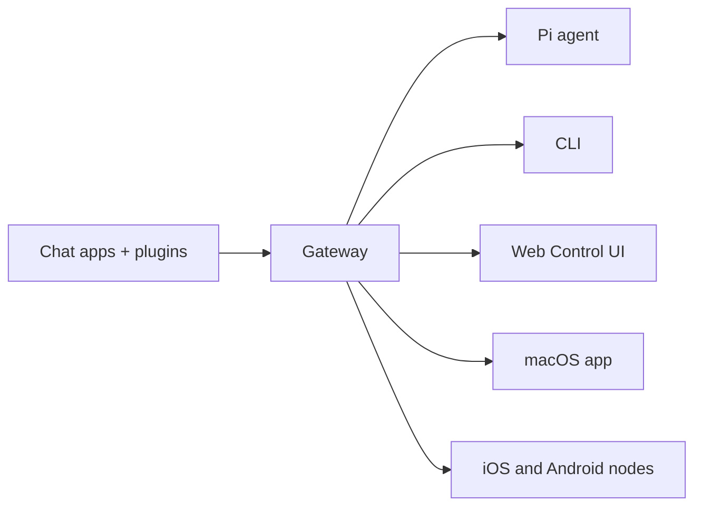

# OpenClaw 🦞

<p align="center">
    
    
</p>

> _"EXFOLIATE! EXFOLIATE!"_ — Uma lagosta espacial, provavelmente

<p align="center"><strong>Gateway para agentes de IA em qualquer sistema operacional no WhatsApp, Telegram, Discord, iMessage e mais.</strong><br />
  Envie uma mensagem e receba a resposta de um agente no seu bolso. Plugins adicionam Mattermost e mais.
</p>

<Columns>
  <Card title="Get Started" href="/start/getting-started" icon="rocket">
    Instale o OpenClaw e coloque o Gateway no ar em minutos.
  </Card>
  <Card title="Run the Wizard" href="/start/wizard" icon="sparkles">
    Configuração guiada com `openclaw onboard` e fluxos de pareamento.
  </Card>
  <Card title="Open the Control UI" href="/web/control-ui" icon="layout-dashboard">
    Inicie o painel no navegador para chat, configuração e sessões.
  </Card>
</Columns>

## O que é o OpenClaw?

OpenClaw é um **gateway auto-hospedado** que conecta seus aplicativos de chat favoritos — WhatsApp, Telegram, Discord, iMessage e mais — a agentes de IA para programação como o Pi. Você executa um único processo do Gateway na sua própria máquina (ou em um servidor), e ele se torna a ponte entre seus apps de mensagens e um assistente de IA sempre disponível.

**Para quem é?** Desenvolvedores e usuários avançados que querem um assistente pessoal de IA com quem possam conversar de qualquer lugar — sem abrir mão do controle dos dados ou depender de um serviço hospedado.

**O que o torna diferente?**

- **Auto-hospedado**: roda no seu hardware, com suas regras
- **Multicanal**: um Gateway atende WhatsApp, Telegram, Discord e mais simultaneamente
- **Nativo para agentes**: criado para agentes de programação com uso de ferramentas, sessões, memória e roteamento multiagente
- **Código aberto**: licenciado sob MIT, orientado pela comunidade

**O que você precisa?** Node 22+, uma chave de API (Anthropic recomendado) e 5 minutos.

## Como funciona



O Gateway é a única fonte de verdade para sessões, roteamento e conexões de canais.

## Principais capacidades

<Columns>
  <Card title="Multi-channel gateway" icon="network">
    WhatsApp, Telegram, Discord e iMessage com um único processo do Gateway.
  </Card>
  <Card title="Plugin channels" icon="plug">
    Adicione Mattermost e mais com pacotes de extensão.
  </Card>
  <Card title="Multi-agent routing" icon="route">
    Sessões isoladas por agente, workspace ou remetente.
  </Card>
  <Card title="Media support" icon="image">
    Envie e receba imagens, áudio e documentos.
  </Card>
  <Card title="Web Control UI" icon="monitor">
    Painel no navegador para chat, configuração, sessões e nós.
  </Card>
  <Card title="Mobile nodes" icon="smartphone">
    Pareie nós iOS e Android com suporte ao Canvas.
  </Card>
</Columns>

## Início rápido

<Steps>
  <Step title="Install OpenClaw">
    ```bash
    npm install -g openclaw@latest
    ```
  </Step>
  <Step title="Onboard and install the service">
    ```bash
    openclaw onboard --install-daemon
    ```
  </Step>
  <Step title="Pair WhatsApp and start the Gateway">
    ```bash
    openclaw channels login
    openclaw gateway --port 18789
    ```
  </Step>
</Steps>

Precisa da instalação completa e do setup de desenvolvimento? Veja [Início rápido](/start/quickstart).

## Painel

Abra a UI de Controle no navegador após o Gateway iniciar.

- Padrão local: [http://127.0.0.1:18789/](http://127.0.0.1:18789/)
- Acesso remoto: [Superfícies web](/web) e [Tailscale](/gateway/tailscale)

<p align="center">
  
</p>

## Configuração (opcional)

A configuração fica em `~/.openclaw/openclaw.json`.

- Se você **não fizer nada**, o OpenClaw usa o binário Pi incluído em modo RPC com sessões por remetente.
- Se quiser restringir, comece com `channels.whatsapp.allowFrom` e (para grupos) regras de menção.

Exemplo:

```json5
{
  channels: {
    whatsapp: {
      allowFrom: ["+15555550123"],
      groups: { "*": { requireMention: true } },
    },
  },
  messages: { groupChat: { mentionPatterns: ["@openclaw"] } },
}
```

## Comece por aqui

<Columns>
  <Card title="Docs hubs" href="/start/hubs" icon="book-open">
    Toda a documentação e guias, organizados por caso de uso.
  </Card>
  <Card title="Configuration" href="/gateway/configuration" icon="settings">
    Configurações centrais do Gateway, tokens e configuração de provedores.
  </Card>
  <Card title="Remote access" href="/gateway/remote" icon="globe">
    Padrões de acesso via SSH e tailnet.
  </Card>
  <Card title="Channels" href="/channels/telegram" icon="message-square">
    Configuração específica por canal para WhatsApp, Telegram, Discord e mais.
  </Card>
  <Card title="Nodes" href="/nodes" icon="smartphone">
    Nós iOS e Android com pareamento e Canvas.
  </Card>
  <Card title="Help" href="/help" icon="life-buoy">
    Correções comuns e ponto de entrada para solução de problemas.
  </Card>
</Columns>

## Saiba mais

<Columns>
  <Card title="Full feature list" href="/concepts/features" icon="list">
    Capacidades completas de canais, roteamento e mídia.
  </Card>
  <Card title="Multi-agent routing" href="/concepts/multi-agent" icon="route">
    Isolamento de workspaces e sessões por agente.
  </Card>
  <Card title="Security" href="/gateway/security" icon="shield">
    Tokens, listas de permissões e controles de segurança.
  </Card>
  <Card title="Troubleshooting" href="/gateway/troubleshooting" icon="wrench">
    Diagnósticos do Gateway e erros comuns.
  </Card>
  <Card title="About and credits" href="/reference/credits" icon="info">
    Origens do projeto, colaboradores e licença.
  </Card>
</Columns>
