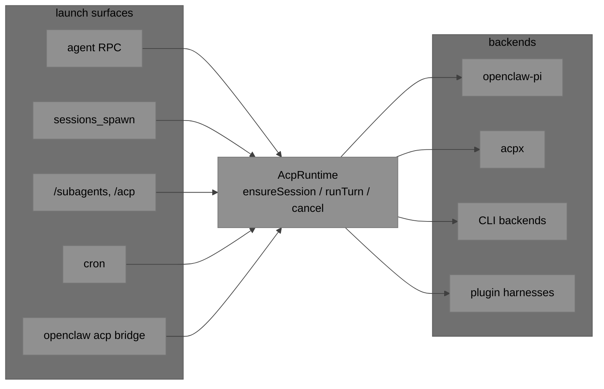
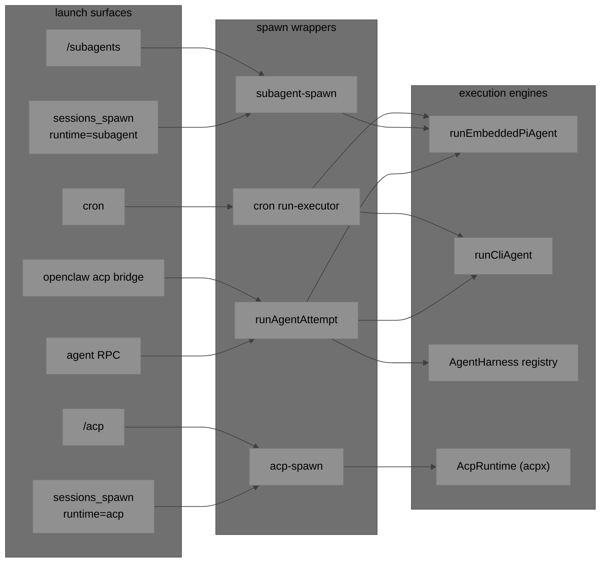
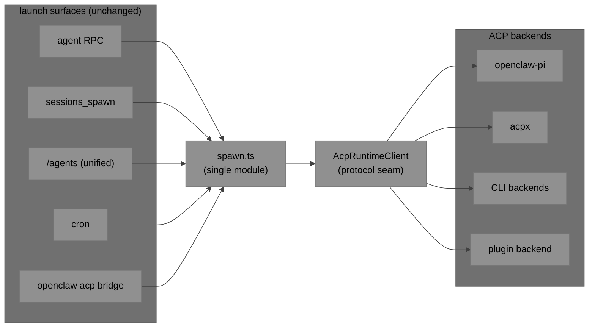
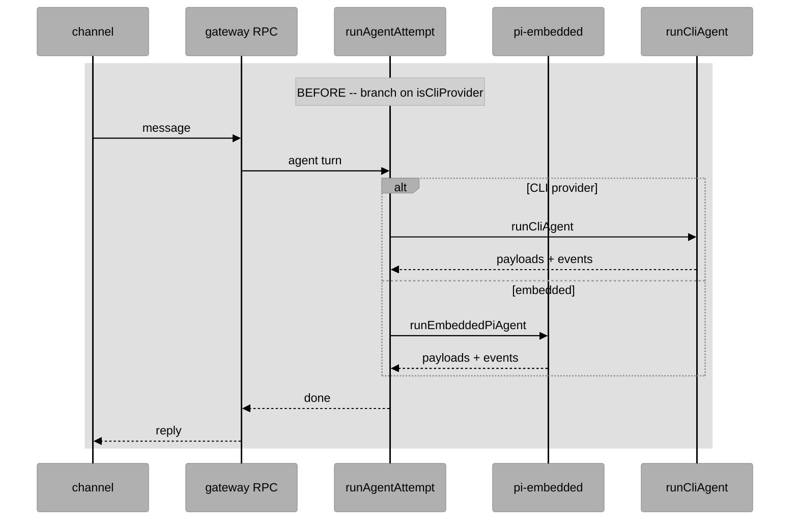
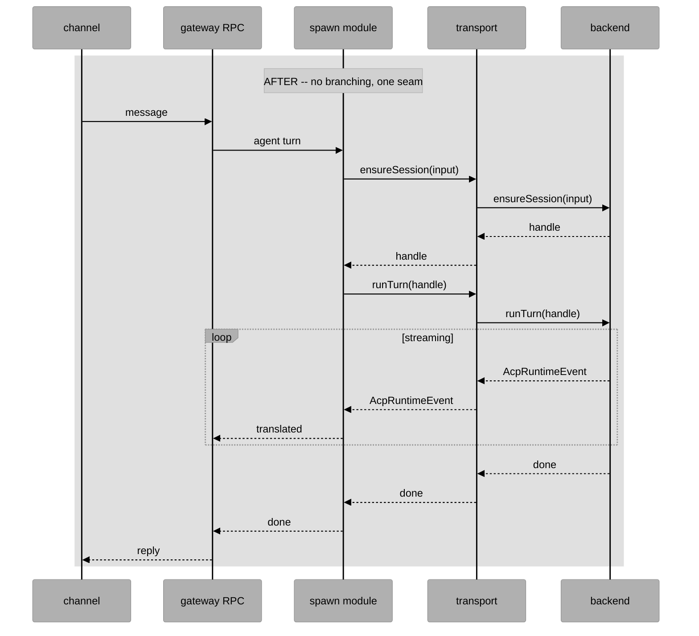
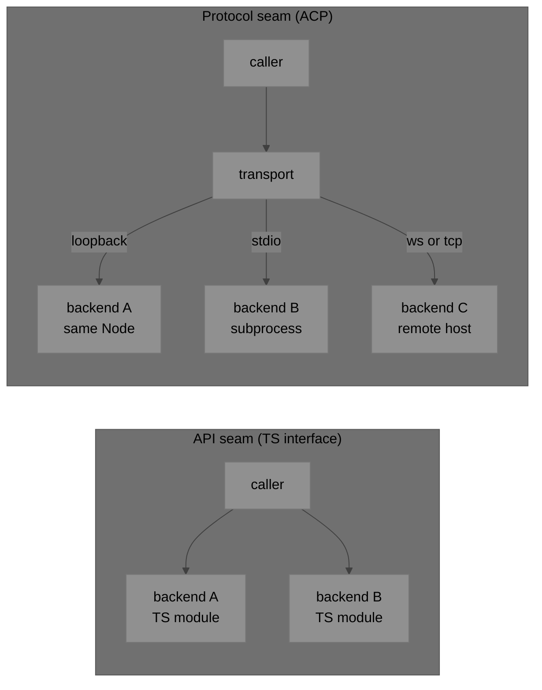
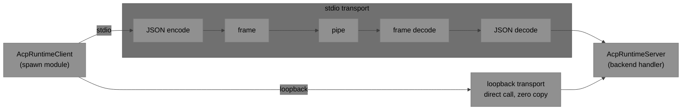
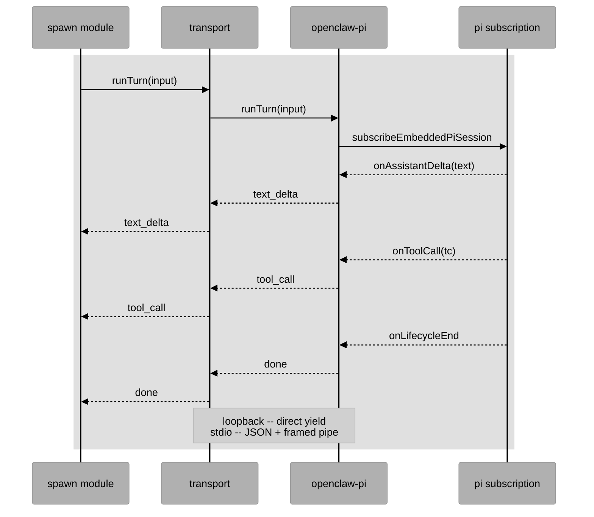
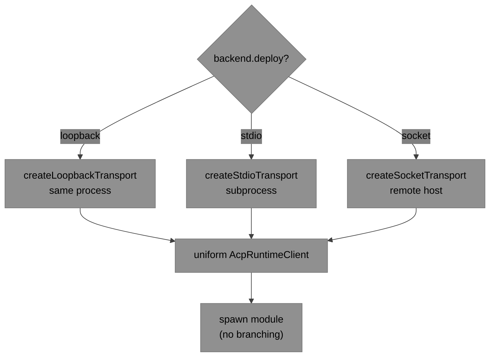

# ACP Everywhere

## TL;DR

OpenClaw currently has at least five different ways to start an LLM/agent turn (normal `agent` RPC, `sessions_spawn` subagent, `sessions_spawn` acp, cron, `openclaw acp` bridge) driving at least four different execution engines (pi-embedded, CLI backends, plugin `AgentHarness`, ACP runtime backends). Each path has its own spawn wrapper, lifecycle eventing, sandbox/announce rules, and slash-command surface. This document proposes making the existing `AcpRuntime` interface (`src/acp/runtime/types.ts`) the single internal execution contract that every path goes through, wrapping pi-embedded, CLI backends, and plugin harnesses as ACP backends behind it. Net effect: one spawn module, one event stream, one policy layer, one set of controls — without changing any external wire protocol.



## Why ACP

Before the problem statement and the mechanics, a short list of why ACP is the right protocol to standardize on. These properties are what make "one seam" actually work in practice and what separate ACP from a bespoke internal interface.

- **Covers chat-style and agent-style interfaces with the same contract.** `session/prompt` handles the straight prompt-in / deltas-and-final-text-out shape that a Responses-API-style caller wants, and the same session can just as easily drive a full agent turn with tools, plans, thoughts, session modes, cwd, resume, and cancel. One contract; no separate API for "assistant turn" vs "agent turn".
- **Tools can live on the client or on the server, or both.** Agent-side tools are the default (the backend exposes its own tool surface). Client-side tools are first-class too (for example `fs/read_text_file`, `fs/write_text_file`, `terminal/*`) and get called through the same JSON-RPC methods. Capability negotiation at `initialize` makes this explicit, so the spawn module can policy-check which side owns which tool.
- **Sessions are first-class.** `newSession`, `loadSession`, `session/set_mode`, `session/status`, resume semantics, and cancel live in the protocol. Maps 1:1 onto OpenClaw's session keys and lifecycle.
- **Streaming is structured, not a single opaque text stream.** Token deltas, reasoning/thought deltas, tool-call lifecycle updates, plan updates, status, usage, and (optionally) terminal output are each their own typed event.
- **Capability negotiation is built in.** Backends advertise what they actually support (sandboxing, resume, attachments, client terminals, specific tool surfaces, config option keys) and callers policy-check against that.
- **Permission handling is in the protocol.** Interactive and non-interactive permission flows for writes/exec/etc. are defined, so headless sessions don't have to invent their own approval path.
- **Transport-agnostic.** The ACP JSON-RPC 2.0 messages are the same regardless of wire. stdio is the canonical transport, but the same messages can be carried over WebSocket, WebRTC, QUIC, TCP, in-process loopback, or any multiplexed transport. See [xumux-ACP](https://github.com/deftai/xumux/blob/openmux/docs/ext-acp-agent-client-protocol.md) for a concrete example that carries the exact same ACP payloads over a xumux multiplexer and picks up WebSocket / WebRTC / QUIC / TCP / stdio from one binding. OpenClaw's proposed loopback transport is another instance of the same principle.
- **Existing ecosystem.** Codex, Claude Code, Gemini CLI, Cursor, OpenCode, and others already speak ACP. Choosing it as the internal seam means OpenClaw consumes that ecosystem cheaply and, through `openclaw acp`, exposes itself to it cheaply too.
- **Additive evolution.** New capabilities (richer plans, structured diffs, embedded terminals, provenance receipts) land as additive protocol updates behind capability flags, not as invariant-breaking schema changes.
- **Editor/IDE-native primitives.** Cancellation, plans, thoughts, diffs, terminals, and status updates are in the protocol rather than bolted on per-harness, which is why Zed-style IDE integrations work without a custom bridge.

## Design principles

Three principles keep this from drifting into protocol cargo-culting or a big-bang refactor:

- **Contract is the deliverable, not the wire.** The unification goal is one protocol-typed contract (`AcpRuntime`) between the spawn module and every backend. The transport those messages flow over is orthogonal to the contract — stdio, socket, and in-process direct calls are all legal. The `openclaw-pi` backend is expected to run in-process by default; no IPC cost is mandated on the hot path. Forcing stdio everywhere would be cargo-culting — what we actually want is the typed, versioned, capability-negotiated interface.
- **Smallest slice first, with explicit parity gates.** Phases 1–3 ship one backend (`openclaw-pi`) wired through one call-site (`runAgentAttempt`) and must prove byte-for-byte parity on transcript/announce/abort/compaction/resume before Phase 4 touches subagent spawn or anything else. CLI and plugin migrations only happen after the pi + main-turn slice is demonstrably boring. A maintainer can veto continuing at the gate if parity is not clean.
- **Capability-driven policy over hard-coded runtime strings.** Backends advertise what they can and can't do (sandbox mode and isolation grade, resume, attachments, client terminals, config-option keys, etc.). The spawn module enforces policy by matching against those capabilities rather than branching on `runtime == "acp"` / `runtime == "subagent"`. This is the reason the `sandbox="require"` / `runtime="acp"` clash (see Cons) can be resolved cleanly instead of patched with another string.

## Problem statement

As OpenClaw has grown it has accumulated parallel launch and execution paths instead of converging on one. Concretely, today we have:

- **Four execution engines** that each own their own loop: the embedded pi harness (`runEmbeddedPiAgent`), `runCliAgent` for Codex/Claude/Gemini CLIs, the plugin `AgentHarness` registry, and `AcpRuntime` backends registered via `registerAcpRuntimeBackend`.
- **Two separate spawn modules** (`src/agents/subagent-spawn.ts` and `src/agents/acp-spawn.ts`) implementing overlapping-but-divergent versions of the same feature set: target resolution, workspace inheritance, sandbox policy, depth/concurrency limits, thread binding, announce, cleanup, registry tracking.
- **A runtime switch on `sessions_spawn`** (`runtime: "subagent" | "acp"`) whose value silently changes which features are available: `resumeSessionId` requires `runtime=acp`, `attachments` and `lightContext` require `runtime=subagent`, `sandbox="require"` is rejected on `runtime=acp`, `streamTo="parent"` is only valid on `runtime=acp`.
- **Two slash-command families** (`/subagents …` and `/acp …`) that are conceptually the same operator surface with slightly different verbs and flags.
- **Two branching agent-entry paths**: `runAgentAttempt` in `src/agents/command/attempt-execution.ts` branches on `isCliProvider` to pick between `runCliAgent` and `runEmbeddedPiAgent`, and cron's `run-executor` does the same thing independently.
- **Lifecycle event streams diverge**: pi emits `lifecycle`/`assistant`/`tool`/`compaction`/`usage` streams; `AcpRuntimeEvent` models a narrower `text_delta | status | tool_call | done | error` shape.

The result is feature drift, duplicated bug surface, partial parity (every time we add a capability to one path we have to decide whether and how to mirror it on the others), and a muddled operator mental model. There is no single place to enforce a new safety policy, add a new audit field, instrument a new metric, or host a new runtime capability (sandbox, resume, attachments) so that it automatically works for normal turns, cron, subagents, and ACP sessions.

## Current state (compact map)

Launch surfaces that start an agent turn today:

- Gateway `agent` RPC → `runAgentAttempt` (`src/agents/command/attempt-execution.ts:217`).
- `sessions_spawn` tool (`src/agents/tools/sessions-spawn-tool.ts`), two branches.
- `/subagents spawn` and `/acp spawn|steer|cancel|close|…` slash commands.
- Cron isolated agents (`src/cron/isolated-agent/run-executor.ts`).
- Top-level `bindings[].type="acp"` (channel inbound routed into an ACP session).
- Stdio ACP bridge `openclaw acp` (`src/acp/server.ts`) — external ACP clients into Gateway.

Execution engines those paths end up in:

- `runEmbeddedPiAgent` (the default).
- `runCliAgent` for Codex CLI / Claude CLI / Gemini CLI.
- Plugin `AgentHarness` registry (`src/agents/harness/selection.ts`).
- `AcpRuntime` backends (today only bundled `acpx`, which itself fans out to Codex/Claude/Gemini/Cursor/OpenCode/etc).

### Before: tangled launch paths



## Target architecture

Promote `AcpRuntime` (`src/acp/runtime/types.ts:118`) from "external harness driver" to the single internal execution contract. Every launch path calls `AcpRuntime.ensureSession` + `runTurn` + `cancel` / `close` / `setMode` / `setConfigOption` / `doctor`. The concrete backends become:

- `openclaw-pi` — wraps `runEmbeddedPiAgent` and `compactEmbeddedPiSession`.
- `acpx` — unchanged, still fronts Codex/Claude/Gemini/Cursor/OpenCode/etc.
- CLI backends — either thin native ACP adapters (one per CLI) or folded under `acpx`.
- Plugin harnesses — register directly as ACP backends.

On top of that one contract:

- `subagent-spawn.ts` and `acp-spawn.ts` collapse to one `spawn.ts` module.
- `sessions_spawn` loses its `runtime` branch; `agentId` (optionally + a `backend` hint) fully determines which backend answers.
- `runAgentAttempt` and cron's `run-executor` stop branching on `isCliProvider`; they call `AcpRuntime.runTurn`.
- `/subagents` and `/acp` collapse into one `/agents …` command family (keep old slashes as aliases).
- `openclaw acp` bridge stays as-is and becomes a clean ACP-in / ACP-out pipe.

### After: unified ACP seam



### Sequence: what changes on a normal turn





## Pros

- **One contract to reason about.** A single `AcpRuntime` interface replaces four overlapping engines and two spawn wrappers.
- **Feature matrix collapses.** `resumeSessionId`, `attachments`, `lightContext`, `sandbox`, `streamTo`, `mode=session`, `thread`, `cwd` become properties of the backend/contract, not of the spawn path. Every backend that supports a capability exposes it the same way.
- **Smaller code surface.** Net LOC should go down, not up. Two spawn modules become one; two entry-branching functions become one seam; duplicate announce/thread-binding logic merges.
- **Simpler mental model for operators.** "Sub-agent" and "ACP agent" stop being two concepts. One `/agents` command family, one set of flags.
- **Plugin story improves.** Third-party runtimes implement one interface (`AcpRuntime`) instead of picking between `AgentHarness`, `cliBackend`, or an ACP adapter.
- **Pi harness is preserved.** Wrapping `runEmbeddedPiAgent` as a backend keeps all of its hard-won behavior (lane serialization, compaction, heartbeat, auth profile rotation, transcript persistence) intact. An optional in-process transport can preserve today's call-cost for the hot path if benchmarks call for it (see [Optional: ACP loopback transport for hot-path performance](#optional-acp-loopback-transport-for-hot-path-performance)).
- **The outward ACP bridge becomes natural.** `openclaw acp` already speaks ACP inbound; when the internals also speak ACP, there is no impedance mismatch to maintain.

## Cons / tradeoffs

- **`AcpRuntimeEvent` must be extended.** Today it does not cover pi's full event surface (lifecycle start/end/error, reasoning deltas, compaction, usage). That is a contract change, additive but real, and it affects `acpx`, any third-party ACP runtime backend, and the outward bridge.
- **Sandbox semantics differ.** Pi can run inside the OpenClaw sandbox; ACP backends today explicitly cannot (`docs/tools/acp-agents.md` — Sandbox compatibility). A boolean `runsInSandbox` is too coarse — different backends offer different isolation grades (host / Docker / Podman / chroot / seccomp) with different guarantees (filesystem, network, process caps). Also, what a backend _can_ enforce and what a particular run _requested_ are different concerns and must not share a single type. The contract separates them cleanly:

  ```ts path=null start=null
  // What the backend CAN enforce. Advertised by the runtime via getCapabilities;
  // does not change per run. Static facts about the runtime.
  type SandboxCapability = {
    mode: "host" | "docker" | "podman" | "chroot" | "seccomp" | "custom";
    guarantees: {
      fsIsolation: "none" | "workspace" | "fullRoot";
      netIsolation: "none" | "restricted" | "denyAll";
      processCaps: boolean;
    };
  };

  // What THIS run requests. Per-spawn input the spawn module passes into
  // ensureSession so the backend knows what the operator asked for. Not a
  // capability — a request.
  type SandboxPolicy = {
    require: "any" | "host" | "sandboxed";
    minFsIsolation?: "workspace" | "fullRoot";
    minNetIsolation?: "restricted" | "denyAll";
    image?: string; // operator-supplied runtime config
    setupCommand?: string; // operator-supplied runtime config
  };
  ```

  Enforcement is a well-defined predicate `satisfies(capability, policy)` that the spawn module evaluates before starting a run (rough shape: `policy.require != "sandboxed" || capability.mode != "host"`, plus pairwise checks that `capability.guarantees` meets each `policy.min*`). That lets `sandbox="require"` be a real check instead of a boolean, keeps the capability surface stable across runs, and leaves room for stronger isolation grades (container-per-session, seccomp profiles, etc.) without another round of string-comparison plumbing. Without the split, capability and policy blur and matching gets hand-wavy fast.

- **Announce / thread-binding migration is delicate.** Channel plugins expect exact historical announce shapes. Merging subagent-spawn and acp-spawn must preserve those bytes or we silently break agents and cron jobs that users already rely on.
- **CLI backend features are non-trivial to move.** Session-expired retry, CLI-session reuse, bundle-MCP overlay, plugin-owned defaults. These need to come along when CLI backends become ACP backends.
- **Migration is multi-release.** Feature flags, legacy aliases, and a period where both paths coexist are mandatory to avoid a big-bang regression.
- **"Everything behind one interface" can mask bugs.** A subtle regression in a shared seam impacts every launch path at once. Mitigated by keeping the pi runner itself intact as the default backend and staging the rollout.

## What this enables for architecture goals

### Security

- **One policy chokepoint.** Tool-policy, sandbox, permission-mode, approval, ACP-agent allowlist, and subagent depth/concurrency limits currently live on at least three paths (`subagent-spawn`, `acp-spawn`, `runAgentAttempt`). Behind one seam they become one set of checks that every launch path inherits automatically.
- **Sandbox becomes a first-class capability.** `sandbox="require"` no longer has to reject `runtime=acp` — instead the backend declares whether it runs inside the sandbox, and the spawn module enforces the policy uniformly.
- **Credential/auth isolation is easier to reason about.** ACP backends already have an explicit `ensureSession({ agent, cwd, env })` boundary. Routing pi and CLI through the same boundary means auth-profile scoping, per-agent `agentDir`, and delegate isolation (`docs/concepts/delegate-architecture.md`) apply the same way regardless of backend.
- **Non-interactive permission handling unifies.** `permissionMode` / `nonInteractivePermissions` currently live on `acpx`. Once pi is a backend too, the same knobs extend naturally to every path (normal turn, cron, subagent, ACP session).

### Auditing

- **One event stream to record.** Collapsing pi and ACP lifecycle events into the extended `AcpRuntimeEvent` stream means every turn emits the same shape of `text_delta` / `tool_call` / `status` / `done` / `error` / lifecycle markers. Transcript persistence, session history, and audit export all read from one source.
- **Stable correlation ids.** `AcpRuntimeHandle` already carries `sessionKey` + `backend` + `runtimeSessionName` + optional `backendSessionId` / `agentSessionId`. Moving every turn through that handle gives us a ready-made correlation key for logs, metrics, transcripts, and GHSA-style incident reconstruction.
- **Consistent provenance.** The `openclaw acp --provenance meta|meta+receipt` flag already exists for the bridge. Making ACP the internal seam means provenance receipts can become a property of every turn, not just bridge turns.
- **Delegate and cron audit trails merge.** `docs/concepts/delegate-architecture.md` already requires audit trails for cron-run history and session transcripts. One execution seam gives those trails one format and one writer.

### Code re-use

- **Spawn wrapper collapses.** Target resolution, workspace inheritance, requester-origin inference, subagent-registry tracking, depth/concurrency limits, cleanup, and announce all live once.
- **Streaming glue is written once.** The translator that turns a runtime event iterable into channel output (assistant text, tool summaries, block replies) is implemented against one contract instead of per-engine.
- **Abort and timeout are implemented once.** `AcpRuntime.cancel` plus `AbortSignal` propagation on `runTurn` replace today's per-engine abort logic (`abortEmbeddedPiRun`, CLI-side SIGTERM handling, ACP cancel).
- **Compaction and session resume are uniform.** `compact?`, `prepareFreshSession?`, and `resumeSessionId` become optional capabilities on any backend, so `sessions_spawn` stops having to special-case them.
- **Tests scale better.** Once the contract is the seam, a single contract test suite (`adapter-contract.testkit.ts` already exists for ACP) covers every backend, instead of reinventing test harnesses per engine.

### Other architecture goals

- **Observability parity.** One set of metrics (turn latency, queue wait, tokens, tool-call count, error class) naturally lights up for every launch path.
- **Plugin SDK simplification.** Plugins that want to contribute a runtime implement `AcpRuntime`. `src/plugin-sdk/acp-runtime.ts` already exists for this — we just make it the recommended plugin surface.
- **Clear extension points for future work.** Adding a new capability (richer thought streaming, structured tool diffs, ACP terminals) is one contract change + one implementation per backend, not an N×M retrofit.
- **VISION.md alignment.** This is consolidation, not a new orchestration layer. The project's stated direction (lean core, optional capability in plugins, no nested-manager frameworks) is what this seam buys us.

## Why a protocol seam, not just an API seam

A reasonable counter-proposal would be "just introduce a shared TypeScript interface (an API seam) that pi, CLI, and ACP backends implement, and stop there." That would solve the in-process duplication, but it would leave most of the architectural wins on the table. Picking a _protocol_ interface — ACP, which has a wire format, an event schema, and a contract independent of any one language or process — is materially stronger than an in-process API interface for several reasons:

- **Process isolation is free.** An API seam only works as long as every implementation lives in the same Node process. A protocol seam lets any backend run out-of-process (a sidecar, a subprocess, a container, a different host) with no change to the caller. That is already how `acpx` works today; extending the same pattern to pi and CLI backends means a misbehaving backend can be restarted, sandboxed, or resource-limited on its own without taking the gateway with it.
- **Crash, hang, and leak blast-radius shrinks.** Language-level APIs share a heap, an event loop, and a process lifetime. A runaway backend that leaks memory, blocks the loop, or segfaults native code takes the whole gateway with it. A protocol seam gives us a real fault boundary: kill the backend process, the gateway keeps serving other sessions.
- **Language and runtime choice opens up.** Third-party (or future first-party) backends can be written in Rust, Go, Python, or anything that can speak ACP over stdio or a socket. An API seam locks every implementation into TypeScript and the specific pi-coding-agent / OpenClaw build. This matters for high-performance harnesses, GPU-bound inference backends, and plugin authors who do not want to take a Node dependency.
- **Cross-network is the same shape as cross-process.** ACP is already transportable over stdio, WebSocket, and (trivially) TCP/TLS. Once the seam is a protocol, "run the backend on another machine" is a configuration change, not a refactor. That unlocks remote harnesses, shared GPU pools, tenant isolation per host, and the kind of Tailnet/SSH topologies OpenClaw already uses for its Gateway.
- **Versioning is explicit.** Protocols have schemas and version negotiation; APIs have function signatures and hope. ACP already has handshake/capabilities (`getCapabilities`, `session_info_update`, `available_commands_update`). Version skew between gateway and backend becomes a declared compatibility matrix instead of a silent duck-typing failure.
- **Security boundaries become enforceable.** An in-process API backend has ambient authority: the whole Node `process.env`, `fs`, `net`, plus any globals OpenClaw has loaded. A protocol backend only sees what the gateway chose to pass into `ensureSession({ cwd, env })`. Least-privilege scoping, seccomp/landlock, Docker/Podman isolation, and per-backend credential injection all become mechanical to apply.
- **Observability is first-class.** Every call across a protocol seam is a framed, schema'd message. We can tee it to a log, a debugger, a provenance receipt, a replay harness, or an audit sink without instrumenting each backend. In-process APIs require per-call wrappers and are easy to bypass.
- **Contract tests replace cross-module test mazes.** Given a protocol, one conformance test suite proves that _any_ backend behaves correctly. With an API seam you end up writing ad-hoc mocks and re-testing the seam per implementation. `src/acp/runtime/adapter-contract.testkit.ts` already does this for ACP; extending it is cheaper than maintaining per-engine test harnesses.
- **Third-party plugin distribution stops being a monorepo problem.** A protocol backend can be `npm i`'d, `brew install`'d, or shipped as a standalone binary and pointed at via `acp.backend.command`. An API backend has to be built against the exact OpenClaw version you are running. This is the same reason MCP won over bespoke tool APIs.
- **Interop with the rest of the ACP ecosystem comes for free.** Zed, `openclaw acp`, `acpx openclaw`, and other ACP-speaking clients/servers already exist. A protocol seam means OpenClaw can both consume and expose ACP backends without an adapter layer. An API seam would only speak OpenClaw's dialect.
- **Language-level "just add an interface" tends to rot.** Once you have three implementations, an API interface drifts: one caller peeks at an implementation-specific field, another short-circuits through a shared helper, tests couple to internals. Protocol seams resist this because the wire format is the only legal way to talk.

### API seam vs protocol seam at a glance



The baseline plan assumes the ordinary stdio transport for every backend (same model `acpx` uses today).

## Optional: ACP loopback transport for hot-path performance

**Status: exploratory / to investigate.** Everything in the plan above works with the standard stdio/socket ACP transport. The loopback transport is an optional future optimization for the `openclaw-pi` hot path. It is called out here so it is not mistaken for a required part of the seam and so the details live in one place.

### What it is

ACP has a protocol layer (typed message shapes and semantics: `AcpRuntimeEnsureInput`, `AcpRuntimeTurnInput`, `AcpRuntimeEvent`, `AcpRuntimeHandle`) and a transport layer (how those messages move between a client and a runtime). Today we only have one transport — the external stdio `@agentclientprotocol/sdk` one used by `acpx`. A loopback transport is a second transport that short-circuits serialization while keeping the same protocol types on both sides. Same contract, no wire.



### Why we might want it

A normal LLM turn emits high-frequency events (token deltas, reasoning deltas, tool-call updates, compaction progress, usage ticks — easily 50–200+ events/sec) and occasionally large payloads (multi-megabyte tool results, attachments, transcripts). Over stdio each event is framed, JSON-serialized, piped, deserialized, re-dispatched. In-process it is a function call and a typed object passed by reference. For the `openclaw-pi` backend, which has always run in-process, mandating stdio pays real per-event cost and copies every tool result twice. The loopback transport lets us keep one contract everywhere without charging IPC cost on the path that runs 99% of turns.

### How it works

Each transport exposes the same two shapes: a client handle (what a spawn module talks to) and a server handler (what a backend implements).

```ts path=null start=null
// Identical regardless of transport.
interface AcpRuntimeClient {
  ensureSession(input: AcpRuntimeEnsureInput): Promise<AcpRuntimeHandle>;
  runTurn(input: AcpRuntimeTurnInput): AsyncIterable<AcpRuntimeEvent>;
  cancel(input: { handle: AcpRuntimeHandle; reason?: string }): Promise<void>;
  close(input: { handle: AcpRuntimeHandle; reason: string }): Promise<void>;
  // getCapabilities, getStatus, setMode, setConfigOption, doctor, prepareFreshSession
}
interface AcpRuntimeServer extends AcpRuntimeClient {}
```

A transport connects a `Client` shape to a `Server` shape. stdio does framing + JSON + pipes. Loopback just calls the function.

```ts path=null start=null
export function createLoopbackTransport(
  server: AcpRuntimeServer,
  opts?: { validate?: boolean; queueLimit?: number },
): AcpRuntimeClient {
  return {
    async ensureSession(input) {
      if (opts?.validate) validateEnsureInput(input); // optional schema check
      const result = await server.ensureSession(input); // direct call
      if (opts?.validate) validateHandle(result);
      return result; // same object, no copy
    },
    runTurn(input) {
      if (opts?.validate) validateTurnInput(input);
      return server.runTurn(input); // AsyncIterable passes straight through
    },
    cancel: (input) => server.cancel(input),
    close: (input) => server.close(input),
    // ...
  };
}
```

That is the whole transport: a thin adapter that hands typed objects from one function to another inside the same Node process.

### Streaming

Inside the `openclaw-pi` server, the pi subscription system produces events on a bounded in-memory queue; `runTurn` yields them as an async iterable of `AcpRuntimeEvent`. Under loopback, that iterable is returned to the caller directly — no `JSON.stringify`, no framing. Under stdio, the same iterable is wrapped by the stdio transport, which serializes and frames.



```ts path=null start=null
async function* runTurn(input: AcpRuntimeTurnInput): AsyncIterable<AcpRuntimeEvent> {
  const queue = new AcpEventQueue({ limit: 1024 }); // bounded ring
  const abort = new AbortController();
  input.signal?.addEventListener("abort", () => abort.abort(), { once: true });
  const unsub = subscribeEmbeddedPiSession(sessionId, {
    onAssistantDelta: (text) => queue.push({ type: "text_delta", text, stream: "output" }),
    onToolCall: (tc) => queue.push({ type: "tool_call", ...tc }),
    onLifecycleEnd: () => queue.push({ type: "done", stopReason: "stop" }),
    onError: (err) => queue.push({ type: "error", message: err.message }),
  });
  const runPromise = runEmbeddedPiAgent({ ...mapped, signal: abort.signal })
    .catch((err) => queue.push({ type: "error", message: err.message }))
    .finally(() => {
      unsub();
      queue.close();
    });
  try {
    for await (const evt of queue) yield evt; // zero-copy handoff under loopback
  } finally {
    abort.abort();
    await runPromise;
  }
}
```

### Backpressure

stdio gets backpressure from OS socket buffers. Loopback does it explicitly: `AcpEventQueue` has a high-water mark; pushing past it either awaits drain or drops with an explicit policy (same shape as today's `acp.stream.coalesceIdleMs` / `maxChunkChars`). The spawn module never sees the difference.

### Cancellation

- stdio: client sends a `cancel` RPC; server receives it and calls `AbortController.abort()` locally.
- loopback: client calls `transport.cancel({ handle })`, which is literally `server.cancel(...)`. `AbortSignal` also passes through directly on `runTurn(input.signal)` without a message at all.
  Same semantics, one less hop.

### Errors

- stdio: thrown errors are caught by the server framing layer and serialized as `{ type: "error", message, code }` events or JSON-RPC errors.
- loopback: thrown errors are caught by the adapter, wrapped into `AcpRuntimeEvent` error events on the same queue, and rethrown as native `Error` objects for request/response calls. Continuous stack traces; no cross-process trace loss.

### How it stays protocol-only and does not become a back door

The risk of an in-process transport is that the backend reaches around the protocol (reads OpenClaw's config, mutates session state, imports internal helpers). Three mechanical rules — all already idiomatic in this codebase — prevent that:

1. **Package-boundary lint.** The `openclaw-pi` backend lives behind the same package boundary as `acpx` (`extensions/*` style), so it can only import `openclaw/plugin-sdk/*` and its own locals. No `import from "../../src/agents/..."`.
2. **No ambient inputs.** The backend receives `cwd`, `env`, session key, and everything else it needs through `ensureSession` / `runTurn` arguments — not via `loadConfig()` at the top of a module.
3. **Contract tests target the client surface.** `src/acp/runtime/adapter-contract.testkit.ts` exercises every backend through `AcpRuntimeClient`. The same suite runs against both stdio and loopback transports. If a backend cheats and needs something off-protocol to pass, the contract test fails.
   With those rules in place, loopback is a _transport choice for an already-legitimate ACP backend_, not an escape hatch.

### Transport selection

The spawn module resolves a transport and then uses it; it never branches on backend identity.

```ts path=null start=null
const backend = getAcpRuntimeBackend("openclaw-pi");
const transport =
  backend.deploy === "stdio"
    ? createStdioTransport(backend.command)
    : backend.deploy === "socket"
      ? createSocketTransport(backend.endpoint)
      : /* default */ createLoopbackTransport(backend.server);
await transport.ensureSession({ sessionKey, agent, mode, cwd });
for await (const evt of transport.runTurn({ handle, text, mode: "prompt", requestId })) {
  translator.emit(evt);
}
```

`openclaw-pi` can register with `deploy: "loopback"` for the hot path and be flipped to `stdio`/`socket` by configuration when process isolation is worth the IPC cost. A mixed fleet (`openclaw-pi` loopback, `acpx` stdio, a plugin backend on a socket) all speaks the same protocol at the same time.



### Properties this gives us

- Zero IPC cost on the hot path.
- Same contract tests run against both transports — parity is proven, not asserted.
- Debuggers step straight into the backend; stack traces are continuous.
- Upgrading pi to out-of-process is a config flip, not a refactor.

### Why this is still optional

- The baseline plan already delivers every architectural win (single contract, one spawn module, one event stream, one policy layer).
- stdio works for `acpx` today and would work for `openclaw-pi` tomorrow; IPC cost may be acceptable in practice and should be measured before investing in a second transport.
- A second transport is additional surface area. Worth it only if benchmarks show the stdio hot path is a real bottleneck, or if we want the cross-process option but also refuse the per-event IPC cost.
- If we keep stdio-only and find cost is fine, we save the complexity entirely.
  Recommendation: land the baseline ACP seam first. Measure. Only build the loopback transport if measurements justify it.

## Phasing (high level)

1. Extend `AcpRuntimeEvent` / `AcpRuntime` to cover pi's full lifecycle surface; keep changes additive. Include the `SandboxCapability` shape from the Cons section on the runtime's capability descriptor.
2. Ship `openclaw-pi` backend wrapping `runEmbeddedPiAgent` + `compactEmbeddedPiSession` behind a feature flag. Runs in-process by default — no stdio, no IPC on the hot path; that's the contract-vs-wire distinction from Design principles.
3. Route `runAgentAttempt` and cron through `AcpRuntime.runTurn` when the flag is on. **Parity gate before Phase 4 begins:** prove byte-for-byte parity with the legacy path on (a) transcript writes, (b) announce output, (c) abort/cancel behavior, (d) compaction and resume roundtrip, (e) sandbox-policy enforcement via the new `SandboxCapability`. A maintainer can hold the RFC here if parity is not clean.
4. **Only after the Phase 3 parity gate passes:** migrate `sessions_spawn runtime="subagent"` onto `openclaw-pi`, then merge `subagent-spawn.ts` and `acp-spawn.ts` into one module.
5. Migrate CLI backends into ACP backends (native adapters or via `acpx`); remove `isCliProvider` branches.
6. Move plugin `AgentHarness` entries onto `AcpRuntime`.
7. Collapse `/subagents` and `/acp` into one `/agents …` command family (with aliases).
8. Remove legacy code and flags one release after every surface is on the unified path.

## Non-goals

- No change to the outward Gateway WS protocol (channels, Swift clients, webchat).
- No change to MCP integration strategy (`mcporter` still owns that surface per VISION.md).
- No new nested-manager / agent-hierarchy framework; this is strictly a consolidation of the existing spawn/runtime landscape.
- No forced migration of third-party plugins in the short term; legacy `AgentHarness` and `cliBackend` paths remain supported during the transition.
