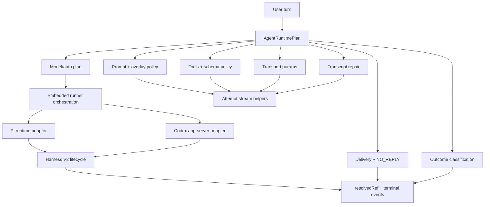

## Status

This handoff belongs to the final stacked PR that follows the consolidated
RuntimePlan cleanup package in
[PR #72276](https://github.com/openclaw/openclaw/pull/72276) and
[RFC #72072](https://github.com/openclaw/openclaw/issues/72072).

The stack is intentionally commit-separated. Maintainers can review, revert, or
split the work by commit boundary:

1. `model-auth-plan.ts` extraction from embedded run orchestration.
2. `attempt-stream-loop.ts` extraction for abortable prompt submission helpers.
3. Neutral `embedded-runner` imports plus a warning-only deprecated import guard.
4. This smoke handoff.
5. Native bundled Codex Harness V2 factory.
6. Public Harness V2 plugin registration surface.
7. WebSocket session pooling behind a conservative gate.
8. Full embedded-runner package rename with Pi compatibility exports.

## Architecture map



## Local verification before review

Run these from the repository root after applying the final stack:

```bash
pnpm check:architecture
pnpm check:test-types

node scripts/run-vitest.mjs run --config test/vitest/vitest.agents.config.ts \
  src/agents/pi-embedded-runner/run/model-auth-plan.test.ts \
  src/agents/pi-embedded-runner/run/attempt-stream-loop.test.ts \
  src/agents/pi-embedded-runner/run/attempt.test.ts \
  src/agents/runtime-plan/build.test.ts \
  src/agents/runtime-plan/types.test.ts \
  src/agents/runtime-plan/types.compat.test.ts \
  src/agents/runtime-plan/tools.test.ts \
  src/agents/runtime-plan/tools.diagnostics.test.ts \
  src/agents/harness/v2.test.ts \
  src/agents/harness/selection.test.ts \
  src/agents/harness/builtin-pi.test.ts

node scripts/run-vitest.mjs run --config test/vitest/vitest.extensions.config.ts \
  extensions/codex/src/app-server/run-attempt.test.ts \
  extensions/codex/src/app-server/event-projector.test.ts \
  extensions/codex/index.test.ts

node scripts/check-embedded-runner-imports.mjs
git diff --check
```

The import guard is warning-only by design. It reports remaining deprecated
`pi-embedded-runner` imports while compatibility barrels are still supported.

## GPT-5.4 live smoke matrix

These checks require live credentials and should be run by a maintainer or
operator after the PR stack is merged into a live-capable branch.

| Route                    | Minimum smoke                                                                                               |
| ------------------------ | ----------------------------------------------------------------------------------------------------------- |
| `openai/*` GPT-5.4       | Meaningful response, `read` probe, `exec+read` probe, image probe when supported, tool-call-only follow-up. |
| `openai-codex/*` GPT-5.4 | Same smoke plus verify OpenAI-Codex auth profile forwarding and Responses-family transport params.          |
| `codex/*` GPT-5.4        | Same smoke plus verify Codex app-server harness lifecycle and OpenClaw-owned tool hook behavior.            |
| `codex-cli/*` GPT-5.4    | Same smoke plus verify CLI auth profile aliasing and no auth leakage into unrelated CLI providers.          |

Recommended gateway command shape:

```bash
source ~/.profile
OPENCLAW_LIVE_TEST=1 \
OPENCLAW_LIVE_GATEWAY_MODELS="openai/gpt-5.4,openai-codex/gpt-5.4,codex/gpt-5.4,codex-cli/gpt-5.4" \
node scripts/run-vitest.mjs run --config test/vitest/vitest.gateway.config.ts \
  src/gateway/gateway-models.profiles.live.test.ts
```

If a local checkout uses a newer model suffix, substitute the exact
`provider/model` ids from:

```bash
openclaw models list --json
```

## Policy domains to verify in the smoke transcript

For each route, capture a transcript or structured log evidence for:

| Domain               | Evidence to capture                                                                                           |
| -------------------- | ------------------------------------------------------------------------------------------------------------- |
| Tools                | OpenClaw-owned tool hook wrapping still fires before/after tool calls, including blocked and mutated calls.   |
| Auth                 | The selected auth profile is forwarded only to the provider that owns it.                                     |
| Prompt overlays      | GPT-5 overlay behavior is scoped to the provider/model family that owns it.                                   |
| Transcript repair    | Text, structured, and media follow-up payloads are not dropped.                                               |
| Delivery             | Successful model output does not silently disappear when origin routing fails.                                |
| Fallback             | Empty, planning-only, reasoning-only, block, side-effect, and `NO_REPLY` outcomes classify consistently.      |
| Schema normalization | Responses, WebSocket, compaction, and Codex paths expose executable tool schemas.                             |
| Transport params     | Responses-family params include the intended parallel tool, verbosity, reasoning, and warmup defaults.        |
| Observability        | Existing agent events include enough resolved backend/model/auth/transport information to debug route choice. |

## What this stack does not claim

- It does not remove Pi-named compatibility exports.
- It does not make WebSocket pooling default-on.
- It does not require third-party plugins to implement Harness V2 immediately.
- It does not remove the V1 `AgentHarness` registration path.

Those constraints keep the stack reversible while making the final architecture
easier to inspect and smoke-test.
