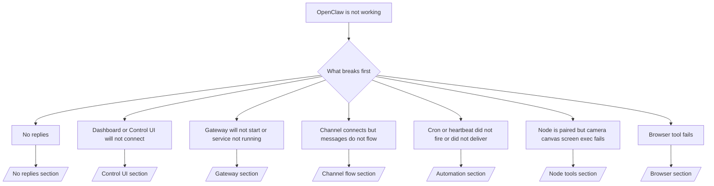

# Устранение неполадок

Если у вас есть только 2 минуты, используйте эту страницу как входную точку первичной диагностики.

## Первые 60 секунд

Выполнить эту точную лестницу по порядку:

```bash
openclaw status
openclaw status --all
openclaw gateway probe
openclaw gateway status
openclaw doctor
openclaw channels status --probe
openclaw logs --follow
```

Хороший результат в одну строку:

- `openclaw status` → показывает настроенные каналы и отсутствие очевидных ошибок аутентификации.
- `openclaw status --all` → полный отчёт присутствует и готов к передаче.
- `openclaw gateway probe` → ожидаемая цель шлюза Gateway достижима.
- `openclaw gateway status` → `Runtime: running` и `RPC probe: ok`.
- `openclaw doctor` → отсутствуют блокирующие ошибки конфигурации/сервисов.
- `openclaw channels status --probe` → каналы сообщают `connected` или `ready`.
- `openclaw logs --follow` → стабильная активность, без повторяющихся фатальных ошибок.

## Дерево решений



<AccordionGroup>
  <Accordion title="No replies">
    ```bash
    openclaw status
    openclaw gateway status
    openclaw channels status --probe
    openclaw pairing list <channel>
    openclaw logs --follow
    ```

    ```
    Хороший результат выглядит так:
    
    - `Runtime: running`
    - `RPC probe: ok`
    - Ваш канал отображается как подключённый/готовый в `channels status --probe`
    - Отправитель выглядит одобренным (или политика DM открыта/используется allowlist)
    
    Распространённые сигнатуры логов:
    
    - `drop guild message (mention required` → блокировка по упоминанию заблокировала сообщение в Discord.
    - `pairing request` → отправитель не одобрен и ожидает подтверждения сопряжения DM.
    - `blocked` / `allowlist` в логах канала → отправитель, комната или группа отфильтрованы.
    
    Подробные страницы:
    
    - [/gateway/troubleshooting#no-replies](/gateway/troubleshooting#no-replies)
    - [/channels/troubleshooting](/channels/troubleshooting)
    - [/channels/pairing](/channels/pairing)
    ```

  </Accordion>

  <Accordion title="Dashboard or Control UI will not connect">
    ```bash
    openclaw status
    openclaw gateway status
    openclaw logs --follow
    openclaw doctor
    openclaw channels status --probe
    ```

    ```
    Хороший результат выглядит так:
    
    - `Dashboard: http://...` отображается в `openclaw gateway status`
    - `RPC probe: ok`
    - В логах нет цикла аутентификации
    
    Распространённые сигнатуры логов:
    
    - `device identity required` → HTTP/незащищённый контекст не может завершить аутентификацию устройства.
    - `unauthorized` / цикл переподключения → неверный токен/пароль или несоответствие режима аутентификации.
    - `gateway connect failed:` → UI нацелен на неверный URL/порт или шлюз недоступен.
    
    Подробные страницы:
    
    - [/gateway/troubleshooting#dashboard-control-ui-connectivity](/gateway/troubleshooting#dashboard-control-ui-connectivity)
    - [/web/control-ui](/web/control-ui)
    - [/gateway/authentication](/gateway/authentication)
    ```

  </Accordion>

  <Accordion title="Gateway will not start or service installed but not running">
    ```bash
    openclaw status
    openclaw gateway status
    openclaw logs --follow
    openclaw doctor
    openclaw channels status --probe
    ```

    ```
    Хороший результат выглядит так:
    
    - `Service: ... (loaded)`
    - `Runtime: running`
    - `RPC probe: ok`
    
    Распространённые сигнатуры логов:
    
    - `Gateway start blocked: set gateway.mode=local` → режим шлюза Gateway не задан/удалённый.
    - `refusing to bind gateway ... without auth` → привязка не к loopback без токена/пароля.
    - `another gateway instance is already listening` или `EADDRINUSE` → порт уже занят.
    
    Подробные страницы:
    
    - [/gateway/troubleshooting#gateway-service-not-running](/gateway/troubleshooting#gateway-service-not-running)
    - [/gateway/background-process](/gateway/background-process)
    - [/gateway/configuration](/gateway/configuration)
    ```

  </Accordion>

  <Accordion title="Channel connects but messages do not flow">
    ```bash
    openclaw status
    openclaw gateway status
    openclaw logs --follow
    openclaw doctor
    openclaw channels status --probe
    ```

    ```
    Хороший результат выглядит так:
    
    - Транспорт канала подключён.
    - Проверки сопряжения/allowlist проходят.
    - Упоминания обнаруживаются там, где это требуется.
    
    Распространённые сигнатуры логов:
    
    - `mention required` → блокировка по групповым упоминаниям остановила обработку.
    - `pairing` / `pending` → отправитель DM ещё не одобрен.
    - `not_in_channel`, `missing_scope`, `Forbidden`, `401/403` → проблема с токеном прав доступа канала.
    
    Подробные страницы:
    
    - [/gateway/troubleshooting#channel-connected-messages-not-flowing](/gateway/troubleshooting#channel-connected-messages-not-flowing)
    - [/channels/troubleshooting](/channels/troubleshooting)
    ```

  </Accordion>

  <Accordion title="Cron or heartbeat did not fire or did not deliver">
    ```bash
    openclaw status
    openclaw gateway status
    openclaw cron status
    openclaw cron list
    openclaw cron runs --id <jobId> --limit 20
    openclaw logs --follow
    ```

    ```
    Хороший результат выглядит так:
    
    - `cron.status` показывает, что включено, и есть следующий запуск.
    - `cron runs` показывает недавние записи `ok`.
    - Heartbeat включён и находится в пределах активных часов.
    
    Распространённые сигнатуры логов:
    
    - `cron: scheduler disabled; jobs will not run automatically` → cron отключён.
    - `heartbeat skipped` с `reason=quiet-hours` → вне настроенных активных часов.
    - `requests-in-flight` → основной поток занят; пробуждение heartbeat было отложено.
    - `unknown accountId` → учётная запись цели доставки heartbeat не существует.
    
    Подробные страницы:
    
    - [/gateway/troubleshooting#cron-and-heartbeat-delivery](/gateway/troubleshooting#cron-and-heartbeat-delivery)
    - [/automation/troubleshooting](/automation/troubleshooting)
    - [/gateway/heartbeat](/gateway/heartbeat)
    ```

  </Accordion>

  <Accordion title="Node is paired but tool fails camera canvas screen exec">
    ```bash
    openclaw status
    openclaw gateway status
    openclaw nodes status
    openclaw nodes describe --node <idOrNameOrIp>
    openclaw logs --follow
    ```

    ```
    Хороший результат выглядит так:
    
    - Узел указан как подключённый и сопряжённый для роли `node`.
    - Для вызываемой команды существует соответствующая возможность.
    - Состояние разрешений для инструмента предоставлено.
    
    Распространённые сигнатуры логов:
    
    - `NODE_BACKGROUND_UNAVAILABLE` → вывести приложение узла на передний план.
    - `*_PERMISSION_REQUIRED` → разрешение ОС было отклонено/отсутствует.
    - `SYSTEM_RUN_DENIED: approval required` → ожидается подтверждение выполнения команды.
    - `SYSTEM_RUN_DENIED: allowlist miss` → команда отсутствует в allowlist выполнения.
    
    Подробные страницы:
    
    - [/gateway/troubleshooting#node-paired-tool-fails](/gateway/troubleshooting#node-paired-tool-fails)
    - [/nodes/troubleshooting](/nodes/troubleshooting)
    - [/tools/exec-approvals](/tools/exec-approvals)
    ```

  </Accordion>

  <Accordion title="Browser tool fails">
    ```bash
    openclaw status
    openclaw gateway status
    openclaw browser status
    openclaw logs --follow
    openclaw doctor
    ```

    ```
    Хороший результат выглядит так:
    
    - Статус браузера показывает `running: true` и выбранный браузер/профиль.
    - Профиль `openclaw` запускается или ретранслятор `chrome` имеет подключённую вкладку.
    
    Распространённые сигнатуры логов:
    
    - `Failed to start Chrome CDP on port` → не удалось запустить локальный браузер.
    - `browser.executablePath not found` → неверно указан путь к бинарному файлу.
    - `Chrome extension relay is running, but no tab is connected` → расширение не подключено.
    - `Browser attachOnly is enabled ... not reachable` → профиль только для подключения не имеет активной цели CDP.
    
    Подробные страницы:
    
    - [/gateway/troubleshooting#browser-tool-fails](/gateway/troubleshooting#browser-tool-fails)
    - [/tools/browser-linux-troubleshooting](/tools/browser-linux-troubleshooting)
    - [/tools/chrome-extension](/tools/chrome-extension)
    ```

  </Accordion>
</AccordionGroup>
