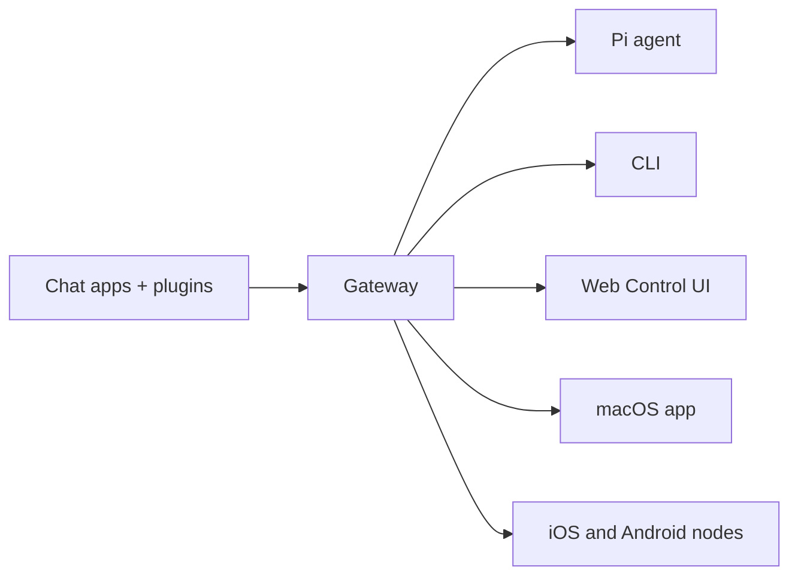

# OpenClaw 🦞

<p align="center">
    
    
</p>

> _«EXFOLIATE! EXFOLIATE!»_ — космический лобстер, вероятно

<p align="center"><strong>Шлюз для ИИ-агентов под любую ОС в WhatsApp, Telegram, Discord, iMessage и не только.</strong><br />
  Отправьте сообщение — получите ответ агента прямо из кармана. Плагины добавляют Mattermost и многое другое.
</p>

<Columns>
  <Card title="Get Started" href="/start/getting-started" icon="rocket">
    Установите OpenClaw и поднимите Gateway (шлюз) за считанные минуты.
  </Card>
  <Card title="Run the Wizard" href="/start/wizard" icon="sparkles">
    Пошаговая настройка с `openclaw onboard` и процессами сопряжения.
  </Card>
  <Card title="Open the Control UI" href="/web/control-ui" icon="layout-dashboard">
    Запустите браузерную панель для чатов, конфига и сеансов.
  </Card>
</Columns>

## Что такое OpenClaw?

OpenClaw — это **самостоятельно размещаемый шлюз**, который подключает ваши любимые чаты — WhatsApp, Telegram, Discord, iMessage и другие — к ИИ-агентам для программирования, таким как Pi. Вы запускаете один процесс Gateway (шлюз) на своей машине (или сервере), и он становится мостом между мессенджерами и всегда доступным ИИ‑ассистентом.

**Для кого это?** Для разработчиков и опытных пользователей, которым нужен персональный ИИ‑ассистент, доступный из любого места — без потери контроля над данными и без зависимости от хостируемого сервиса.

**Чем он отличается?**

- **Самостоятельное размещение**: работает на вашем оборудовании, по вашим правилам
- **Многоканальность**: один Gateway (шлюз) одновременно обслуживает WhatsApp, Telegram, Discord и другие
- **Ориентирован на агентов**: создан для агентного кодинга с инструментами, сеансами, памятью и маршрутизацией между агентами
- **Open source**: лицензия MIT, развитие сообществом

**Что нужно?** Node 22+, ключ API (рекомендуется Anthropic) и 5 минут.

## Как это работает



Gateway (шлюз) — это единый источник истины для сеансов, маршрутизации и подключений каналов.

## Ключевые возможности

<Columns>
  <Card title="Multi-channel gateway" icon="network">
    WhatsApp, Telegram, Discord и iMessage в одном процессе Gateway (шлюза).
  </Card>
  <Card title="Plugin channels" icon="plug">
    Добавляйте Mattermost и другое с помощью пакетов расширений.
  </Card>
  <Card title="Multi-agent routing" icon="route">
    Изолированные сеансы для каждого агента, рабочего пространства или отправителя.
  </Card>
  <Card title="Media support" icon="image">
    Отправка и получение изображений, аудио и документов.
  </Card>
  <Card title="Web Control UI" icon="monitor">
    Браузерная панель для чатов, конфига, сеансов и узлов.
  </Card>
  <Card title="Mobile nodes" icon="smartphone">
    Сопряжение узлов iOS и Android с поддержкой Canvas.
  </Card>
</Columns>

## Быстрый старт

<Steps>
  <Step title="Install OpenClaw">
    ```bash
    npm install -g openclaw@latest
    ```
  </Step>
  <Step title="Onboard and install the service">
    ```bash
    openclaw onboard --install-daemon
    ```
  </Step>
  <Step title="Pair WhatsApp and start the Gateway">
    ```bash
    openclaw channels login
    openclaw gateway --port 18789
    ```
  </Step>
</Steps>

Нужна полная установка и dev‑настройка? См. [Быстрый старт](/start/quickstart).

## Панель управления

Откройте браузерную панель Control UI после запуска Gateway (шлюза).

- Локально по умолчанию: [http://127.0.0.1:18789/](http://127.0.0.1:18789/)
- Удалённый доступ: [Web surfaces](/web) и [Tailscale](/gateway/tailscale)

<p align="center">
  
</p>

## Конфигурация (необязательно)

Конфиг находится по адресу `~/.openclaw/openclaw.json`.

- Если **ничего не делать**, OpenClaw использует поставляемый в комплекте бинарник Pi в режиме RPC с сеансами для каждого отправителя.
- Если требуется ужесточить доступ, начните с `channels.whatsapp.allowFrom` и (для групп) правил упоминаний.

Пример:

```json5
{
  channels: {
    whatsapp: {
      allowFrom: ["+15555550123"],
      groups: { "*": { requireMention: true } },
    },
  },
  messages: { groupChat: { mentionPatterns: ["@openclaw"] } },
}
```

## Начните отсюда

<Columns>
  <Card title="Docs hubs" href="/start/hubs" icon="book-open">
    Вся документация и руководства, сгруппированные по сценариям.
  </Card>
  <Card title="Configuration" href="/gateway/configuration" icon="settings">
    Основные настройки Gateway (шлюза), токены и конфигурация провайдеров.
  </Card>
  <Card title="Remote access" href="/gateway/remote" icon="globe">
    Паттерны доступа по SSH и через tailnet.
  </Card>
  <Card title="Channels" href="/channels/telegram" icon="message-square">
    Настройка каналов для WhatsApp, Telegram, Discord и других.
  </Card>
  <Card title="Nodes" href="/nodes" icon="smartphone">
    Узлы iOS и Android с сопряжением и Canvas.
  </Card>
  <Card title="Help" href="/help" icon="life-buoy">
    Типовые решения и точка входа для устранения неполадок.
  </Card>
</Columns>

## Узнать больше

<Columns>
  <Card title="Full feature list" href="/concepts/features" icon="list">
    Полный набор возможностей каналов, маршрутизации и медиа.
  </Card>
  <Card title="Multi-agent routing" href="/concepts/multi-agent" icon="route">
    Изоляция рабочих пространств и сеансы для каждого агента.
  </Card>
  <Card title="Security" href="/gateway/security" icon="shield">
    Токены, списки разрешённых и средства безопасной работы.
  </Card>
  <Card title="Troubleshooting" href="/gateway/troubleshooting" icon="wrench">
    Диагностика Gateway (шлюза) и распространённые ошибки.
  </Card>
  <Card title="About and credits" href="/reference/credits" icon="info">
    Происхождение проекта, участники и лицензия.
  </Card>
</Columns>
