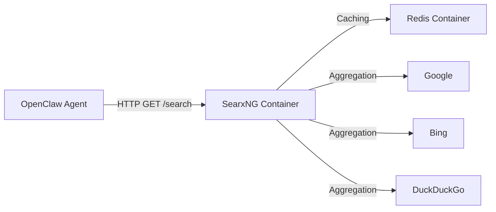

# SearxNG Implementation Guide

## 1. Overview
This project integrates **SearxNG**, a free internet metasearch engine, to provide the AI agent with "unlimited" and private web search capabilities. Unlike proprietary providers (like Brave or Perplexity) that require paid API keys and impose strict rate limits, this self-hosted solution runs entirely within your infrastructure.

## 2. Why is this useful?

### 🚀 **Free & Unlimited**
-   **No API Costs**: You stop paying per-search fees to 3rd party providers.
-   **No Hard Rate Limits**: While public engines (Google/Bing) verify traffic, SearxNG rotates user agents and aggregates from dozens of sources to minimize blocking. You control the thoroughness of the search.

### 🛡️ **Privacy & Security**
-   **No Data Leaks**: Your search queries are not sent to a 3rd party API aggregator log.
-   **Proxy**: Request traffic comes from your server IP, not the end-user's IP.

### 🧠 **Better Results (Metasearch)**
-   **Aggregation**: SearxNG combines results from Google, Bing, DuckDuckGo, Wikipedia, Reddit, and 70+ other engines into a single ranking.
-   **No Ads**: It automatically strips tracking pixels and advertisements from the search results before the AI reads them.

---

## 3. Architecture

The implementation consists of two main parts:

### A. Infrastructure (Docker Compose)
We added two lightweight services to your `docker-compose.yml`:
1.  **searxng**: The core search engine application (exposed on port `8080`).
2.  **redis**: An in-memory cache required by SearxNG to store session data and limit abuse.



### B. Code Integration (`web-search.ts`)
The TypeScript tool (`src/agents/tools/web-search.ts`) was updated to:
1.  Detect the `searxng` provider in the config.
2.  Send requests to the configured `baseUrl` (default: `http://localhost:8080`).
3.  Parse the specialized JSON format returned by SearxNG.
4.  Standardize the results (Titles, URLs, Snippets) so the Agent understands them just like it understands Brave or Perplexity results.

---

## 4. Setup & Verification

### Step 1: Start Services
Ensure the Docker containers are running:
```bash
docker-compose up -d --build
```

### Step 2: Configure OpenClaw
Update your configuration file (e.g., `config.json` or `config.json5`) to enable the provider:

```json
{
  "tools": {
    "web": {
      "search": {
        "enabled": true,
        "provider": "searxng",
        "searxng": {
          "baseUrl": "http://localhost:8080" 
        }
      }
    }
  }
}
```

### Step 3: Verify
You can test if SearxNG is working by opening your browser to [http://localhost:8080](http://localhost:8080). You should see the search bar interface.

---

## 5. Troubleshooting

**Issue**: `error: seaxng provider requires a baseUrl`
**Fix**: Ensure your `config.json` includes the `searxng.baseUrl` field.

**Issue**: `docker pull access denied for openclaw`
**Fix**: This means the local image wasn't built. Run `docker-compose up -d --build` to force a build from source.

**Issue**: "Rate limit" from upstream (Google/etc)
**Fix**: SearxNG handles this by falling back to other engines. If it happens often, you can add proxies to the `searxng/settings.yml` file (mapped in docker-compose).
