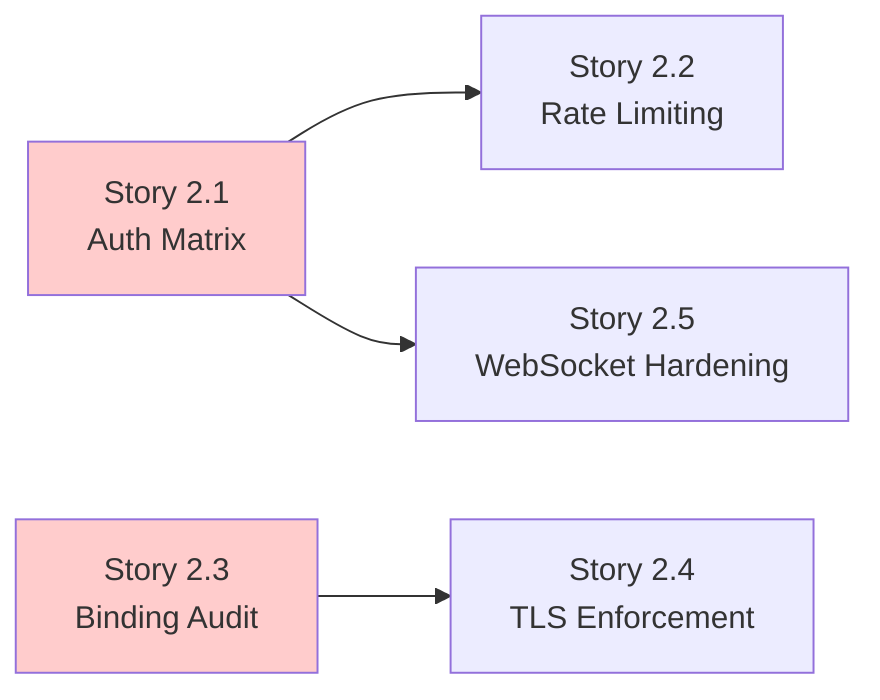
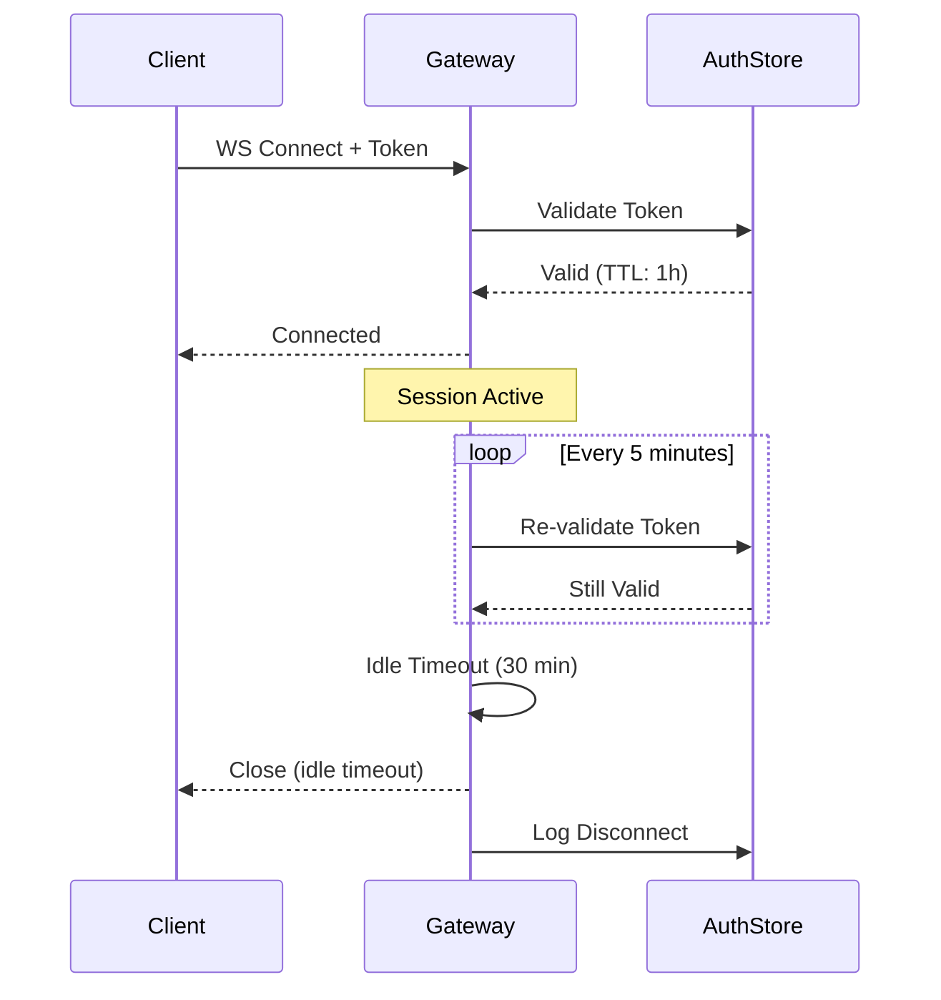

# Security Stories: Exposed Control Surfaces

This document contains implementation-ready Jira stories for addressing **Security Concern 2: Internet-exposed control surfaces (UI, APIs, WebSockets, tool endpoints)**. Each story includes testable acceptance criteria, verification methods, and affected files.

> **Related Documentation:**
> - [Agentic Security Assessment - Concern 2](/security/agentic-security-assessment#concern-2-internet-exposed-control-surfaces) - Detailed risk analysis and current state assessment
> - [Security Epic](/security/security-epic) - Parent epic and success criteria
> - [Operational Security Guide](/gateway/security) - Day-to-day security operations

---

## Overview

| Field | Value |
|-------|-------|
| **Security Concern** | 2 - Internet-exposed control surfaces (UI, APIs, WebSockets, tool endpoints) |
| **Severity** | Critical |
| **Priority** | P0 |
| **Stories in Collection** | 5 |
| **Related Epic** | SEC-EPIC-001: Agentic Security Hardening Initiative |

### Problem Statement

OpenClaw exposes multiple control surfaces that, if compromised, provide direct access to agent capabilities:

- **HTTP Server** (`src/gateway/server-http.ts:205-321`) - Handles hooks, tools invoke, OpenAI API, and Control UI
- **WebSocket RPC** - Real-time communication channel for agent control
- **Control UI** (`src/gateway/control-ui.ts`) - Web interface for agent management
- **Hook Endpoints** (`/hooks/*`) - Webhook receivers for external integrations
- **OpenAI-compatible API** (`src/gateway/openai-http.ts`) - Chat completions endpoint

Without consistent authentication requirements and network hardening, these surfaces create attack vectors for unauthorized access, session hijacking, and credential theft.

### Current Architecture Reference

**Authentication System:**
```
Source: src/gateway/auth.ts:199-222
```

The gateway authentication supports multiple modes:
- Token-based authentication (`gateway.auth.token`)
- Password authentication (`gateway.auth.password`)
- Tailscale identity verification (`gateway.auth.allowTailscale`)

**Control Surface Security Gaps:**

| Surface | Current Auth | Gap |
|---------|--------------|-----|
| WebSocket RPC | Token/Password/Tailscale | ✅ Implemented |
| HTTP Hooks | Bearer Token | ✅ Implemented |
| OpenAI API | Token | Rate limiting missing |
| Control UI | Device + Token | Configurable bypass options exist |
| Plugin Routes | Plugin-defined | Inconsistent enforcement |

### Story Dependency Flow



---

## Story 2.1: Implement Endpoint Authentication Matrix

### Metadata

| Field | Value |
|-------|-------|
| **Story ID** | SEC-2.1 |
| **Category** | Architecture |
| **Priority** | Critical |
| **Estimated Complexity** | Medium |
| **Dependencies** | None |

### Description

Create a centralized authentication matrix that explicitly declares authentication requirements for every HTTP and WebSocket endpoint in the gateway. This matrix serves as both documentation and runtime enforcement, ensuring no endpoint is accidentally exposed without authentication.

The authentication matrix must be:
1. **Declarative** - Authentication requirements defined as data, not scattered in code
2. **Enforced** - Middleware validates every request against the matrix
3. **Auditable** - Security audit can verify all endpoints have explicit requirements

**Reference Implementation Pattern:**

```typescript
// src/gateway/endpoint-auth-matrix.ts
type AuthRequirement = 
  | { type: "token" | "password" | "tailscale" }
  | { type: "public"; justification: string }
  | { type: "internal-only" };

const ENDPOINT_AUTH_MATRIX: Record<string, AuthRequirement> = {
  "/v1/chat/completions": { type: "token" },
  "/hooks/*": { type: "token" },
  "/health": { type: "public", justification: "Read-only status, no sensitive data" },
  // ... all endpoints
};
```

### Acceptance Criteria

- [ ] All HTTP and WebSocket endpoints have explicit authentication requirements documented in `src/gateway/endpoint-auth-matrix.ts`
- [ ] Authentication middleware validates every incoming request against the matrix before routing to handlers
- [ ] Unauthenticated endpoints are explicitly marked as `public` with a security justification string that is logged at startup
- [ ] Requests to endpoints not in the matrix are rejected with 403 Forbidden (fail-closed)
- [ ] Security audit (`openclaw security audit`) reports any endpoints missing from the matrix

### Security Risk Reduced

**Attack Vector Mitigated:** Accidental exposure of unauthenticated endpoints

Without an explicit matrix, new endpoints might be added without authentication requirements, creating backdoor access. The matrix ensures:
- Every endpoint has a conscious authentication decision
- Changes to authentication requirements are visible in code review
- Fail-closed behavior prevents accidental exposure

### Verification Method

1. **Unit Tests:**
   - Test that all known endpoints are present in the matrix
   - Test that missing endpoints are rejected with 403
   - Test that public endpoints require justification

2. **Integration Tests:**
   - Test authentication enforcement for each endpoint type
   - Test that authenticated requests succeed with valid credentials
   - Test that unauthenticated requests to protected endpoints fail with 401

3. **Security Audit Check:**
   ```bash
   openclaw security audit --deep
   # Should report: "All endpoints have explicit auth requirements"
   ```

### Affected Files

| File | Change Type | Description |
|------|-------------|-------------|
| `src/gateway/endpoint-auth-matrix.ts` | **New** | Authentication matrix definition and types |
| `src/gateway/server-http.ts` | Modify | Integrate matrix validation middleware |
| `src/gateway/auth.ts` | Modify | Add matrix lookup helper functions |
| `src/security/audit.ts` | Modify | Add endpoint coverage audit check |

---

## Story 2.2: Add Rate Limiting to Exposed APIs

### Metadata

| Field | Value |
|-------|-------|
| **Story ID** | SEC-2.2 |
| **Category** | Runtime |
| **Priority** | High |
| **Estimated Complexity** | Medium |
| **Dependencies** | Story 2.1 (Endpoint Authentication Matrix) |

### Description

Implement configurable rate limiting for all HTTP APIs and WebSocket connections using a token bucket algorithm. Rate limiting protects against:

- **Brute force attacks** on authentication endpoints
- **API abuse** and resource exhaustion
- **Denial of service** through request flooding

Rate limits must be:
1. **Configurable** per endpoint category (hooks, API, UI)
2. **Observable** with metrics exposed for monitoring
3. **Informative** with Retry-After headers on violations

**Configuration Schema:**

```yaml
# config.yaml
gateway:
  rateLimit:
    enabled: true
    defaults:
      requestsPerMinute: 100
      burstSize: 20
    endpoints:
      "/v1/chat/completions":
        requestsPerMinute: 30
        burstSize: 5
      "/hooks/*":
        requestsPerMinute: 60
        burstSize: 10
```

### Acceptance Criteria

- [ ] Rate limiting is enabled by default with sensible defaults (100 req/min, burst 20)
- [ ] Rate limits are configurable per endpoint category in `gateway.rateLimit` configuration
- [ ] Rate limit violations return HTTP 429 status with `Retry-After` header indicating seconds until retry is allowed
- [ ] Rate limit state persists across requests using client IP (or authenticated identity if available)
- [ ] Rate limit metrics are exposed at `/metrics` endpoint: `gateway_rate_limit_hits_total`, `gateway_rate_limit_violations_total`
- [ ] WebSocket connections are rate-limited by connection establishment rate, not message rate

### Security Risk Reduced

**Attack Vectors Mitigated:**
- Brute force credential guessing (auth endpoints)
- API abuse for resource exhaustion (completions endpoint)
- Hook flooding for denial of service

**Risk Reduction:** Rate limiting ensures that even if an attacker discovers an exposed endpoint, they cannot abuse it at scale. The Retry-After header enables legitimate clients to back off gracefully.

### Verification Method

1. **Unit Tests:**
   - Test token bucket algorithm with various burst/rate configurations
   - Test client identification by IP and authenticated identity
   - Test Retry-After header calculation

2. **Load Tests:**
   ```bash
   # Verify rate limiting kicks in at configured threshold
   ab -n 200 -c 10 http://localhost:18789/v1/chat/completions
   # Should see 429 responses after burst limit exceeded
   ```

3. **Integration Tests:**
   - Test 429 response with valid Retry-After header
   - Test that requests resume after Retry-After period
   - Test metrics endpoint exposes rate limit counters

### Affected Files

| File | Change Type | Description |
|------|-------------|-------------|
| `src/gateway/rate-limit.ts` | **New** | Token bucket implementation and middleware |
| `src/gateway/server-http.ts` | Modify | Integrate rate limiting middleware |
| `src/config/types.gateway.ts` | Modify | Add rate limit configuration types |
| `src/gateway/metrics.ts` | Modify | Add rate limit metrics |

---

## Story 2.3: Create Network Binding Audit Checks

### Metadata

| Field | Value |
|-------|-------|
| **Story ID** | SEC-2.3 |
| **Category** | Tooling |
| **Priority** | Critical |
| **Estimated Complexity** | Small |
| **Dependencies** | None |

### Description

Extend the security audit system to verify gateway bind address configuration and detect unsafe network exposure patterns. The audit must identify configurations that expose the gateway to networks beyond localhost without adequate protection.

**Current Binding Behavior:**

```
Source: src/security/audit.ts:256-363
```

The existing audit checks for `gateway.bind_no_auth` (binding beyond loopback without auth), but additional checks are needed for:
- Explicit opt-in for non-localhost binding
- Trusted proxy configuration behind reverse proxies
- Combined risk of open binding + dangerous settings

**Audit Rule Severity Mapping:**

| Configuration | Without Auth | With Auth | Risk |
|---------------|--------------|-----------|------|
| Bind to `127.0.0.1` | Warning | OK | Low |
| Bind to `0.0.0.0` | **Critical** | Warning | High |
| Bind to public IP | **Critical** | Warning | High |
| Behind reverse proxy, no `trustedProxies` | Warning | Warning | Medium |

### Acceptance Criteria

- [ ] Audit detects binding to `0.0.0.0` or public IP addresses without explicit `gateway.allowPublicBind: true` opt-in, reporting as **critical** severity
- [ ] Audit warns when proxy headers are detected (`X-Forwarded-For`) but `gateway.trustedProxies` is not configured, as this indicates misconfigured reverse proxy setup
- [ ] Audit reports **critical** when authentication is disabled (`gateway.auth.mode: none` or missing token/password) on any non-localhost binding
- [ ] Audit output includes remediation guidance for each finding (e.g., "Add gateway.trustedProxies configuration or set gateway.bind: loopback")
- [ ] Audit findings are machine-readable (JSON output option) for CI/CD integration

### Security Risk Reduced

**Attack Vector Mitigated:** Accidental internet exposure of unprotected control surfaces

Misconfigurations like binding to `0.0.0.0` without authentication are easy to introduce during development and forget to change before deployment. The audit catches these patterns before they become production vulnerabilities.

### Verification Method

1. **Unit Tests:**
   ```typescript
   // Test audit rules in isolation
   describe("gateway binding audit", () => {
     it("reports critical for 0.0.0.0 binding without auth", () => {
       const findings = runAudit({ bind: "0.0.0.0", auth: null });
       expect(findings).toContain({ severity: "critical", checkId: "gateway.public_bind_no_auth" });
     });
     
     it("warns when behind proxy without trustedProxies", () => {
       const findings = runAudit({ bind: "loopback", proxyHeadersDetected: true, trustedProxies: [] });
       expect(findings).toContain({ severity: "warn", checkId: "gateway.proxy_no_trusted" });
     });
   });
   ```

2. **Integration Tests:**
   - Test audit with various bind configurations
   - Test JSON output format for CI/CD consumption
   - Test remediation guidance in output

3. **Manual Verification:**
   ```bash
   openclaw security audit --deep --json
   # Verify output includes gateway binding checks
   ```

### Affected Files

| File | Change Type | Description |
|------|-------------|-------------|
| `src/security/audit.ts` | Modify | Add binding audit checks and severity logic |
| `src/security/audit-extra.ts` | Modify | Add proxy header detection heuristics |
| `src/security/audit.test.ts` | Modify | Add tests for new audit rules |

---

## Story 2.4: Implement TLS Enforcement for Control UI

### Metadata

| Field | Value |
|-------|-------|
| **Story ID** | SEC-2.4 |
| **Category** | Architecture |
| **Priority** | High |
| **Estimated Complexity** | Small |
| **Dependencies** | Story 2.3 (Network Binding Audit Checks) |

### Description

Add configuration option to require TLS (HTTPS) for Control UI access, with clear warning when running in insecure mode. The Control UI requires a **secure context** for device identity generation (WebCrypto API), but currently allows degraded modes that bypass this requirement.

**Current Insecure Options:**

```
Source: src/gateway/control-ui.ts
```

- `gateway.controlUi.allowInsecureAuth` - Allows token-only auth over HTTP
- `gateway.controlUi.dangerouslyDisableDeviceAuth` - Disables device identity checks entirely

**Target Behavior:**

1. When TLS is available (via Tailscale Serve or native HTTPS), Control UI should redirect HTTP→HTTPS
2. New `gateway.controlUi.requireTls` option enforces HTTPS-only access
3. Insecure options (`allowInsecureAuth`, `dangerouslyDisableDeviceAuth`) generate deprecation warnings and security audit findings

### Acceptance Criteria

- [ ] Control UI returns HTTP 301 redirect to HTTPS when TLS is available and client connects via HTTP
- [ ] Configuration option `gateway.controlUi.requireTls` (default: `false`) enforces HTTPS-only access, returning 403 with error page for HTTP connections
- [ ] Security audit reports **warning** when `requireTls` is `false` on non-localhost bindings
- [ ] Security audit reports **critical** when `dangerouslyDisableDeviceAuth` is `true`, with deprecation notice
- [ ] Deprecation warnings are logged at startup when insecure options are enabled

### Security Risk Reduced

**Attack Vector Mitigated:** Credential interception on Control UI

Without TLS enforcement:
- Authentication tokens can be intercepted by network attackers (MITM)
- Session cookies are vulnerable to hijacking
- Device identity cannot be properly established (no secure context)

TLS enforcement ensures credentials are encrypted in transit and the browser has access to secure APIs for identity generation.

### Verification Method

1. **Integration Tests:**
   ```typescript
   describe("Control UI TLS enforcement", () => {
     it("redirects HTTP to HTTPS when TLS available", async () => {
       // Start server with TLS
       const res = await fetch("http://localhost:18789/ui/", { redirect: "manual" });
       expect(res.status).toBe(301);
       expect(res.headers.get("Location")).toMatch(/^https:/);
     });
     
     it("returns 403 when requireTls=true and HTTP request", async () => {
       // Configure requireTls: true
       const res = await fetch("http://localhost:18789/ui/");
       expect(res.status).toBe(403);
     });
   });
   ```

2. **Audit Tests:**
   - Test audit warning for `requireTls: false` on non-localhost
   - Test audit critical for `dangerouslyDisableDeviceAuth: true`

3. **Manual Verification:**
   ```bash
   # Enable Tailscale Serve, access UI via HTTP
   curl -I http://localhost:18789/ui/
   # Should see Location: https://...
   ```

### Affected Files

| File | Change Type | Description |
|------|-------------|-------------|
| `src/gateway/control-ui.ts` | Modify | Add TLS detection and redirect logic |
| `src/config/types.gateway.ts` | Modify | Add `requireTls` option to `ControlUiConfig` |
| `src/security/audit.ts` | Modify | Add audit checks for insecure UI options |

---

## Story 2.5: Add WebSocket Authentication Hardening

### Metadata

| Field | Value |
|-------|-------|
| **Story ID** | SEC-2.5 |
| **Category** | Runtime |
| **Priority** | High |
| **Estimated Complexity** | Medium |
| **Dependencies** | Story 2.1 (Endpoint Authentication Matrix) |

### Description

Implement per-connection authentication validation for WebSocket connections with session timeout enforcement. Currently, WebSocket authentication occurs only at connection establishment; this story adds:

1. **Session timeout** - Configurable idle and absolute timeouts
2. **Periodic validation** - Re-validate authentication during long-lived sessions
3. **Graceful disconnect** - Clean session termination with audit logging

**WebSocket Session Lifecycle:**



### Acceptance Criteria

- [ ] WebSocket sessions have configurable idle timeout (default: 30 minutes), after which connection is closed with close code 4001 (idle timeout)
- [ ] WebSocket sessions have configurable absolute timeout (default: 24 hours), after which connection is closed with close code 4002 (session expired)
- [ ] Authentication tokens are validated at connection and periodically during session (default: every 5 minutes)
- [ ] Invalid or expired tokens during session trigger immediate disconnect with close code 4003 (authentication failed) and audit log entry
- [ ] Session disconnect events are logged with structured audit metadata: `{ sessionId, reason, duration, lastActivity }`

### Security Risk Reduced

**Attack Vectors Mitigated:**
- **Session hijacking** - Periodic re-validation limits window for stolen tokens
- **Stale session exploitation** - Idle timeout prevents forgotten connections from being exploited
- **Token revocation bypass** - Periodic validation ensures revoked tokens are honored

**Risk Reduction:** Long-lived WebSocket connections are a unique security challenge because the authentication handshake happens only once. Periodic validation and session timeouts ensure that even compromised sessions have limited lifetime.

### Verification Method

1. **Unit Tests:**
   - Test idle timeout triggers after configured period
   - Test absolute timeout triggers regardless of activity
   - Test periodic validation with valid/invalid tokens
   - Test close codes match documented values

2. **Integration Tests:**
   ```typescript
   describe("WebSocket session timeout", () => {
     it("disconnects idle connection after timeout", async () => {
       const ws = await connectWebSocket({ token: validToken });
       // Configure idle timeout to 1 second for testing
       await wait(1500);
       expect(ws.readyState).toBe(WebSocket.CLOSED);
       expect(ws.closeCode).toBe(4001);
     });
     
     it("disconnects when token is revoked mid-session", async () => {
       const ws = await connectWebSocket({ token: validToken });
       await revokeToken(validToken);
       // Wait for periodic validation
       await wait(5000);
       expect(ws.readyState).toBe(WebSocket.CLOSED);
       expect(ws.closeCode).toBe(4003);
     });
   });
   ```

3. **Audit Log Verification:**
   - Verify disconnect events include required metadata
   - Verify log format is machine-parseable

### Affected Files

| File | Change Type | Description |
|------|-------------|-------------|
| `src/gateway/server-ws.ts` | Modify | Add session timeout and periodic validation |
| `src/gateway/session-utils.ts` | Modify | Add session timeout management functions |
| `src/config/types.gateway.ts` | Modify | Add WebSocket session configuration options |
| `src/logging/session-audit.ts` | **New** | Structured session audit logging |

---

## Summary Table

| Story ID | Title | Category | Priority | Complexity | Dependencies | Status |
|----------|-------|----------|----------|------------|--------------|--------|
| SEC-2.1 | Implement Endpoint Authentication Matrix | Architecture | Critical | Medium | None | ⬜ Not Started |
| SEC-2.2 | Add Rate Limiting to Exposed APIs | Runtime | High | Medium | SEC-2.1 | ⬜ Not Started |
| SEC-2.3 | Create Network Binding Audit Checks | Tooling | Critical | Small | None | ⬜ Not Started |
| SEC-2.4 | Implement TLS Enforcement for Control UI | Architecture | High | Small | SEC-2.3 | ⬜ Not Started |
| SEC-2.5 | Add WebSocket Authentication Hardening | Runtime | High | Medium | SEC-2.1 | ⬜ Not Started |

### Estimated Total Effort

| Complexity | Count | Typical Duration |
|------------|-------|------------------|
| Small | 2 | 1-2 days each |
| Medium | 3 | 3-5 days each |
| **Total** | **5** | **~15-20 days** |

### Recommended Implementation Order

1. **Phase 1 (Parallel):**
   - SEC-2.1: Authentication Matrix (Critical, enables 2.2 and 2.5)
   - SEC-2.3: Binding Audit (Critical, enables 2.4)

2. **Phase 2 (After Phase 1):**
   - SEC-2.2: Rate Limiting (depends on 2.1)
   - SEC-2.4: TLS Enforcement (depends on 2.3)
   - SEC-2.5: WebSocket Hardening (depends on 2.1)

---

## Appendix: Source Code References

### HTTP Server Endpoint Handling

```
Source: src/gateway/server-http.ts:236-318
```

The `handleRequest` function routes requests to various handlers:
1. Hooks (`handleHooksRequest`) - line 245
2. Tools Invoke (`handleToolsInvokeHttpRequest`) - line 249
3. Slack (`handleSlackHttpRequest`) - line 256
4. Plugins (`handlePluginRequest`) - line 259
5. OpenResponses (`handleOpenResponsesHttpRequest`) - line 264
6. OpenAI (`handleOpenAiHttpRequest`) - line 275
7. Control UI (`handleControlUiHttpRequest`) - line 301

### Authentication Resolution

```
Source: src/gateway/auth.ts:199-222
```

The `resolveGatewayAuth` function determines authentication mode:
- Token mode (default): Requires `gateway.auth.token` or `OPENCLAW_GATEWAY_TOKEN`
- Password mode: Requires `gateway.auth.password`
- Tailscale mode: Requires Tailscale Serve with identity headers

### Control UI Security Modes

```
Source: src/gateway/control-ui.ts (security configuration options)
```

- `allowInsecureAuth`: Falls back to token-only auth over HTTP
- `dangerouslyDisableDeviceAuth`: Completely disables device identity validation

### Existing Audit Checks

```
Source: src/security/audit.ts:256-363
```

Current gateway audit checks:
- `gateway.bind_no_auth`: Binding beyond loopback without authentication
- `gateway.control_ui_insecure`: Control UI with insecure options enabled
