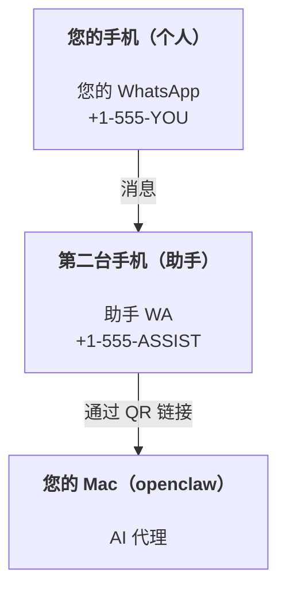

# 使用 OpenClaw 构建个人助手

OpenClaw 是一个自托管网关，将 Discord、Google Chat、iMessage、Matrix、Microsoft Teams、Signal、Slack、Telegram、WhatsApp、Zalo 等连接到 AI 代理。本指南涵盖了 "个人助手" 设置：一个专用的 WhatsApp 号码，其行为就像您始终在线的 AI 助手。

## ⚠️ 安全第一

您正在将代理置于以下位置：

- 在您的机器上运行命令（取决于您的工具策略）
- 读写工作区中的文件
- 通过 WhatsApp/Telegram/Discord/Mattermost 和其他捆绑通道发回消息

保守开始：

- 始终设置 `channels.whatsapp.allowFrom`（永远不要在您的个人 Mac 上运行对世界开放的设置）。
- 为助手使用专用的 WhatsApp 号码。
- 心跳现在默认为每 30 分钟一次。在您信任设置之前，通过设置 `agents.defaults.heartbeat.every: "0m"` 禁用它。

## 先决条件

- OpenClaw 已安装并引导 — 如果您还没有完成此操作，请参阅 [快速开始](/start/getting-started)
- 助手的第二个电话号码（SIM/eSIM/预付费）

## 双手机设置（推荐）

您需要这样：



如果您将个人 WhatsApp 链接到 OpenClaw，发送给您的每条消息都会成为 "代理输入"。这很少是您想要的。

## 5 分钟快速开始

1. 配对 WhatsApp Web（显示 QR；用助手手机扫描）：

```bash
openclaw channels login
```

2. 启动网关（保持运行）：

```bash
openclaw gateway --port 18789
```

3. 在 `~/.openclaw/openclaw.json` 中放入最小配置：

```json5
{
  gateway: { mode: "local" },
  channels: { whatsapp: { allowFrom: ["+15555550123"] } },
}
```

现在从您的允许列表中的手机向助手号码发送消息。

引导流程完成后，我们会自动打开仪表板并打印一个干净（非令牌化）的链接。如果它提示进行身份验证，请将配置的共享密钥粘贴到控制 UI 设置中。引导流程默认使用令牌（`gateway.auth.token`），但如果您将 `gateway.auth.mode` 切换为 `password`，密码身份验证也可以使用。以后要重新打开：`openclaw dashboard`。

## 给代理一个工作区（AGENTS）

OpenClaw 从其工作区目录读取操作说明和 "内存"。

默认情况下，OpenClaw 使用 `~/.openclaw/workspace` 作为代理工作区，并会在设置/首次代理运行时自动创建它（加上启动的 `AGENTS.md`、`SOUL.md`、`TOOLS.md`、`IDENTITY.md`、`USER.md`、`HEARTBEAT.md`）。`BOOTSTRAP.md` 仅在工作区全新时创建（删除后不应再出现）。`MEMORY.md` 是可选的（不会自动创建）；存在时，它会为正常会话加载。子代理会话仅注入 `AGENTS.md` 和 `TOOLS.md`。

提示：将此文件夹视为 OpenClaw 的 "内存" 并将其设为 git 仓库（理想情况下是私有的），以便备份您的 `AGENTS.md` + 内存文件。如果安装了 git，全新的工作区会自动初始化。

```bash
openclaw setup
```

完整工作区布局 + 备份指南：[代理工作区](/concepts/agent-workspace)
内存工作流程：[内存](/concepts/memory)

可选：使用 `agents.defaults.workspace` 选择不同的工作区（支持 `~`）。

```json5
{
  agent: {
    workspace: "~/.openclaw/workspace",
  },
}
```

如果您已经从仓库提供自己的工作区文件，可以完全禁用引导文件创建：

```json5
{
  agent: {
    skipBootstrap: true,
  },
}
```

## 将其转变为 "助手" 的配置

OpenClaw 默认为良好的助手设置，但您通常需要调整：

- [`SOUL.md`](/concepts/soul) 中的角色/说明
- 思考默认值（如果需要）
- 心跳（一旦您信任它）

示例：

```json5
{
  logging: { level: "info" },
  agent: {
    model: "anthropic/claude-opus-4-6",
    workspace: "~/.openclaw/workspace",
    thinkingDefault: "high",
    timeoutSeconds: 1800,
    // 从 0 开始；稍后启用。
    heartbeat: { every: "0m" },
  },
  channels: {
    whatsapp: {
      allowFrom: ["+15555550123"],
      groups: {
        "*": { requireMention: true },
      },
    },
  },
  routing: {
    groupChat: {
      mentionPatterns: ["@openclaw", "openclaw"],
    },
  },
  session: {
    scope: "per-sender",
    resetTriggers: ["/new", "/reset"],
    reset: {
      mode: "daily",
      atHour: 4,
      idleMinutes: 10080,
    },
  },
}
```

## 会话和内存

- 会话文件：`~/.openclaw/agents/<agentId>/sessions/{{SessionId}}.jsonl`
- 会话元数据（令牌使用情况、最后路由等）：`~/.openclaw/agents/<agentId>/sessions/sessions.json`（旧版：`~/.openclaw/sessions/sessions.json`）
- `/new` 或 `/reset` 为该聊天开始新会话（可通过 `resetTriggers` 配置）。如果单独发送，代理会回复简短的问候以确认重置。
- `/compact [instructions]` 压缩会话上下文并报告剩余的上下文预算。

## 心跳（主动模式）

默认情况下，OpenClaw 每 30 分钟运行一次心跳，提示：
`如果 HEARTBEAT.md 存在（工作区上下文），请阅读它。严格遵循它。不要从之前的聊天中推断或重复旧任务。如果没有需要注意的事项，请回复 HEARTBEAT_OK。`
设置 `agents.defaults.heartbeat.every: "0m"` 以禁用。

- 如果 `HEARTBEAT.md` 存在但实际上是空的（只有空行和 Markdown 标题，如 `# 标题`），OpenClaw 会跳过心跳运行以节省 API 调用。
- 如果文件缺失，心跳仍会运行，模型决定做什么。
- 如果代理回复 `HEARTBEAT_OK`（可选带有短填充；见 `agents.defaults.heartbeat.ackMaxChars`），OpenClaw 会抑制该心跳的出站传递。
- 默认情况下，允许向 DM 风格的 `user:<id>` 目标传递心跳。设置 `agents.defaults.heartbeat.directPolicy: "block"` 以抑制直接目标传递，同时保持心跳运行活跃。
- 心跳运行完整的代理轮次 — 更短的间隔会消耗更多令牌。

```json5
{
  agent: {
    heartbeat: { every: "30m" },
  },
}
```

## 媒体输入和输出

入站附件（图像/音频/文档）可以通过模板显示在您的命令中：

- `{{MediaPath}}`（本地临时文件路径）
- `{{MediaUrl}}`（伪 URL）
- `{{Transcript}}`（如果启用了音频转录）

代理的出站附件：在单独的行上包含 `MEDIA:<path-or-url>`（无空格）。示例：

```
这是截图。
MEDIA:https://example.com/screenshot.png
```

OpenClaw 提取这些并将它们作为媒体与文本一起发送。

本地路径行为遵循与代理相同的文件读取信任模型：

- 如果 `tools.fs.workspaceOnly` 为 `true`，出站 `MEDIA:` 本地路径仅限于 OpenClaw 临时根目录、媒体缓存、代理工作区路径和沙箱生成的文件。
- 如果 `tools.fs.workspaceOnly` 为 `false`，出站 `MEDIA:` 可以使用代理已经被允许读取的主机本地文件。
- 主机本地发送仍然只允许媒体和安全文档类型（图像、音频、视频、PDF 和 Office 文档）。纯文本和类似秘密的文件不被视为可发送媒体。

这意味着当您的文件系统策略已经允许这些读取时，工作区外生成的图像/文件现在可以发送，而不会重新打开任意主机文本附件泄露。

## 操作清单

```bash
openclaw status          # 本地状态（凭据、会话、排队事件）
openclaw status --all    # 完整诊断（只读，可粘贴）
openclaw status --deep   # 向网关请求实时健康探测，支持时包含通道探测
openclaw health --json   # 网关健康快照（WS；默认可返回新鲜的缓存快照）
```

日志位于 `/tmp/openclaw/` 下（默认：`openclaw-YYYY-MM-DD.log`）。

## 后续步骤

- WebChat：[WebChat](/web/webchat)
- 网关操作：[网关运行手册](/gateway)
- Cron + 唤醒：[Cron 作业](/automation/cron-jobs)
- macOS 菜单栏 companion：[OpenClaw macOS 应用](/platforms/macos)
- iOS 节点应用：[iOS 应用](/platforms/ios)
- Android 节点应用：[Android 应用](/platforms/android)
- Windows 状态：[Windows (WSL2)](/platforms/windows)
- Linux 状态：[Linux 应用](/platforms/linux)
- 安全：[安全](/gateway/security)