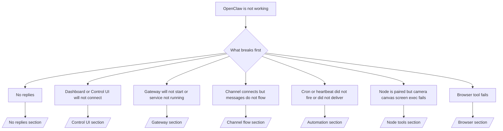

# Felsökning

Om du bara har 2 minuter, använd den här sidan som en triage-ingång.

## Första 60 sekunderna

Kör exakt denna stege i ordning:

```bash
openclaw status
openclaw status --all
openclaw gateway probe
openclaw gateway status
openclaw doctor
openclaw channels status --probe
openclaw logs --follow
```

Bra utdata på en rad:

- `openclaw status` → visar konfigurerade kanaler och inga uppenbara autentiseringsfel.
- `openclaw status --all` → fullständig rapport finns och kan delas.
- `openclaw gateway probe` → förväntat gateway-mål är nåbart.
- `openclaw gateway status` → `Runtime: running` och `RPC probe: ok`.
- `openclaw doctor` → inga blockerande konfigurations-/tjänstfel.
- `openclaw channels status --probe` → kanaler rapporterar `connected` eller `ready`.
- `openclaw logs --follow` → stabil aktivitet, inga upprepade fatala fel.

## Beslutsträd



<AccordionGroup>
  <Accordion title="No replies">
    ```bash
    openclaw status
    openclaw gateway status
    openclaw channels status --probe
    openclaw pairing list <channel>
    openclaw logs --follow
    ```

    ```
    Bra utdata ser ut så här:
    
    - `Runtime: running`
    - `RPC probe: ok`
    - Din kanal visar ansluten/redo i `channels status --probe`
    - Avsändaren verkar godkänd (eller DM-policy är öppen/tillåtelselista)
    
    Vanliga loggsignaturer:
    
    - `drop guild message (mention required` → nämningsgating blockerade meddelandet i Discord.
    - `pairing request` → avsändaren är inte godkänd och väntar på godkännande för DM-parkoppling.
    - `blocked` / `allowlist` i kanalloggar → avsändare, rum eller grupp är filtrerad.
    
    Fördjupningssidor:
    
    - [/gateway/troubleshooting#no-replies](/gateway/troubleshooting#no-replies)
    - [/channels/troubleshooting](/channels/troubleshooting)
    - [/channels/pairing](/channels/pairing)
    ```

  </Accordion>

  <Accordion title="Dashboard or Control UI will not connect">
    ```bash
    openclaw status
    openclaw gateway status
    openclaw logs --follow
    openclaw doctor
    openclaw channels status --probe
    ```

    ```
    Bra utdata ser ut så här:
    
    - `Dashboard: http://...` visas i `openclaw gateway status`
    - `RPC probe: ok`
    - Ingen autentiseringsloop i loggarna
    
    Vanliga loggsignaturer:
    
    - `device identity required` → HTTP/icke-säker kontext kan inte slutföra enhetsautentisering.
    - `unauthorized` / återanslutningsloop → fel token/lösenord eller mismatch i autentiseringsläge.
    - `gateway connect failed:` → UI pekar mot fel URL/port eller en onåbar gateway.
    
    Fördjupningssidor:
    
    - [/gateway/troubleshooting#dashboard-control-ui-connectivity](/gateway/troubleshooting#dashboard-control-ui-connectivity)
    - [/web/control-ui](/web/control-ui)
    - [/gateway/authentication](/gateway/authentication)
    ```

  </Accordion>

  <Accordion title="Gateway will not start or service installed but not running">
    ```bash
    openclaw status
    openclaw gateway status
    openclaw logs --follow
    openclaw doctor
    openclaw channels status --probe
    ```

    ```
    Bra utdata ser ut så här:
    
    - `Service: ... (loaded)`
    - `Runtime: running`
    - `RPC probe: ok`
    
    Vanliga loggsignaturer:
    
    - `Gateway start blocked: set gateway.mode=local` → gateway-läget är inte satt/fjärr.
    - `refusing to bind gateway ... without auth` → bindning utan loopback utan token/lösenord.
    - `another gateway instance is already listening` eller `EADDRINUSE` → porten är redan upptagen.
    
    Fördjupningssidor:
    
    - [/gateway/troubleshooting#gateway-service-not-running](/gateway/troubleshooting#gateway-service-not-running)
    - [/gateway/background-process](/gateway/background-process)
    - [/gateway/configuration](/gateway/configuration)
    ```

  </Accordion>

  <Accordion title="Channel connects but messages do not flow">
    ```bash
    openclaw status
    openclaw gateway status
    openclaw logs --follow
    openclaw doctor
    openclaw channels status --probe
    ```

    ```
    Bra utdata ser ut så här:
    
    - Kanaltransporten är ansluten.
    - Kontroller för parkoppling/tillåtelselista passerar.
    - Nämningar detekteras där det krävs.
    
    Vanliga loggsignaturer:
    
    - `mention required` → gating för gruppnämningar blockerade bearbetning.
    - `pairing` / `pending` → DM-avsändaren är ännu inte godkänd.
    - `not_in_channel`, `missing_scope`, `Forbidden`, `401/403` → problem med kanalens behörighetstoken.
    
    Fördjupningssidor:
    
    - [/gateway/troubleshooting#channel-connected-messages-not-flowing](/gateway/troubleshooting#channel-connected-messages-not-flowing)
    - [/channels/troubleshooting](/channels/troubleshooting)
    ```

  </Accordion>

  <Accordion title="Cron or heartbeat did not fire or did not deliver">
    ```bash
    openclaw status
    openclaw gateway status
    openclaw cron status
    openclaw cron list
    openclaw cron runs --id <jobId> --limit 20
    openclaw logs --follow
    ```

    ```
    Bra utdata ser ut så här:
    
    - `cron.status` visar aktiverad med nästa väckning.
    - `cron runs` visar nyliga `ok`-poster.
    - Heartbeat är aktiverad och inte utanför aktiva tider.
    
    Vanliga loggsignaturer:
    
    - `cron: scheduler disabled; jobs will not run automatically` → cron är inaktiverad.
    - `heartbeat skipped` med `reason=quiet-hours` → utanför konfigurerade aktiva tider.
    - `requests-in-flight` → huvudfilen är upptagen; heartbeat-väckning sköts upp.
    - `unknown accountId` → målkontot för heartbeat-leverans finns inte.
    
    Fördjupningssidor:
    
    - [/gateway/troubleshooting#cron-and-heartbeat-delivery](/gateway/troubleshooting#cron-and-heartbeat-delivery)
    - [/automation/troubleshooting](/automation/troubleshooting)
    - [/gateway/heartbeat](/gateway/heartbeat)
    ```

  </Accordion>

  <Accordion title="Node is paired but tool fails camera canvas screen exec">
    ```bash
    openclaw status
    openclaw gateway status
    openclaw nodes status
    openclaw nodes describe --node <idOrNameOrIp>
    openclaw logs --follow
    ```

    ```
    Bra utdata ser ut så här:
    
    - Noden listas som ansluten och parkopplad för rollen `node`.
    - Kapacitet finns för kommandot du anropar.
    - Behörighetsstatus är beviljad för verktyget.
    
    Vanliga loggsignaturer:
    
    - `NODE_BACKGROUND_UNAVAILABLE` → ta fram nodappen i förgrunden.
    - `*_PERMISSION_REQUIRED` → OS-behörighet nekades/saknas.
    - `SYSTEM_RUN_DENIED: approval required` → exec-godkännande väntar.
    - `SYSTEM_RUN_DENIED: allowlist miss` → kommandot finns inte på exec-tillåtelselistan.
    
    Fördjupningssidor:
    
    - [/gateway/troubleshooting#node-paired-tool-fails](/gateway/troubleshooting#node-paired-tool-fails)
    - [/nodes/troubleshooting](/nodes/troubleshooting)
    - [/tools/exec-approvals](/tools/exec-approvals)
    ```

  </Accordion>

  <Accordion title="Browser tool fails">
    ```bash
    openclaw status
    openclaw gateway status
    openclaw browser status
    openclaw logs --follow
    openclaw doctor
    ```

    ```
    Bra utdata ser ut så här:
    
    - Webbläsarstatus visar `running: true` och en vald webbläsare/profil.
    - `openclaw`-profilen startar eller `chrome`-reläet har en ansluten flik.
    
    Vanliga loggsignaturer:
    
    - `Failed to start Chrome CDP on port` → lokal webbläsarstart misslyckades.
    - `browser.executablePath not found` → konfigurerad binär sökväg är fel.
    - `Chrome extension relay is running, but no tab is connected` → tillägget är inte anslutet.
    - `Browser attachOnly is enabled ... not reachable` → profil med endast anslutning saknar ett aktivt CDP-mål.
    
    Fördjupningssidor:
    
    - [/gateway/troubleshooting#browser-tool-fails](/gateway/troubleshooting#browser-tool-fails)
    - [/tools/browser-linux-troubleshooting](/tools/browser-linux-troubleshooting)
    - [/tools/chrome-extension](/tools/chrome-extension)
    ```

  </Accordion>
</AccordionGroup>
