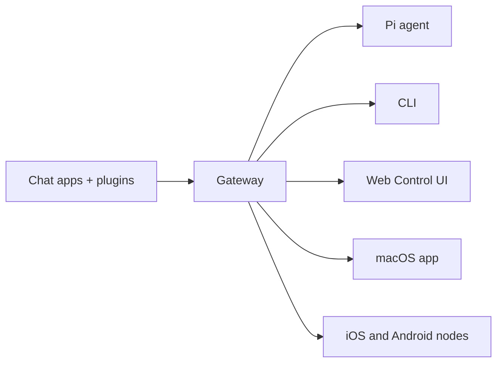

# OpenClaw 🦞

<p align="center">
    
    
</p>

> _”EXFOLIATE! EXFOLIATE!”_ — En rymdhummer, förmodligen

<p align="center">
  <strong>Gateway för AI-agenter på alla operativsystem över WhatsApp, Telegram, Discord, iMessage och mer.</strong><br />
  Skicka ett meddelande, få ett agentsvar direkt i fickan. Plugins lägger till Mattermost och mer.
</p>

<Columns>
  <Card title="Kom igång" href="/start/getting-started" icon="rocket">
    Installera OpenClaw och starta Gateway på några minuter.
  </Card>
  <Card title="Kör guiden" href="/start/wizard" icon="sparkles">
    Guidad konfigurering med `openclaw onboard` och parningsflöden.
  </Card>
  <Card title="Öppna Control UI" href="/web/control-ui" icon="layout-dashboard">
    Starta webbdashboarden för chatt, konfig och sessioner.
  </Card>
</Columns>

## Vad är OpenClaw?

OpenClaw är en **självhostad gateway** som kopplar dina favoritappar för chatt — WhatsApp, Telegram, Discord, iMessage och fler — till AI-kodningsagenter som Pi. Du kör en enda Gateway-process på din egen dator (eller en server), och den blir bryggan mellan dina meddelandeappar och en AI-assistent som alltid är tillgänglig.

**Vem är det för?** Utvecklare och avancerade användare som vill ha en personlig AI-assistent som de kan skriva till var som helst — utan att ge upp kontrollen över sina data eller förlita sig på en hostad tjänst.

**Vad gör det annorlunda?**

- **Självhostad**: körs på din hårdvara, dina regler
- **Flerkanalig**: en Gateway betjänar WhatsApp, Telegram, Discord och mer samtidigt
- **Agent-native**: byggd för kodningsagenter med verktygsanvändning, sessioner, minne och routing mellan flera agenter
- **Öppen källkod**: MIT-licensierad, community-driven

**Vad behöver du?** Node 22+, en API-nyckel (Anthropic rekommenderas) och 5 minuter.

## Hur det fungerar



Gateway är den enda sanningskällan för sessioner, routing och kanalkopplingar.

## Viktiga funktioner

<Columns>
  <Card title="Flerkanalig gateway" icon="network">
    WhatsApp, Telegram, Discord och iMessage med en enda Gateway-process.
  </Card>
  <Card title="Plugin-kanaler" icon="plug">
    Lägg till Mattermost och mer med tilläggspaket.
  </Card>
  <Card title="Routing för flera agenter" icon="route">
    Isolerade sessioner per agent, arbetsyta eller avsändare.
  </Card>
  <Card title="Mediastöd" icon="image">
    Skicka och ta emot bilder, ljud och dokument.
  </Card>
  <Card title="Webb-Control UI" icon="monitor">
    Webbdashboard för chatt, konfig, sessioner och noder.
  </Card>
  <Card title="Mobila noder" icon="smartphone">
    Para ihop iOS- och Android-noder med Canvas-stöd.
  </Card>
</Columns>

## Snabbstart

<Steps>
  <Step title="Installera OpenClaw">
    ```bash
    npm install -g openclaw@latest
    ```
  </Step>
  <Step title="Introduktion och installation av tjänsten">
    ```bash
    openclaw onboard --install-daemon
    ```
  </Step>
  <Step title="Para WhatsApp och starta Gateway">
    ```bash
    openclaw channels login
    openclaw gateway --port 18789
    ```
  </Step>
</Steps>

Behöver du fullständig installation och dev-setup? Se [Snabbstart](/start/quickstart).

## Dashboard

Öppna webbaserade Control UI efter att Gateway har startat.

- Lokal standard: [http://127.0.0.1:18789/](http://127.0.0.1:18789/)
- Fjärråtkomst: [Webbytor](/web) och [Tailscale](/gateway/tailscale)

<p align="center">
  
</p>

## Konfiguration (valfritt)

Konfig finns på `~/.openclaw/openclaw.json`.

- Om du **inte gör någonting** använder OpenClaw den medföljande Pi-binären i RPC-läge med sessioner per avsändare.
- Om du vill låsa ned det, börja med `channels.whatsapp.allowFrom` och (för grupper) omnämnanderegler.

Exempel:

```json5
{
  channels: {
    whatsapp: {
      allowFrom: ["+15555550123"],
      groups: { "*": { requireMention: true } },
    },
  },
  messages: { groupChat: { mentionPatterns: ["@openclaw"] } },
}
```

## Börja här

<Columns>
  <Card title="Dokumentationshubbar" href="/start/hubs" icon="book-open">
    All dokumentation och guider, organiserade efter användningsfall.
  </Card>
  <Card title="Konfiguration" href="/gateway/configuration" icon="settings">
    Centrala Gateway-inställningar, token och leverantörskonfig.
  </Card>
  <Card title="Fjärråtkomst" href="/gateway/remote" icon="globe">
    Åtkomstmönster via SSH och tailnet.
  </Card>
  <Card title="Kanaler" href="/channels/telegram" icon="message-square">
    Kanalspecifik konfigurering för WhatsApp, Telegram, Discord och mer.
  </Card>
  <Card title="Noder" href="/nodes" icon="smartphone">
    iOS- och Android-noder med parning och Canvas.
  </Card>
  <Card title="Hjälp" href="/help" icon="life-buoy">
    Vanliga lösningar och ingång till felsökning.
  </Card>
</Columns>

## Läs mer

<Columns>
  <Card title="Fullständig funktionslista" href="/concepts/features" icon="list">
    Kompletta kanal-, routing- och mediakapaciteter.
  </Card>
  <Card title="Routing för flera agenter" href="/concepts/multi-agent" icon="route">
    Isolering av arbetsytor och sessioner per agent.
  </Card>
  <Card title="Säkerhet" href="/gateway/security" icon="shield">
    Token, tillåtelselistor och säkerhetskontroller.
  </Card>
  <Card title="Felsökning" href="/gateway/troubleshooting" icon="wrench">
    Gateway-diagnostik och vanliga fel.
  </Card>
  <Card title="Om projektet och tack" href="/reference/credits" icon="info">
    Projektets ursprung, bidragsgivare och licens.
  </Card>
</Columns>
